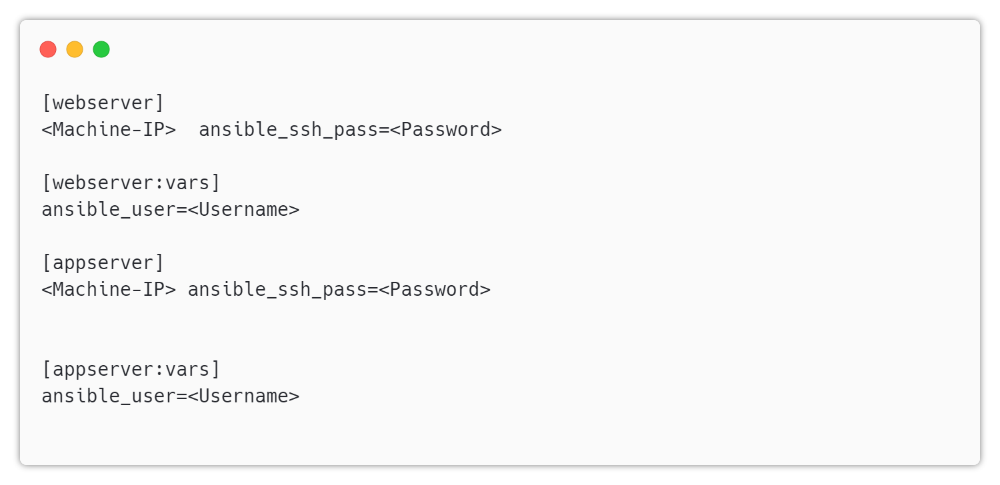
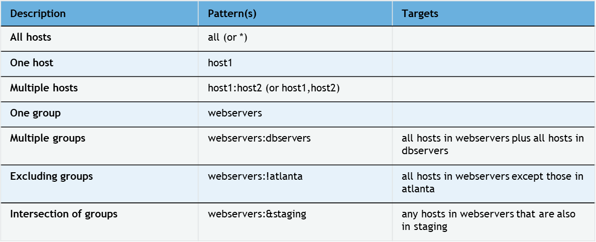

# Inventory 

---

## What is an inventory?

* A list of hosts that Ansible can manage
* Can be static or dynamic
* Can be defined in a file or in the command line

---

## Static Inventory

* A static inventory is a list of hosts defined in a file
* The file is usually called `hosts` and is located in the `/etc/ansible` directory
* The file can be in any format, but the most common one is the INI format

---

## INI Format

* The INI format is a simple format that uses sections and key/value pairs
* The sections are the groups of hosts
* The key/value pairs are the hosts and their attributes
* The attributes are optional
* The attributes are used to define the connection parameters
* The attributes are defined in the form of key=value pairs
* The attributes are defined after the host name

---

## Example

---

## Dynamic Inventory

* A dynamic inventory is a list of hosts that is generated by a script
* The script can be written in any language
* The script can be written to query a database, a cloud provider, or any other source
* The script must return a JSON object with the list of hosts and their attributes
* The script must be located in the `/etc/ansible` directory

---

## Patterns

* Patterns let you run commands and playbooks against specific hosts and/or groups in your inventory

* Pattern can refer to a single host, an IP address, an inventory group, a set of groups, or all hosts in your inventory

* highly flexible
  * Can exclude or require subsets of hosts
  * Use wildcards or regular expressions
  * And more…

---

## Patterns

---

# Lab
Create Inventory