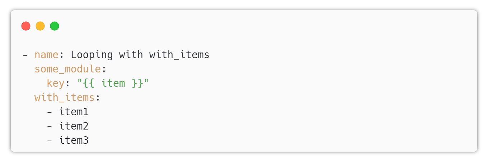
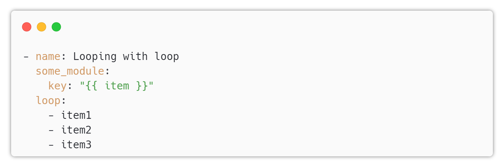
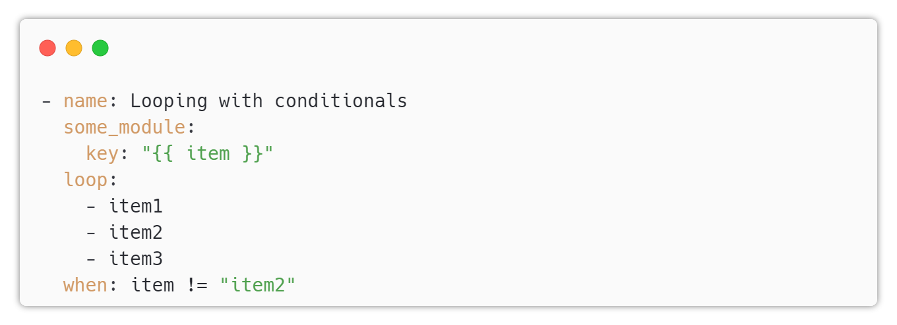
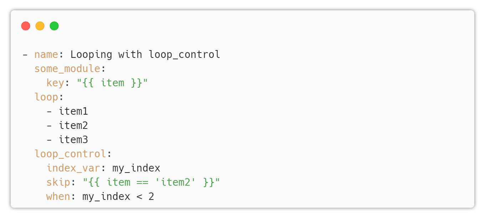

# Ansible Loop

---

## Loop

Ansible provides a simple and efficient way to iterate over a set of values using loops in a playbook.
---

## The with_items Loop

The `with_items` loop is the most commonly used loop in Ansible. It iterates over a list of items and performs a task for each item.

---

## The `loop` Loop

The `loop` loop is a newer alternative to with_items loop, and it offers more flexibility and readability. It allows you to loop over a list or dictionary of items, and use the item variable to access each item.

---

## Using Loops with Conditionals

You can also use loops with conditionals to perform tasks based on certain conditions.

---

## The loop_control Keyword

The loop_control keyword allows you to modify the behavior of the loop. For example, you can use it to set the loop index, skip items, or stop the loop.

---

## Conclusion

Loops in Ansible Playbook provide an efficient way to perform repetitive tasks. With the with_items and loop loops, you can iterate over a list of items or a dictionary, and use conditionals and loop_control keyword to modify the behavior of the loop.
