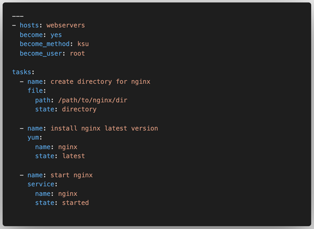
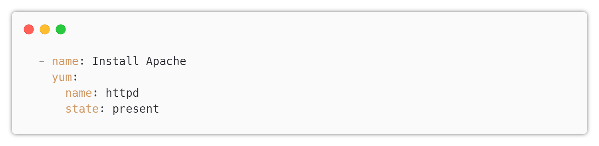

# Ansible Playbook

---

## Playbook

A playbook is a collection of tasks that define the desired state of a system. 

Playbooks are written in YAML format and can be used to manage a wide range of systems, from simple web servers to complex multi-tier applications.

---

## Example

---

## Task Structure

A task is a single module with a set of arguments.
  

---