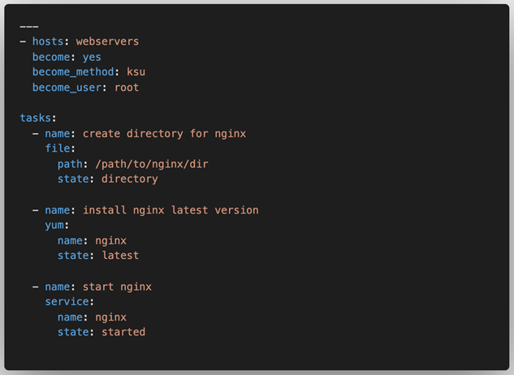

# Ansible Terms

---

## Inventory

* A list of hosts that Ansible can manage
* Can be static or dynamic

---

## Tasks

* A task is a single action that is executed on a host
* A task is a single module with a set of arguments

---

# Modules

* A module is a self-contained script that implements a single action
* Modules are the building blocks of Ansible
* Modules are executed on the remote hosts
* Modules are written in Python

---

## Play

* A play is a list of tasks to be executed on a set of hosts

---

## Playbook

* A playbook is a list of plays

---

## Facts

* Facts are pieces of information about the remote hosts
* Facts are gathered by Ansible and can be used in playbooks
* Facts are stored in the ansible_facts variable
* Facts are gathered by default

---

## Variables

* Variables are used to store information that can be used in playbooks and templates
* Variables can be defined in the playbook or in a separate file
* Variables can be defined in the inventory file

---

## Templates

* Templates are files that contain variables
* Templates are used to generate configuration files
* Templates are written in Jinja2
* Templates are rendered on the Ansible controller

---

## Handlers

* Handlers are tasks that are triggered by notifications
* Handlers are used to restart services
* Handlers are executed at the end of the play
* Handlers are executed only if the task that triggered them has changed
* Handlers are executed only once
* Handlers are executed in the order they are defined
* Handlers are executed on the hosts that were changed

---

## Conditionals

* Conditionals are used to execute tasks based on conditions
* Conditionals are written in Jinja2
* Conditionals are evaluated on the Ansible controller
* Conditionals are evaluated before the play starts

---

## Plugins

* Plugins are used to extend Ansible
* Plugins are written in Python
* Plugins are executed on the Ansible controller
* Plugins are executed before the play starts

---

## Looping

* Looping is used to execute tasks multiple times
* Looping is written in Jinja2
* Looping is evaluated on the Ansible controller
* Looping is evaluated before the play starts

---

## Vault

* Vault is used to encrypt sensitive data
* Vault is used to encrypt variables
* Vault is used to encrypt files
* Vault is used to encrypt the entire playbook

---

## Ansible Galaxy

* Ansible Galaxy is a repository of Ansible roles
* Ansible Galaxy is a repository of Ansible modules

---

## Roles

* Roles are a way to organize playbooks

---

## Run AGAINST 

Means to run a specific adhoc, play or playbook on the specified host or group from the inventory

---

