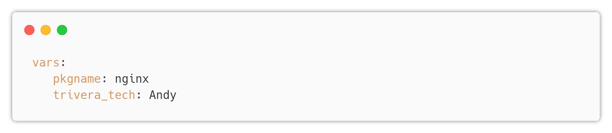
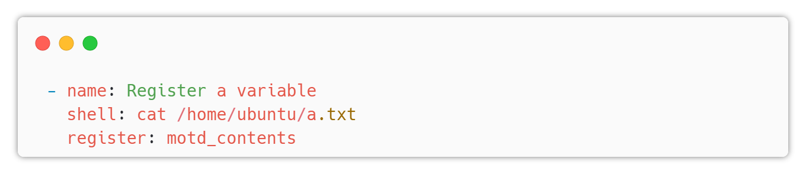
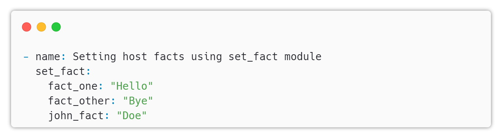

# Ansible Variables

---

## Variables

* Variables are used to store information that can be used in playbooks and templates.

* Variables can be defined in the playbook or in a separate file.

* Variables are defined in the form of key=value pairs.

* Variables are defined in the vars section of the playbook.

* Variables can be used in the tasks section of the playbook.

---

## Example

---

## Variables Prompt

* Variables can be prompted for user input.
* The prompt can be defined in the vars section of the playbook.

---

## Example

`name`: variable name

`prompt`: prompt message

`default`: default if user skips the prompt

`private`: hide the input from the screen

---

## Variables File

* Variables can be defined in a separate file.
* The file can be in any format, but the most common one is the YAML format.
* The file must be located in the same directory or relative to the playbook.
* The file must be named anything that you need.
* The file must be defined in the vars_files section of the playbook.
  * There is a module called `include_vars` that can be used to include variables from a file as a task.

---

## Variables Register

* Variables can be registered to store the output of a task.

---

## Variables Set Fact

Variables can be set as facts to store the output of a task using `set_fact` module

these variables can be accessed like a normal variable

Note: If you have `redis` installed, you can use `cached` to store these variables for later use.

---

