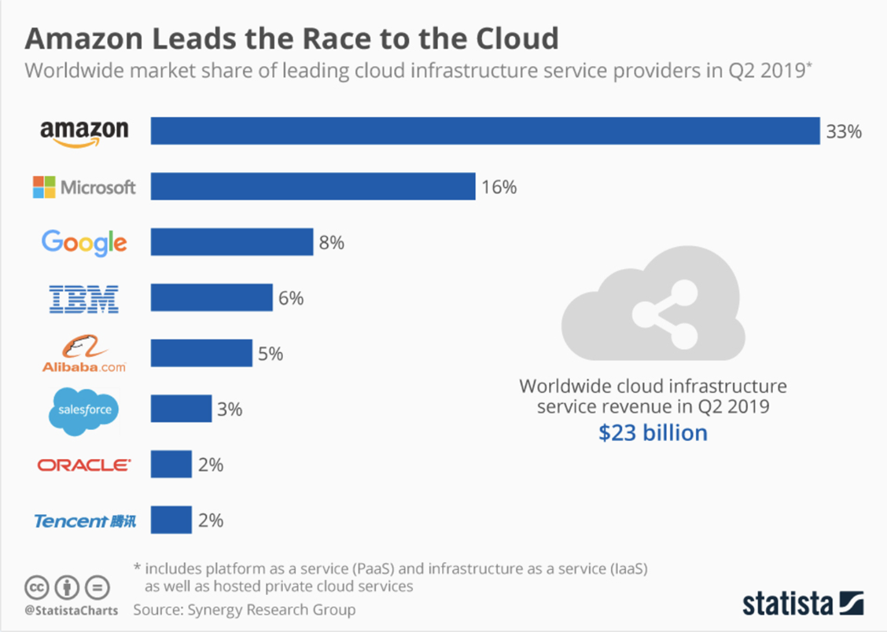
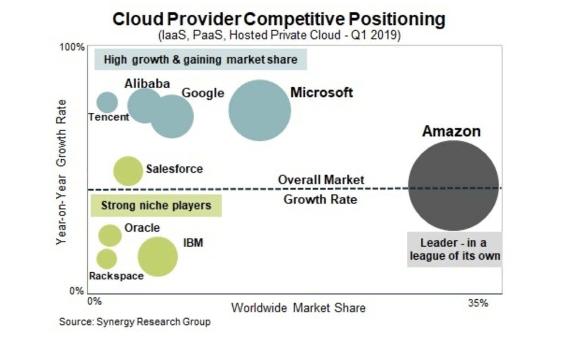

# Cloud Computing Overview

---

## What is Cloud Computing?

---

## What Is Cloud Computing?

Cloud Computing is a technology that allows individuals and businesses to access and store data, run applications, and utilize computing resources
over the internet without needing to own or maintain physical hardware.

Cloud computing enables you to stop thinking of your infrastructure as hardware, and instead
think of it (and use it) as software.

---

## What Is Cloud Computing?

Hardware solutions are physical. This means they require:

- Space
- Staff
- Physical security
- Planning
- Capital expenditure

And what if your needs change?

You have to go through the time, effort, and cost required to change all of the above.

---

## What Is Cloud Computing?

**Software is flexible.**

If your needs change, your software can change much more quickly, easily, and cost-effectively than your hardware.

---

## The **Cloud** Metaphor

Imagine storing your files in a distant warehouse instead of your local computer. Anytime you need a file, you can just request it, and it's delivered
to you over the internet.

That warehouse is the **cloud**

---

## In simple terms

* Get as many resources as you need
* In a matter of minutes
* Only pay for what you use

---

# History of ...

---

## 1960s

- DARPA funded the development of a computer which could be simultaneously used by multiple users
- John McCarthy's suggests in a speech at MIT that computing can be sold like a utility, just like water or electricity.
- American computer scientist J.C.R. Licklider presents an idea for an interconnected system of computers, later implemented in the development of
  ARPANET (Advanced Research Projects Agency Network) - the precursor of modern Internet.
- Douglas F. Parkhill predicts that the computer industry will become a public utility “in which many remotely located users are connected via
  communication links to a central computing facility.”

---

## 1970s

- The concept of virtual machines (VMs) is created to allow running a completely different computer (virtual machine) inside a desktop operating
  system. This allows for more efficient use of hardware resources.

- IBM releases the first version if its VM operating system

- The cloud symbol is used to represent networks of computing equipment in the original ARPANET.

---

## 1980s

- The U.S. National Science Foundation (NSF) launches an initiative to build a national backbone network that would be based on transmission control
  protocol/internet protocol (TCP/IP)

- The first Ethernet adapter card for the IBM personal computer is released, introducing fast, inexpensive connections that would enable cloud
  computing

- A National Science Foundation Network project creates network access to the supercomputer sites in the United States
  Commercial Internet Service Providers (ISPs) begin to emerge

---

## 1990s

- World Wide Web invented

- The term 'cloud' is used for virtualized services by General Magic

- Early cloud models implemented by iland (IaaS), CallidusCloud (SaaS), Rackspace and Salesforce

- References to the phrase "cloud computing" appear with the first known mention in a Compaq internal document

- Ramnath Chellappa defines cloud as a “computing paradigm where the boundaries of computing will be determined by economic rationale rather than
  technical limits alone.”

- German Math Society presented a concept of Basic Support for Collaborative Work

---

## 2000s

- The Amazon Elastic Compute Cloud is introduced as an IaaS that lets organizations contract for computers to run their applications with the
  ability to programmatically create and terminate instances that gives developers the flexibility to write their own code for autoscaling

- Google CEO Eric Schmidt introduces the term "cloud computing" to an industry conference. “What’s interesting now is that there is an emergent new
  model, (..) I don’t think people have really understood how big this opportunity really is. It starts with the premise that the data services and
  architecture should be on servers. We call it cloud computing—they should be in a “cloud” somewhere.”

- Amazon creates Amazon Web Services as a subsidiary to provide on-demand cloud computing platforms, and introduces its Elastic Compute Cloud(EC2)

---

## 2000s

- Amazon decided to use their service-oriented architecture and the services designed to cope with large and fluctuating numbers of users, and
  transform it into a product that could be offered to outside customers.

- For Amazon, that meant that peak loads would be distributed among all of the users of their infrastructure.

- The scaling effects of the cloud services thus became the key selling point of cloud computing

- A prerequisite for efficient cloud computing services is a fast broadband connection, with high bandwidth and low latency.
    - With such connectivity, it makes no difference whether data is stored locally on a PC, or in remote servers in a cloud

---

## Amazon's Innovation

- **2002:** Amazon Web Services (AWS) provided a bundled cloud platform with storage and computation capabilities.
- **2006:** Amazon's EC2 was groundbreaking, providing resizable compute capacity in the cloud, democratizing access to scalable computing resources.

---

## Major Tech Entrants & Innovations

- **2008:** Google launched Google App Engine. Developers could build web applications without thinking about the underlying infrastructure.
- **2010:** Microsoft Azure, Microsoft's response to AWS, allowed developers to use Microsoft tools to build cloud-native apps.

---

## Expansion, Competition & Cloud Variants

- **2009:** Oracle Cloud launched, focusing on integrated cloud services.
- **2011:** IBM's SmartCloud offered tailored cloud solutions for enterprises.

---

## Current Trends & The Future

- **Edge Computing:** Processing data closer to its source, especially important for IoT.
- **Quantum Cloud Services:** Early integrations of quantum computing capabilities into cloud platforms.
- **Sustainability:** Green cloud computing emerges as the demand for eco-friendly data centers grows.
- **Cloud & Global Networks:** Expanding global infrastructures to reduce latency and improve access.

---

## Cloud computing global market

---

## Cloud computing global market

---

## Advantages

---

## Cloud Computing Advantages

* Revolutionary shift in how technology
    - Obtained
    - Used
    - Managed

* You can
    - Reconfigure the environment
    - Scale capacity up and down
    - Deploy applications

---

## Variable vs. Capital Expense

Trade capital expenses for variable operational expenses (pay as you go)

---

## Economies of Scale

Usage from hundreds of thousands of customers is aggregated in the cloud to achieve lower costs and higher economies of scale for all.

---

## Stop guessing capacity

Eliminate guessing on your infrastructure capacity needs. When you make a capacity decision prior to deploying an application, you often either
end up sitting on expensive idle resources or dealing with limited capacity. With cloud computing, these problems go away.

---

## Increase speed and agility

You can develop and experiment faster and cheaper

---

### Focus on Business Differentiators

Spend on what you do well, not on running data centers and managing hardware.

---

### Go global in minutes

Easily deploy your application in multiple regions around the world with just a few clicks.

---

# Disadvantages

---

## Data Privacy and Security Concerns

- **Third-Party Control:** Cloud providers have access to your data.
- **Multi-Tenancy:** Sharing resources with others can pose security risks.
- **Potential for Breaches:** Even major providers can be vulnerable to hacks and unauthorized access.

---

## Downtime and Reliability

- **Not Always Online:** All cloud providers experience occasional outages.
- **Dependency on Internet:** No internet means no access to cloud services.
- **Data Loss:** While rare, data loss events can and do happen.

---

## Limited Control and Flexibility

- **Bound by Provider Choices:** Limited to tools and operations offered by the cloud provider.
- **Migration Challenges:** Moving to a different provider or back on-premises can be complex.
- **Potential Vendor Lock-In:** Difficulties in transferring services and data between providers.

---

## Costs and Bandwidth

- **Hidden Costs:** Billing can be complicated, leading to unexpected charges.
- **Bandwidth Expenses:** Large-scale data transfers can be costly.
- **Scaling Costs:** As you grow, costs can escalate if not monitored.

---

# Cloud Service Models

---

## The Service Model Spectrum

Cloud services are categorized based on what they provide to users

The three main service models are:

- Infrastructure as a Service (IaaS)
- Platform as a Service (PaaS)
- Software as a Service (SaaS)

---

# Iaas

---

## Infrastructure as a Service (IaaS)

Provides virtualized computing resources over the internet on a pay-as-you-go basis

---

## Key Components

- Virtual machines
- storage
- networking

**Example:** Amazon EC2, Google Compute Engine.

---

## Benefits

- **Flexibility:** Choose your software, configuration, and architecture.
- **Cost-Efficient:** Pay only for the infrastructure used.
- **Scalability:** Easily scale resources based on demand.
- **No Physical Maintenance:** Servers are managed by the provider.

---
# PaaS
---

## Platform as a Service (PaaS)

Provides a platform allowing customers to develop, run, and manage applications without dealing with infrastructure complexities.

---

## Key Components

- Development tools
- operating systems
- databases

**Example:** Heroku, Google App Engine.

---

## Benefits

- **Simplified Development:** Focus on coding, not infrastructure.
- **Scalable:** Platform scales with application demands.
- **Integrated Development Tools:** Streamlined development and deployment processes.
- **Cost-Efficient:** Reduce costs associated with app development, testing, and deployment.

---
# SaaS
---

## Software as a Service (SaaS)

Software applications provided over the internet on a subscription basis.

- **Accessibility:** Access from anywhere with an internet connection and a browser.

- **Example:** Google Workspace, Microsoft Office 365.

---

## Benefits

- **Ease of Use:** No installations or updates; handled by the provider.
- **Collaboration:** Centralized data, accessible by multiple users.
- **Automatic Updates:** Always use the latest version.
- **Cost-Effective:** No upfront costs for software licenses.

---

## Other Cloud Service Models

- **Function as a Service (FaaS):** Serverless computing where code execution is fully managed by the cloud provider.
- **Container as a Service (CaaS):** Container management service that allows users to upload, organize, start, stop, scale, and otherwise manage
  containers.

---

## Comparing Service Models

- **IaaS:** Like renting a bare apartment; you furnish and maintain it.
- **PaaS:** Renting a furnished apartment; you live and personalize it but don't worry about the furniture.
- **SaaS:** Staying in a hotel; everything is managed, and you just use the services.

---

# Cloud Deployment Models

---

# An In-depth Exploration
---

## Deployment Models

Cloud deployment models define where and how cloud services are delivered and who has access.

**Primary Models**

- Public
- Private
- Hybrid
- Community

---

# Public Cloud

---

Cloud resources owned and operated by third-party cloud service providers delivered over the internet.

**Accessibility**

Available to public

**Example Providers**

AWS, Google Cloud, Microsoft Azure

---

## Benefits

- **Economies of Scale:** Cost-efficient due to shared infrastructure.
- **No Maintenance:** Provider handles upkeep and updates.
- **High Scalability:** Resources can be provisioned or de-provisioned based on demand.
- **Pay-as-You-Go:** Users only pay for resources they consume.

---

## Concerns with Public Cloud

- **Data Security:** Potential vulnerabilities since resources are shared.
- **Less Customization:** Limited to what the cloud provider offers.
- **Potential Downtime:** Reliant on provider's infrastructure.

---

## Private Cloud

- **Definition:** Cloud resources exclusively used by a single business or organization.
- **Location:** Can be on-premises or hosted by a third-party provider.
- **Customization:** Infrastructure tailored to specific business needs.

---

## Benefits of Private Cloud

- **Enhanced Security:** Dedicated resources offer more robust security options.
- **Customization:** Greater control over configurations.
- **Performance Consistency:** No interference from other users.

---

## Concerns with Private Cloud

- **Higher Costs:** Requires investment in infrastructure and maintenance.
- **Limited Scalability:** Bound by in-house resources unless expanded.
- **Management Overhead:** Organization responsible for upkeep unless outsourced.

---

## Hybrid Cloud

- **Definition:** Combines both private and public clouds, allowing data and applications to be shared between them.
- **Flexibility:** Optimal deployment options for different workloads.
- **Interoperability:** Integrated solutions working cohesively.

---

## Benefits of Hybrid Cloud

- **Optimal Resource Utilization:** Use public cloud for scalable needs and private cloud for sensitive operations.
- **Cost-Effective:** Balance between operational costs of public and security benefits of private.
- **Business Continuity:** Backup and disaster recovery solutions are more efficient.

---

## Concerns with Hybrid Cloud

- **Complexity:** Managing different platforms can be challenging.
- **Security Compliance:** Ensuring consistent security policies across platforms.
- **Integration Issues:** Seamless integration requires proper tools and configurations.

---

## Community Cloud

- **Definition:** Cloud infrastructure shared among several organizations with common concerns (e.g., mission, security requirements, policy).
- **Collaborative:** Built by multiple parties or by a single provider.
- **Examples:** Clouds for banking sectors, government agencies, or research institutions.

---

## Benefits of Community Cloud

- **Shared Costs:** Multiple parties split infrastructure costs.
- **Tailored Solutions:** Built for specific community needs.
- **Shared Knowledge:** Collaborative problem-solving and innovations.

---

## Concerns with Community Cloud

- **Management Issues:** Who takes the lead in management?
- **Less Flexibility:** Customized for the group, not individual organizations.
- **Potential for Conflict:** Differences in priorities or requirements among members.

---

## Multi-Cloud

- **Multi-cloud** means that you or your company are not only using the services of one cloud provider, but are also using different solutions from
  different cloud providers.

- Examples include using Microsoft Office 365 for business collaboration, Salesforce for customer relationship management, and AWS Route 53 for
  GeoDNS and GeoIP.

---

## Multi-Cloud

- **Redundancy:** You don't want to build your environment on only one cloud provider, because one can fail, as has happened with AWS in the past.

- So, you want to keep the business running with the services of the other cloud providers.

- This is mostly related to using IaaS or PaaS.

- For the most part, redundancy is not possible with SaaS if the cloud provider does not support hybrid environments.

---

## Concluding Thoughts & The Future

- **Strategic Choices:** Organizations should choose based on cost, security, compliance, and scalability needs.
- **Future Evolution:** Continuous evolution with the advancement of technologies and business needs.
- **Emerging Concepts:** Edge computing, distributed cloud, and more are influencing deployment strategies.

---

# Cloud Outages

Causes and Consequences

---

## Introduction to Cloud Outages

A cloud outage is an interruption to cloud service availability.

- **Impact:** Can affect businesses, end-users, and other reliant entities.
- **Fact:** Even the largest cloud providers aren't immune to outages.

---

## Common Causes of Outages

1. **Hardware Failures:** Even in redundant configurations, hardware can malfunction.
2. **Software Bugs:** Errors in code can cause disruptions.
3. **Network Issues:** Localized or widespread network failures can cut off access.
4. **DDoS Attacks:** Overwhelming traffic can cripple servers.
5. **Human Error:** Misconfigurations or accidental changes can result in outages.

---

# Famous Cloud Outages

---

## AWS

On February 2017, Amazon Web Services (AWS) experienced a major caused by a typo in a command that was being run during a routine debugging of the S3
billing system.

- **Duration:** Lasted approximately 4 hours.
- **Major Sites Down:** Netflix, Reddit, Quora, Apple services and Trello were affected during AWS's 2017 outage.

---

## Google Cloud

On June 2019, Google Cloud experienced a major outage. The outage was caused by a configuration
change intended for a small group of servers in one region that was mistakenly applied to a larger number of servers across several neighboring
regions.

- **Duration:** Lasted approximately 4 hours.
- **Major Sites Down:** Snapchat, Vimeo, and Shopify.

---

## Microsoft Azure

On May 2019, Microsoft Azure experienced a major outage due to a series of storms that caused hardware damage, leading to data center outages.

- **Duration:** Unspecified by Microsoft.
- **Major Sites Down:**  Microsoft-based products.

---

## Repercussions Beyond the Direct Outage

- **Reputation Damage:** Trust is hard to rebuild after significant downtime.
- **Financial Repercussions:** Direct (lost sales/services) and indirect (compensation, regulatory fines).
- **Operational Setbacks:** Lost data or work, delay in business operations.

---

## Preventive Measures and Mitigation

1. **Redundancy:** Deploying resources across multiple data centers or regions.
2. **Monitoring & Alerts:** Real-time tracking to identify and address issues immediately.
3. **Backup and Recovery:** Regularly back up data and ensure swift recovery procedures.
4. **DDoS Protection:** Implementing solutions to deflect or absorb malicious traffic.

---

## Importance of Incident Response Plans

- **Preparation:** Knowing what to do and who is responsible during an outage.
- **Communication:** Keeping customers informed can mitigate reputation damage.
- **Review & Iteration:** Post-mortem analysis to understand what went wrong and how to avoid future occurrences.

---

## Looking Ahead: The Future of Cloud Resilience

- **Increasing Reliability:** Cloud providers investing more in infrastructure and prevention mechanisms.
- **Advanced AI Monitoring:** Predictive analytics to preemptively tackle potential issues.
- **The Role of Edge Computing:** Distributing data and applications to reduce the strain on centralized servers.
