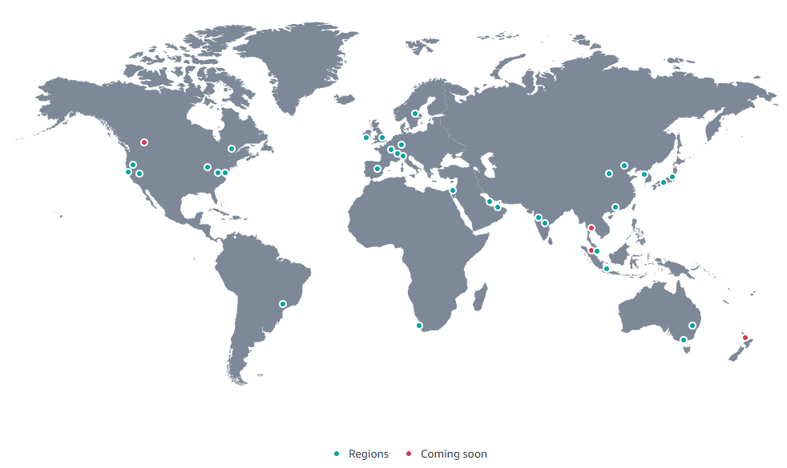
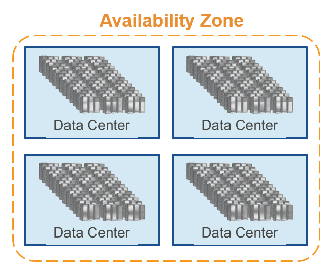
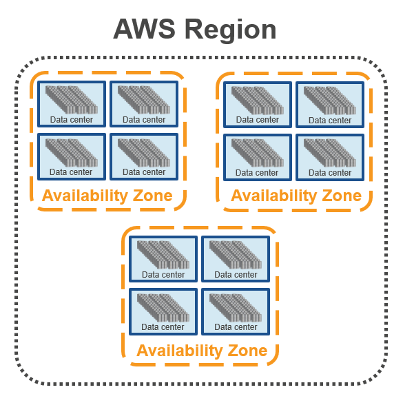
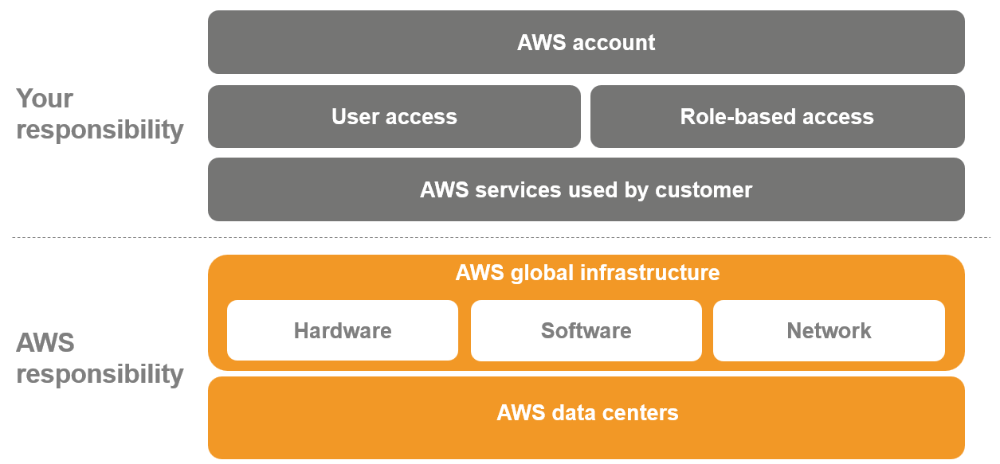
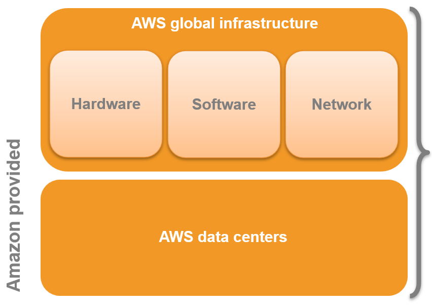
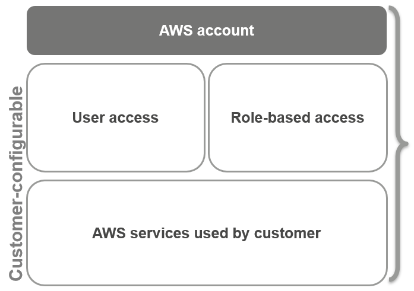

# AWS

History, Introduction and Evolution

---

## What Exactly Is Amazon Web Services?

Amazon Web Services is a secure cloud services platform with over 50 different services that include solutions for:

- Compute & Networking
- Storage & Content Delivery
- Database
- Analytics
- Application Services
- Deployment & Management
- Mobile
- Developer Tools
- Tools for the Internet of Things
- Artificial Intelligence
- Security

---

# Inception of AWS

---

## Early Beginnings (2000s)

Amazon’s challenges in scaling infrastructure led to AWS's vision and eventual launch.

AWS's initial offerings were basic, but it quickly expanded its service suite to cater to diverse business needs.

AWS's growth was exponential,and it soon became the industry leader in cloud computing.

**Vision:** Jeff Bezos envisioned a selling platform for the excess capacity they had built.

---

## The Launch of S3 (2006)

- **Amazon S3:** Introduced the concept of object storage in the cloud.
- **Importance:** Businesses could now store vast data amounts without investing in physical storage.
- **Reception:** Gained rapid adoption due to its scalability, durability, and easy-to-use API.

---

## EC2 Introduction (2006)

- **EC2's Role:** Allowed users to rent virtual machines and scale resources on demand.
- **Paradigm Shift:** Companies no longer needed to purchase physical servers; they could rent virtual ones as needed.
- **Growth:** EC2's flexible pricing models made it especially appealing to startups.

---

## Service Suite Expansion (2007-2009)

- **Management Console (2008):** Streamlined interface to manage AWS products.
- **RDS, ELB & Auto Scaling (2009):** Cumulatively simplified database operations, traffic distribution, and resource scalability.
- **Significance:** These tools bolstered AWS’s reputation for holistic cloud solutions.

---

## Global Expansion

- **Ireland Region (2007):** AWS’s first step in global datacenter expansion.
- **Multiple Availability Zones:** Redundant, isolated locations ensured higher availability and fault tolerance.
- **Subsequent Expansions:** Catered to regional data regulations and reduced latency for global users.

---

## 2010 - New Horizons

- **AWS Marketplace (2012):** Central hub for third-party software tailored for AWS.
- **DynamoDB (2012):** This NoSQL service highlighted AWS's intent to cater to varied database needs.
- **Adoption:** As services grew, so did the user base, spanning developers to large enterprises.

---

## Advanced Tools (2011-2012)

- **Amazon Glacier (2012):** Targeted long-term, infrequently accessed data at lower costs.
- **Redshift (2012):** Marked AWS's foray into data warehousing, supporting large-scale analytical queries.
- **Philosophy:** AWS was no longer just about basic compute and storage but about comprehensive data solutions.

---

## Enterprise Adoption (2013)

- **re:Invent 2013:** Became the definitive cloud computing event, highlighting AWS's industry leadership.
- **Service Expansion:** Numerous launches tailored to enterprise needs like VPC, Direct Connect, and IAM.
- **Narrative:** AWS transitioned from a startup solution to an enterprise necessity.

---

## Diving into Analytics (2014)

- **Amazon Kinesis:** Addressed streaming data use cases, from analytics to real-time dashboards.
- **Lambda (2014):** This serverless compute service challenged traditional architecture models.
- **Differentiator:** These services exemplified AWS's commitment to innovation and foresight.

---

## Broadening Horizons (2015)

- **Machine Learning (2015):** Offered tools and wizards to create machine learning models without expertise.
- **AWS IoT (2015):** Enabled devices to connect, collecting data for processing and analysis.
- **Diverse Portfolio:** From data scientists to IoT developers, AWS catered to an expansive tech spectrum.

---

## AI & ML Push (2016)

- **Comprehensive AI Suite:** Lex for chatbots, Polly for speech, and Rekognition for image analysis marked AWS's deep dive into AI.
- **Feedback Loop:** AWS harnessed feedback and integrated services to provide a seamless AI development environment.

---

## Integration & Productivity (2017)

- **AWS AppSync:** Synchronized data across devices and users in real-time.
- **AWS Glue:** Automating ETL tasks made data preparation more accessible.
- **Cohesion:** Enhanced interconnectivity of AWS services enabled smoother workflows.

---

## Hybrid Cloud Focus (2018)

- **AWS Outposts:** Addressed needs for hybrid deployments, bringing AWS services on-premises.
- **Strategic Move:** Recognizing enterprises' transitional phase and need for hybrid solutions, AWS bridged the cloud-on-prem gap.

---

## Security & Satellite (2019)

- **AWS Security Hub:** Unified view to manage security and compliance.
- **AWS Ground Station:** Propelled space tech into the cloud era, simplifying satellite communication and data processing.

---

## AWS Today

- **Market Dominance:** A frontrunner in cloud services with a vast service suite.
- **Client Spectrum:** Diverse clientele, from startups to governments, rely on AWS for critical operations.

---

## Challenges & Controversies

- **Emerging Competition:** Azure and GCP, though trailing, have been closing the market share gap.
- **Dependency Risks:** High reliance on AWS by global enterprises highlights potential risks during outages or issues.

---

# AWS Infrastructure

---

## AWS Data Centers

- A single data center typically houses several thousands of servers.
- All data centers are online.
    - No data center is “cold”: <small>in case of failure, automated processes move customer data traffic away from the affected area.</small>

- AWS custom network equipment:
    - Multi-ODM sourced*
    - Amazon custom network protocol stack

<small>"ODM" refers to "original design manufacturer", which designs and manufactures products based on specifications from a second company. The
second company then rebrands the products for sale.</small>

---

## AWS Network

Amazon Web Services (AWS) has an extensive global cloud infrastructure that allows for high availability, fault tolerance, and scalability.

It's comprised of Regions, Availability Zones, and Edge Locations.

---

---

## AWS Availability Zones (AZs)

Each Availability Zone is:

- Made up of one or more data centers.
- Designed for fault isolation.
- Interconnected with other Availability Zones using high-speed private links.
- Abbreviated as AZs
- equipped with power, cooling, and networking to isolate from failures.

---

## AWS Availability Zones (AZs)

- No data center can be part of two Availability Zones.

- Each Availability Zone is designed as an independent failure zone.

- You are responsible for selecting the Availability Zones where your systems will reside.

---

## Number of Availability Zones

As of last update in Oct 2023, AWS has 102 availability zones around the world.

<small>AWS continuously expands, so always refer to their official documentation for the latest count.</small>

https://aws.amazon.com/about-aws/global-infrastructure/

---

## Importance of AZs

Availability Zones are designed for redundancy and failover capabilities.

By hosting resources across multiple AZs, AWS ensures if one AZ experiences a failure, resources can be rerouted to another, maintaining service
availability.

---

## Fault Tolerance with AZs

Using multiple AZs allows for a highly available infrastructure.

If one AZ faces an outage, the services can continue running from another AZ without disruption *.

This design protects applications from failures.

<small>* This requires the application and architect to be designed for high availability.</small>

---

## AWS Regions

- Each region is made up of two or more Availability Zones.

- You enable and control data replication across regions.

- Communication between regions uses public Internet infrastructure.

---

## Number of AWS Regions

As of last update in Oct 2023, AWS has 32 regions around the world.

<small>AWS continuously expands, so always refer to their official documentation for the latest count.</small>

https://aws.amazon.com/about-aws/global-infrastructure/

---

## Regions Vs AZs

While regions refer to the geographical location where AWS has data centers, Availability Zones are physically separated locations within each region.

Each AZ is isolated, but the AZs in a region are connected through low-latency links.

---

## AWS Edge Locations

Edge Locations are sites deployed in major cities and highly populated areas globally.

They are not tied to a specific region and are used to deliver content to end users with reduced latency.

---

## Purpose of Edge Locations

Edge Locations are part of Amazon's Content Delivery Network (CDN), Amazon CloudFront.

They cache content closer to the viewers, reducing the need to fetch content from the source, thus speeding up content delivery.

---

## Relation Between Regions, AZs, and Edge Locations

Regions consist of multiple AZs, ensuring high availability and fault tolerance.

Edge Locations, on the other hand, are separate entities that cache and deliver content closer to the end-users, ensuring low latency.

---

## AWS Local Zones

AWS Local Zones are a type of infrastructure deployment that places AWS compute, storage, database, and other services closer to end-users in cities
beyond the existing AWS Regions.

---

## Significance of Local Zones

Local Zones are designed to help run latency-sensitive applications closer to end-users, providing single-digit millisecond latency. They are perfect
for applications like gaming, real-time financial systems, and AR/VR experiences.

---

## AWS Wavelength

AWS Wavelength brings AWS services to the edge of the 5G network, minimizing latency to deliver applications that require single-digit millisecond
latencies. It's designed to support devices like IoT, game streaming, and more.

---

## Inter-Region Connectivity

AWS offers high bandwidth, low latency connectivity between its regions. This ensures that if businesses operate in multiple regions, they can easily
replicate or transfer data between them.

---

## Security in AWS Infrastructure

AWS's priority is the security of its infrastructure. All data centers employ leading physical and operational security measures, ensuring data
safety. Furthermore, the isolation between Regions and AZs adds an additional layer of security.

---

## Pricing Differences Across Regions

It's essential to note that AWS service pricing can vary across different regions. Factors influencing these variations include regional operational
costs, demand, and local regulations.

---

## Optimal Use of Global Infrastructure

To leverage AWS's global infrastructure efficiently, businesses should:

- Choose regions closer to their end-users for reduced latency.

- Distribute applications across multiple AZs for high availability.

- Use CloudFront and Edge Locations for faster content delivery.

---

## AWS Infrastructure Resilience

AWS's design philosophy ensures that even if individual data centers or an entire Availability Zone faces issues, the services continue to run
seamlessly.

This resilience is achieved through redundancy and a robust network architecture.

---

## Data Transfer Among AWS Services

Data transfer IN to AWS is free. However, data transfer OUT from AWS to the internet may incur costs. The prices can vary depending on the source (
like EC2, S3) and the destination (like the internet or other AWS regions).

---

# Manged vs Unmanaged Services

---

## Unmanaged Services

Typically provisioned in discrete portions as specified by the user.

Unmanaged services require the user to manage how the service responds to changes in load, errors, and situations where resources become unavailable.

---

## Example of Unmanaged Services

If you launch a web server on an Amazon EC2
instance, that web server will not scale to handle increased traffic load or replace unhealthy instances with healthy ones unless you specify it to
use a scaling solution such as Auto Scaling, because Amazon EC2 is an "unmanaged" solution.

---

## Managed Services

Managed services are fully managed by AWS and require no user intervention to scale or replace unhealthy instances.

**NOTE:** Managed services still
require the user to configure them (for example, creating an Amazon S3 bucket and setting permissions for it); however, managed services typically
require far less configuration.
---

## Example of Managed Services

if you have a static website that you're hosting in a cloud-based storage solution such as Amazon S3 without a web server, scaling,
fault-tolerance, and availability would be automatically handled internally by Amazon S3, because it is a managed solution.

---

## Managed vs Unmanaged Services

The benefit to using an unmanaged service, however, is that you have more fine-tuned control over how your solution handles changes in load, errors,
and situations where resources become unavailable.

---

## Example of Managed vs Unmanaged Services

Hosting your relational database with...

---

## EC2

Amazon Elastic Compute Cloud (Amazon EC2)

Fully Unmanaged, you have to manage everything

---

## RDS

Amazon Relational Database Service (Amazon RDS)

Fully Managed, AWS manages everything

**More on these services later...**

---

# Shared Responsibility

---

## Model

Amazon Web Services provides the same familiar approaches to security that companies have been using for decades.

It does this while also
allowing the flexibility and low cost of cloud computing.

There is nothing inherently at odds about providing on-demand infrastructure while also
providing the security isolation companies have become accustomed to in their existing, privately owned environments.

---

## Model

---

## Security OF The Cloud

AWS handles the security of the cloud, specifically the physical infrastructures that host your resources.

- **Data centers:** Non-descript facilities, 24x7 security guards, two-factor authentication, access logging and review, video surveillance, and disk
  degaussing and destruction.

- **Hardware infrastructure:** Servers, storage devices, and other appliances on which all of our services rely.
- **Software infrastructure:** Host operating systems, service applications, and virtualization software.
- **Network infrastructure:** Routers, switches, load balancers, firewalls, cabling, etc. (including continuous network monitoring at external boundaries, secure access points, and redundant
  infrastructure).

---

## Security OF The Cloud

---

## Security IN The Cloud

You are responsible for what you implement using AWS and for the applications you connect to AWS. The security steps you need to take depend on the services you use and the complexity
of your system. 

---

---
# Core AWS Architectural Concepts
---

## AWS Elasticity and Scalability

Elasticity allows AWS resources to be automatically allocated or deallocated based on actual usage, ensuring efficient use. Scalability ensures that
as the workload grows, resources can be added seamlessly.

---

## Decoupling Mechanisms

Decoupling allows individual components of a system to operate independently. AWS services like Amazon SQS (Simple Queue Service) allow for decoupling
components, ensuring a fault in one doesn't bring down the entire system.

---

## AWS Service Limits

AWS imposes certain soft and hard limits on its services to ensure resource availability and prevent misuse. While some of these limits can be
increased upon request, it's vital to be aware of them during architectural planning.

---

## AWS Service Integration

AWS services are designed to work seamlessly together. For instance, AWS Lambda can trigger based on events from Amazon S3, or Amazon EC2 instances
can integrate with Amazon RDS for database services.

---

