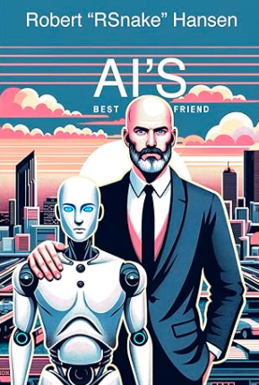
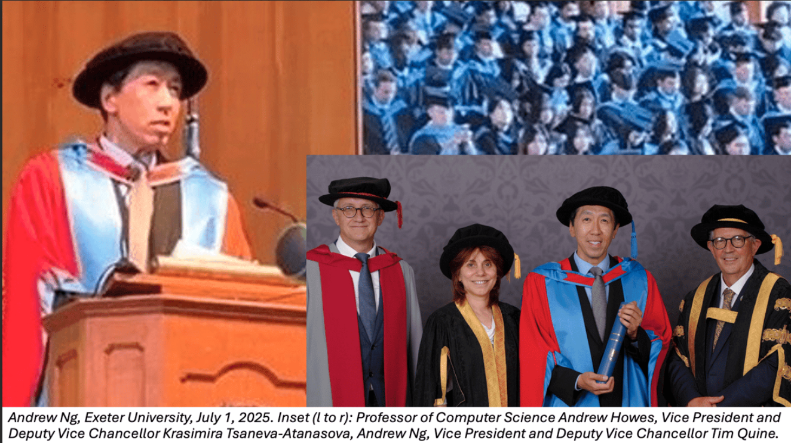

# AI Will Not Take My Job

---

## What will happen instead?
* AI will become your friend
* Your will become AI's friend

---

## Andrew Ng
* Andrew Ng is a founder of Coursera
* Honorary doctor at Exeter
* Much material is based on his letter about the event

---

## Andrew Ng at University of Exeter Faculty of Environment, Science and Economy.
* The name of this faculty stood out to me as a particularly forward-looking way to organize an academic division. 
* Having Computer Science sit alongside Environmental Science and the Business School creates natural opportunities for 
* collaboration across these fields.

---

## Future

* Every university must become an AI university
* Not just teaching AI, but using it to advance every field of study. 
* This doesn’t mean abandoning disciplinary expertise. 
* It means maintaining technical excellence while ensuring AI enhances every field.

---

## Yes, you will have to learn
* The AI will be your helper on the way
* DIY
  * [AI for Everyone](https://www.coursera.org/learn/generative-ai-for-everyone)
  * [Elephant Scale Webinar](https://courses.elephantscale.com/pages/advances-in-ai-free-weekly-webinar)
* For your company
  * https://elephantscale.com/
  * info@elephantscale.com

---
