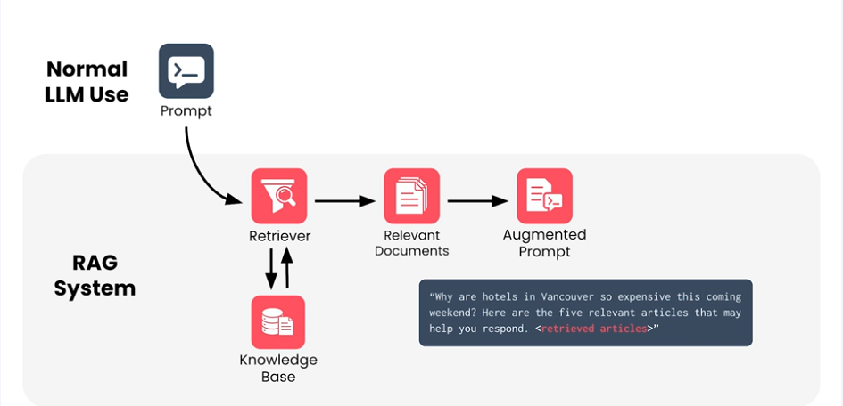
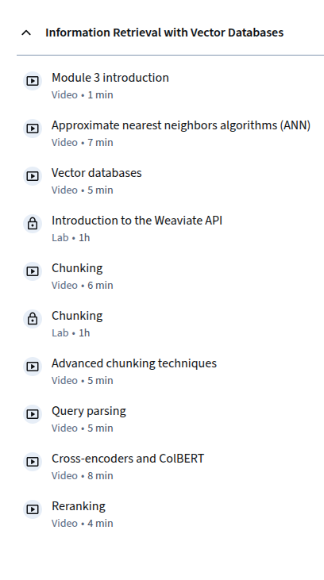

# LLM with semantic search

---

# Keyword Search

---

## Introduction
- Learn the basics of keyword search and its role in information retrieval.
- **Key Objectives**:
  - Understand how keyword search works in retrieval systems.
  - Implement basic search functionality using Python.
  - Explore the limitations of keyword-based search.
- **Why it matters**:
  - Keyword search forms the foundation of traditional search engines and is widely used in text-based systems.

---

## Setup
- Import required libraries:
```python
import os
from sklearn.feature_extraction.text import CountVectorizer
```

- **Key Insight**:
  - CountVectorizer is a common tool for converting text into numerical form, enabling basic keyword matching.

---

## Implementing a Keyword Search
- Example of a simple keyword search:
```python
documents = [
    "The quick brown fox jumps over the lazy dog",
    "A journey of a thousand miles begins with a single step",
    "To be or not to be, that is the question"
]
vectorizer = CountVectorizer()
X = vectorizer.fit_transform(documents)
query = "quick fox"
query_vector = vectorizer.transform([query])
similarities = (X @ query_vector.T).toarray()
print(similarities)
```

- **What happens here**:
  - The query is converted into a numerical vector.
  - Similarities between the query and documents are calculated using dot product.

---

## Challenges with Keyword Search
- **Key Limitations**:
  - Exact keyword matching fails to capture semantic meaning.
  - Misses results with synonyms or related concepts.
- **Real-world Examples**:
  - Searching for "car" will not return results containing "automobile."

---

## Next Steps
- Explore alternatives to keyword search:
  - Semantic search.
  - Contextual embeddings.
- **Real-world Applications**:
  - Building simple search engines for structured datasets.
  - Initial filtering in information retrieval systems.

---

# Embeddings

---

## Introduction
- **What are embeddings?**
  - Vector representations of text, allowing for semantic understanding.
- **Key Objectives**:
  - Learn how embeddings represent text numerically.
  - Explore popular embedding techniques like Word2Vec, GloVe, and OpenAI embeddings.
- **Why embeddings are powerful**:
  - Capture context and relationships between words, enabling semantic search.

---

## Setting Up Embeddings
- Import required libraries:
```python
from openai.embeddings_utils import get_embedding
```

- **Key Insight**:
  - OpenAI embeddings provide pre-trained, high-quality representations for semantic understanding.

---

## Generating Embeddings
- Example of generating embeddings for text:
```python
text = "The capital of France is Paris."
embedding = get_embedding(text, model="text-embedding-ada-002")
print(embedding)
```

- **What happens here**:
  - The text is mapped to a high-dimensional vector space.
  - Similar texts have closer embeddings, enabling semantic similarity comparisons.

---

## Visualizing Embeddings
- Use dimensionality reduction to visualize embeddings:
```python
from sklearn.decomposition import PCA
import matplotlib.pyplot as plt

embeddings = [get_embedding(doc, model="text-embedding-ada-002") for doc in documents]
pca = PCA(n_components=2)
reduced = pca.fit_transform(embeddings)

plt.scatter(reduced[:, 0], reduced[:, 1])
plt.show()
```

- **Why visualization matters**:
  - Helps understand how embeddings group similar texts in vector space.

---

## Next Steps
- Experiment with embeddings in semantic search and clustering.
- **Applications**:
  - Search engines.
  - Text classification.
  - Topic modeling.

---

# Dense Retrieval

---

## Introduction
- Learn about dense retrieval and its role in modern search engines.
- **Key Objectives**:
  - Understand the difference between dense and sparse retrieval.
  - Implement dense retrieval using embeddings.
- **Why this is important**:
  - Dense retrieval leverages embeddings for semantic understanding, overcoming keyword-based search limitations.

---

## Implementing Dense Retrieval
- Example of retrieving documents based on query embeddings:
```python
from sklearn.metrics.pairwise import cosine_similarity

query_embedding = get_embedding("Find documents about journeys.", model="text-embedding-ada-002")
cosine_scores = cosine_similarity([query_embedding], embeddings)
print(cosine_scores)
```

- **What this does**:
  - Uses cosine similarity to rank documents based on their semantic similarity to the query.

---

## Challenges in Dense Retrieval
- **Common Issues**:
  - Requires high-quality embeddings.
  - Computationally expensive for large datasets.
- **Mitigations**:
  - Use approximate nearest neighbors (ANN) for faster retrieval.

---

## Next Steps
- Experiment with tools like FAISS for scalable dense retrieval.
- **Applications**:
  - Personalized search.
  - Semantic content recommendation.

---

# ReRank

---

## Introduction
- **What is ReRanking?**
  - Refining search results using additional contextual information or models.
- **Key Objectives**:
  - Implement reranking for improving search quality.
  - Use OpenAI models for context-aware reranking.
- **Why reranking is critical**:
  - Improves user satisfaction by delivering the most relevant results.

---

## Setting Up Reranking
- Import required libraries:
```python
from langchain.chains import RerankChain
```

---

## Implementing Reranking
- Example:
```python
query = "philosophy of life"
documents = ["A journey of a thousand miles...", "The meaning of life is...", "Philosophy deals with existence..."]

rerank_chain = RerankChain(...)
ranked_documents = rerank_chain.run(query, documents)
print(ranked_documents)
```

- **What happens here**:
  - Initial results are refined using a more sophisticated model to improve relevance.

---

## Applications of Reranking
- **Use Cases**:
  - Search engines.
  - Recommendation systems.
  - FAQ matching.

---

# Generating Answers

---

## Introduction
- Learn how to use OpenAI models for generating answers based on retrieved documents.
- **Key Objectives**:
  - Implement document-grounded answer generation.
  - Combine retrieval with generative models.

---

## Setting Up Answer Generation
- Example:
```python
query = "What is the capital of France?"
context = "France is a country in Europe. Its capital is Paris."

response = openai.Completion.create(
    model="text-davinci-003",
    prompt=f"Answer the query: {query} based on the context: {context}",
    max_tokens=50
)
print(response.choices[0].text.strip())
```

---

## Next Steps
- Integrate retrieval systems with generative models for end-to-end pipelines.
- **Applications**:
  - Chatbots.
  - Automated customer support.
  - Knowledge assistants.

---

## RAG course

* Coursera course
* https://www.coursera.org/learn/retrieval-augmented-generation-rag/home/module/1

---

## RAG intro


---

## Need for RAG


---

## RAG idea


---

## RAG applications


---

## More RAG applications


---

## Specialized knowledge


---

## Applications of RAG


---


## Personalized of RAG


---

## Summary of RAG


---

## RAG architecture


---

## RAG architecture cont'd


---

## Advantages of RAG


---

## Basic code snippet of RAG


---

## Module 2


---

## Module 3


---

## Module 4


---

## Module 5


---
