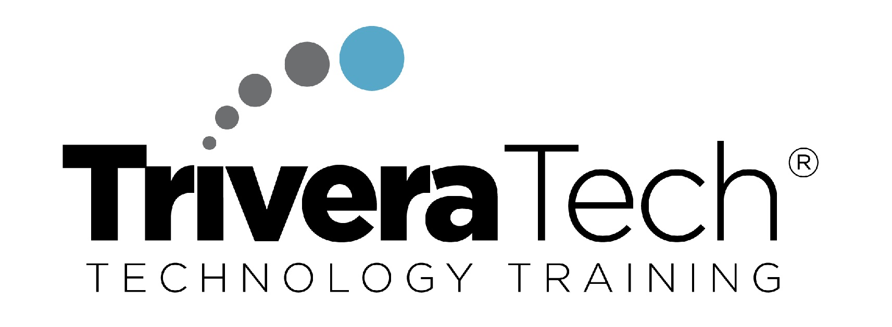
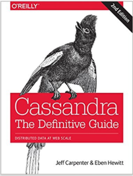
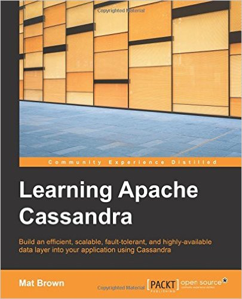

 <!-- {"left" : 3.33, "top" : 6.2, "height" : 2.33, "width" : 2.33} -->

# Introduction to Apache Cassandra

---

## Instructor Introduction

* Instructor, please introduce yourself

* And highlight your expertise and experience in the subject

---

## Class Objectives

 * Understand Cassandra design and architecture

 * Learn data modeling in CQL

 * Implement real world scenarios in C*

 * Gain an understanding of C* internals

 * Learn best practices

Notes: 

---

## Class Agenda

* Day 1
    - **NOSQL** 
    - **Cassandra Intro** 
    - **CQL Intro** 
    - **CQL Modeling 1** 

* Day 2
    - **CQL Modeling 2 (advanced)** 
    - **Group exercise: Modeling workshop** 

* Day 3
    - **Implement use case scenarios in C*** 
    - **Java drivers** 
    - **C* internals** 
    - **Administration fundamentals** 

Notes: 

---

## Prerequisites & Expectations

 * Basic understanding of Linux development environment

     - Command line navigation 

     - Editing files (e.g. using VI or nano)

 * This is a **Cassandra Introductory** class. 

     - No previous C* knowledge is assumed 

     - Class will be paced based on the pace of majority of the students. 

 * C* Driver Labs require basic knowledge of Java

Notes: 

---

## Our Teaching Philosophy

 <!-- {"left" : 1.54, "top" : 1.98, "height" : 5.77, "width" : 7.16} -->

 * Emphasis on concepts & fundamentals

 * Highly interactive (questions, discussions ..etc  are welcome)

 * Hands-on (learn by doing)

Notes: 

All the labs are verified at 1.3 even though latest is 1.4

---

## Real World Can Be Complicated...

Notes: 

---

## Recommended Books / Resources

 * “Cassandra: The Definitive Guide,” by Jeff Carpenter, Eben Hewitt

 * “Learning Apache Cassandra” by Mat Brown

 * Datastax Academy: https://academy.datastax.com 

 &nbsp;  &nbsp;  

Notes: 

---

## Quick Introductions (Time Permitting)

* Your Name

* Your background (developer, admin, manager, etc.)

* Technologies you are familiar with

* Familiarity with Cassandra (scale of 1 – 4;  1 – new,   4 – expert)

*  **Something non-technical about you!**  **(favorite ice cream flavor or hobby, etc.)** 

 &nbsp; <!-- {"left" : 1.02, "top" : 5.93, "height" : 2.02, "width" : 2.28} --> &nbsp; <!-- {"left" : 3.33, "top" : 5.96, "height" : 1.95, "width" : 3.59} --> &nbsp; <!-- {"left" : 6.94, "top" : 5.93, "height" : 2.02, "width" : 2.28} -->

Notes: 

---

## Class Logistics

 *  **Instructor's contact** Email / LinkedIn

 *  **Slides** 

     - You will get PDF copies of slides.  

     - Feel free to annotate or highlight, etc. (use a modern PDF reader)

 *  **Lab Exercises:** 

 *  **Working environment:** Provided in the cloud

Notes: 

---

## Let's Get Started!

  &nbsp;  &nbsp;