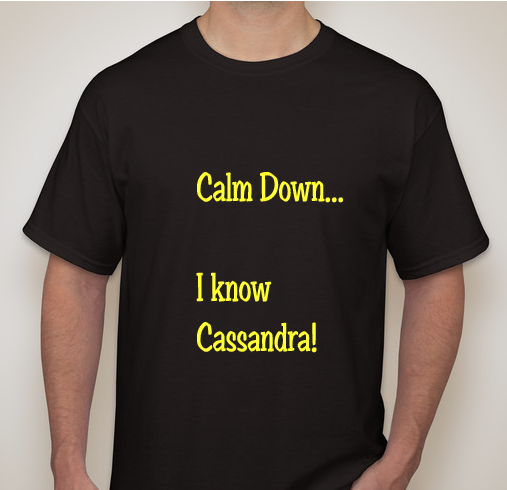
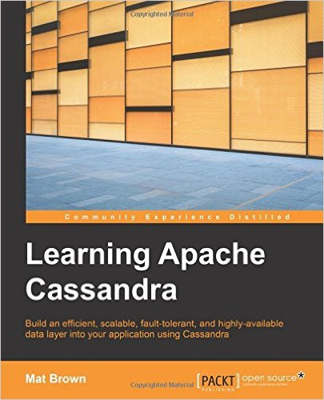

# About Cassandra Class


---


## Class Objectives


 * Understand Cassandra design and architecture

 * Learn data modeling in CQL

 * Implement real world scenarios in C*

 * Gain an understanding of C* internals

 * Learn best practices

Notes: 


---

## Class Overview


 * Day 1

     -  **NOSQL** 
     -  **Cassandra Intro** 
     -  **CQL Intro** 
     -  **CQL Modeling 1** 

 * Day 2

     -  **CQL Modeling 2 (advanced)** 
     -  **Group exercise: Modeling workshop** 

 * Day 3

     -  **Implement use case scenarios in C*** 
     -  **Java drivers** 
     -  **C* internals** 
     -  **Administration fundamentals** 

Notes: 


---

## Prerequisites & Expectations


 * Basic understanding of Linux development environment

     - Command line navigation 

     - Editing files (e.g. using VI or nano)

 * This is a **Cassandra Introductory** class. 

     - No previous C* knowledge is assumed 

     - Class will be paced based on the pace of majority of the students. 

 * C* Driver Labs require basic knowledge of Java

Notes: 


---

## Our Teaching Philosophy


 * Emphasis on concepts & fundamentals

 * Highly interactive (questions, discussions ..etc  are welcome)

 * Hands-on (learn by doing)

Notes: 

All the labs are verified at 1.3 even though latest is 1.4


---

## Lots of Labs: Learn By Doing


 <!-- {"left" : 1.54, "top" : 1.98, "height" : 5.77, "width" : 7.16} -->

Notes: 


---

## Analogy: Learning To Fly...


 <!-- {"left" : 0.25, "top" : 1.74, "height" : 6.17, "width" : 9.74} -->

Notes: 

Image: http://aviation-schools.regionaldirectory.us/learn-to-fly-720.jpg


---

## Instruction


 <!-- {"left" : 0.25, "top" : 1.74, "height" : 6.17, "width" : 9.74} -->

Notes: 

Image: http://www.wikihow.com/Become-a-Certified-Flight-Instructor


---

## + Flight Time


 <!-- {"left" : 0.25, "top" : 1.45, "height" : 6.17, "width" : 9.74} -->

Notes: 


---

## After The Class...



Notes: 


---

## Real World Can Be Complicated...


Notes: 


---

## Recommended Books / Resources


 * “Cassandra: The Definitive Guide,” by Jeff Carpenter, Eben Hewitt

 * “Learning Apache Cassandra” by Mat Brown

 * Datastax Academy: https://academy.datastax.com 

 &nbsp;  &nbsp;  

Notes: 


---

## Class Logistics


 *  **Instructor’s contact** Email / LinkedIn

 *  **Slides** 

     - You will get PDF copies of slides.  

     - Feel free to annotate or highlight, etc. (use a modern PDF reader)

 *  **Lab Exercises:** 

 *  **Working environment:** Provided in the cloud

 *  **Setup instructions:** None / Minimal

Notes: 


---

## About You And Me


 * About you

     - Your Name

     - Your background (developer, admin, manager, etc.)

     - Technologies you are familiar with

     - Familiarity with Cassandra (scale of 1 – 4;  1 – new,   4 – expert)

     -  **Something non-technical about you!**  **(favorite ice cream flavor or hobby, etc.)** 

 &nbsp; <!-- {"left" : 1.02, "top" : 5.93, "height" : 2.02, "width" : 2.28} --> &nbsp; <!-- {"left" : 3.33, "top" : 5.96, "height" : 1.95, "width" : 3.59} --> &nbsp; <!-- {"left" : 6.94, "top" : 5.93, "height" : 2.02, "width" : 2.28} -->

Notes: 


---

## Typographic Conventions


 * Code in the text uses a fixed-width code font, e.g.: 

     - catalog: Catalog = new CatalogImpl

     - Code fragments are the same, e.g. catalog.speakTruth

     - We  **bold/color**  text for emphasis

     - Filenames are in italics, e.g.  *Catalog.scala* 

     - Notes are indicated with a superscript number (1) or a  **star *** 

     - Longer code examples appear in a separate code box - e.g.

```text
object TestApp {  // Basic Spark App (Scala)
  def main(args: Array[String]) {
		val sc = new SparkContext(
      new SparkConf().setMaster("local").setAppName(”TestApp")
		val totalWords = sc.textFile(“file”)
               .flatMap(l => l.split(" ")).count()
		println (“# lines : “ + totalWords)
	}
}

```

Notes: 

(1) If we had additional information about a particular item in the slide, it would appear here in the notes

We might also put related information that generally pertains to the material covered in the slide


---

## Questions?


 * Any Questions? 

Notes: 


