# Cassandra Intro

---

## Lesson Objectives

 * Learn Cassandra Architecture

 * Interact with Cassandra

 * Learn Cassandra data organization and data models

 * Gain an understanding of Cassandra replication & consistency levels

Notes: 

---

# Introduction & Architecture

---

## What is Cassandra?

 * Cassandra

     - Is a NoSQL database

 * That is...

     - Highly scalable
     - Highly available
     - With no single point of failure

Notes: 

---

## What is Cassandra?

 * That provides:

     - Very high read/write throughputs
     - With low latency
     - Tunable consistency
     - And query language

 * That runs on: 

     - Commodity hardware
     - And cloud friendly
     - Can span multiple data centers

---

## C* History

 * Developed @ Facebook to power ‘inbox’ search (2008)

 * Modeled after Amazon Dynamo & Google Big Table

 * Timeline

     - 2008: Created @ FB

     - 2010: Became Apache project

     - 2011: v1.0 with CQL support

     - 2013: v2.0 with light weight transactions support

     - 2015: v3.0 with materialized views

     - 2017: v3.10

Notes: 

---

## Cassandra is Designed to Run on a Cluster

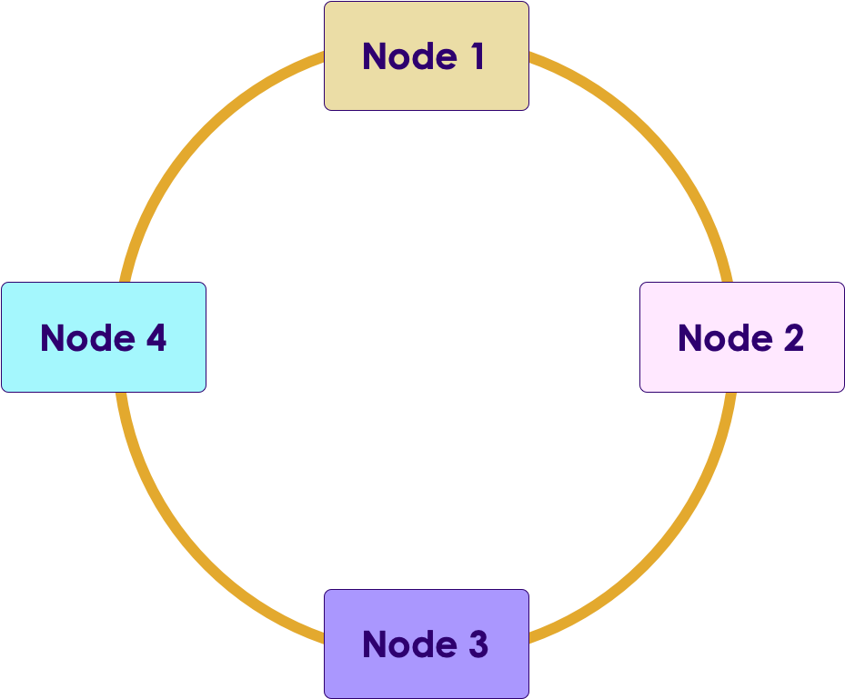

Notes: 

---

## Cassandra Cluster

 * The way C* is intended to run (Production setup)

 * Runs on commodity hardware (cost effective)

 * Failure tolerant

     - Can survive node failures

 * Peer-to-Peer

     - All nodes are "equal"

     - No "master"/"slave" design

     - “Ring" design

 * No single master

     - No single point of failure => highly available

     - Compare with Hadoop

Notes: 

---

## Compare with HDFS Architecture

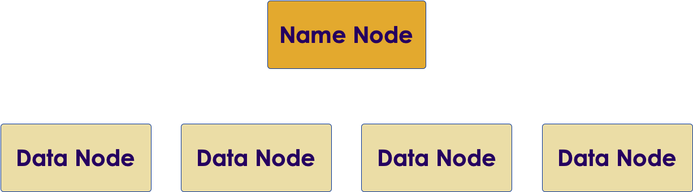

Notes: 

---

## C* Across Data Centers

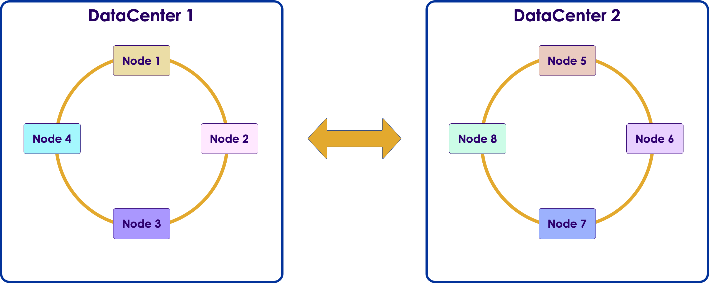

Notes: 

C* cluster can span multiple DCs.

---

## C* Across Data Centers

 * Nodes can be arranged in multiple DCs

 * C* will replicate data efficiently between remote data centers

 * Used for:

     - Disaster recovery

     - Load balancing

        * Keep data close to the user, multiple geolocations (US, Asia-Pac)

Notes: 

---

## Sidebar: Cassandra on a Single Node

 * C* can run on a single node

 * Useful for developing 

 * Runs on Mac, Linux, and Windows

 * Needs Java 

Notes: 

---

## High Throughput & Scalability

 * Start with small number of nodes (3)

 * Add more nodes for capacity 

     - => scale out

     - No need to replace existing nodes

     - No change to the APPLICATION code!

     - Seamless scaling

 * C* distributes data across the cluster

     - More nodes => more workers to ingest data & serve data

     - => linear scale

Notes: 

---

## Massive Scale

 * http://techblog.netflix.com/2011/11/benchmarking-cassandra-scalability-on.html

Notes: 

---

## Cassandra in Cloud

 * C* works very well on cloud environments 

 * Amazon AWS, Google Cloud, Cloudstack ...etc.

 * Cloud gives you “unlimited” scale

 * Netflix is a big user of C* on Amazon Cloud

     - Thousands of nodes

     - Used for user profiles/recommendations

Notes: 

---

# Cassandra Use Cases

---

## C* Use Case: T-Mobile

 *  **Goal:** 

     - Improve customer support and device diagnostics

     - Collect device metrics data from millions of devices

 *  **Problem:** 

     - Traditional database buckled under the load

 *  **Solution:** 

     - Moved to Cassandra to store massive amount of device data

Notes: 

Source: http://bigdatausecases.info/entry/from-sql-to-nosql

---

## C* Use Case: Netflix

 *  **Problem:** 

     - Original data warehouse was Oracle

     - Was not handling the load

     - Maintenance downtime every week

 *  **Solution:** By moving to Cassandra

     - No downtime!

     - Massive scalability on Amazon Cloud

     - Data safety

 * Netflix recommendations are powered by C*

Notes: 

Source: http://bigdatausecases.info/entry/oracle-to-cassandra-at-netflix

---

# Data Organization

---

## Data Organization

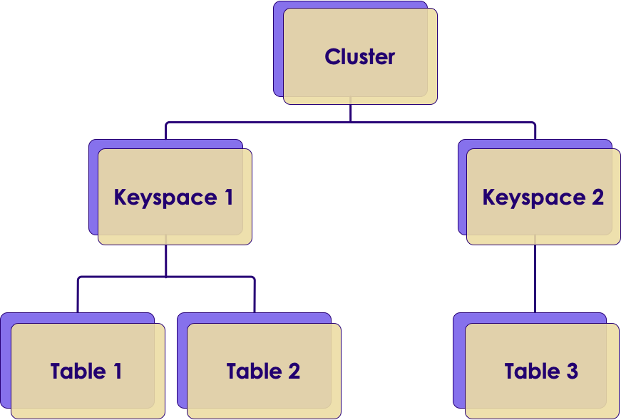

Notes: 

---

## Cluster

 * Cassandra Cluster is a bunch of nodes assigned in a RING formation

 * Each node is assigned a position in the Ring

 * A cluster can span multiple data centers!

Notes: 

---

## Keyspace

 * A cluster has a bunch of keyspaces 

     - Usually one/two

 * Keyspace, in turn, contains ‘tables’

 * Keyspace attributes

     - Replication factor

     - Replica placement

     - Tables

Notes: 

---

## Data Hierarchy Visualization

Notes: 

---

## Cassandra vs. RDBMS

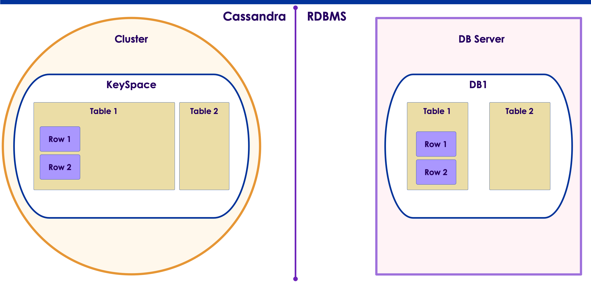

Notes: 

---

## Hierarchy: ‘Myflix’ Application

Notes: 

---

## Tables

 * Tables have rows & columns.

     - Very much like RDBMS

 * Each row must have a **UNIQUE** primary key.

|       | Col 1   | Col 2   | Col 3   |
|-------|---------|---------|---------|
| Row 1 | Value 1 | Value 2 | Value 3 |
| Row 2 | Value 4 | Value 5 | Value 6 |

Notes: 

---

## Sparse Tables

 * Unlike RDBMS, Cassandra is built for “sparse” rows

 

|       | Col 1   | Col 2   | Col 3   | Col 5   | Col 5   |
|-------|---------|---------|---------|---------|---------|
| Row 1 | Value 1 | Value 2 | Value 3 |         |         |
| Row 2 |         |         |         | Value 4 | Value 5 |

 * Each row can have any number of columns

     - Doesn’t have to be same column (unlike RDBMS)

 * C* does NOT store NULL values

     - NULLs don’t take up any space (free)

Notes: 

---

## Timestamp of Cell

 * C* tracks “last modification” time for each column automatically.  

 * This timestamp is stored along side with data.

 * Timestamp is accurate to micro-seconds since Epoch (1970-01-01  00:00:00)

 * Timestamp is used for resolving conflicts (multiple updates to same cell value)

|       | Col 1       | Col 2        | Col 3       |
|-------|---------    |---------     |---------    |
| Row 1 | Value 1     | Value 2      | Value 3     |
|       | Timestamp 1 |  Timestamp 2 | Timestamp 3 |

Notes: 

http://www.epochconverter.com/ for converting times.

---

# First Look at Cassandra

---

## Lab: Preparation

 *  **Instructor:**

     - Distribute  **cassandra-labs.zip** 

     - Help students set up  **Markdown preview plus plugin**  **in Chrome** 

 *  **Students:**

     - You each get individual C* node in Amazon Cloud

     - Use an SSH client (ssh, putty, bitvise) to connect

 *  **Lab** 

Notes: 

---

## Lab: Install

 *  **Overview:** Install C*

 *  **Builds on previous labs:** None

 *  **Approximate time:** 15 mins

 *  **Instructions:** 01-intro / 1.1-install

 *  **Lab** 

Notes: 

---

## Interacting with C*

 * Interaction via CQLsh console/shell

     - (Old versions: cassandra-cli)

 * Command: cqlsh

 * CQL shell is a client to run CQL commands

 * All commands must end with a " **;** "

 * Comments

     - Single-line: // This is a comment

     - Multi-line: /* This is also                              a comment */

 * quit; => exits the shell

Notes: 

---

## CQL Shell Getting Started

 * Use ‘help’ or ‘?’ to get help

 * 	*cqlsh> help describe;*

     - Prints options for "describe" command

 * Describe

 * *cqlsh> Describe cluster;*   prints cluster status

 * Learn to use TAB completion

     - Type partial keyword and then <TAB>

     - Also, do double-TAB (tab-tab)

Notes: 

---

## Lab: CQLSH

 *  **Overview:** Interact With Cassandra

 *  **Builds on previous labs:** None

 *  **Approximate time:** 15 mins

 *  **Instructions:** 

     - 01-intro  / 1.2-cqlsh.md

 *  **Lab** 

Notes: 

---

## Lab: Answers

 * To see cluster details

     - *cqlsh>  describe cluster;*

 * To view keyspaces

     - *cqlsh>  describe keyspaces;*

 * To view system keyspace

     - *cqlsh>  describe keyspace system;*

 *  **Lab** 

Notes: 

---

# Replication & Consistency

---

## Data Distribution

 * C* distributes data across clusterThis gives us:

     - Linear scalability to massive data sizes

     - Load balancing

 * Where will the data go?

 * Data placement decision has to be:

     - Very quick

     - Predictable(We need to locate the data quicklytoo, so random placement will not work)

     - No overhead (No separate lookup tables to maintain)

Notes: 

---

## How is Data Distributed

 * C* uses **hashing** to distribute data

     - Fast

     - Predictable

     - No need for separate lookup tables

 * Hash algorithm: Murmur3

 * **Partition Key** is hashed using a partitioner to generate a **token**

 * Token determines which **node owns** that partition

Notes: 

Murmur Hash algorithm: https://en.wikipedia.org/wiki/MurmurHash
Murmur code repository: https://github.com/aappleby/smhasher
Murmur3 is the new default hashing algorithm.  It provides faster hashing & improved performance over its predecessor “RandomPartitioner.” 

---

## Data Distribution

 * Rows are distributed across nodes as partitions

 * Placement is determined by “hashing”

 * “Subsequent” rows may not be stored together on the same node.

     - Hashing can place them on different nodes

     - See diagram: ‘row2’ and ‘row3’ are on different nodes 

Notes: 

---

## Replicas and Data Safety

 * C* creates multiple replicas on different nodes

 *  **“Replication Factor”**  decides the number of copies (default 3 copies)

 * RF is set at KeySpace level

 * All replicas are equally important (there is no primary replica)

Notes: 

---

## Replication: SimpleStrategy

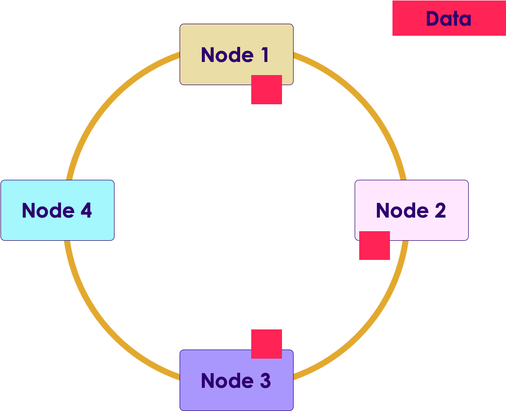

 * Make replicas within a DC

 * The first replica is determined by partitioner

 * Places other replicas on next nodes around the ring walking “clockwise”

 * Doesn’t consider network topology

 * OK for evaluation/testing

 * Not recommended for production use

Notes: 

---

## Replication: NetworkTopologyStrategy

Notes: 

---

## Replication: NetworkTopologyStrategy

 * Network topology aware (racks & data center)

 * Each data center can have its own Replication Factor

     - In our example, DC1 has 3 copies, DC2 has 2 copies

 * Allows for disaster recovery

 * Recommended for production use

Notes: 

---

## Replication: Rack Awareness

 * We have 2 replicasIs it safe?

 * If ‘rack 1’ fails, datais lost!

Notes: 

---

## Replication: Rack Awareness

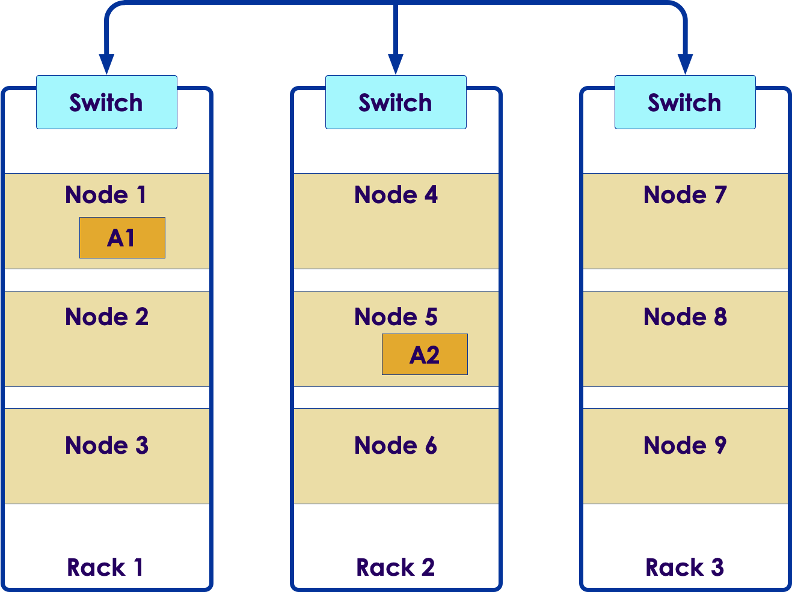

 * NetworkTopologyStrategy places a copy on another rack

 * This safeguards data in case of rack failure

Notes: 

---

## Snitches

 * Snitches describe the network topology

     - Configured in cassandra.yaml

     - Describe racks, Datacenters for On-prem clusters

     - Describe regions, DCs for Cloud clusters

 * Cassandra comes with pre-defined snitches

     - SimpleSnitch – Single DC

     - GossipingPropertyFileSnitch – recommended for Production

        * Spreads rack/DC settings across cluster automatically

     - Various cloud snitches

Notes: 

---

## Consistency

 * Consistency: 

     - How do we view data?

     - Do all readers see the latest version of data?

 * Strong Consistency

     - Readers always see the latest value

     - Most RDBMS offer this

 * Eventual Consistency

     - Readers may see obsolete value

Notes: 

---

## Eventual Consistency Example:Video + Comments

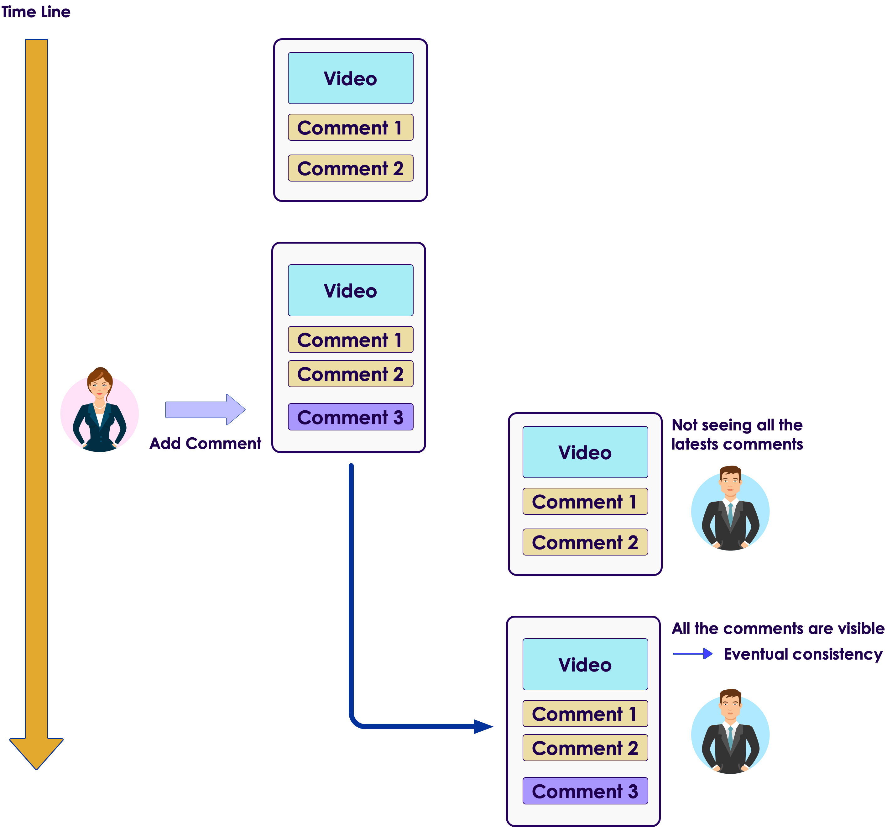

Notes: 

---

## Consistency in Distributed Systems

 * CAP Theorem is in effect again

 * Strong consistency in a distributed system will mean “locking” and “blocking”

     - Writers “lock” the data they are updating

     - All readers attempting to read the data “block” till lock is released

 * Locking and Blocking will reduce data throughput

 * We don’t need strong consistency all the time

Notes: 

---

## Consistency in C*

 * C* offers **tunable consistency**

 * Extension of Eventual Consistency

 * Clients decide the consistency level

     - For each request!

Notes: 

---

## C* Writes and Updates

 * Client can connect to any node

 * If the node is not responsible for the data (row), it will forward the request to other nodes

     - => coordinator node

 * Client can choose to wait for 

     - Any replica to be completed

     - All replicas to be completed

     - Or something in between

Notes: 

---

## Write, RF=3, Consistency = ALL

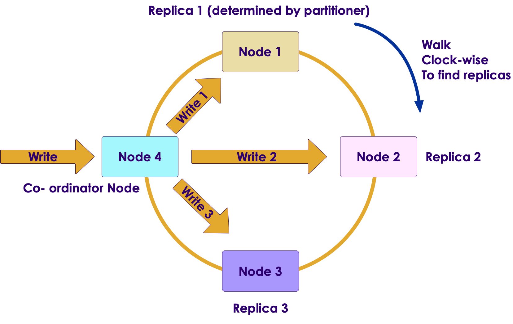

Notes: 

Node 4 is coordinator for this request.
Node 4 is forwarding writes to appropriate replicas.
RF=3 means, we need to create 3 replicas.
Consistency = ALL, client will wait for all replicas to be created.

---

## Write, RF=3, Consistency = ALL (Cont.)

 * Client connects to any node

     - This becomes the “co-ordinator” node

 * RF = 3

     - We need to write to 3 replicas

     - The first replica is determined by the partitioner (hash)

     - Walks the ring “clockwise” to find replicas

 * Consistency = ALL

     - Client waits for all replicas to be created

 * Slower writes

Notes: 

---

## Write Consistency Levels

| Level         | Description                                                 | Usage                                                                           |
|---------------|-------------------------------------------------------------|---------------------------------------------------------------------------------|
| ANY           | Client will wait for ONE replica to be created              | Lowest consistency, Highest availability,  Low latency, Fast writes |
| ALL           | Client will wait for ALL replicas to be created             | Highest consistency, Lowest availability, Not-so-fast writes            |
| QUORUM        | Wait for Quorum (RF / 2 + 1) replicas                       | Good compromise                                                                 |
| LOCAL_QUORUM  | Wait for all QUORUM replicas within the 'local' data center | Avoid inter-data center communication,  Consistency within a DC             |
| Complete list | See documentation                                           |                                                                                 |

Notes: 

---

## Quorum

 * QUORUM is a good middle-ground ensuring strong consistency, yet still tolerating some level of failure.

 * Quorum = (Replication Factor/2) + 1

 * RF = 3, Quorum = 2

     - Can tolerate 1 replica down

 * RF = 6, Quorum = 4

     - Can tolerate 2 replicas down

Notes: 

---

## Quiz 1: RF & Level

 * Client writes with RF = 3,   Level=ANYWhich of the following is true…

     - C* will only create only COPY of data

     - C* will create 3 copies

     - Client will wait for all replicas

     - Client will wait for ONE replica only

 * Answer:

     - C* will create 3 copies

     - Client will only wait for first replica to be completed

     - The other replicas (2) will be created in the background

Notes: 

---

## Quiz 2: Multi-Datacenter

 * RF (fixed): @ DC1 = 3, @ DC2 = 2

 * Write Level (dynamic) = Local_Quorum

Notes: 

---

## Quiz 2: Answer

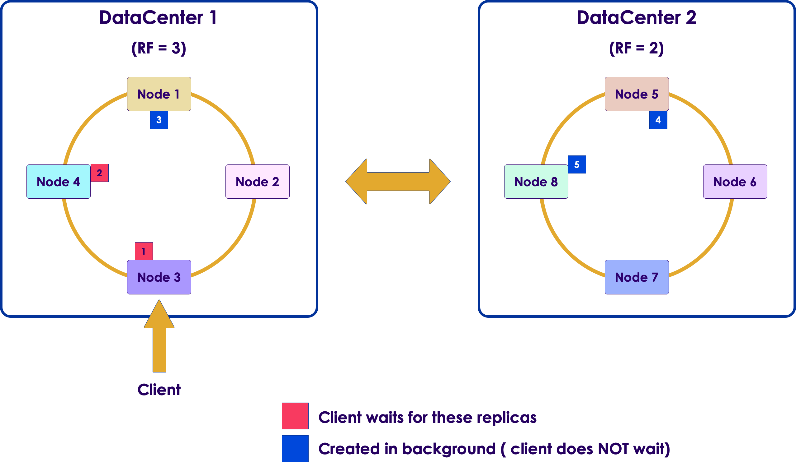

Notes: 

RF is 3 @ DC1, so 3 replicas need to be created here.
RF = 2 @ DC2, 2 replicas
Client is connected to DC1, so this is our local data center.
Level = Local_Quorum, so we need to meet quorum in local data center (DC1). 
Create 2 replicas  ( Q = RF / 2 + 1)
RF1 and RF2 are created in DC1…client waits until they are created.
After that, client is notified of successful write, client returns.
In DC1, RF3 is created in background.
In DC2, RF4 and RF5 are created in background.

---

## Quiz 3: Multi-Data Center

 * RF (fixed): @ DC1 = 3, @ DC2 = 2

 * Write Level (dynamic) = Each_Quorum

Notes: 

---

## Quiz 3: Answer

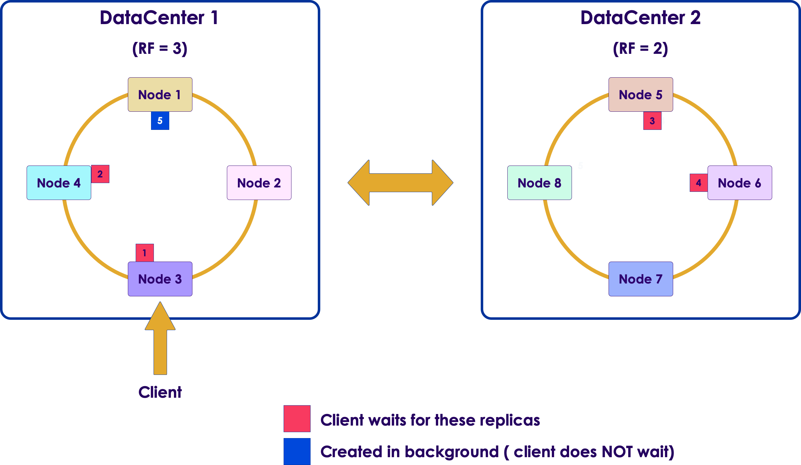

Notes: 

RF is 3 @ DC1, so 3 replicas need to be created here.
RF = 2 @ DC2, 2 replicas
Client is connected to DC1, so this is our local data center.
Level = Each_Quorum, so we need to meet quorum in both data centers (DC1 and DC2).
@DC1: RF1 and RF2 are created.
@DC2: RF3 and RF4 are created.
After that, client is notified of successful write, client returns.
In DC1, RF5 is created in background.

---

## Read, Consistency Level = ALL

Notes: 

Values are read from all replicas.

---

## Read Consistency

 * Specifies how many replicas need to respond to a read

 

| Level  | Description                                  | Usage                                                      |
|--------|----------------------------------------------|------------------------------------------------------------|
| ALL    | All replicas must respond, if not read fails | Highest consistency  Lowest availability               |
| QUORUM | Returns after a quorum of replicas respond   | Strong consistency  Some level of failure is tolerated |

 

 * Full list: See documentation

Notes: 

---

## Read: Consistency Level = ALL, Resolving Conflicts...

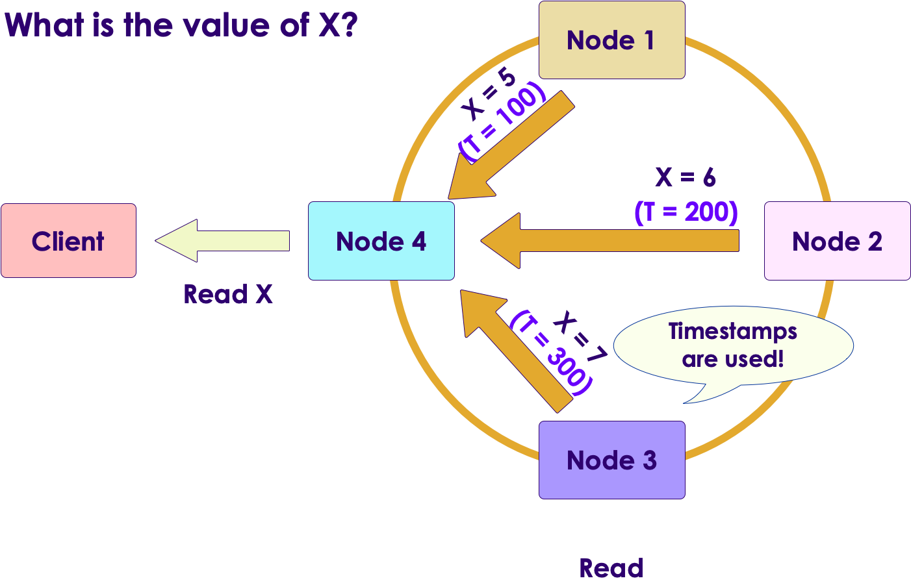

Notes: 

What if everyone disagrees?
And the correct values are pushed to all out-of-date nodes.

---

## Repair on Read

 * Reconciled values are pushed out to “out-of-date” replicas

 * Only replicas that are read will be updated

Notes: 

---

## Read, Consistency Level = ANY

 * Only Node2 replica is read (ANY level)

 * So client gets X = 6

 * Obsolete value!!

Notes: 

---

## Read, Consistency Level = Quorum

 * 2 replicas are read from Node2 (X = 6) & Node3 (X = 7)

 * Conflict is resolved using timestamps

 * Client gets X = 7 (latest value)

 * Node2 replica is updated to X = 7

Notes: 

---

## Read, Consistency Level = Quorum 

 * Replicas from Node1 (X = 5) and Node2 (X = 6)

 * Client gets X = 6 (as Node2 has latest timestamp)

 * Node1 replica is updated with X = 6

Notes: 

---

## Read: Resolving Conflicts

 * What happens when results from replicas disagree?

 * Read operation with consistency=quorum

 * Got two results

     - X = 5,    timestamp = 100

     - X = 10,  timestamp = 110

 * Value with **latest timestamp** is chosen (X = 10)

 * (Remember to time-synchronize Cassandra nodes!)

 *  **Quiz:** 

     - Can get obsolete data when I say Level = Any?

     - How about at Level = ALL?

Notes: 

---

## Read Repair

 * C* will repair all replicas that were involved in the read path

     - E.g., Quorum reads will only repair replicas read, NOT all

     - Controlled by consistency level

 * C* can initiate 'read repair' on additional replicas based on 'read_repair_chance' property on table

     - Usually set to  **0.1** 

     - 10% of the read requests will trigger a read-repair

Notes: 

---

## Uses of Tunable Consistency...

 * C* allows the application to specify consistency **for each request**

     - This allows great flexibility in building applications

 * Case 1) User changes password

     - We want MOST consistency for this action

     - We want the change to take effect in all data centers

     - => Consistency level = EACH_QUORUM / LOCAL_QUORUM

 * Case 2) Incoming data speed increased (spike in usage...)

     - See next slide  =>

     - Need to speed up ingest process

     - Lower consistency level temporarily from  QUOROM => ANY

     - When traffic subsides, go back to QUORUM

Notes: 

---

## Dynamic Consistency Level Change

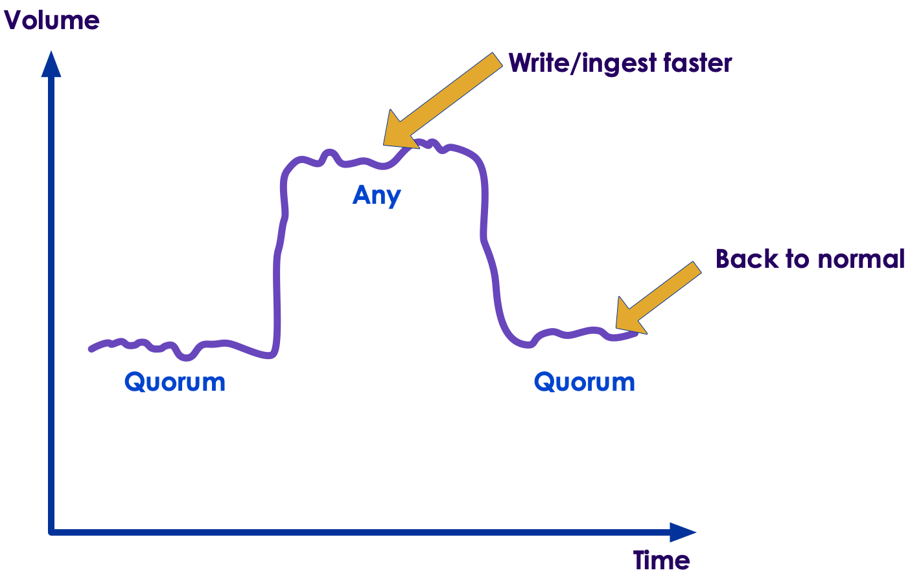

Notes: 

---

## Ensuring Consistency

 * 1) Replication

     - Just saw this

 * 2) What if one replica is down?

 * 3) What if coordinator node goes down?

 * 4) “Good data turning bad”

Notes: 

---

## Hinted Handoff

 * What happens if Node-3 is down?

 * Co-ordinator node will store a hint

 * And replay it when node3 comes back up

 * This is called **hinted handoff**

Notes: 

---

## Hinted Hand-Off

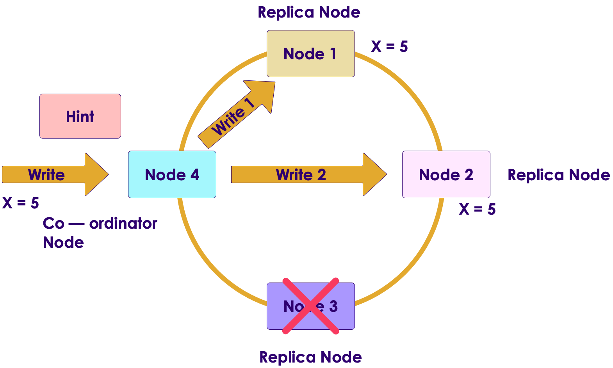

Notes: 

Node 4 will store the hints and forward them to node 3 when it comes back up.

---

## Ensuring Consistency

 * C* can do repair-on-read…cool!

 * How about data that is never read?

 * “Bad things happen to good data”

     - A disk corruption changes data value

 * Anti-Entropy-Service 

     - Run periodically to ensure “good data remains good”

 * Summary

     - 1) Replication

     - 2) Hinted hand-off

     - 3) Repair-on-read

     - 4) Anti-entropy-service

Notes: 

---

## Deletes

 * C* supports deleting rows/columns

 * However, it does **not** immediately delete data on disk

 * Instead, it marks the delete using a **tombstone** marker

 * Data is physically deleted during next compaction cycle

Notes: 

---

## Review Questions

 * Where does Cassandra fit in the CAP theorem (CP / AP) ?

 * Does Cassandra cluster have a master?

 * What is Cassandra ring?

 * Is Replication Factor (RF) setting static or dynamic?

 * Is Consistency Level (any, all ..etc) setting static or dynamic?

 * How does C* protect data when 'bad things  happen to good data'?

Notes: 

