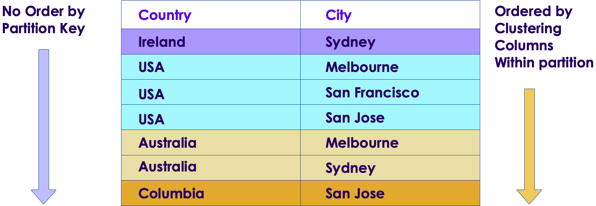

# Session: Cassandra Data Modeling 2


---


## Lesson Objectives


 * Learn advanced data modeling concepts in C*

 * Learn to use collections

 * Model with composite primary keys

 * Gain an understanding of time series data modeling

 * Learn to use Counters

 * Understand Lightweight Transaction support in C*

Notes: 


---

# Collections

---


## C* Collections

| Type | Description                                       | Sample                            |
|------|---------------------------------------------------|-----------------------------------|
| List | * Ordered collection   </br> * Duplicates allowed | [‘foo’, ‘bar’, ‘foo’]             |
| Set  | * Un-ordered collection   </br>  * No duplicates  | {‘foo’, ‘bar’}                    |
| Map  | * Key / value  </br> * No dupes                   | {‘x’: ‘foo’,     </br>‘y’: ‘bar’} |


Notes: 


---

## Collections Best Practices


 * Keep collections ‘small’.

 * Observe the following limitations of collections.

 * Don’t insert more than 2 Billion entries into a collectionAny thing more won’t be queryable  => data loss 

 * Maximum number of keys for map is 64k

 * Each item in collections has size limits

     - Map / List: 2GB per item
     - Set: 64KB

 * Collections cannot be ‘sliced’.  C* reads the entire collection into memory. => stay well within the maximum limits listed

 * Support for indexing collections is moving target

     - check release notes for exact capabilities
     - e.g.  Map type only supports indexing values (not keys)

Notes: 


---

## Collections Examples


```text
create table users (
	uid text PRIMARY KEY,
	name text,
	phones set<text>,
	emails map<text, text>,
	checkins list<text>
);

-- set
insert into users(uid, name, phones) 
VALUES (‘u1’, ‘user 1’, {‘+1415123456’ , ‘+14082349876’});

-- map
insert into users (uid, emails)
VALUES (‘u1’, {‘personal’: ‘u1@gmail.com’, 
					   ‘work’: ‘u1@company.com’ } );

-- list (duplicates allowed)
Insert into users (uid, checkins)
VALUES (‘u1’, [‘starbucks’,  ‘great mall’,  ‘starbucks’]);

```

Notes: 


---

## Lab 3: Collections


 *  **Overview:**

     - Define collections

     - Insert data into collections

     - Query data in collections

 *  **Builds on previous labs:** None

 *  **Approximate Time:** 30 – 40 mins

 *  **Instructions:**  **03-collections /**  **README.md** 

 *  **Documentation:** http://docs.datastax.com/en//cql/latest/cql/cqlIntro.html (search for ‘collections’)

 *  **Lab** 

Notes: 


---

# Composite Keys

---


## Modeling World Cities


 * We want to model cities in the world.

 * Can the table below uniquely represent all cities in the world?

```text
create table cities (	city_name text,	population int,	PRIMARY KEY (city_name)	);

```


Notes: 


---

## Cities table...


 * City name alone can not uniquely identify a city

 * Melbourne

     - Melbourne, Florida, US

     - Melbourne, Australia

 * San Diego

     - California, US

     - Columbia

 * Let’s include **Country Name** in primary key

 * **Primary Key = Country Name + City Name**


Notes: 

---

## Cities table Revised

  * *CREATE TABLE cities (	country text,	city text,	population int,	PRIMARY KEY (country, city)	);*


  * Quiz: can this uniquely identify all cities in the US?

  * Quiz: What are the most popular city names in the US?

    - Greenville (38),  Franklin (30) … Springfield (29)http://en.wikipedia.org/wiki/List_of_the_most_common_U.S._place_names 

```text

// cities table that can support all US cities
CREATE TABLE cities (	country text,
  state, text	city text,	population int,	PRIMARY KEY (country, state, city)	);
```
---


## Composite Primary Key


 * Primary Key can be a combination of more than one column
    - => composite key

 * Primary Key = **Partition Key** + one / more **Cluster Columns**

 * PK = country + city

     - Country: partition key
     - City: clustering key


 * Partition Key decides which node the data resides
 * Data is ordered in cluster column order within a partition

 * PK(A,B)

     - Partition key: A
     - Clustering keys: B

 * PK(A,B,C)

     - Partition key: A
     - Clustering keys: B,C


---

## Composite Key: Data Layout


 *  **PK (country, city)** 

 * Only  **country** is hashed locate the data


Notes: 


---

## Lab 4.1: Composite Keys


 *  **Overview:** 

     - Create and use composite keys

 *  **Builds on previous labs:**  None

 *  **Approximate Time:**  15 mins

 *  **Instruction:s**  **04-composite-keys /**  **README.md** 

 *  **Lab** 

Notes: 


---

## Clustering Keys: Sorting Order





Notes: 


---

## Composite Keys: Sorting Order


 * In our example

     - Primary Key =  **country** (Partition Key) +  **City** (Cluster Column)

 * Table is NOT sorted **by partition key**

 * But within a partition key, data is sorted by cluster column

Notes: 


---

## Composite Keys: Query Mechanics


 * During Query

     - 1) C* uses Partition Key first

     - 2) Then it may search within cluster columns

 * Query by **Partition Key**

     - SELECT * from cities WHERE  **country** = ‘USA’

     - Specifying Partition key is important for fast queries

 * Query by **Cluster Columns**

     - SELECT  * from cities   WHERE  **city** = ‘Melbourne’

     - Can be slow!

     - ALLOW FILTERING

Notes: 


---

## Query Speed


 * Queries within a partition are FAST

     - Need to specify Partition Key in WHERE clause

     - Select*  ... where  **country = ‘**  **USA** ’

| Country | City          | Population |
|---------|---------------|------------|
| **USA** | Melbourne     |            |
| **USA** | San Francisco |            |
| **USA** | San Jose      |            |


Notes: 


---

## Query Speed


 * Queries across partitions are   S-L-O-W

     - Needs multiple seeks on disk

 * Select... WHERE   **city = ‘**  **Melbourne**  **’** 

| Country | City      | Population |
|---------|-----------|------------|
| USA     | **Melbourne** |            |

</br>
</br>

| Country       | City      | Population |
|---------      |-----------|------------|
| Australia     | **Melbourne** |            |

Notes: 


---

## Visualize Composite Keys


 * Postal mail: Which of these mails will be delivered quickly?


 * In C* queries specifying partition key are faster

 * PK (A,B,C)

     - Query speed </br> All specified (A,B,C) >>  ( __ , B, C)  >>  ( __, __ , C)

Notes: 


---

## Possible Problems: Data Skew


 * Primary Key = (Country , City)

     - Partition Key = Country

 * Big countries (USA) might have a lot of data

 * Small countries (Belgium) may have just a few entries

 * Partitions could become unbalanced

 * Group Discussion:

     - How can we fix this?


Notes: 


---

## Partition Skew: Solution 1


 * PRIMARY KEY **(city, country)**    // flipped

 * Which queries will be fast?  Which need ‘allow filtering’?

     - Select * from cities where city = ‘Melbourne’ ;  // is this fast?

     - Select * from cities where country = ‘USA’;  // is this fast?

        * No,  needs ‘allow filtering’, hence slow!

Notes: 


---

## Partition Skew: Solution 2


 * Let’s make **State** part of the PK

 * PRIMARY KEY (  **(country, state)**,   city)
     - Note the brackets

 * What is the implication of  PK (country, state, city) ?

 * (A, B, C)  is not the same as   ( (A,B), C)   

 * Queries:
     - Select  * from cities where country = ‘USA’ // will this work?
     - select * from cities2 where state = 'CA’;
     - select * from cities2 where country = 'USA'  and state = 'CA’;
     - select * from cities2 where city = 'Melbourne'


Notes: 


---

## Key Take Aways


 * Design the schema  with **query** in mind

 * In composite keys, key order matters a great deal

     - Fast query  vs. slow query

     - PK (A,B,C)  !=   PK (C,B,A)

 * Be judicious with ‘allow filtering’

Notes: 


---

# Time Series Data

---


## Time Series Data


 * Sensor Data (thermostats, weather stations, buoys)

 * Stock tickers

 * Other cases where the data that changes on temporal basis


Notes: 

Source: Wikipedia


---

## Storing Sensor Data


 * An ambient sensor sends the following

     - Sensor_id

     - Timestamp

     - Temperature

     - Humidity

     - Carbon Monoxide level

     - Etc.

 * How do we store it?

 * Good news: C* can handle this VERY WELL!

Notes: 


---

## Quiz: How Will This Be Stored In an RDBMS?


| Time | Sensor_id | Temp | Humidity | Co_level |
|------|-----------|------|----------|----------|
| 100  | **S1**        | 70   | 34       | 12       |
| 110  | S2        | 89   | 99       | 11       |
| 130  | **S1**        | 68   | 33       | 12       |
| 140  | S2        | 88   | 98       | 11       |
| 180  | **S1**        | 67   | 33       | 12       |


Notes: 


---

## Sensor Table in C*


Notes: 


---

## Time Series in C* Visualization


 * Visualize (look at sort order for timestamp).

 * Notice the color coding.


Notes: 


---

## C* Vs. RDBMS


 * In RDBMS each new reading will create a **ROW**

 * In C* each new reading becomes a **COLUMN**


Notes: 


---

## Lab 5.1: Time Series Data


 *  **Overview:**

     - Model time series data

 *  **Builds on previous labs:** None

 *  **Approximate Time:** 20 mins

 *  **Instructions:**

     -  **05-time-series / 5.1-time-series-1.md** 

     -  **Go to 5.2 (next slide)** 

 *  **Lab** 

Notes: 


---

## Lab 5.2: Time Series Data


 *  **Overview:**

     - Generate bulk time series data using data-gen scripts

 *  **Builds on previous labs:** 5.1

 *  **Approximate Time:** 30 mins

 *  **Instructions:**  **05-time-series / 5.2-generate-data.md** 

 *  **Lab** 

Notes: 


---

## Understanding Time Series Data Storage


 * Inspect sensor data using cqlsh

 * $  cqlsh</br>
Cqlsh>   select * from sensors;*

* Inspect the data using ‘cassandra-cli’ tool

* *$ cassandra-cli</br>
Cli>  use myflix;</br>
Cli>  list sensors;*

Notes: 

‘cassandra-cli’   has been deprecated in C* version 3.  It may be replaced by another tool liks ‘sstables2json’   or ‘sstabledump’


---

## Design Improvements


 * Overtime data from sensors add up

 * Partitions can get pretty large

     - Partition_key = sensor_id

 * ONE partition’s data must fit on ONE machine

 * Add another partition key

     - Maybe by month?

Notes: 


---

## Partitioning by: sensor + month


 *  create table sensors (	 ....	month text,  // e.g:  2014-04

 *         	PRIMARY KEY ( (sensor_id, month),  time)) WITH CLUSTERING ORDER BY (time DESC);

 * Note : It is not same as PK (sensor_id, month, time)!!

Notes: 


---

## Partitioning: sensor + month


Notes: 


---

## Group Discussion: Recovering from a full partition


 * One of my C* partitions is FULL

     - Primary key (sensor_id, time)

     - All updates to the partition are failing!

     - I am losing data!!

     - Help!!!

 * Come up with solutions, consider the following

     - Stop the ‘bleeding’ (stop losing data)

     - Come up with a schema

     - Figure out how to migrate data to new schema

     - How do we deploy

Notes: 

Image credit: wikimedia commons


---

## Controlling Table Size


 * Timestamp is a large data size: 8 bytes  (long)

 * Storing 100s of millions or billions of timestamps will consume a lot of storage

 * How can we optimize space?

     - Store full timestamp for one month

     - Then, only store ‘delta’ increments

Notes: 


---

## Takeaways


 * C* handles time series data well

 * Watch out for partitions ballooning in size

     - Further segment partition (by day, week, month …)

 * Optimize storing smaller values 

     - Long: 8 bytes

     - Int: 4 bytes

     - Short: 2 bytes

Notes: 


---

## Lab 5.3: Partitioning Time Series Data


 *  **Overview:** 

     - Partition time series data

 *  **Builds on previous labs:** 5.1 & 5.2

 *  **Approximate Time:** 45 mins

 *  **Instructions:**  **05-time-series / 5.3-partitioning.md** 

 *  **Lab** 


Notes: 


---

# Counters

---


## Counters


 * Quickly count things
     - Events, pageviews …etc.

 * Store counters in dedicated tables  (count_pageviews)

 * Can only have Primary Key and counter column

 * More than 1 counter column allowed

```text

     CREATE TABLE count_pageviews (
         visits counter,
         url varchar,
       PRIMARY KEY (url)
     );

     UPDATE count_pageviews
            SET visits = visits + 1
           WHERE url ='http://www.mysite.com'
```

Notes: 


---

## Lab 6: Counters


 *  **Overview:**

     - Using counters

 *  **Builds on previous labs:** None

 *  **Approximate Time:** 15 mins

 *  **Instructions:**  **06-counter /**  **README.md**  

 *  **Lab** 

Notes: 


---

# Lightweight Transactions

---


## ACID


 * **A**tomic

     - updates succeed or rolled back
     - Data in consistent state

 * **C**onsistent

     - A transaction cannot leave the database in inconsistent state

 * **I**solated

     - Transactions cannot interfere with each other

 * **D**urable

     - Completed transactions persist in the event of server crash

Notes: 


---

## ACID in C*: Atomic


 * Row level updates are atomic

     - Insert / update is one operation

 * Multi-row updates are NOT atomic

 * Write may succeed in one replica and fail on others

     - No roll-backs, handled via repair

 * C* uses timestamps to resolve conflicts

     - When multiple clients are updating the same ‘cell’, the latest timestamp will win

Notes: 


---

## ACID in C*: Consistency


 * Two consistency levels are offered

     - Tunable Consistency

     - Serial Consistency

Notes: 


---

## ACID in C*: Tunable Consistency


 * Extension of eventual consistency

 * Multiple levels: 

     - ALL, LOCAL_QUORUM, QUORUM, ANY, etc.

     - Applies to both Reads and Writes

 * Set in cqlsh using:

     - CONSISTENCY [ *level* ]

Notes: 


---

## ACID in C*: Isolation


 * Imagine the case:

     - Client-A  is writing a row with 1000 column

     - Client-B is reading the same row,  it may see ‘partial’ columns (500)

 * Writes to a ROW are isolated

 * Partial row is NOT visible to another client until the update is complete

Notes: 


---

## ACID in C*: Durability


 * C* provides excellent durability

 * Writes are replicated across nodes

 * On each node, writes is

     - First persisted to **“COMMIT LOG”**

     - And is persisted in **memory**

     - Acknowledge successful write

 * In event of crash

     - Commit logs are replayed

Notes: 


---

## Transactions


 * Do something or do nothing

 * Begin	

     - update table1	
     - update table 2
 * commit

 * If something goes wrong => roll back

Notes: 


---

## Transaction semantics


 * Transactions require  ‘locks’

 * Locks are very expensive in a distributed system

 * Cassandra provides

     - Row level isolation

     - Atomic batches

     - Light weight transactions in C* version 2

Notes: 


---

## Batch Example


 * BEGIN BATCH

```text

 INSERT INTO users (userid, password) values (‘user1’, ‘seckret’);

 UPDATE users set email=‘me@me.com’  where userid = ‘user1’;

 UPDATE users set account_verified=true where userid = ‘user1’;

```

 * APPLY BATCH 

Notes: 


---

## Batch Semantics


 * Batch command supports executing multiple statements in one batch

 * Reduces network round-trips

 * All statements in the batch are executed **atomically** (all or nothing)

 * Isolation is only guaranteed within **ONE partition** (imposed by C* design)

 * No ordering of statements within batch

 * Sets **SAME** timestamp for **ALL** operations within the batch

Notes: 


---

## Light Weight Transactions


 * Available  for INSERT / UPDATE / DELETE

 * Also known as Compare And Set (CAS)

 * Triggered via IF clause

     - Does a read before the write

 * Restricted to a PARTITION

     - DC-Local coming soon

 * Use SERIAL consistency 

 * DO NOT use lightly

     - 4X latency 

Notes: 


---

## ACID in C*: SERIAL Consistency


 * Only applies to Lightweight Transactions

 * Set in cqlsh using:

     - SERIAL CONSISTENCY [ *level* ]

        * Level: LOCAL_SERIAL or SERIAL

Notes: 


---

## LWT Example: INSERT


 * Two users are trying to create account with the same user_id

 * We don’t want to over-write each record

     - Prevents race conditions (think two threads competing to update a value)

 * SERIAL CONSISTENCY LOCAL_SERIAL

 * INSERT INTO USERS (user_id, name….)VALUES  (‘joe’,  ….)IF NOT EXISTS;

Notes: 


---

## LWT Example: Update


 * UPDATE users (email)SET email = ‘new email’IF email = ‘old email’

Notes: 


---

## Paginating Through All Rows


 * Not really a good C* use case

     - ‘needle in a haystack’

 * Can use ‘token’  function

 * SELECT * FROM test WHERE token(k) > token(42);

     - Quiz: why 42? 

 * Partitioner Choice:

     - ByteOrderedPartitioner:  ordered distribution

     - RandomPartitioner – random distribution

     - Murmur3Partitioner (default) – random

 * More: http://www.datastax.com/documentation/cql/3.0/cql/cql_using/paging_c.html 

Notes: 


---

# Materialized Views

---


## Materialized Views


 * A table created from another table

 * Primary Key constraints

     - Must include all columns from source table primary key 

     - Can include ONE additional column

     - No static columns allowed

 * Use Materialized Views when Secondary Index are not suitable

     - For high cardinality data

Notes: 


---

## Materialized Views: Example


```text
CREATE MATERIALIZED VIEW features_by_type 
    AS SELECT code, name, type, release_date 
    FROM features 
    WHERE type is NOT NULL 
	  PRIMARY KEY(type, code);

select * from features_by_type where type = ‘TV Show’;  // OK

```

Notes: 


---

## Materialized Views: Limitations


 * Cannot insert/update materialized views directly

     - Created and updated asynchronously 

     - When base table changes

     - Updates can lag

Notes: 


---

## Data Aggregation


 * C* support for aggregation is limited:

     - COUNT, SUM, AVG, MIN, MAX

     - Limited to a column within selected rows

 * Solutions

     - Use COUNTER type 

     - Compute aggregations on the fly

     - Do aggregations in application code

     - Use SPARK!

Notes: 


---

## Takeaways


 * C* support for ACID is different from RDBMS

 * **Lightweight Transactions** help CAS style transactions

 * Secondary Indexes can be used for low cardinality data and low volume queries

 * Don’t use C* for data aggregation / analysis. Spark may be a better option

Notes: 


---

## Review Questions


  * What is the use of collections in Cassandra?

  * Does Cassandra allow secondary indices? What are the performance tradeoffs?

  * True or False? Can Cassandra store time series data?

  * How do you store time series data in Cassandra?

  * Are there transactions in Cassandra? What are lightweight transactions?

Notes: 


