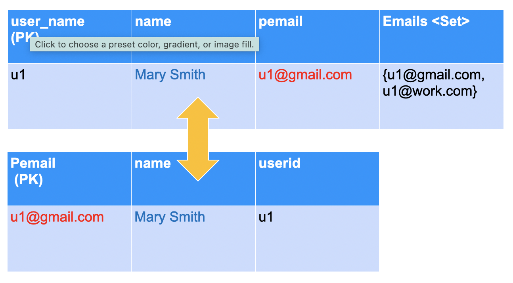
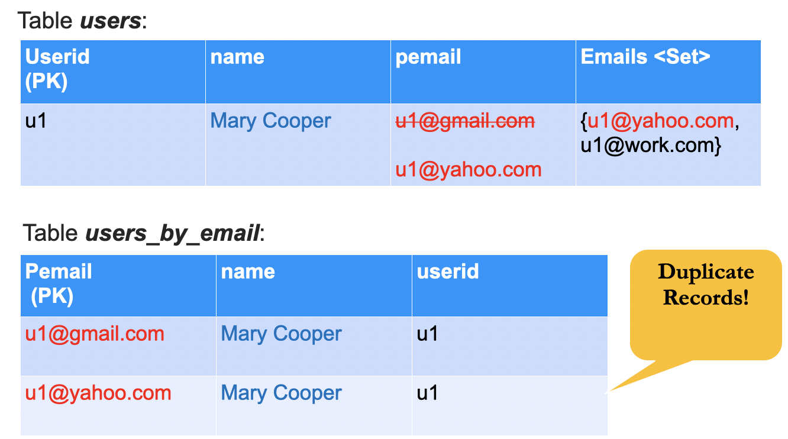
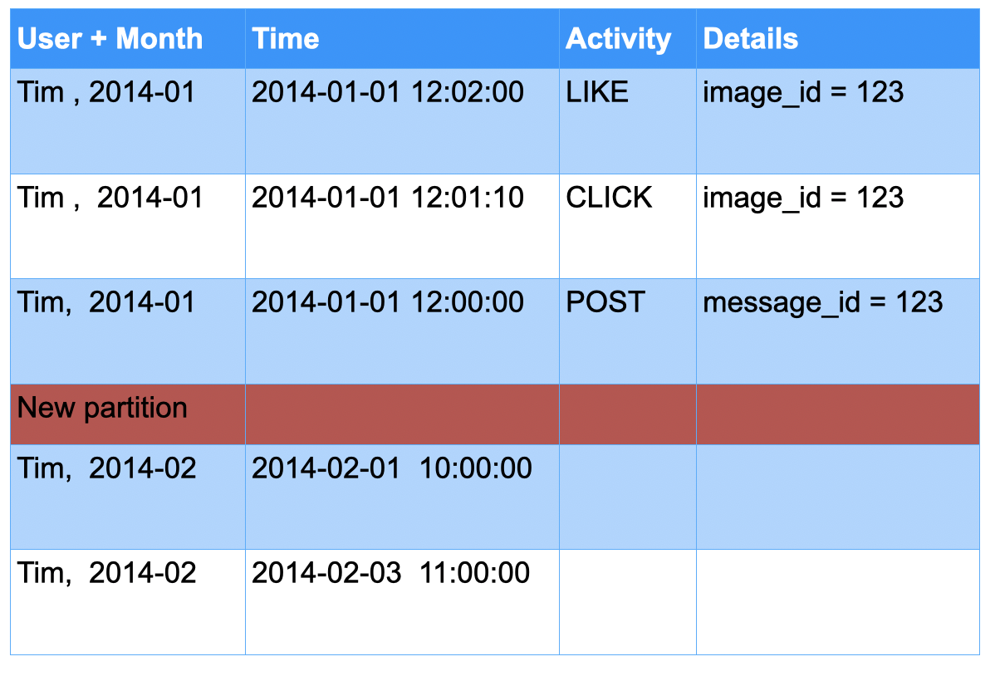

# Cassandra Data Modeling Labs


---


## Lesson Objectives


 * Learn to model various scenarios on Cassandra using CQL


Notes: 


---

## About This Lesson


 * Heavily hands-on

 * Based on: 

     - Actual use cases

     - Best practices available

 * Thanks to...

     - Apache Cassandra project

     - Patrick McFadin examples on GitHub

Notes: 


---

## Approach


 * We present a particular use case/problem

 * Work as groups to: 

     - Come up with your solution
     - Present it to the class

 * Analyze 

     - Your solution
     - Instructor’s solution

 * Discuss

     - Compromises & comparisons
     - Performance implications
     - Lessons learned

 * Reference:
     - Datastax docs: http://www.datastax.com/docs 

Notes: 


---

# MyFlix (Netflix)

---


## Use Case: MyFlix


 * Modeled after Netflix

 * Models

     - Movies

     - Users

     - Ratings

Notes: 


---

## MyFlix: Users


 * We need to store information about millions of users

 * Store the following attributes per user:

     - Name

     - Username & password

     - User **has multiple emails; ONE email is primary**

 * Think about:

     - What will be the primary key?

 * Hint: Check out available CQL data typeshttp://www.datastax.com/documentation

Notes: 


---

## Before You Start...


 * Ask me the question!!

 * What is the QUERY?

 * Q: Query users by  **username** 

 * **Answer: Next Slide!**

Notes: 


---

## MyFlix: Users: Our Solution 

```text
// Basic entity table for a user
CREATE TABLE users (
   user_name text,
   fname text,
   lname text,
   emails list<text>,
   password text,
   created_date timestamp,
   PRIMARY KEY (user_name)
);

```

 * PK = user_name (unique)

 * Emails are stored as a list.

     - The first email in the list is the “primary email”


Notes: 


---

## MyFlix: Users: Email Collections


 * How do you:

     - Prepend email to a list?

     - Append email to a list?

```text
UPDATE users SET emails = ['me@johnsmith.com'] + emails WHERE user_name = 'user1';

UPDATE users SET emails = emails + ['me2@johnsmith.com']  WHERE user_name = 'user1';

```

Notes: 


---

## MyFlix: Users: Lessons


 * Primary Key

     - We used ‘user_name’
     - => natural key (part of the model)
     - No auto-sequence keys in C*
     - Use natural keys whenever possible

 * Emails

     - Can store as List or Set
     - List has order; Set has no order; Set doesn’t allow dupes
     - If using List, I can assume “first email” is primary
     - If using SET, I need a separate field (no ordering)

Notes: 


---

## MyFlix: Users: Solution 2

```text
CREATE TABLE users (   user_name text,   fname text,   lname text,   primary_email  text,   emails set<text>,   password text,   created_date timestamp,   PRIMARY KEY (user_name));

```

 * Primary email is a SEPARATE field.

</br>

```text
Adding to set:update users set emails = emails + {‘newemail’} where user_name = ‘user1’;

```


Notes: 


---

## Using Collections—Tips


 * C* will retrieve the collection entirely

     - Keep the size manageable

     - If collection becomes too large, look at alternative design

 * Order

     - Set: sorted in alphabet order

     - List: in insert-order

 * Indexes on collections are available with the latest C*

     - Still, there are limitations

Notes: 


---

## MyFlix: Users: Part II


 *  Q: Find users by  **user_name**  **or**  **primary email** 

 *  **Answer: Next Slide!**

Notes: 


---

## MyFlix: Users by Email: Approach 1

```text
CREATE TABLE users (	user_name text,
  fname   text,	…	primary_email  text,   // add index	PRIMARY KEY (user_name));
create index  idx_email  on users(primary_email);

```

 * Add an Index on primary email

 * Is this a good index?

     - NO: Email is a high-cardinality column  


Notes: 


---

## MyFlix: Users by Email: Solution

 * Create another table!


```text
CREATE TABLE users_by_email (	user_name text,	primary_email  text, 	PRIMARY KEY (primary_email));

```
 * Create another table!

 * If I want to get the **first name** from the **email**

     - How many queries does it take?

     - Can I do it using ONE query?


Notes: 


---

## MyFlix: Users by Email: Solution

```text
CREATE TABLE users_by_email (	user_name text,	fname  text,  // de-normalized	primary_email  text, 	PRIMARY KEY (primary_email));

```
 * De-normalize!

 * Now I can get email-> firstname in one query

 * De-normalizing is very normal in C*


Notes: 


---

## Maintaining Two Tables 1


 * What happens when a new account is created?

     - Need to insert into two tables!

</br>

| user_name   </br>(PK) | name       | pemail       | Emails  <Set>                       |
|-----------------------|------------|--------------|-------------------------------------|
| u1                    | Mary Smith | u1@gmail.com | {u1@gmail.com,   </br>u1@work.com } |

</br>

</br>

| Pemail   </br>(PK) | name       | userid |
|--------------------|------------|--------|
| u1@gmail.com       | Mary Smith | u1     |

Notes: 


---

## Maintaining Two Tables 2


 * What happens when some one changes name?

     - Need to update two tables!




Notes: 


---

## Maintaining Two Tables 3


 * What happens when someone changes  **PRIMARY EMAIL** ?

     - Need to update two tables!





Notes: 


---

## Schema Consistency


 * De-normalization implies data duplication

 * Data consistency is application’s responsibility

 * Insert/Update/Delete of data requires work!

 * Q: How can we ensure data consistency?

Notes: 


---

## Logged Batches


```text
BEGIN BATCH
    UPDATE users set lname = ‘Cooper’ where user_name = ‘u1’;
    UPDATE users_by_email set lname = ‘Cooper’ where primary_email = ‘u1@gmail.com’;
APPLY BATCH;

```

 * Batch is written to co-ordinator node and replicas
 * C* will ensure that batch succeeds – no rollbacks
 * No isolation – other clients may read updated rows before entire batch completes


Notes: 


---

## MyFlix: Movies 


 * Movies Features

     - All features have a unique code

     - Name

     - Release date (date only)

     - Studio

     - Type (TV_Show, Movies, etc.)

 * Queries:

     - Q1: Find feature by code

     - Q2: Find all features by studio 

 * **Answer: Next Slide!**

Notes: 


---

## MyFlix: Movies: Our Solution

```text
create table features (	code  text,	name  text,	studio text,	release_date  timestamp,	type  text,   // TV-show,  Movies ..etc	PRIMARY KEY (code));

```
 * Q: Find movie by code	</br> select * from movies where code = ‘jaws’;


Notes: 


---

## MyFlix: Movies: Find by Studio: Solution 1

```text
create table studio_features (	code  text,	name  text,	studio text,	release_date  timestamp,	type  text,   // TV-show,  Movies ..etc	PRIMARY KEY ((studio),  code))

```

 * Q: Find movies by studio	</br>*select * from features where studio = ‘HBO’;*


Notes: 


---

## MyFlix: Movies: Find by Studio: Solution 2

```text
create table features (	code  text,	name  text,	studio text,	release_date  timestamp,	type  text,   // TV-show,  Movies ..etc	PRIMARY KEY (code));create index  idx_studio  on features(studio);

```

 * Create an Index

 * Q: Find movies by studio	</br>*Select * from features where studio = ‘HBO’;*

 * What are the implications of indexing?


Notes: 


---

## MyFlix: Movies: Bonus Lab


 * How can we store “release dates” in movie table?

     - (Theatrical release, date1)

     - (Blue ray release, date2)

     - (IMAX release, date3)

 * **Answer: Next Slide!**

Notes: 


---

## MyFlix: Movies: Bonus Lab: Answer


```text
//Use MAP

Create table features (	….	releases map<text, date>,	);

INSERT into features(code, releases) values (‘ryan’, {‘theatrical’: ‘2000-01-01’,    ‘dvd’: ‘2002-01-02’} );

INSERT into features (code, releases) values (‘ryan’,  {‘blueray’: ‘2010-10-10’}  );
select * from features;


```

Notes: 


---

## MyFlix: Ratings


 * Users will rate movies

 * Rating is an integer 1 to 5

 * Users will rate multiple movies

 * Only one rating for movie by user

 * Users may change their rating for a movie later (just store the latest rating)

 * Query: 

     - Find all ratings by a user

 * **Answer: Next Slide!**

Notes: 


---

## MyFlix: Ratings: Solution 1


```text
create table users (	user_name text,	…	ratings map<text, int>	…);

insert into users (user_name, ratings) values (‘user1’, {‘movie1’: 3} );

insert into users (user_name, ratings) values (‘user1’, {‘movie2’: 2}  );

```

 * Ratings is a Map {‘movie1’: 3}

 * What are the limitations of Map?


Notes: 


---

## MyFlix: Ratings: Solution 1 Review


 * Map has certain limitations

 * Size:

     - No more than 2 billion entries per map

     - Each item less than 64k (65,535)

     - Maximum size of a map is 2 GB

     - Which of these limitations matter?

 * Performance:

     - Cassandra will load the entire map into memory (no slicing)

 * Indexing support

Notes: 


---

## MyFlix: Ratings by User: Solution 2


```text
create table ratings_by_user (	user_name text,	feature_code text,	rating int,	PRIMARY KEY (user_name, feature_code));

```
 * We can get ratings per user quickly. </br>*select * from ratings_by_user where user_name = ‘user1’;*

 * User can rate multiple movies

 * Only one rating per movie


Notes: 


---

## MyFlix: Ratings: Part II


 * Queries

     - Find all ratings by movie

     - What is the best (worst) rating for a movie?

 * **Answer: Next Slide!**

Notes: 


---

## MyFlix: Ratings by Feature: Our Solution

```text
create table ratings_by_feature (  // another table!	user_name text,	feature_code text,	rating int,	PRIMARY KEY ((feature_code), rating, user_name)) WITH CLUSTERING ORDER BY (rating DESC);

```
 * Q: Our PK ((feature_code), rating, user_name)Why not use PK ((feature_code), user_name, rating)?

 * What happens when a user changes the rating?U1,  M1  => rating = R1U1,  M1  => rating = R2

     - Row has to be deleted and added

 * Q: Find best rating for movie:

     - select * from ratings_by_feature where feature_code = ‘xyz’ order by **rating DESC LIMIT** 1;

 * Q: Find worst rating for a movie?


Notes: 


---

## MyFlix: Ratings by Feature: Bonus


 * Any issue with column ‘type’?

     - It gets repeated for all rows of the same feature

 * Use  **“static”** - value is “universal” across all rows in a partition

 *   create table  **ratings_by_feature**  **(** 	    user_name text,	    feature_code text,	    rating int,

 *        **type text STATIC** ,	PRIMARY KEY ((feature_code), rating, user_name) **)** WITH CLUSTERING ORDER BY (rating DESC);

```text
create table ratings_by_feature (
	user_name text,	feature_code text,	rating int,
  type text,	PRIMARY KEY ((feature_code), rating, user_name)) WITH CLUSTERING ORDER BY (rating DESC);

```

Notes: 


---

## MyFlix: Ratings: Lessons


 * When user rates a movie, we need to **insert into TWO** tables

     - ratings_by_user

     - ratings_by_feature

 * Needed to satisfy the queries

     - Design schemas for queries!

 * In C* writes are fast!

Notes: 


---

## MyFlix: Bonus: User Devices


 * A user has multiple devices (TV, tablet, phone, computer)
 * Devices belong to one user
 * Classic “one to many” relationship
 * Device attributes:
     - device_id (something unique)
     - MAC address
     - Description (“my phone”)
     - Device Type (phone/tv/tablet/set-top)
     - Device belongs to ONE user

 * Queries:

     - Find all devices owned by a user
     - Find which user owns a device (given device_id)

 * **Answer: Next Slide!**

Notes: 


---

## MyFlix: User Devices


```text
create table devices (	device_id  uuid, 	mac text,	description text,	device_type int,	user_id text,	PRIMARY KEY (device_id));

-- Also modify users table to include devices he/she owns
create table users (	user_id  text,   devices  set<uuid> // new field for devices	…	);

```

Notes: 


---

## UUID & TimeUUID


 * UUID – universally unique id

     - E.g.: bfb96110-5105-4742-b17c-aeef5b5670d7

 * Collision free

 * Time UUID

     - Timestamp encoded in UUID

 * Both are ‘first-class citizens’ in C*

 * Maps to Java UUID

Notes: 


---

## MyFlix: Resuming a Movie


 * Users can watch a movie from multiple devices

 * Each device should be able to resume (pick up) the movie where the user paused (e.g., where _last_ device left off)

 * Query: Find the latest resume position for user

 * **Answer: Next Slide!**

Notes: 


---

## MyFlix: Resuming Movie: Our Solutions


```text
create table movie_resume(	feature_code text, 	device_id uuid, // last device 	position int, // in seconds	user_id text,	PRIMARY KEY ((user_id), feature_code));

```
 * Do we store only the ‘latest resume position’ per movie?

 * Do we need to store device_id (last watched on)?

 * Can the primary key be ((feature_code), user_id) ?


Notes: 


---

## Recommended: Amazon Prime


Notes: 


---

## Netflix: Profiles


Notes: 


---

## Recommendations with Profiles


Notes: 


---

## Recommendations


 * Heavy machine learning!
 * Many algorithms

 * ‘Collaborative filtering’ is one popular algorithm
     - Two models: users & items

 * Quick example
     - Recommend movies for ‘user α’

Notes: 


---

## MyFlix Lessons


 * Build Data Model for Queries

     - Goal - Single read of ONE partition

 * De-normalize for fast queries – no JOINS

     - Don’t worry about storage... storage is cheap!

 * Q: Is Netflix a **read-heavy** or **write-heavy** application?

     - Hint: In prime time (8-11pm) **36%** Internet traffic in US is consumed by Netflix streaming!

     - Probably **write-heavy** (all the devices sending ‘position’ data as movie is being watched)

     - Netflix is not serving actual movie content from C*C* is not built for large files

Notes: 


---

## Lab: MyFlix


 *  **Overview:**

     - Model MyFlix on C*

     - Generate and insert data

     - Query data

 *  **Builds on previous labs:** None

 *  **Approximate time:** 1 hour

 *  **Instructions:**  **08-myflix / README.md** 

 *  **Lab** 

Notes: 


---

## Jump off point


 *  **To instructor** 

 * Please pause this exercise  for now

 * Cover the  **Drivers and Internals** sections

 * And come back and resume the rest of the exercise

     - You may complete this section as the last one in the course

Notes: 


---

# YouTube

---


## YouTube: Models


 * Users (we already have this)

 * Videos

 * Tags

 * Comments

Notes: 


---

## YouTube Videos


 * Videos belong to users

 * Video files may be large
     - Large files are usually not stored in Cassandra

 * Video attributes:

     - Title
     - Description
     - User
     - Content (actual video content)
     - Upload_time
     - Tags

 * Videos cannot be identified by names or title (“my cat” is not unique)

 * Query:
     - Query video by a unique ‘video_id’

 * **Answer: Next Slide!**

Notes: 


---

## YouTube: Videos: Our Solution


```text
CREATE TABLE videos (
   video_id uuid,
   video_name text,
   user_name text,
   description text,
   location text,
   tags set<text>,
   upload_time timestamp,
   PRIMARY KEY (video_id)
);

cqlsh> INSERT INTO videos
(video_id, video_name, user_name, description, location, tags, upload_date)
VALUES
(18134b9d-6222-4f0e-b06d-4ba1e6c62f50, 'my cat', 'johnsmith', 'this is my cat', ‘http://cdn.com/video/18134b9d-6222-4f0e-b06d-4ba1e6c62f50’, {'cats', 'pets'}, toTimestamp(now()));

```

Notes: 


---

## YouTube: Video: Lessons


 * UUID and TIMEUUID produce unique values

     - Can be generated using uuid() and now() functions

     - Generated on the coordinator node

 *  *username*  – for easy access

 *  *tags*  – ‘Set’ implies no order

 *  *location*  -  stored as a URL:

     - Content delivery systems usually store the video itself in a different location 

 *  *upload_time*  – TimeUUID provides several functions to convert to/from various data types

Notes: 


---

## YouTube: User/Video Relation


 * Users often have many videos

 * Each video belongs to one user

 * Q: Find all videos by user

 * Q: Find latest videos by user

 * **Answer: Next Slide!**

Notes: 


---

## YouTube: User/Video Relation—Solution


 * Three fields in the PRIMARY KEY: 

     - username

     - upload_date 

     - videoid 

 * Why are they ordered in this way?

```text
// One-to-many from the user point of view
// Also known as a lookup table

CREATE TABLE videos_by_user (
   user_name text,
   video_id uuid,
   upload_time timestamp,
   video_name text,
   PRIMARY KEY ((user_name), upload_time, video_id)
);


```

Notes: 


---

## YouTube: User/Video Relation Lessons


 * We can find: 

     - All videos for a user

     - All videos within a specific date range

     - Display the latest videos

     - For a specific video, should the user click to select it? 

 * Give & Take

     - There is another table to maintain

     - When the user uploads a new video, the information about it goes to:

        * videos table

        * videos_by_user

Notes: 


---

## Lab: YouTube Videos


 *  **Overview:** 

     - Generate data for YouTube videos

 *  **Builds on previous labs:** None

 *  **Approximate time:** 30 mins

 *  **Instructions:**  **generators/generate-videos.py** 

     - Complete the TO DO items

     - Q1: Find all videos uploaded by user (What is the sorting order?)

     - Q2: Can we find all latest videos? (Uploaded by all users)

 *  **Lab** 

Notes: 


---

# Amazon

---


## Online Shopping


 * Models

     - Users
     - Items
     - Shopping cart

 * Queries:

     - Retrieve shopping cart for user
     - Add items to shopping cart
     - Delete items from cart
     - Update item quantities from cart
     - Only ONE shopping cart per user

 * **Answer: Next Slide!**

Notes: 


---

## Shopping Cart: Solution 1


 * Think about implications for Map type

```text
create table users(
    user_id  text,    …    cart map<text, int>, // itemid, qty
    PRIMARY KEY ( user_id)
);


```

Notes: 


---

## Shopping Cart: Solution 2


 * Get items in cart for user:

     - select * from shopping_cart  where user_id = ‘user1’

 * Add items to cart:

     - insert into shopping_cart (user_id, item_id, qty)values ( ‘user1’,   ‘item1’,  2)

 * Delete an item:

     - update shopping_cart (user_id,  item_id,  qty)  

     - values (‘user1’,   ‘item1’,  0);

```text
create table shopping_cart (
    user_id  text,
    item_id  text,
    qty int
    PRIMARY KEY ( (user_id), item_id)
);


```

Notes: 


---

# User Activity Logging

---


## User Activity


 * Users browse pages

 * Leave comments

 * “Like” items 

 * Queries

     - Find last-N activities per user

     - Activities for a time window (12pm–1pm)

     - Activities per day (weekday/weekend)

 * **Answer: Next Slide!**

Notes: 


---

## Shopping Cart: Solution 2


 * Discuss any potential limitations of this design.

```text
create table user_activities (	user_id  text,	activity_time  timestamp,	activity text,	details text,
	PRIMARY KEY ((user_id),  activity_time))WITH CLUSTERING ORDER BY (activity_time DESC);

```

 * insert into user_activities(user_id, activity,  details, activity_time) values (‘user1’, ‘post’,  ‘post1’,   ‘2014-01-01 10:00:00’);insert into user_activities(user_id, activity, details, activity_time) values (‘user1’, ‘click’, ‘image1’,  ‘2014-01-01 10:03:00’);

 * insert into user_activities(user_id, activity, details, activity_time) values (‘user2’, ‘like’, ‘image1’,  ‘2014-01-01 10:10:00’);

Notes: 


---

## User Activity Model

| User | Time                | Activity | Details          |
|------|---------------------|----------|------------------|
| Tim  | 2014-01-01 12:02:00 | LIKE     | message_id = 123 |
| Tim  | 2014-01-01 12:01:10 | CLICK    | message_id = 123 |
| Tim  | 2014-01-01 12:00:00 | POST     | message_id = 123 |
|      |                     |          |                  |
| Pat  |                     |          |                  |
| Pat  |                     |          |                  |

 * Note : Activity is reverse sorted by time

Notes: 


---

## User Activities: Refining


 * Single user activities map to single partition

     - b/c our partition key = user_id

 * This can lead to heavily skewed partitions

 * Need to balance partition size

 * Solutions

     - Only keep last few months of data

     - Break down the partition by using composite keys

Notes: 


---

## User Activities: Keeping Only a Few Months of Data


 * Cassandra provides TTL–Time To Live

 * When inserting data, specify the desired TTL

     - Data automatically expires afterward!

 * E.g., keep 6 months of data

     - INSERT INTO ….   VALUES(…)   USING TTL 15552000

     - 3600 secs x 24 hr x 30 day x 6 month =  15552000

Notes: 


---

## User Activities: Solution 2


 * Each partition has one month’s data per user 

 * Note double brackets for Partition Key (user_id, month)

 * Not the same as (user_id, month, time)!

```text
create table user_activities (	user_id  text,	time  timestamp,	month text,	activity text,	details text,
	PRIMARY KEY ((user_id, month),  time)) WITH  CLUSTERING ORDER BY (time DESC);

```

Notes: 


---

## User Activities: Sample View




Notes: 


---

## User Activities: Query by Activity


 * select count(*) from activity_by_time where activity = ‘post’ AND activity_time = ‘2014-01-01’;

```text
create table activity_by_time (	user text,	activity text,	activity_time  timestamp,
	PRIMARY KEY (activity,  activity_time)) WITH  CLUSTERING ORDER BY (activity_time DESC);

```

 * Q: Find activities for a particular day

Notes: 


---

## Next: Log Collection


Notes: 


---

## Log Collection


 * Collect and analyze logs on massive scale

 * Use cases:

     - Large data center
        * Keep track of logins
        * Detect attacks

     - Web properties (Amazon or LinkedIn)
        * Log user activities
        * Analyze user activities (which button users click most…etc.)

 * Distributed log collection
     - Need to collect from multiple sources (100s or even 1000s)

 * Tools

     - Flume (part of Hadoop ecosystem)
     - Kafka (distributed message queue)
     - Log Stash

Notes: 


---

## Distributed Log Collection Tools: Flume


 * Part of Hadoop ecosystem

 * Works on ‘agent -> hub’ model

 * Agents run on ‘log source’ and keep sending data upstream

 * Can handle failures


Notes: 


---

## Distributed Log Collection Tools: Kafka


 * Producer/Consumer model

 * Producers write data to Kafka

 * Consumers read data

 *  Fault tolerant

     - Data is replicated

 * Data is organized as topics

     - “emails”
     - “clicks”

 * Built for high throughput

     - LinkedIn: 220 billion messages / day
     - At peak: 3+ million messages / sec


Notes: 


---

## Log Collection: Log Table


 * Logs contain:

     - Source (ip or application_name)

     - Severity (info, error)

     - Timestamp

 * Query: 

     - Find log events for a certain host (latest event first)

     - Make sure partition size doesn’t get too big

 * **Answer: Next Slide!**

Notes: 


---

## Log Gathering: Log Table


```text
create table logs (	source text,	severity  text,  // WARN, INFO	log_time  timestamp,	raw_log blob     // or text	log_date, text,  // 2014-01-01		PRIMARY KEY ((source, log_date), log_time)) WITH CLUSTER ORDER BY (log_time DESC);

```

Notes: 


---

## Key Takeaways


 * Figure out the query first  

 * Then design the schema

 * Time series data

     - Mostly want LATEST events first  

        * Add Time as ‘clustering column’ and sort accordingly

     - Make sure partitions don’t get too big in the long run

        * Segment Partition Key by adding (date, month, year)

Notes: 


---

## Further Reading


 * Become a super data modeler

     - http://wiki.apache.org/cassandra/DataModel 

 * Sample schemas:

     - YouTube model: https://github.com/pmcfadin/cql3-videodb-example 

Notes: 


---

## Review Questions


 * In Cassandra, which comes first, data model or queries?

 * Is de-normalization good or bad in Cassandra?

 * How do you generate unique primary keys in Cassandra?

 *  Where do you store blobs in Cassandra solutions?

Notes: 


