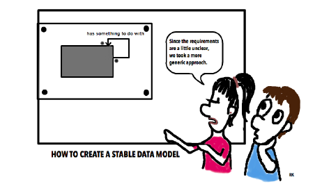
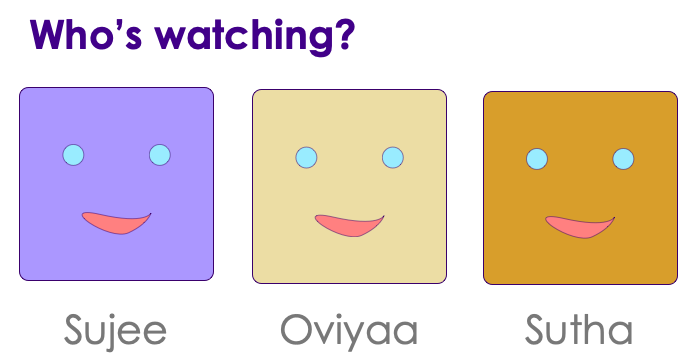
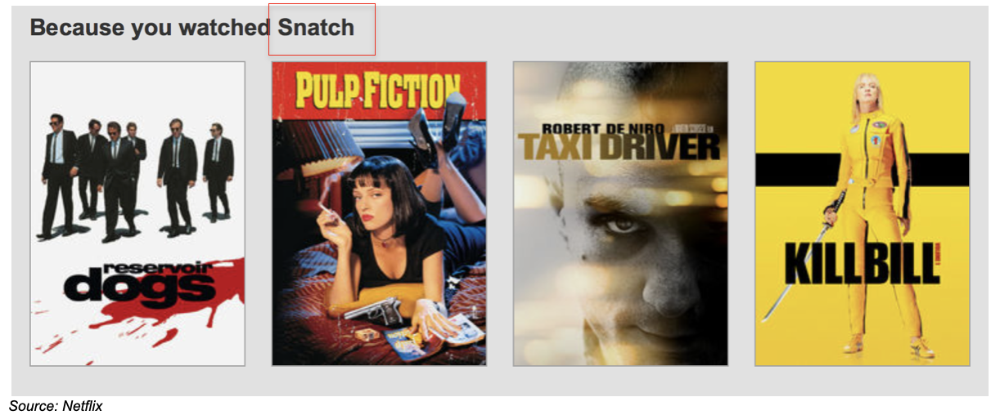
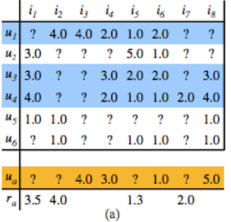
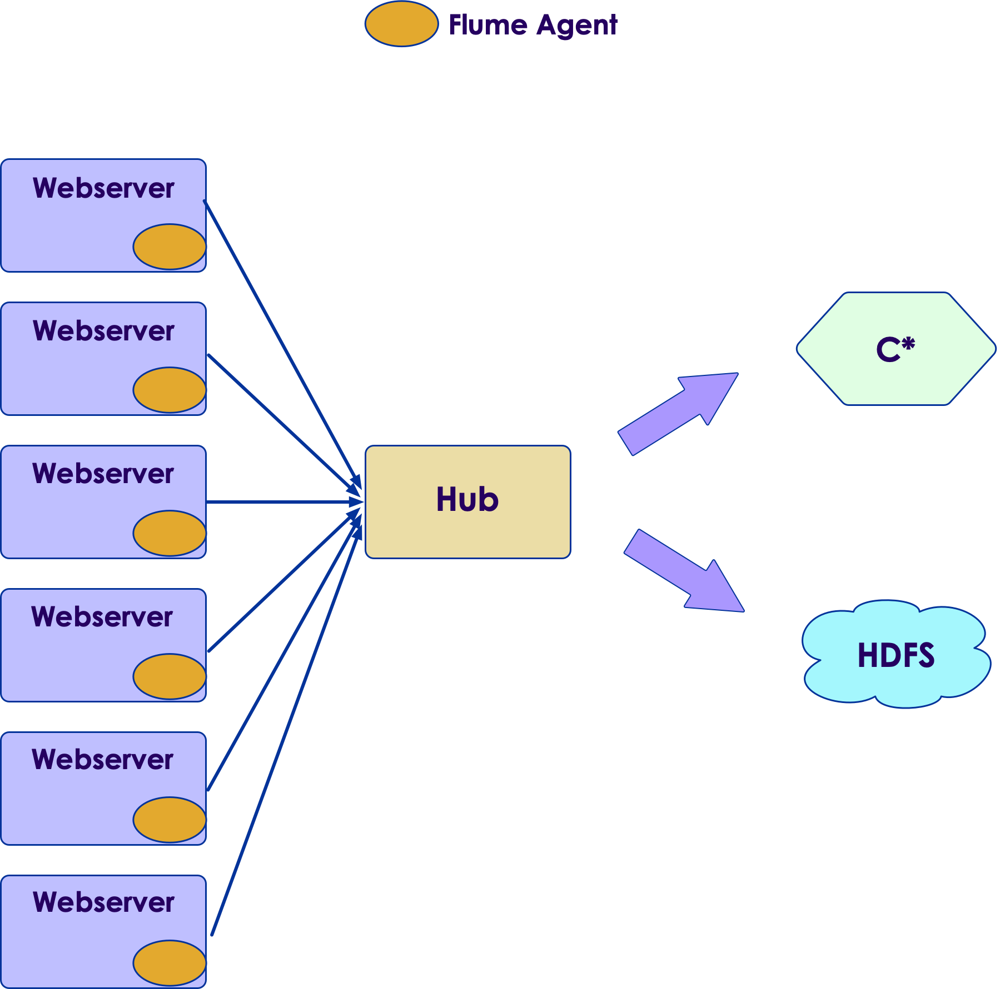
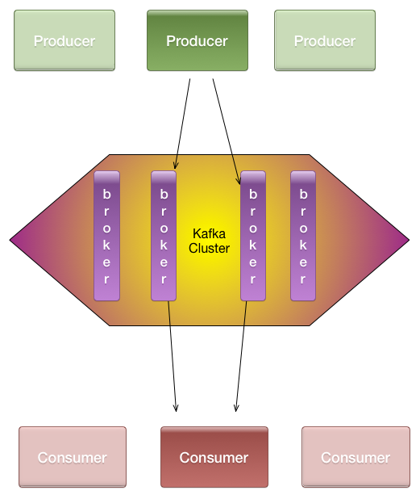

# Cassandra Data Modeling Labs

---

## Lesson Objectives

 * Learn to model various scenarios on Cassandra using CQL

Notes: 

---

## About This Lesson

 * Heavily hands-on

 * Based on: 

     - Actual use cases

     - Best practices available

 * Thanks to...

     - Apache Cassandra project

     - Patrick McFadin examples on GitHub

Notes: 

---

## Approach

 * We present a particular use case/problem

 * Work as groups to: 

     - Come up with your solution
     - Present it to the class

 * Analyze 

     - Your solution
     - Instructor’s solution

 * Discuss

     - Compromises & comparisons
     - Performance implications
     - Lessons learned

 * Reference:
     - Datastax docs: http://www.datastax.com/docs 

Notes: 

---

# MyFlix (Netflix)

---

## Use Case: MyFlix

 * Modeled after Netflix

 * Models

     - Movies

     - Users

     - Ratings

Notes: 

---

## MyFlix: Users

 * We need to store information about millions of users

 * Store the following attributes per user:

     - Name

     - Username & password

     - User **has multiple emails; ONE email is primary**

 * Think about:

     - What will be the primary key?

 * Hint: Check out available CQL data typeshttp://www.datastax.com/documentation

Notes: 

---

## Before You Start...

 * Ask me the question!!

 * What is the QUERY?

 * Q: Query users by  **username** 

 * **Answer: Next Slide!**

Notes: 

---

## MyFlix: Users: Part II

 *  Q: Find users  **user_name**   **or**  **primary email** 

 * **Answer: Next Slide!**

Notes: 

---

## MyFlix: Movies 

 * Movies Features

     - All features have a unique code

     - Name

     - Release date (date only)

     - Studio

     - Type (TV_Show, Movies, etc.)

 * Queries:

     - Q1: Find feature by code

     - Q2: Find all features by studio 

 * Answer: Next Slide!

Notes: 

---

## MyFlix: Movies: Bonus Lab

 * How can we store “release dates” in movie table?

     - (theatrical_release, date1)

     - (Blue-ray release, date2)

     - (IMAX release, date3)

 * Answer: Next Slide!

Notes: 

---

## MyFlix: Ratings

 * Users will rate movies

 * Rating is an integer 1 to 5

 * Users will rate multiple movies

 * Only one rating for movie by user

 * Users may change their rating for a movie later (just store the latest rating)

 * Query: 

     - Find all ratings by a user

 * Answer: Next Slide!

Notes: 

---

## MyFlix: Ratings: Part II

 * Queries

     - Find all ratings by movie

     - What is the best (worst) rating for a movie?

 * Answer: Next Slide!

Notes: 

---

## MyFlix: Bonus: User Devices

 * A user has multiple devices (TV, tablet, phone, computer)
 * Devices belong to one user
 * Classic “one to many” relationship
 * Device attributes:

     - Device_id (something unique)
     - MAC address
     - Description (“my phone”)
     - Device Type (phone/tv/tablet/set-top)
     - Device belongs to ONE user

 * Queries:

     - Find all devices owned by a user
     - Find which user owns a device (given device_id)

 * Answer: Next Slide!

Notes: 

---

## MyFlix: Resuming a Movie

 * Users can watch a movie from multiple devices

 * Each device should be able to resume (pick up) the movie where the user paused (e.g., where _last_ device left off)

 * Query: Find the latest movie resume position for user

 * Answer: Next Slide!

Notes: 

---

## Recommended: Amazon Prime

Notes: 

---

## Netflix: Profiles

Notes: 

---

## Recommendations with Profiles

Notes: 

---

## Recommendations

 * Heavy machine learning!

 * Many algorithms

 * ‘Collaborative filtering’ is one popular algorithm
     - Two models: users & items

 * Quick example
     - Recommend movies for ‘user α’

Notes: 

---

## MyFlix Lessons

 * Model for query

 * De-normalize for fast queries

     - Don’t worry about storage... storage is cheap!

 * Q: Is Netflix a **read-heavy** or **write-heavy** application?

     - Hint: In prime time (8-11pm) **36%** Internet traffic in US is consumed by Netflix streaming!

     - Probably **write-heavy** (all the devices sending ‘position’ data as movie is being watched)

     - Netflix is not serving actual movie content from `C*``C*` is not built for large files

Notes: 

---

## Lab: MyFlix

 *  **Overview:**

     - Model MyFlix on `C*`

     - Generate and insert data

     - Query data

 *  **Builds on previous labs:** None

 *  **Approximate time:** 1 hour

 *  **Instructions:** **08-myflix / README.md** 

 *  **Lab** 

Notes: 

---

# YouTube

---

## YouTube: Models

 * Users (we already have this)

 * Videos

 * Tags

 * Comments

Notes: 

---

## YouTube Videos

 * Videos belong to users
 * Video files may be large
     - Large files are usually not stored in Cassandra
 * Video attributes:
     - Title
     - Description
     - User
     - Content (actual video content)
     - Upload_time
     - Tags

 * Videos cannot be identified by names or title (“my cat” is not unique)

 * Query:
     - Query video by a unique ‘video_id’

 * **Answer: Next Slide!**

Notes: 

---

## YouTube: User/Video Relation

 * Users often have many videos

 * Each video belongs to one user

 * Q: Find all videos by user

 * Q: Find latest videos by user

 * **Answer: Next Slide!**

Notes: 

---

## Lab: YouTube Videos

 *  **Overview:**

     - Generate data for YouTube videos

 *  **Builds on previous labs:** None

 *  **Approximate time:** 30 mins

 *  **Instructions:**  **generators/generate-videos.py** 

     - Complete the TO DO items

     - Q1: Find all videos uploaded by user (What is the sorting order?)

     - Q2: Can we find all latest videos? (Uploaded by all users)

 *  **Lab** 

Notes: 

---

# Amazon

---

## Online Shopping

 * Models

     - Users

     - Items

     - Shopping cart

 * Queries:

     - Retrieve shopping cart for user quickly

     - Add items to shopping cart quickly

     - Delete items from cart

     - Update item quantities from cart

     - Only ONE shopping cart per user

 * **Answer: Next Slide!**

Notes: 

---

# User Activity Logging

---

## User Activity

 * Users browse pages

 * Leave comments

 * “Like” items 

 * Queries

     - Find last-N activities per user

     - Activities for a time window (12pm–1pm)

     - Activities per day (weekday/weekend)

 * Answer: Next Slide!

Notes: 

---

## Next: Log Collection

Notes: 

---

## Log Collection

 * Collect and analyze logs on massive scale

 * Use cases:
     - Large data center
        * Keep track of logins
        * Detect attacks
     - Web properties (Amazon or LinkedIn)
        * Log user activities
        * Analyze user activities (which button users click most…etc.)
 * Distributed log collection
     - Need to collect from multiple sources (100s or even 1000s)

 * Tools
     - Flume (part of Hadoop ecosystem)
     - Kafka (distributed message queue)
     - Log Stash

Notes: 

---

## Distributed Log Collection Tools: Flume

 * Part of Hadoop ecosystem

 * Works on ‘agent => and his hub’ model

 * Agents run on ‘log source’ and keep sending data upstream

 * Can handle failures

Notes: 

---

## Distributed Log Collection Tools: Kafka

 * Producer/Consumer model

 * Producers write data to Kafka

 * Consumers read data

 *  Fault tolerant
     - Data is replicated

 * Data is organized as topics

     - “emails”
     - “clicks”

 * Built for high throughput

     - LinkedIn: 220 billion messages / day
     - At peak: 3+ million messages / sec

Notes: 

---

## Log Collection: Log Table

 * Logs contain:

     - Source (ip or application_name)

     - Severity (info, error)

     - Timestamp

 * Query: 

     - Find log events for a certain host (latest event first)

     - Make sure partition size doesn’t get too big

 * **Answer: Next Slide!**

Notes: 

---

## Further Reading

 * Become a super data modeler

     - http://wiki.apache.org/cassandra/DataModel 

 * Sample schemas:

     - YouTube model: https://github.com/pmcfadin/cql3-videodb-example 

Notes: 

---

## Review Questions

   * In Cassandra, which comes first, data model or queries?

   * Is denormalization good or bad in Cassandra?

   * How do you generate unique primary keys in Cassandra?

   * Where do you store blobs in Cassandra solutions?

Notes: 

