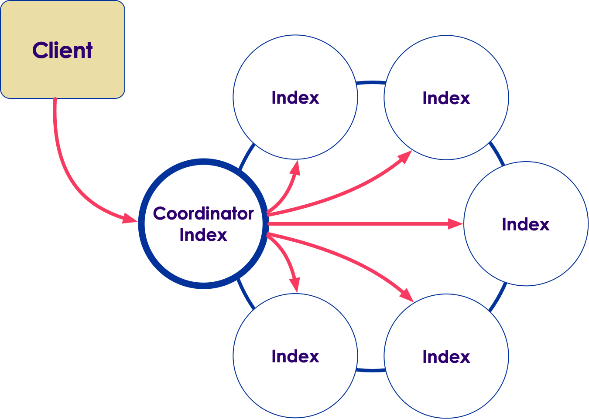
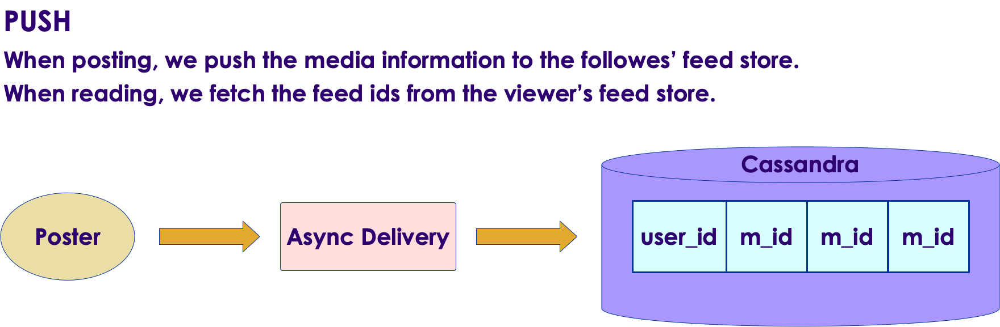
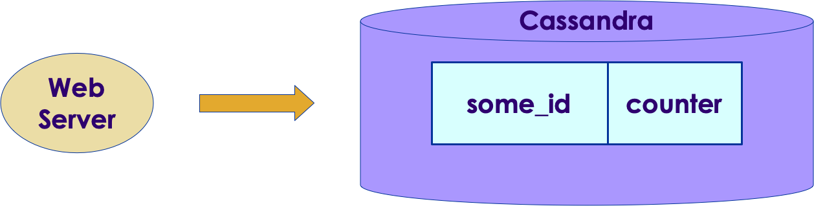
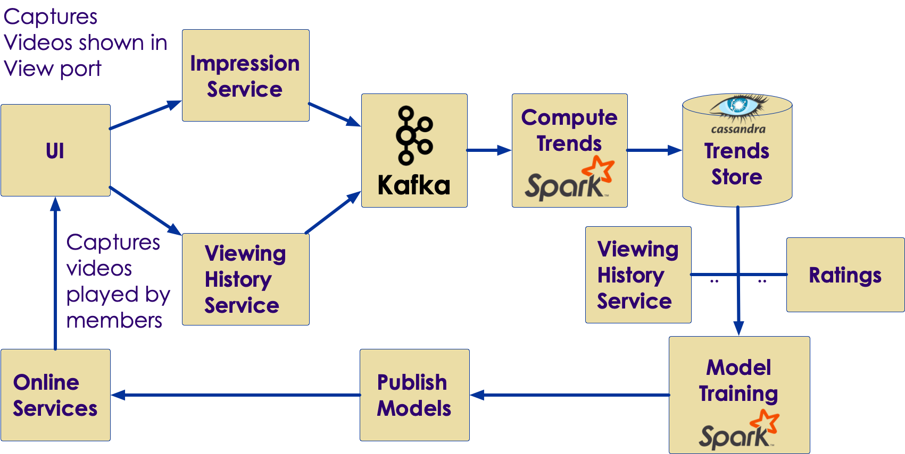

# Session 09: Cassandra Best Practices

---

## Lesson Objectives

 * Learn C* best practices

 * Learn about some C* use cases

Notes: 

---

# 15 Commandments

---

## 15 Commandments for C* Developers and Admins

 * By Patrick McFadin, 

     - Chief evangelist @ Datastax

 * http://patrickmcfadin.com/2014/02/24/15-commandments-cassandra-admin/

Notes: 

---

## 15 Commandments

 *  **Commandment 1 )**  Great data models start with the queries

     - RDBMS:    Data -> Model -> Queries

     - Cassandra: Queries -> Model -> Data

 *  **Commandment**  **2)**  It is OK to duplicate data (de-normalize)

     - Joins

     - Volume isn’t a problem (disks are cheap)

     - Speed isn’t a problem

 *  **Commandment**  **3)**  Disk IO is your first problem

     - SAN / NAS

     - Local disks

     - Use SSDs 

Notes: 

---

## 15 Commandments

 *  **Commandment 4)**  Secondary Indexes are for convenience not speed

     - C* does distributed indexes (not like a RDBMS)

        * Every node’s local index will have to be accessed – so slow

     - Too many queries that depend on indexes

 *  **Commandment  5)**  Embrace large partitions and de-normalization

     - C* can handle large partitions

     - Make sure partitions stay < 1GB

 *  **Commandment 6)**   Don’t be afraid to add nodes

     - Vertical scale (more cpu, more RAM)

     - Add nodes to scale horizontally

Notes: 

---

## 15 Commandments

 *  **Commandment 7**  – Mind your compactions

     - Heavy IO, might impact ‘normal’ operations

 *  **Commandment 8**  – Never use shared storage

     - SAN / NAS

     - (We will talk about Cloud storage separately)

 *  **Commandment 9**  – Understand cache. Disk, Key and Row

     - So you can build better performing applications

 *  **Commandment 10**  – Watch your GC!

     - But with G1 GC, annoyances of CMS have gone away!

Notes: 

---

## 15 Commandments

 *  **Commandment 11** – Learn how to load data. Bulk Load. Insert. Copy

 *  **Commandment 12**  – Repair isn’t just for broken data

     - ‘bad things happen to good data’

     - Run ‘repair’ regularly

 *  **Commandment 13** – Know the relationship between Consistency Level and Replication Factor

     - RF is per keyspace (how many copies, across data centers)

     - Consistency: how many replicas acknowledge or respond to request

        * set by client PER read / write request

Notes: 

---

## 15 Commandments

 *  **Commandment 14** – Use ¼ of system memory (systems now have 64-256 GB memory)

     - More than 8G heap with CMS is a problem -> GC pauses

     - Can do 32-64GB heap now

 *  **Commandment 15** – Get involved in the community

     - ‘nuff said

Notes: 

---

## Cassandra Limits

 * All data for a single partition must fit (on disk) on a single machine in the cluster. 

 * A single column value may not be larger than 2GB; in practice, ”**1 MB**" recommended

 * **Collection** values may not be larger than **64KB**.

 * The maximum number of **cells** (rows x columns) in a single partition is **2 billion**.

 * https://docs.datastax.com/en/cql/3.3/cql/cql_reference/refLimits.html

Notes: 

---

## Know Linux

 * Being proficient in Linux would help you diagnose C* problems

 * Linux tools

     - Atop, top

     - Dstat – includes vmstat, iostat, ifstat

Notes: 

---

## No VMs

 * C* needs good IO throughput

 * VM’s don’t offer good IO paths

     - Share a central disk (SAN) for multiple VMs  bottleneck

 * Go with bare metal with multiple disks

 * Commitlog on a separate spindle

     - Dedicated IO

 * SSTables spread across other disks

Notes: 

---

## Debugging

 * C* Admin tools

     - Nodetool – main admin tool for everything

        * Tablestats, compactionhistory, toppartitions, ring, gossipinfo 

     - Check Logs in /var/log/cassandra/*  

        * Node behavior - system.log, debug.log

        * Java GC behavior – gc.log

 * Linux utils (iftop / atop ..etc)

Notes: 

---

## Developer Best Practices

 * Start with queries;  **then**  design the schema

 * Keep in mind the constraints around 

     - partition keys, clustering columns, secondary indexes, etc.

 * Generate ‘fake’ data to test at scale

     - Use our ‘generator’ scripts

 * Query tracing

     - cqlsh>   tracing oncqlsh>   select * from increments;

     -  **<query output>** 

 |*  **activity**             | **timestamp**                   |  **source**      |  **source_elapsed** 

 * ----------------------------------------------------------------------------           

 *  **Execute CQL3 query**  |  **2019-01-10 19:00:05.676000**  |  **10.31.4.58**  |               **0** 

 *  **Parsing select * from increments**  |  **2019-01-10 19:00:05.676000**  |  **10.31.4.58**  |  **146** 

 *  **Preparing statement ..**            |  **2019-01-10 19:00:05.676000**  |  **10.31.4.58**  |  **252** 

 *  **Computing ranges to query**        |  **2019-01-10 19:00:05.677000**  |  **10.31.4.58**  |  **428** 

 *  **Submitting range requests on 1025 ranges with a concurrency of 445 (0.225 rows per range expected)** |

Notes: 

---

## Developer Best Practices

 * How is it internally stored?

     - Use ‘sstabledump  <SSTable>’ 

 * Where is my row?

     - nodetool getendpoints <keyspace> <table> <primary key>

 * $ nodetool getendpoints myflix users user-91363

Notes: 

---

## Loading Data into C*

 * Lots of ETL tools support C*

     - Talend,  Pentaho, Jaspersoft

     - They offer nice GUI, scheduling engines ..

 * C* can be a sink for 

     - Flume

     - Kafka

     - Spark

 * cql copy command - load flat files

 * sstableloader – bulk load SSTables directly

Notes: 

---

# Hardware & Capacity Planning

---

## Capacity Planning

 * Watch disk space

 * Run below 50% capacity

     - Compaction needs spikes in disk usage

 * Add more nodes

 * Remember, multiple disks per node

Notes: 

---

## Recommended Hardware

 * Memory

     - 8-32GB Dev, 64-256 GB for Production

     - More memory -> More Memtables -> More caching

 * CPU

     - 2 cores Dev, 16 cores Production

     - C* can utilize CPU cores very well

 * Network

     - C* is network intensive

     - Have 2 interfaces ‘bonded’ together (minimize network failure)

Notes: 

---

## Recommended Hardware

 * Disks

     - SSDs are preferred 

        * Low-latency reads

        * High Sequential write performance 

     - HDDs

        * Use if data size is very large and cost is a factor

          * (SSDs can cost 10x HDDs)

        * Compensate with more RAM to avoid reads from HDDs

Notes: 

SSDs can cost 10x HDDs

---

## C* on Cloud

 * Choose compute optimized instances

 * EBS volumes have many advantages

     - More reliable

     - Faster recovery using snapshots

     - Easy to setup backup/restores

 * Configure clusters using appropriate snitches:

     - Ec2Snitch  - simple clusters within one region/DC

     - Ec2MultiRegionSnitch

     - GoogleCloudSnitch

     - GossipingPropertyFileSnitch – for Azure

Notes: 

---

# C* Case Studies

---

## Cassandra Use Cases

 * https://www.datastax.com/resources/casestudies

 * http://bigdatausecases.info/technologies/cassandra

 * Few Notables (details in next slides)

     - The Weather Company

     - Instagram

     - Hulu: user watch history

     - Ebay: recommendations

     - Spotify

     - Comcast

     - Netflix

Notes: 

---

## The Weather Company

 * Data

     - 30 Billion API requests / day

     - 360 PB traffic daily

     - Million+ events / sec consumed

 * Links

     - Case study 

     - slides

Notes: 

---

## Architecture

 * Slide #38

 * Built on Amazon Cloud (AWS)

 * Loading data into C* directly using Spark streaming

Notes: 

---

## Highlights

 * Slide #39

 * Each event is stored in its own table

 * Using TTL to auto expire events

 * Batch Analytics

     - Done by Spark 

     - Two C* clusters : one (A) online, other one (B) batch analytics

     - Spark co-located with batch C* cluster (B)

Notes: 

---

## Spark & Cassandra

 * Slide #84

 * Using secondary indexes in C* to filter out data in C* layer (not in Spark layer)

 * As Spark is co-located with C* nodes, secondary indexes are very effective!

 &nbsp; &nbsp; &nbsp;

Notes: 

---

## C* @ Instagram (2016)

 * From Cassandra Summit 2016

 * Cluster Details 

     - 1000+  C* nodes (across multiple clusters)

     - Data : 100+ TB

     - Largest cluster : 150 nodes

 * Link : 

     - http://bigdatausecases.info/entry/cassandra-at-instagram-2016-cassandra-summit-2016 

     - Slides

Notes: 

---

## Posting

 * Slide #8

 * QPS: 1M writes / sec

 * Latency:  20ms (avg)  to 100ms (p99)

 * Model: user_id -> List (media_id)

Notes: 

---

## Counting

 * Slide #12

 * QPS: 50k / sec

 * Latency:  3ms (avg)  to 50ms (p99)

 * Model: some_id -> counter

Notes: 

---

## C* @ Netflix (Very Unique Case)

 * Runs on AWS

 * production clusters > 65 

 * Production nodes > 2000

 * Data size : 300 TB

     - 1M+ writes / sec,   300k reads / sec

 * ‘profile’ feature quadrupled data volume!

 * Largest cluster : 150 nodes (across 3 DCs)

 * Increasingly using SSDs in cloud

 * Links: 

     - Use case
     - slides

Notes: 

---

## Trending Now Architecture

 * Slide #28

 

Notes: 

---

## Tracking Video Play Performance

 * Slide #32

 

Notes: 

---

## C* Use Cases: Online Service: Hulu

 * 5 million subscribers

 * 30 million unique views

 * C* setup:

     - 16 node cluster split across 2 data centers

     - 1TB per data center

     - Use SSDs 

Notes: 

---

## C* Use Cases : Online Service: Spotify

 * 40 M active users / month

 * 25 M song catalog (and growing)

 * 1.5 Billion playlists created / managed!!

 * 40k requests / sec

 * C* setup

     - 500 C* nodes across 4 data centers(production + testing)

     - Recommendations generated ‘off-line’ using Cassandra + Hadoop (not in critical path)

Notes: 

---

## Review Questions

 * What are typical JVM heap sizes used?

 * What types of disks are best for Cassandra?

 * What monitoring tool does Cassandra provide?

 * How can I debug slow queries?

Notes: 

