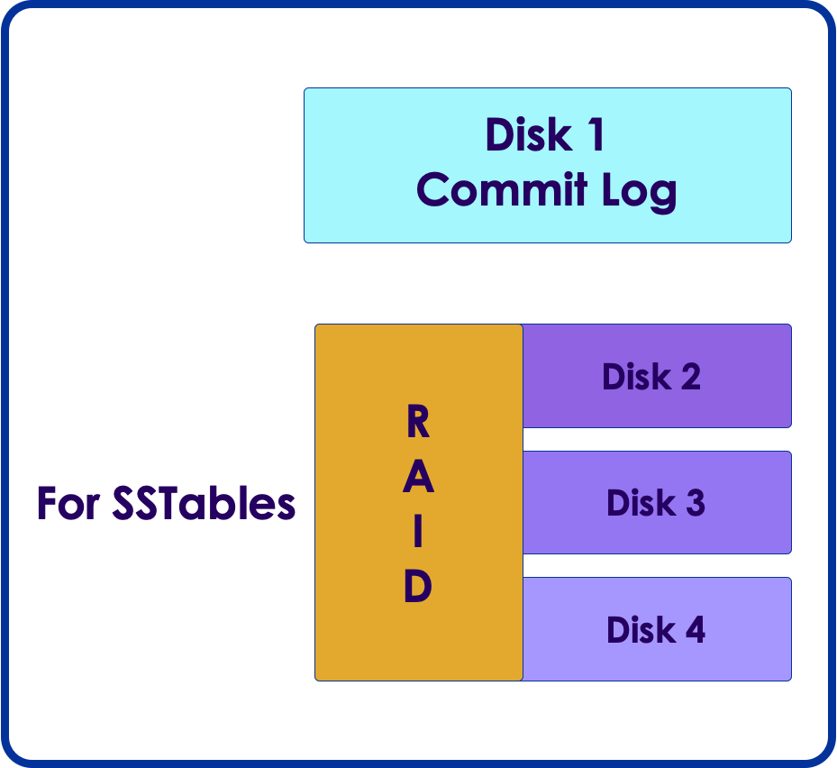
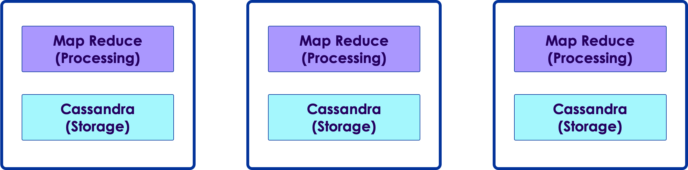
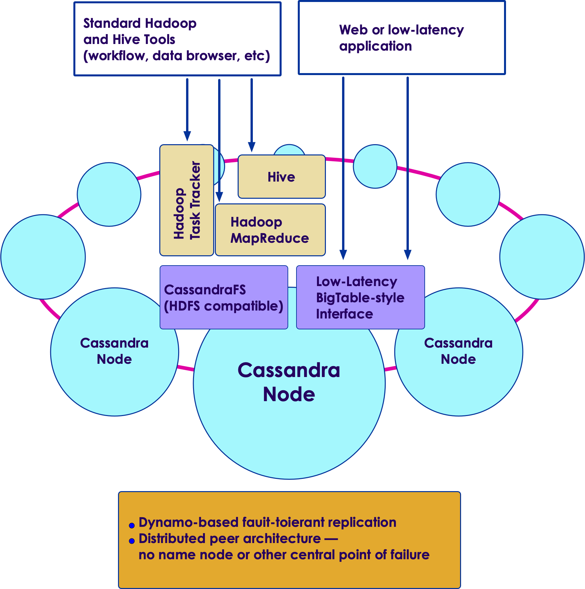
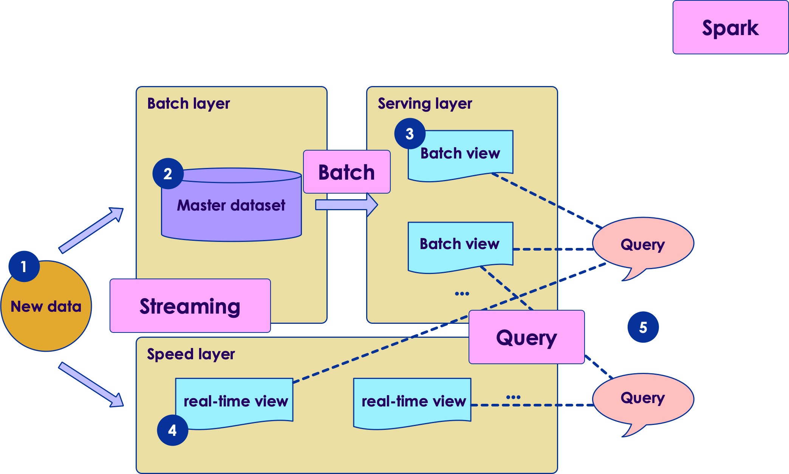

# Cassandra Admin

---

## Lesson Objectives

 * Learn some admin knowledge of `C*`

 * Install `C*`

Notes: 

---

# Cassandra Software

---

## Cassandra Version History

 * Version 2

     - CQL 3.x

     - Light weight transactions

     - Atomic BATCH

     - Triggers

 * Version 3

     - Materialized Views

     - New storage engine  (new SSTable format)

     - Java 8 and new garbage collector G1

Notes: 

---

## Cassandra Choices

| Apache `C*`           | Datastax Community                  | Datastax Enterprise                   |
|---------------------|-------------------------------------|---------------------------------------|
|                     | Apache + tests + native drivers     |                                       |
| Source distribution | Source + package manager            | installers                            |
|                     | Ops Center   (only in v2)       | Ops center + sophisticated monitoring |
|                     | Native drivers = java / python / c# | Native drivers = java / python / c#   |
|                     |                                     | Hadoop Support                        |

<!-- {"left" : 0.89, "top" : 2.53, "height" : 3.37, "width" : 15.71} -->

Notes: 

---

## Install Medium

 * Tar package

     - Easy install

     - No need for 'root / admin' privileges

 * RPM

     - For CENTOS based systems

     - Repo: http://rpm.datastax.com

     - $ sudo yum install cassandra

 * Debian packages

     - For ubuntu based systems

Notes: 

---

## Tools

 * Monitoring: 

     - Ops center (datastax)

 * Development / Schema management

     - Dev Center (datastax)
     - Helenos 	(https://github.com/tomekkup/helenos) 
     - RazorSQL (https://razorsql.com) 

 * Profilers

     - TRACE ON in CQL
     - Jprofiler
     - Jprobe
     - Custom scripts (Gist) https://gist.github.com/amorton/1074715

Notes: 

---

## OpsCenter Dashboard

<!-- {"left" : 2.43, "top" : 2.24, "height" : 9.22, "width" : 12.7} -->

Notes: 

---

## OpsCenter capabilities

 * Basic cluster configuration

     - Administration tasks, such as adding a cluster, using simple point-and-click actions

     - Visual creation of clusters

     - Multiple cluster management from a single OpsCenter instance using agents

     - Rebalancing data across a cluster when new nodes are added

     - Downloadable PDF cluster report

     - Alerts and performance metrics

Notes: 

---

## OpsCenter capabilities

 * Built-in external notification capabilities

     - Alert warnings of impending issues

     - Metrics are collected every minute from Cassandra, Analytics, and Search nodes and stored in a keyspace created by OpsCenter

     - Backup operations and restoring from backups

Notes: 

---

## OpsCenter Enterprise

 * DataStax Enterprise Management Services

 * Alerts

 * Data Backup and Restore

 * Management en Masse

 * Viewing historical metrics more than one week in the past

 * Rebalance

 * Diagnostics tarball

 * Hadoop jobtracker integration

Notes: 

---

# Hardware

---

## Hardware

 * Dedicated / bare-metal nodes are recommended

 * Memory

     - 24G – 96G

     - More is better

 * CPU

     - Dual quad core

 * Network

     - 1 Gigabit recommended

Notes: 

---

## Disks

<!-- {"left" : 10.69, "top" : 1.89, "height" : 5.85, "width" : 6.38} -->

 * Multiple spindles per node

 * One for commit log

     - Commit log records every update / write

     - Only read-back on node startup (not during 'normal' operation)

     - no need to be huge size, just fast to accommodate writes

 * SSTables

     - Where data lives

     - Need lots of space

     - Multiple disks 

     - SSTable disks can be RAIDed (RAID 0, 5, 10)

Notes: 

---

## SSD / Flash Disks

 * Great fit for `C*`

 * Extremely low latency for read / writes

 * Very high IOPS

 * 'no seek' time  (costly operation on mechanical disks)

 * Cost is coming down

|                       | Cost / 1TB | Cost / GB |
|-----------------------|------------|-----------|
| SSD                   | $500       | 50c / GB  |
| Mechanical Hard Drive | $70        | 7c / GB   |

<!-- {"left" : 1.18, "top" : 6.1, "height" : 1.5, "width" : 15.14} -->

Notes: 

---

## Linux File System Choices

 * Ext2 / ext3  limit on file size: 2TB

 * Ext4 file size limit: 16TB

 * `C*` can use upto HALF of disk space for a single file (SSTable) !

 * Imagine you have  12 disks x 3TB each in RAID-0

     - 36 TB total size 

     - 50% of that is 18 TB ( > file system limit ! )

 * XFS recommended (basically unlimited file size in 64 bit mode)

Notes: 

---

## Scaling

 * Start with few nodes (3 - 5) 

 * Scale up as needed

Notes: 

---

## Lab 10: Single Node Install

 *  **Overview:**

     - Install `C*` as single node

 *  **Builds on previous labs:** None

 *  **Approximate Time:** 45 mins

 *  **Instructions:**  **10-single-node-install  /**  **README.md** 

 *  **Lab** 

Notes: 

---

# Analytics With Cassandra & Hadoop & Spark

---

## Big Data Analytics With `C*`

 * `C*` is a NOSQL datastore that can store 'Big Data' (100s of TB)

 * How ever its use case is **'needle in a haystack'**
     - Query for a few rows at a time in billions of rows

 * It doesn't support 'bulk analytics'

 * Example:
     - Imagine we are storing sensor readings in `C*`
     - We have billions of data points
     - OK queries:
        * What is the latest temp for 'sensor-1'
     - Not OK queries:
        * Find the average temp for ALL sensors for the month of June in 2015
        * Involves large data scan, not supported.

 * For large scale analytics we need to pair `C*` with other tools: Hadoop & Spark

Notes: 

---

## (Very) Quick Hadoop Intro

 * Hadoop is one of the first Big Data platform

 * Hadoop design

     - Runs on commodity hardware
     - Runs as a cluster
     - Scales horizontally 

 * Hadoop components

     - HDFS: Distributed storage (scales to peta bytes of storage)
     - MapReduce: Distribute compute
     - YARN: An operating system for distributed applications

Notes: 

---

## Hadoop Architecture

 * Each Hadoop node serves two purposes:

     - Stores data

     - Process data

<!-- {"left" : 0.92, "top" : 5.33, "height" : 3.1, "width" : 6.81} -->
  <!-- {"left" : 8.65, "top" : 5.16, "height" : 4.53, "width" : 7.93} -->

Notes: 

---

## Cassandra & Hadoop

<!-- {"left" : 9.47, "top" : 2.45, "height" : 1.9, "width" : 7.67} -->

 * `C*` enterprise has Hadoop intergration

 * `C*` acts as a 'Hadoop / HDFS compatible file system'

 * Analyze data in `C*` using Hadoop analytics 

     - MapReduce
     - Pig (write high level MapReduce)
     - Hive (SQL queries via MapReduce)

 * Best Practices

     - Do **NOT** mix real time and batch work loads
     - Best to have a separate topologies
     - Use NetworkPlacementStrategy 

Notes: 

---

## Separate Batch/ Realtime

 <!-- {"left" : 2.91, "top" : 2.56, "height" : 8.58, "width" : 11.73} -->

Notes: 

---

## Cassandra/ Hadoop

 <!-- {"left" : 4.3, "top" : 2.35, "height" : 9.02, "width" : 8.96} -->

Notes: 

---

## Spark Primer

 <!-- {"left" : 9.68, "top" : 1.89, "height" : 4.15, "width" : 7.39} -->

 * Apache Spark is a 'second generation' Big Data platform

 * Spark is a cluster, compute engine

 * Spark does not provide its own distributed storage (like Hadoop)

 * Spark relies on other distributed storage systems

     - HDFS
     - Cassandra

Notes: 

---

## Spark & Cassandra

 * Spark works very well with `C*`

 * Spark & Cassandra are used heavily in 'streaming workloads'.

     - Spark reads data from a queue like Kafka
     - Inserts into `C*`

 * Spark-Cassandra connector: https://github.com/datastax/spark-cassandra-connector

 <!-- {"left" : 0.54, "top" : 7.6, "height" : 1.44, "width" : 16.42} -->

Notes: 

Spark & Cassandra : Amazing love story : https://www.youtube.com/watch?v=9xf_IXNylhM
Spark & Cassandra : Amazing Love Story : http://www.slideshare.net/SparkSummit/spark-and-cassandra-an-amazing-apache-love-story-by-patrick-mcfadin

---

## Lambda architecture

 <!-- {"left" : 2.64, "top" : 2.65, "height" : 7.09, "width" : 12.23} -->

Notes: 

---

## LAMBDA Architecture Explained

 * All new data is sent to both batch layer and  speed layer

 * Batch layer

     - Holds master data set (immutable , append-only)
     - Answers batch queries

 * Serving layer

     - updates batch views so they can be queried adhoc

 * Speed Layer

     - Handles new data
     - Facilitates fast / real-time queries

 * Query layer

     - Answers queries using batch & real-time views

Notes: 

---

## Spark + Lambda Architecture

<!-- {"left" : 1.16, "top" : 2.29, "height" : 9.14, "width" : 15.19} -->

Notes: 

Image in slide from http://lambda-architecture.net/

Spark can be used in multiple places in LA.
Spark streaming can be used to consume data and push it to 'batch layer' and 'real time layer'
Spark Map Reduce can be used to update batch views
Spark can run queries against batch layer and / or speed layer

---

## Streaming Solution With Kafka + Spark + Cassandra + Hadoop

 * Kafka: Input queue / buffer

 * Spark: Processing engine

 * Cassandra: Real time store & real time queries

 * HDFS: Long term store and batch queries

<!-- {"left" : 1.15, "top" : 6.09, "height" : 3.47, "width" : 15.19} -->

Notes: 

A Modern Architecture for Internet of Things : http://elephantscale.com/2015/08/04/webinar-recap-a-modern-data-infrastructure-for-internet-of-things-2015-07-31/

---

## Review Questions

Notes: 

---

## Lesson Summary

Notes: 

