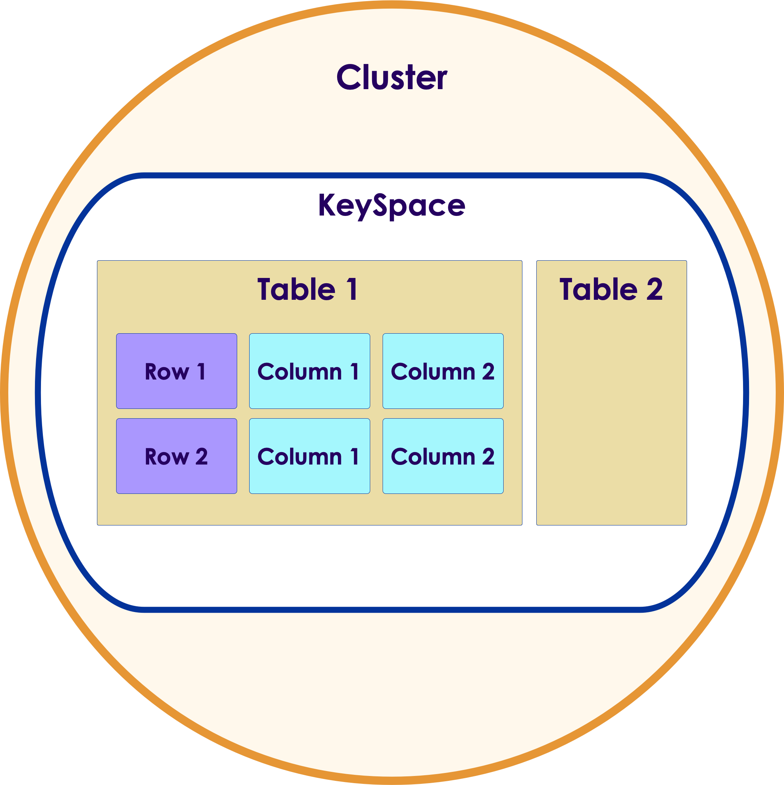
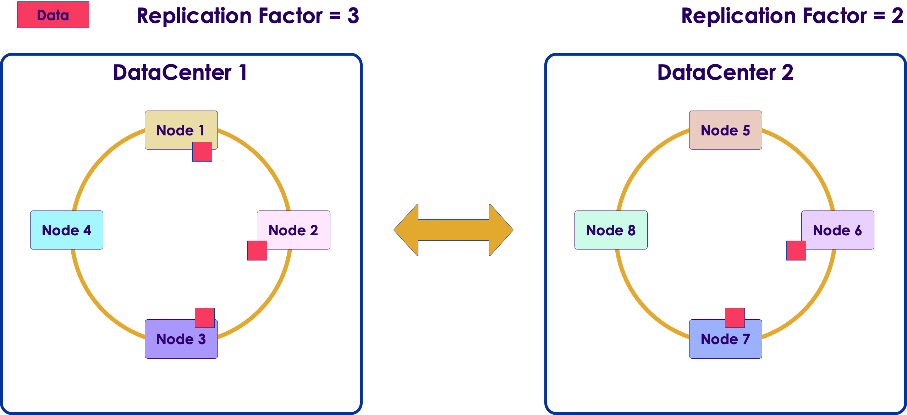

# Cassandra Data Modeling 1


---


## Lesson Objectives


 * Learn Cassandra Query Language (CQL)

 * Creating Keyspaces and Tables 

 * Inserting and Querying Data

 * Learn how to do data modeling for Cassandra

Notes: 


---

# Keyspaces & Tables

---


## Data Modeling in `C*`


 * `C*` is a distributed data store

 * `C*` is optimized for **non-relational** data models

 * E.g, joins don't work very well in distributed systems

 * We need to learn to model data properly in `C*`

Notes: 


---

## Meet CQL: Cassandra Query Language


 * Very much like SQL

 * Created for ease of use

 * Standard from Cassandra 2.x(Earlier `C*` versions used Thrift API)

 * Makes you think about “data model” rather than APIs 

```sql
-- CQL Examples

select * from movies;

select * from movies where code = 'starwars';
```

Notes: 


---

## CQL: Before & After


Notes: 


---

## Cassandra Data Organization


Notes: 


---

## Data Hierarchy



Notes: 


---

## Keyspace


 * A cluster can have a bunch of keyspaces 

     - Usually one

 * Keyspace, in turn, contains tables

 * Keyspace attributes

     - Replication factor: How many times the data has to be copied

     - Replica placement:How to choose replicas (Simple or Network placement)

Notes: 


---

## Creating Keyspaces


```text
CREATE KEYSPACE <name>
WITH replication = {
  'class': <str> (Simple|NetworkTopology)Strategy,
  <options>
}

```
 * Specify replication properties

 * See documentation: http://cassandra.apache.org/doc/latest/cql/ddl.html#create-keyspace


Notes: 


---

## Creating Keyspace with SimpleStrategy

```text
CREATE KEYSPACE <name>
WITH replication = {
  'class': 'SimpleStrategy',
  'replication_factor': 3
}

```


 * 'SimpleStrategy' is fine for evaluation purposes. (A single data center)

Notes: 


---

## Creating Keyspace with NetworkTopology


```text
CREATE KEYSPACE <name>
WITH replication = {
  'class': 'NetworkTopologyStrategy',  'DC1': 3,   'DC2': 2};

```


 * Each data center has its own replication factor

 * Use 'NetworkTopology' for production uses (even when using a single data center)

Notes: 


---

## Keyspace Modification


 * *ALTER KEYSPACE <name> WITH < properties >;* </br> < properties > is same as the CREATE KEYSPACE < properties >

```text
-- changing replication
ALTER KEYSPACE  myflix  WITH REPLICATION ={     'class' : 'NetworkTopologyStrategy',     'dc1' : 3 };


```

Notes: 


---

## Drop Keyspace

```text
DROP KEYSPACE <name>;


-- doesn't return an error if keyspace doesn't exist
DROP KEYSPACE IF EXISTS <name>;

```

 * Irreversible removal of the keyspace with all data in it deleted permanently!


Notes: 


---

## Using Keyspace


```text
use myflix;
create table .. (…); // this table is created in myflix keyspace

```

 * USE KEYSPACE < name >;

 * Sets the namespace for subsequence commands

 * Note : This is set per-session and can be changed with another USE KEYSPACE command


Notes: 


---

## `C*` Tables


 * `C*` Tables contain rows and columns

 * Rows are indexed by primary key

 * Columns are variable i.e., no fixed schema for each row

 * Tables are partitioned across a `C*` cluster

 * Table data is replicated according to replication strategy for the keyspace the table belongs to

Notes: 


---

## Distributing Table Data


 * Table is distributed as **partitions** across nodes

 * **Partition Key** is hashed using a partitioner to generate a **token**

 * Token determines which **node owns** that partition


Notes: 


---

## `C*` Tables

 


Notes: 


---

## Create Table – Simple Primary Key


* *CREATE TABLE <table name> (
  </br> < column name> <data type > < options >, </br>  …  < column_name > < data_typ e> < options >
  </br>PRIMARY KEY (???)
</br>);*


```text
-- example

CREATE TABLE users(    user_id text,    email text,
    state text,    PRIMARY KEY (user_id));

```

 * Each table must have a primary key


Note: Column Families was the original name for "tables" but please use Table for CQL3 and onwards.
Documentation: http://docs.datastax.com/en//cql/latest/cql/cqlIntro.html


---

## How is Data Stored


Note: Column Families was the original name for "tables" but please use Table for CQL3 and onwards.
Documentation: http://docs.datastax.com/en//cql/latest/cql/cqlIntro.html


---

## Specifying PRIMARY Keys


```text
-- at the end of table 
CREATE TABLE users(    user_id text,    email text,    PRIMARY KEY (user_id));

-- inline
CREATE TABLE users(    user_id text PRIMARY KEY,
    email text
);

-- composite key : state + user_id
-- (More on this in next section)
CREATE TABLE users(    user_id text,
    email text,
    state text,
		PRIMARY KEY (state, user_id)
);

```

Notes: 


---

## CQL Data Types

 


 *  *Source:*  *DataStax* 

Notes: 

Source: https://docs.datastax.com/en/cql/3.3/cql/cql_reference/cql_data_types_c.html


---

## `C*` vs.  RDMBS

| Feature                                      | RDBMS                                         | Cassandra                                            |
|----------------------------------------------|-----------------------------------------------|------------------------------------------------------|
| Unique Primary Key                           | Required most of the time. </br>Not Null      | Required always. </br>NOT Null.                      |
| Auto Sequence key generation  </br>(1, 2,3…) | YES </br>(id INT AUTO_INCREMENT PRIMARY KEY)  | NO </br>Relies on application to provide unique PKs  |
| Foreign Keys                                 | YES                                           | NO                                                   |
| Referential Integrity                        | YES                                           | NO                                                   |
| Mandatory columns (Non-NULL)                 | YES                                           | NO                                                   |

</br>

 * Class discussion: 
</br> Why `C*` does  **NOT**  do AUTO SEQUENCE key?

Notes: 


---

## Generating Unique Keys


 * UUID – universally unique id

     - E.g.: bfb96110-5105-4742-b17c-aeef5b5670d7

     - Can also be generated using Java at the application level

     - CQL provides uuid() function

 * TimeUUID

     - Version 1 UUID – date and time part of encoding

     - Time-ordered rows

     - Generate using now() function. DO NOT generate at application level

 * Uuid() and now() generate the IDs on coordinator node

 * Reference: https://en.wikipedia.org/wiki/Universally_unique_identifier 

Notes: 


---

# CQL Queries

---


## Myflix 'Movies' 'Features' Table


 * Lets create a “features” table with the following attributes:

</br>


| Attribute    | Type   | Example                                  |
|--------------|--------|------------------------------------------|
| Name         | String | “Star Wars”  </br>“Mad Men”              |
| Type         | String | “Movie”  </br> “TV Show”  </br>“Standup” |
| Release_date | Data   | 2016-01-01                               |

</br>

 *  **What is our primary key? How do we generate one?**


Notes: 


---

## Myflix 'Features' Table


 * Let's add a unique key called 'code.'We will assign this for each movie.IMDB examples:

     - “Star Wars: Force Awakens”http://www.imdb.com/title/tt2488496/

     - “Mad Men”http://www.imdb.com/title/tt0804503/

</br>

| Attribute    | Type   | Example                                  |
|--------------|--------|------------------------------------------|
| **Code**         | **String** | **“star1”   </br> “madmen”**                |
| Name         | String | “Star Wars”  </br>“Mad Men”              |
| Type         | String | “Movie”  </br> “TV Show”  </br>“Standup” |
| Release_date | Data   | 2016-01-01                               |


Notes: 


---

## Myflix 'Features' Table

```text
create table features (    code text,    name text,    release_date timestamp,     type text,
    PRIMARY KEY (code) );

```

 * We are using 'text' type to represent strings

 * We use 'timestamp' to represent for date

     - Though 'time stamp' can be accurate up to seconds, we are only using the 'date' portion of it ( **2016-01-01** 00:00:00)

     - Timestamp is Unix timestamp since 'epoch'


Notes: 


---

## INSERT Some Data


```text
INSERT INTO features (code, name, type, release_date)
VALUES ('madmen', 'Mad Men', 'TV Show', '2010-01-01');

INSERT INTO features (code, name, type, release_date)
VALUES ('star1', 'Star Wars Episode 1', 'Movie' , '1999-01-01');

```

 * Syntax: **INSERT INTO** < table name > (column names)VALUES (column values)

 * Wrap string values in **single quotes** (example : 'mad men')

 * Timestamp can be entered in format: 'yyyy-mm-dd HH:mm:ssZ'

Notes: 


---

## Lab: CQL


 *  **Overview:**

     - Create 'features' table using CQL

     - Insert some data

     - Query data

 *  **Builds on previous labs:** None

 *  **Approximate time:** 1 hour

 *  **Instructions:**  **02-cql /**  **README.md** 

 *  **Lab** 

Notes: 


---

## Lab 4.1: Composite Keys


 *  **Overview:** 

     - Create and use primary keys with partition keys and clustering columns

 *  **Builds on previous labs:** None

 *  **Approximate Time:** 15 mins

 *  **Instructions:**  **04-composite-keys /**  **README.md** 

 *  **Lab** 

Notes: 


---

## TTL


 * TTL–Time To Live (in seconds)

 * Determines how long the value will be “alive”

 * After that, the value “disappears”

 * INSERT INTO < table name > (column names)VALUES (column values) USING TTL <# seconds>;

 * TTL applications

     - Purging archival data (only keep six months of data, etc.)
     - Purge sensitive data (temporary passwords that expire)

Notes: 


---

## Insert with TTL Example


 * Insert a value into 'features' that disappears in seconds 

 * TTL is specified in seconds

```text
Cqlsh>

	INSERT INTO features(code, name) 
	VALUES('simp', 'The Simpsons') 
	USING TTL 20;

	select * from features;

   -- Wait a few seconds and try the select again

	select * from features;

	-- compare results

```

Notes: 


---

## Quiz: What Happens Below?


```text

INSERT INTO features (code, name, type, release_date)

VALUES ('star1', 'Star Wars : Episode 4', 'Movie', '1977-01-01');

```
```text

INSERT INTO features (code, name, type, release_date)

VALUES ('star1', 'Star Wars : Episode 1', 'Movie', '1999-01-01');

```


 * What will be the value of row 'star1'?

 * How can we prevent the race condition?


Notes: 


---

## INSERT IF NOT Exists

   

 * *INSERT INTO <table name> (column names)
   </br>VALUES (column values) IF NOT EXISTS;*


 * Only inserts if the row with the primary key given does not exist. 

 * This does incur a performance penalty!

 * More on this later

```text

-- first insert succeeds
INSERT INTO features (code, name, type, release_date)
VALUES ('star1', 'Star Wars : Episode 4', 'Movie', '1977-01-01')
IF NOT EXISTS;

-- second insert fails  (PK exists)
INSERT INTO features (code, name, type, release_date)
VALUES ('star1', 'Star Wars : Episode 1', 'Movie', '1999-01-01')
IF NOT EXISTS;

```


Notes: 


---

## Insert with Timestamp


 * Each cell has a 'last modified' timestamp.

 * `C*` automatically populates this using current time (microseconds accuracy).

     - This is the preferred way.

 * We can specify the timestamp too.

 *  **Quiz**: **Why do we want to override timestamp?**

```text
insert into features (code, name) values ('sopr', 'The Sopranos')  using timestamp 1404172800000;  // 2014-07-01 12:00:00  in microsecs

```


Notes: 


---

## Specifying Consistency Levels


 * Remember our consistency levels? 

     - ALL, ANY, QUORUM,...

 * Default level: ONE

     - What does this mean?

```text
insert into features (code, name) values ('sopr', 'The Sopranos')  using CONSISTENCY LOCAL_QUORUM ;

-- checking default level
cqlsh>  CONSISTENCY
Current consistency level is ONE.

-- set level for session
cqlsh>  CONSISTENCY QUORUM
Consistency level is set to QUORUM.

```

Notes: 


---

## More Insert Examples


```text
-- specifying multiple conditions

insert into features (code, name) values ('sopr', 'The Sopranos')  using CONSISTENCY LOCAL_QUORUM
AND TTL  86400;


```

Notes: 


---

## Alter Table


 * Altering tables (adding columns, etc.) is “very fast” in `C*`

     - As opposed to RDBMS (most need to re-write tables)

 * However, we can not alter primary key?

     - Why?

```text
cqlsh> 

CREATE TABLE features (
            code text,
            name text,
            type text,
            release_date timestamp,
            PRIMARY KEY(code)
        );


ALTER TABLE features  ADD studio text;


DESCRIBE TABLE features;

```


Notes: 


---

## UPDATE


 * *UPDATE < table name > 
 </br>SET column_name=value, ...
 </br>WHERE < primary key condition >;*

 * Where clause is used to select rows to update.

 * If a row with the given primary key does not exist, it will be inserted!

 * UPSERT!

```text
UPDATE features
SET
  studio = 'HBO'
WHERE
  code = 'sopr';

```

Notes: 


---

## INSERT vs. UPDATE


 * Inserts and Updates in `C*` are not the same as in a RDBMS

 * Insert will create a new row or **update** (i.e., replace) an existing one

 * Update will update an existing row or **insert** a new row for a non-existent row

 * Update + Insert = Upsert!  

 * No key violation!!

Notes: 


---

## Update & Insert in `C*` and RDBMS


 * Assume the following data exists in `C*` and RDBMS

 * What is the result of these operations?


| Code (PK) | Name        | Type  | Studio |
|-----------|-------------|-------|--------|
| Star1     | Star Wars 1 | Movie | Lucas  |
| Madmen    | Mad Men     | TV    | AMC    |

</br>


| Query                                                                  | RDBMS | `C*` |
|------------------------------------------------------------------------|-------|----|
| Update features set studio = 'HBO'  </br> where code = 'sopr';         | ?     | ?  |
| Insert into features (code, name)     </br>VALUES('star1','star trek') | ?     | ?  |


Notes: 


---

## DELETE


 * Data can be deleted using the DELETE command.

 * DELETE can be used to delete columns from rows or to delete entire rows.

 * *DELETE < column names  > FROM < table name > </br> WHERE < where clause >;*

 * If < column names > are missing then DELETE will delete entire rows.

 * DELETE needs a WHERE clause.

Notes: 


---

## Delete Examples


```text
-- deletes entire row
delete from features where code = 'simp'

-- only delete 'studio' column
delete studio from features where code = 'madmen'

-- Deleting all rows
-- There is no: delete * from table
-- Use truncate command

```

 * In `C*` deletes are “soft deletes”

 * `C*` marks the data as deleted

     - Tombstone marker

     - Blocks data from queries

 * Data on disk is removed during the next “compaction cycle.”(More on this later)

Notes: 


---

# Indexing

---


## Indexes


 * Let us look at the movie table again:

     - Only queries by PK are supported

     - Querying by other columns will not work

 * We can add indexes

 * `C*` has limited support for secondary indexes

```text
CREATE TABLE features (	code text,	name text,	type text,	release_date timestamp,	PRIMARY KEY(code)	);

Select * from features where code = 'madmen';  // OK

Select * from features where type = 'TV Show' ; // NOT OK


```

Notes: 


---

## Adding Index to a Table


```text
Cqlsh > 

create index idx_type ON features (type);

DESCRIBE table features;

CREATE TABLE features (	code text,	...);

CREATE INDEX idx_type ON features (type);

-- Lets try the query again:
select * from features where type = 'TV Show'; // works!

```

```console
 
```

Notes: 


---

## Indexing Mechanics


 * If data is already in table, `C*` will index them immediately

 * New data is indexed as they are inserted or updated

 * Can index most columns

 * Single column only for now (no compound indexes)

     - Might change soon

 * No support for indexing collections (lists, maps, etc.)

     - Coming soon

 * Indexes can **greatly affect performance**

     - Beware!

Notes: 


---

## Indexing: Behind the Scenes


 * `C*` index is distributed

 * Each node maintains index for its local data -> efficient

 * Queries using indexgo to **EVERY** node

     - By contrast queries using primary key go to **SINGLE** node

 * Need to be aware of this index query performance!


Notes: 


---

## Indexing Best Practices

```text
create table people (
  ssn  text  PRIMARY KEY ,	name text,	phone text,	state text,	gender text,	);

```

 * Do not index high-cardinality columns

 * Index by state: Yes or No?

     - Yes: low cardinality

 * Index by phone: Yes or No?

     - No: high cardinality

 * Index on GENDER: Yes or No?

     - No: VERY LOW cardinality (just two values, male/female)…(not efficient)


Notes: 


---

## Indexing Best Practices


 * Avoid indexing “highly volatile” columns (columns that are updated frequently)

 * Creating index on a VERY LOW cardinality column doesn't make sense

     - E.g., GENDER

     - Boolean values (true/false) (e.g., is_veteran)

Notes: 


---

## Lab: Indexing


 *  **Overview:**

     - Create and use secondary index in `C*`

 *  **Builds on previous labs:** 02-cql

 *  **Approximate time:** 10 mins

 *  **Instructions:**  **02-cql /**  **index.md** 

 *  **Lab** 

Notes: 


---

## Review Questions


*  What is Cassandra cluster? Keyspace? Table?

*  What is the importance of the primary key? What does it consist of?

*  How is the data physically stored?

*   What is CQL?

- What is an Upsert?

Notes: 


