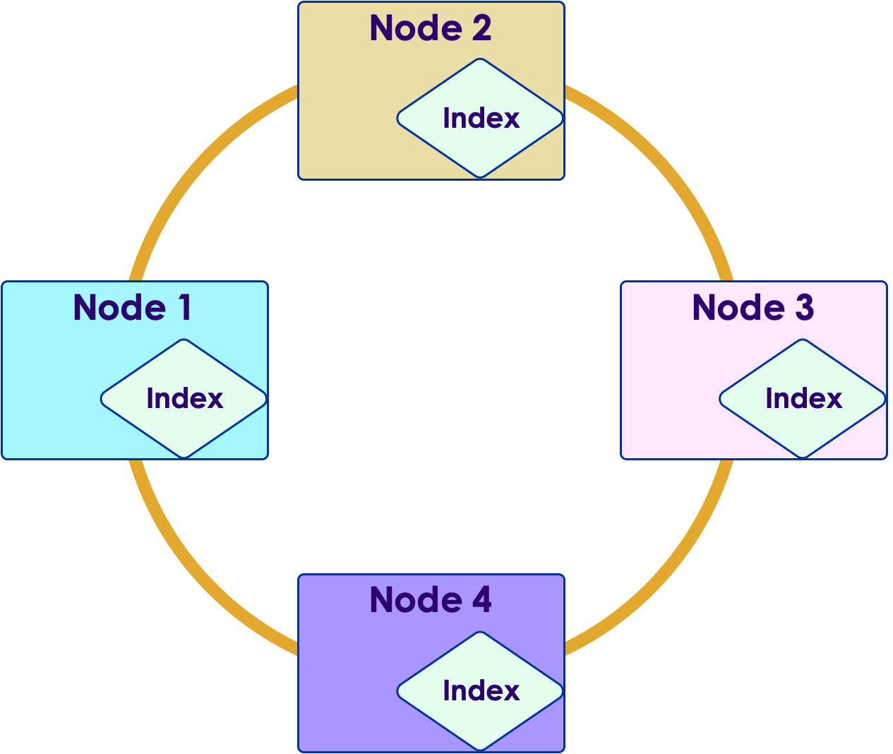

# Data Modeling with Cassandra  - Part 1

<!-- {"left" : 6.51, "top" : 7.6, "height" : 3.01, "width" : 4.48} -->


---


## Lesson Objectives


 * Learn Cassandra Query Language (CQL)

 * Creating Keyspaces and Tables 

 * Inserting and Querying Data

 * Learn how to do data modeling for Cassandra

Notes: 


---

# Keyspaces & Tables

---


## Data Modeling in `C*`


 * `C*` is a distributed data store

 * `C*` is optimized for **non-relational** data models

 * E.g, joins don't work very well in distributed systems

 * We need to learn to model data properly in `C*`

Notes: 


---

## Meet CQL: Cassandra Query Language


 * Very much like SQL

 * Created for ease of use

 * Standard from Cassandra 2.x(Earlier `C*` versions used Thrift API)

 * Makes you think about "data model" rather than APIs 

```sql
-- CQL Examples

select * from movies;

select * from movies where code = 'starwars';
```
<!-- {"left" : 0.82, "top" : 4.89, "height" : 2.35, "width" : 11.21} -->


Notes: 


---

## CQL: Before & After

<!-- {"left" : 0.78, "top" : 2.02, "height" : 9.38, "width" : 13.36} -->


Notes: 


---

## Cassandra Data Organization

 <!-- {"left" : 2.65, "top" : 2.73, "height" : 8.25, "width" : 12.19} -->


Notes: 


---

## Data Hierarchy

 <!-- {"left" : 4.12, "top" : 2.22, "height" : 9.27, "width" : 9.27} -->

Notes: 


---

## Keyspace


 * A cluster can have a bunch of keyspaces 

     - Usually one

 * Keyspace, in turn, contains tables

 * Keyspace attributes

     - Replication factor: How many times the data has to be copied

     - Replica placement:How to choose replicas (Simple or Network placement)

Notes: 


---

## Creating Keyspaces

<br/>

```sql
CREATE KEYSPACE <name>
WITH replication = {
  'class': <str> (Simple|NetworkTopology)Strategy,
  <options>
}
```
<!-- {"left" : 0.82, "top" : 2.15, "height" : 2.2, "width" : 11.54} -->

 * Specify replication properties

 * See documentation: http://cassandra.apache.org/doc/latest/cql/ddl.html#create-keyspace


Notes: 


---

## Creating Keyspace with SimpleStrategy

```sql
CREATE KEYSPACE keyspace1
WITH replication = {
  'class': 'SimpleStrategy',
  'replication_factor': 3
}

```
<!-- {"left" : 0.82, "top" : 1.79, "height" : 2.49, "width" : 7.8} -->

<!-- {"left" : 9.21, "top" : 2.14, "height" : 6.47, "width" : 7.96} -->


 * 'SimpleStrategy' is fine for evaluation purposes. (A single data center)

Notes: 


---

## Creating Keyspace with NetworkTopology


```sql
CREATE KEYSPACE keyspace2
WITH replication = {
  'class': 'NetworkTopologyStrategy',  
  'DC1': 3,   
  'DC2': 2};

```
<!-- {"left" : 0.82, "top" : 1.89, "height" : 1.9, "width" : 7.98} -->

<!-- {"left" : 8.44, "top" : 4.24, "height" : 3.9, "width" : 8.55} -->

 * Each data center has its own replication factor

 * Use 'NetworkTopology' for production uses (even when using a single data center)


Notes: 


---

## Keyspace Modification


* Use **`ALTER KEYSPACE`**

```sql
-- changing replication

ALTER KEYSPACE  myflix  WITH REPLICATION = {
         'class' : 'NetworkTopologyStrategy',     
         'dc1' : 3 };
```
<!-- {"left" : 0.82, "top" : 2.91, "height" : 2.45, "width" : 12.87} -->


Notes: 


---

## Drop Keyspace

<!-- {"left" : 12.94, "top" : 1.36, "height" : 3.95, "width" : 3.95} -->


* Irreversible removal of the keyspace with all data in it deleted permanently!

```sql
DROP KEYSPACE <name>;


-- doesn't return an error if keyspace doesn't exist

DROP KEYSPACE IF EXISTS keyspace1;

```

<!-- {"left" : 0.82, "top" : 4.09, "height" : 2.45, "width" : 11.43} -->


Notes: 


---

## Using Keyspace

* **`USE KEYSPACE  <name>;`**

* Sets the namespace for subsequence commands

* Note : This is set per-session and can be changed with another USE KEYSPACE command


```sql
use myflix;
 
-- from this point on, operations are done on myflix keyspace

create table  (...); 
```
<!-- {"left" : 0.82, "top" : 4.74, "height" : 2.25, "width" : 14.19} -->


Notes: 


---

## C* Tables


 * `C*` Tables contain rows and columns

 * Rows are indexed by primary key (must be unique per row)

 * Tables are partitioned across a `C*` cluster

 * Table data is replicated according to replication strategy for the keyspace the table belongs to

<!-- {"left" : 4.62, "top" : 5.79, "height" : 4.96, "width" : 8.26} -->


Notes: 


---

## Distributing Table Data

<!-- {"left" : 9.29, "top" : 2.18, "height" : 6.52, "width" : 7.83} -->


 * Table is distributed as **partitions** across nodes

 * **Partition Key** is hashed using a partitioner to generate a **token**

 * Token determines which **node owns** that partition


Notes: 


---

## Create Table – Simple Primary Key


```sql
CREATE TABLE <table name> (
   column_name  data_type   options, 
   column_name  data_type   options

  PRIMARY KEY (???)
);
```
<!-- {"left" : 0.82, "top" : 1.75, "height" : 2.43, "width" : 8.32} -->

<br/>

```sql
CREATE TABLE users(
    user_id text,
    email text,
    state text,
    
    PRIMARY KEY (user_id)
);
```
<!-- {"left" : 0.82, "top" : 4.34, "height" : 3.02, "width" : 6.45} -->


* Each table must have a primary key

* Quick Tip: Column Families was the original name for "tables". But please use Table for CQL3 and onwards.
    - Documentation: http://docs.datastax.com/en//cql/latest/cql/cqlIntro.html


---

## How is Data Stored


<!-- {"left" : 4.46, "top" : 2.27, "height" : 5.33, "width" : 8.58} -->


Note : Column Families was the original name for "tables" but please use Table for CQL3 and onwards.
Documentation: http://docs.datastax.com/en//cql/latest/cql/cqlIntro.html


---

## Specifying PRIMARY Keys

* There are few different ways of specifying primary keys

```sql
-- at the end of table 
CREATE TABLE users(
    user_id text,
    email text,
    PRIMARY KEY (user_id)
);

-- inline
CREATE TABLE users(
    user_id text PRIMARY KEY,
    email text
);

-- composite key : state + user_id
-- (More on this in next section)
CREATE TABLE users(
    user_id text,
    email text,
    state text,
    PRIMARY KEY (state, user_id)
);
```
<!-- {"left" : 0.82, "top" : 2.87, "height" : 7.69, "width" : 7.74} -->

Notes: 


---

## CQL Data Types

 <!-- {"left" : 2.07, "top" : 1.89, "height" : 6.53, "width" : 13.37} -->


* [Reference](https://docs.datastax.com/en/cql/3.3/cql/cql_reference/cql_data_types_c.html)

Notes: 


---

## C* vs.  RDMBS

| Feature                                      | RDBMS                                         | Cassandra                                            |
|----------------------------------------------|-----------------------------------------------|------------------------------------------------------|
| Unique Primary Key                           | Required most of the time. <br/>Not Null      | Required always. <br/>NOT Null.                      |
| Auto Sequence key generation  <br/>(1, 2,3...) | YES <br/>(id INT AUTO_INCREMENT PRIMARY KEY)  | NO <br/>Relies on application to provide unique PKs  |
| Foreign Keys                                 | YES                                           | NO                                                   |
| Referential Integrity                        | YES                                           | NO                                                   |
| Mandatory columns (Non-NULL)                 | YES                                           | NO                                                   |

<!-- {"left" : 0.8, "top" : 1.96, "height" : 1, "width" : 9.64} -->

<br/>

<!-- {"left" : 10.89, "top" : 1.6, "height" : 4.2, "width" : 6.32} -->

* **Question for class:** Why `C*` does  **NOT**  do AUTO SEQUENCE key?


Notes: 


---

## Generating Unique Keys


 * **UUID** – universally unique id

     - E.g.: bfb96110-5105-4742-b17c-aeef5b5670d7

     - Can also be generated using Java at the application level

     - CQL provides **`uuid()`** function

 * **TimeUUID**

     - Version 1 UUID – date and time part of encoding

     - Time-ordered rows

     - Generate using **`now()`** function.

     - **DO NOT generate this at application level**

 * **`uuid()`** and **`now()`** generate the IDs on coordinator node

 * Reference: https://en.wikipedia.org/wiki/Universally_unique_identifier 

Notes: 


---

# CQL Queries

---


## Myflix  'Features' Table


 * Lets create a "features" table with the following attributes:

<br/>


| Attribute    | Type   | Example                                  |
|--------------|--------|------------------------------------------|
| Name         | String | "Star Wars"  <br/>"Mad Men"              |
| Type         | String | "Movie"  <br/> "TV Show"  <br/>"Standup" |
| Release_date | Data   | 2016-01-01                               |

<!-- {"left" : 0.77, "top" : 2.7, "height" : 1, "width" : 15.92} -->


* **What is our primary key?**
    - Remember, primary key must be unique for each row
    - Are any of these attributes unique?
    - How about if you combine these?  Like `"name + release_date"`,  will that be unique?
    - If none of the attributes are unique, we can always **generate** a unique key

Notes:

---

## Myflix 'Features' Table

* Let's add a unique key called **`code`**.  We will assign this for each movie.

* Some IMDB examples:

     - "Star Wars: Force Awakens" : http://www.imdb.com/title/tt2488496/

     - "Mad Men" : http://www.imdb.com/title/tt0804503/


| Attribute    | Type   | Example                                  |
|--------------|--------|------------------------------------------|
| **Code**         | **String** | **"star1"**  <br/> **"madmen"**                |
| Name         | String | "Star Wars"  <br/>"Mad Men"              |
| Type         | String | "Movie"  <br/> "TV Show"  <br/>"Standup" |
| Release_date | Data   | 2016-01-01                               |

<!-- {"left" : 0.96, "top" : 5.34, "height" : 1, "width" : 15.58} -->

Notes:

---

## Myflix 'Features' Table

<br/>

```sql
create table features (
    code text,
    name text,
    release_date date,
    type text,

    PRIMARY KEY (code) 
);
```
<!-- {"left" : 0.82, "top" : 1.99, "height" : 3.23, "width" : 5.7} -->


* We are using **`text`** type to represent strings

* We use **`date`** to represent for date

Notes:

---

## INSERT Some Data

<br/>

```sql
INSERT INTO features (code, name, type, release_date)
VALUES ('madmen', 'Mad Men', 'TV Show', '2010-01-01');

INSERT INTO features (code, name, type, release_date)
VALUES ('star1', 'Star Wars Episode 1', 'Movie' , '1999-01-01');
```
<!-- {"left" : 0.82, "top" : 2.15, "height" : 2.28, "width" : 15} -->

* Insert syntax:

```sql
INSERT INTO <table name> (column names) VALUES (column values)
```
<!-- {"left" : 0.82, "top" : 5.6, "height" : 0.57, "width" : 11.11} -->

* Wrap string values in **single quotes** (example : 'mad men')

* Date can be entered in format: 'yyyy-mm-dd'

Notes:

---

## Lab: CQL

<!-- {"left" : 12.57, "top" : 1.43, "height" : 6.08, "width" : 4.57} -->

* **Overview:**
    - Create 'features' table using CQL
    - Insert some data
    - Query data

* **Builds on previous labs:**
    - None

* **Approximate run time:**
    - 1 hour

* **Instructions:**  
    - Please follow **02-cql**

Notes:

---

## Lab 4.1: Composite Keys

<!-- {"left" : 12.57, "top" : 1.43, "height" : 6.08, "width" : 4.57} -->

 *  **Overview:** 

     - Create and use primary keys with partition keys and clustering columns

 *  **Builds on previous labs:** None

 *  **Approximate Time:** 15 mins

 *  **Instructions:**  **04-composite-keys /**  **README.md** 

 *  **Lab** 

Notes: 


---

## TTL


 * TTL–Time To Live (in seconds)

 * Determines how long the value will be "alive"

 * After that, the value "disappears"

 * INSERT INTO < table name > (column names)VALUES (column values) USING TTL <# seconds>;

 * TTL applications

     - Purging archival data (only keep six months of data, etc.)
     - Purge sensitive data (temporary passwords that expire)

Notes: 


---

## Insert with TTL Example


 * Insert a value into 'features' that disappears in seconds 

 * TTL is specified in seconds

```text
Cqlsh>

	INSERT INTO features(code, name) 
	VALUES('simp', 'The Simpsons') 
	USING TTL 20;

	select * from features;

   -- Wait a few seconds and try the select again

	select * from features;

	-- compare results

```
<!-- {"left" : 0.82, "top" : 3.33, "height" : 5.36, "width" : 11.78} -->

Notes: 


---

## Quiz: What Happens Below?

<br/>

```text

INSERT INTO features (code, name, type, release_date)

VALUES ('star1', 'Star Wars : Episode 4', 'Movie', '1977-01-01');

```
<!-- {"left" : 0.82, "top" : 2.13, "height" : 1.34, "width" : 13.52} -->


```text

INSERT INTO features (code, name, type, release_date)

VALUES ('star1', 'Star Wars : Episode 1', 'Movie', '1999-01-01');

```
<!-- {"left" : 0.82, "top" : 3.81, "height" : 1.34, "width" : 13.52} -->


 * What will be the value of row 'star1'?

 * How can we prevent the race condition?


Notes: 


---

## INSERT IF NOT Exists

   

 * *INSERT INTO <table name> (column names)
   <br/>VALUES (column values) IF NOT EXISTS;*


 * Only inserts if the row with the primary key given does not exist. 

 * This does incur a performance penalty!

 * More on this later

```text

-- first insert succeeds
INSERT INTO features (code, name, type, release_date)
VALUES ('star1', 'Star Wars : Episode 4', 'Movie', '1977-01-01')
IF NOT EXISTS;

-- second insert fails  (PK exists)
INSERT INTO features (code, name, type, release_date)
VALUES ('star1', 'Star Wars : Episode 1', 'Movie', '1999-01-01')
IF NOT EXISTS;

```
<!-- {"left" : 0.82, "top" : 4.74, "height" : 3.78, "width" : 14.89} -->


Notes: 


---

## Insert with Timestamp


 * Each cell has a 'last modified' timestamp.

 * `C*` automatically populates this using current time (microseconds accuracy).

     - This is the preferred way.

 * We can specify the timestamp too.

 *  **Quiz:** **Why do we want to override timestamp?**

```text
insert into features (code, name) values ('sopr', 'The Sopranos')  using timestamp 1404172800000;  // 2014-07-01 12:00:00  in microsecs

```
<!-- {"left" : 0.82, "top" : 5.84, "height" : 0.39, "width" : 16.06} -->


Notes: 


---

## Specifying Consistency Levels


 * Remember our consistency levels? 

     - ALL, ANY, QUORUM,...

 * Default level: ONE

     - What does this mean?

```text
insert into features (code, name) values ('sopr', 'The Sopranos')  using CONSISTENCY LOCAL_QUORUM ;

-- checking default level
cqlsh>  CONSISTENCY
Current consistency level is ONE.

-- set level for session
cqlsh>  CONSISTENCY QUORUM
Consistency level is set to QUORUM.

```
<!-- {"left" : 0.82, "top" : 4.7, "height" : 2.74, "width" : 16.31} -->


Notes: 


---

## More Insert Examples


```text
-- specifying multiple conditions

insert into features (code, name) values ('sopr', 'The Sopranos')  using CONSISTENCY LOCAL_QUORUM
AND TTL  86400;


```
<!-- {"left" : 0.82, "top" : 2.35, "height" : 1.38, "width" : 16.14} -->


Notes: 


---

## Alter Table


 * Altering tables (adding columns, etc.) is "very fast" in `C*`

     - As opposed to RDBMS (most need to re-write tables)

 * However, we can not alter primary key?

     - Why?

```text
cqlsh> 

CREATE TABLE features (
            code text,
            name text,
            type text,
            release_date timestamp,
            PRIMARY KEY(code)
        );


ALTER TABLE features  ADD studio text;


DESCRIBE TABLE features;

```
<!-- {"left" : 0.82, "top" : 4.39, "height" : 6.07, "width" : 9.28} -->


Notes: 


---

## UPDATE


 * *UPDATE < table name > 
 <br/>SET column_name=value, ...
 <br/>WHERE < primary key condition >;*

 * Where clause is used to select rows to update.

 * If a row with the given primary key does not exist, it will be inserted!

 * UPSERT!

```text
UPDATE features
SET
  studio = 'HBO'
WHERE
  code = 'sopr';

```
<!-- {"left" : 0.82, "top" : 4.85, "height" : 2.69, "width" : 5.33} -->


Notes: 


---

## INSERT vs. UPDATE


 * Inserts and Updates in `C*` are not the same as in a RDBMS

 * Insert will create a new row or **update** (i.e., replace) an existing one

 * Update will update an existing row or **insert** a new row for a non-existent row

 * Update + Insert = Upsert!  

 * No key violation!!

Notes: 


---

## Update & Insert in `C*` and RDBMS


 * Assume the following data exists in `C*` and RDBMS

 * What is the result of these operations?


| Code (PK) | Name        | Type  | Studio |
|-----------|-------------|-------|--------|
| Star1     | Star Wars 1 | Movie | Lucas  |
| Madmen    | Mad Men     | TV    | AMC    |

<!-- {"left" : 1.41, "top" : 3.71, "height" : 1.5, "width" : 14.69} -->

<br/>


| Query                                                                  | RDBMS | `C*` |
|------------------------------------------------------------------------|-------|----|
| Update features set studio = 'HBO'  <br/> where code = 'sopr';         | ?     | ?  |
| Insert into features (code, name)     <br/>VALUES('star1','star trek') | ?     | ?  |

<!-- {"left" : 0.45, "top" : 5.67, "height" : 1, "width" : 16.59} -->

Notes: 


---

## DELETE


 * Data can be deleted using the DELETE command.

 * DELETE can be used to delete columns from rows or to delete entire rows.

 * *DELETE < column names  > FROM < table name > </br> WHERE < where clause >;*

 * If < column names > are missing then DELETE will delete entire rows.

 * DELETE needs a WHERE clause.

Notes: 


---

## Delete Examples

<br/>

```text
-- deletes entire row
delete from features where code = 'simp'

-- only delete 'studio' column
delete studio from features where code = 'madmen'

-- Deleting all rows
-- There is no: delete * from table
-- Use truncate command

```
<!-- {"left" : 0.82, "top" : 2.02, "height" : 3.28, "width" : 10.11} -->


 * In `C*` deletes are "soft deletes"

 * `C*` marks the data as deleted

     - Tombstone marker

     - Blocks data from queries

 * Data on disk is removed during the next "compaction cycle."(More on this later)

Notes: 


---

# Indexing

---


## Indexes


 * Let us look at the movie table again:

     - Only queries by PK are supported

     - Querying by other columns will not work

 * We can add indexes

 * `C*` has limited support for secondary indexes

```text
CREATE TABLE features (	code text,	name text,	type text,	release_date timestamp,	PRIMARY KEY(code)	);

Select * from features where code = 'madmen';  // OK

Select * from features where type = 'TV Show' ; // NOT OK


```
<!-- {"left" : 0.82, "top" : 5.12, "height" : 1.47, "width" : 15.58} -->


Notes: 


---

## Adding Index to a Table


```text
Cqlsh > 

create index idx_type ON features (type);

DESCRIBE table features;

CREATE TABLE features (	code text,	...);

CREATE INDEX idx_type ON features (type);

-- Lets try the query again:
select * from features where type = 'TV Show'; // works!

```
<!-- {"left" : 0.82, "top" : 2.78, "height" : 3.78, "width" : 10.11} -->


```console
 
```
<!-- {"left" : 0.82, "top" : 7, "height" : 0.55, "width" : 0.61} -->


Notes: 


---

## Indexing Mechanics


 * If data is already in table, `C*` will index them immediately

 * New data is indexed as they are inserted or updated

 * Can index most columns

 * Single column only for now (no compound indexes)

     - Might change soon

 * No support for indexing collections (lists, maps, etc.)

     - Coming soon

 * Indexes can **greatly affect performance**

     - Beware!

Notes: 


---

## Indexing: Behind the Scenes

<!-- {"left" : 10.22, "top" : 2.18, "height" : 5.73, "width" : 6.79} -->


 * `C*` index is distributed

 * Each node maintains index for its local data -> efficient

 * Queries using indexgo to **EVERY** node

     - By contrast queries using primary key go to **SINGLE** node

 * Need to be aware of this index query performance!


Notes: 


---

## Indexing Best Practices

<br/>

```text
create table people (
  ssn  text  PRIMARY KEY ,	name text,	phone text,	state text,	gender text,	);

```
<!-- {"left" : 0.82, "top" : 2.19, "height" : 0.97, "width" : 16.33} -->

 * Do not index high-cardinality columns

 * Index by state: Yes or No?

     - Yes: low cardinality

 * Index by phone: Yes or No?

     - No: high cardinality

 * Index on GENDER: Yes or No?

     - No: VERY LOW cardinality (just two values, male/female)...(not efficient)


Notes: 


---

## Indexing Best Practices


 * Avoid indexing "highly volatile" columns (columns that are updated frequently)

 * Creating index on a VERY LOW cardinality column doesn't make sense

     - E.g., GENDER

     - Boolean values (true/false) (e.g., is_veteran)

Notes: 


---

## Lab: Indexing


 *  **Overview:**

     - Create and use secondary index in `C*`

 *  **Builds on previous labs:** 02-cql

 *  **Approximate time:** 10 mins

 *  **Instructions:**  **02-cql /**  **index.md** 

 *  **Lab** 

Notes: 


---

## Review Questions


*  What is Cassandra cluster? Keyspace? Table?

*  What is the importance of the primary key? What does it consist of?

*  How is the data physically stored?

*   What is CQL?

- What is an Upsert?

Notes: 


