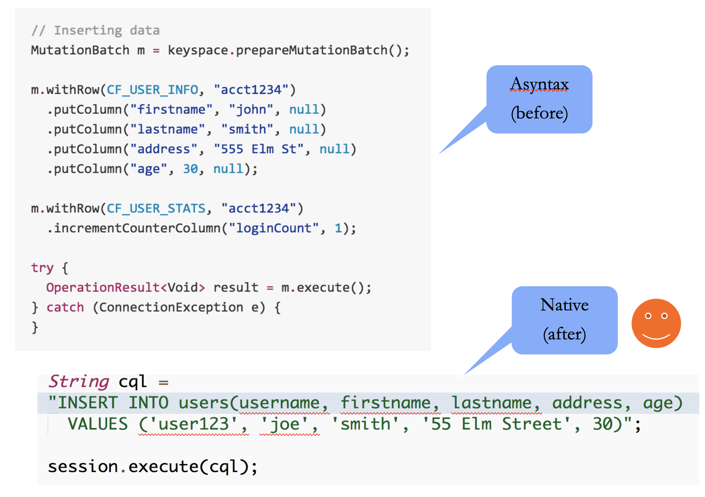
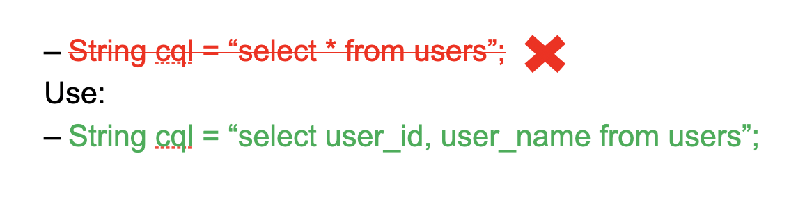
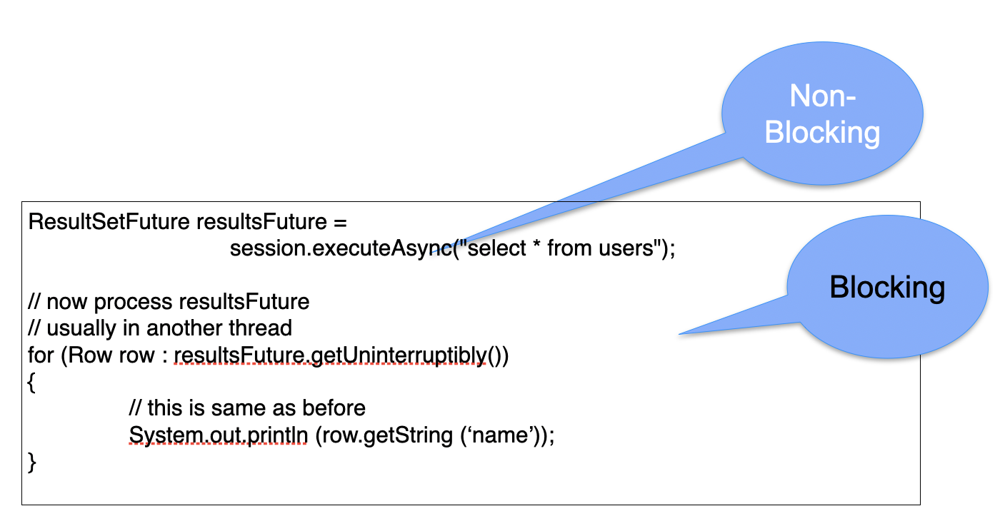
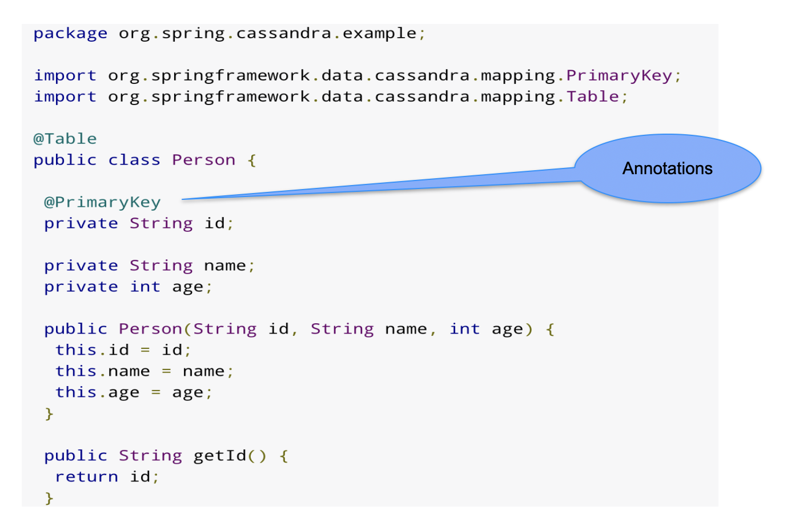
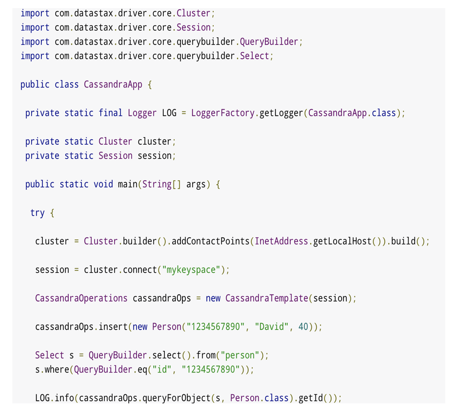

# Cassandra Drivers


---


## Lesson Objectives


 * Learn to use native Java drivers to connect to `C*`

Notes: 


---

# Native Drivers

---


## `C*` Drivers


 * Interact with `C*` programmatically

 * Supported languages:

     - Official : Java, Python, C#

     - Community : Go, PHP, Ruby, many more

 * A bit of history

     - Lots of clients for `C*` 1.x

     - Hector, Kundera …etc

     - They all use thrift interface

 * With `C*`  2.x   recommended clients are 'native' drivers

Notes: 


---

## Native Drivers


 * Asynchronous – Netty based

 * Supports collections (lists, maps…)

 * Automatic ResultSet pagination

 * Client-Server compression (LZ4)

 * Latency aware policies

 * Better tracing support

 *  **Much easier to use (every one speaks SQL!)** 

Notes: 


---

## Driver Comparison: Asyntax Vs. Native





Notes: 


---

## Native Java Driver (by Datastax)


 * Latest Java Driver works with CQL.Exposes schema

 * Connection Pooling – for efficient connections

 * Automatic new node discovery

 * Automatic failover (in case of node failure)

 * Asynchronous queries

 * Current version: 3.x

Notes: 


---

## Connecting to cluster


```text
import com.datastax.driver.core.Cluster;import com.datastax.driver.core.Session;// Javadocs : http://www.datastax.com/drivers/java/2.0/index.htmlpublic class TestConnection {    public static void main(String[] args) throws Exception {   Cluster cluster = Cluster.builder().addContactPoint("localhost")      .build();
   System.out.println("connected to " + cluster.getClusterName());   Session session = cluster.connect("myflix");
   System.out.println("session initialized to "      + session.getLoggedKeyspace());
   session.close();   cluster.close();    }}

```

Notes: 

addContactPointI()
	- we can add more contact points… to safeguard against single-point-of-contact down
	- no need to specify all nodes (10 node cluster.. No need to specify all 10 nodes)
	- the driver will LEARN the topology after connecting to a node  (example… moving to a new neighborhood… talk to one neighbor… learn about others 

Sessions
	- can be authorized for each keyspace (if password protected)


---

## Executing a Query

```text
cluster = Cluster.builder().addContactPoint("localhost”).build();
Session session = cluster.connect("myflix");
String cql = “insert into users(id, name) values ('user1',  'Joe')”;
session.execute(cql);

```
 * Just like SQL!

 * String values must be included in single quotes ('hello')

 * List values are in enclosed in square brackets []

 * Set values are enclosed in curly braces {}


Notes: 


---

## Prepared Statements


 * Create prepared statements for often used queries

     - Prepare only once in your application

     - `C*` will parse and cache query 

     - Bind statement with values to pass to query

```text
cluster = Cluster.builder().addContactPoint("localhost”).build();
Session session = cluster.connect("myflix");

PreparedStatement statement = session.prepare(
   "INSERT INTO users (user_name, fname) VALUES (?,?);");
BoundStatement boundStatement = new BoundStatement(statement);

session.execute(boundStatement.bind(“user1”, “Joe”));

```

Notes: 


---

## Query

```text
String cql = “select user_id, user_name from users”;

ResultSet resultSet = session.execute(cql);
	
For (Row row : resultSet) {
   System.out.println(row.getString(“user_name”) );
}


```

 * Very much like JDBC!

 * NOTE : Schema changes can cause prepared SELECTs to fail. ALWAYS name the fields in SELECT



Notes: 


---

## Asynchronous Query


 * Non-blocking

 * Process results as they become available

 * Note : 

     - 'executeAsync': non blocking
     - 'queryUniterruptibly': blocking




Notes: 


---

## CQL Data Type <- -> Java Type

| CQL Type        | Java Type      |
|-----------------|----------------|
| Bigint, counter | long           |
| Text / varchar  | string         |
| Timestamp       | Java.util.Date |
| UUID            | Java.util.UUID |
| TimeUUID        | Java.util.UUID |
| List            | Java.util.List |
| Set             | Java.util.Set  |
| Map             | Java.util.Map  |


Notes: 


---

## Java Driver Documentation


 * Java driver docs: </br> https://docs.datastax.com/en/developer/java-driver/3.3/

 * Java API docs: </br> https://docs.datastax.com/en/drivers/java/3.3/

Notes: 


---

## Lab 09 : Java Driver


 *  **Overview:** 

     - Use native Java driver to connect / insert / query data

 *  **Builds on previous labs:**

     - None

 *  **Approximate Time:** 1 hr

 *  **Instructions:** 09-java-driver / README.md 

 *  **Bonus Lab:** 

     - Benchmarking: how much time it takes to insert 100k users?

     - Can the insert be faster?  (hint : Batch)

 *  **Lab** 

Notes: 


---

# Spring Cassandra

---


## Spring-Cassandra


 * Spring is a popular Java based framework (http://spring.io/ )

 * MVC concept: Model / View / Controller

 * Provides ORM – Object Relational Mapping 

     - Map Java objects to data stores

     - adapters for various data sources (MySQL / Oracle …etc)

 * Cassandra support: full

     - High level annotated POJOs

     - Low level high-performance data ingestion

Notes: 


---

## Spring-Cassandra – Object Class




Notes: 

Table name inferred from class name  ,  notice @Table annotation


---

## Spring-Data Cassandra features


 * Build repositories based on common Spring Data interfaces

 * Support for synchronous and asynchronous data operations

 * Asynchronous callback support

 * Support for XML based Keyspace creation and CQL Table creation

 * JavaConfig and XML Support for all Cluster and Session Capabilities

 * Exception Translation to the familiar Spring DataAccessException hierarchy

 * QueryBuilders as alternative to CQL

 * Based on DataStax CQL Java Driver

Notes: 


---

## Spring Cassandra – Main Driver




Notes: 

Connect to casssandra cluster
Provide contact points
Explain the query builder
Provided by datastax


---

## Lab 14 : Spring Cassandra


 *  **Overview:**

     - Use Spring drivers to connect to `C*`

 *  **Builds on previous labs:**

     - None

 *  **Approximate Time** : 20 mins

 *  **Instructions: **15-spring / README.md 

 *  **Lab** 

Notes: 


---

## Review Questions


Notes: 


---

## Lesson Summary


 * Learned to interact with `C*` using drivers (Native & Spring)

Notes: 


