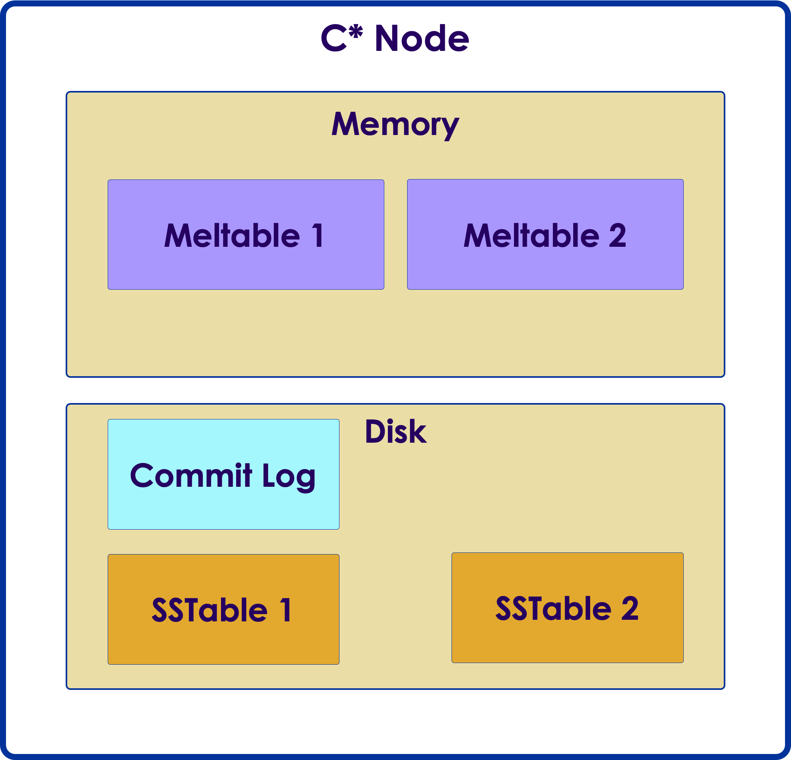
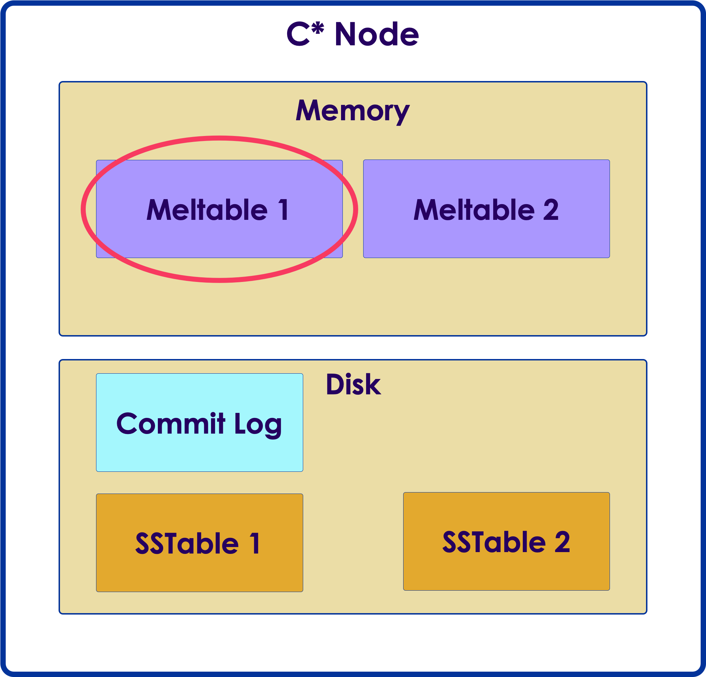
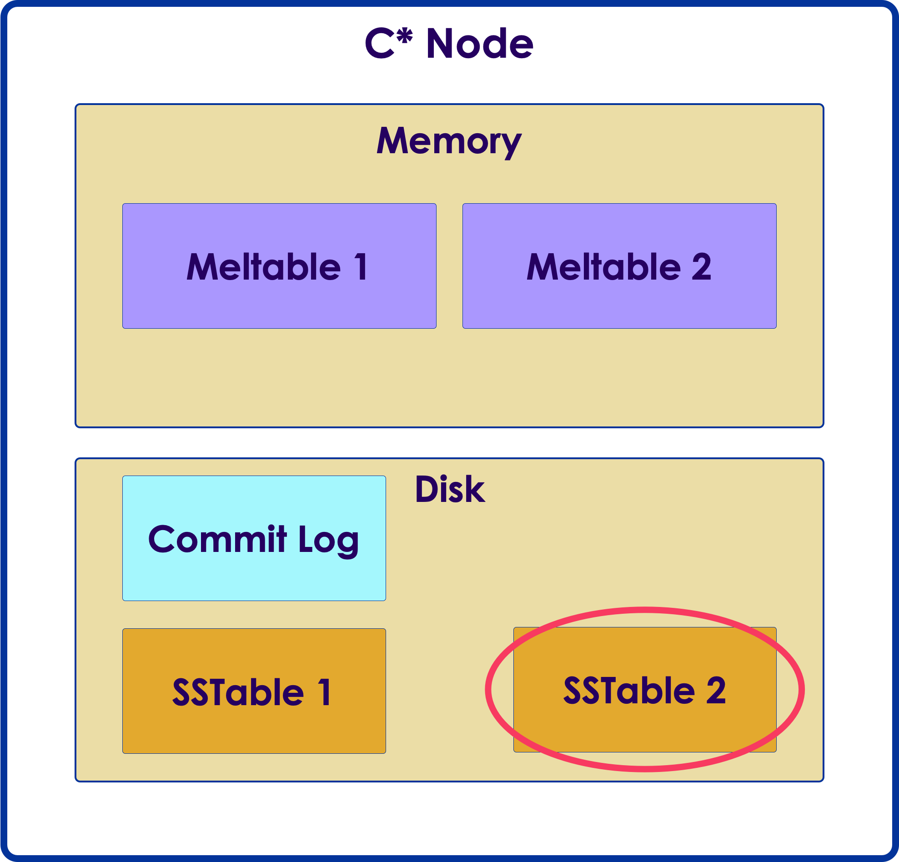
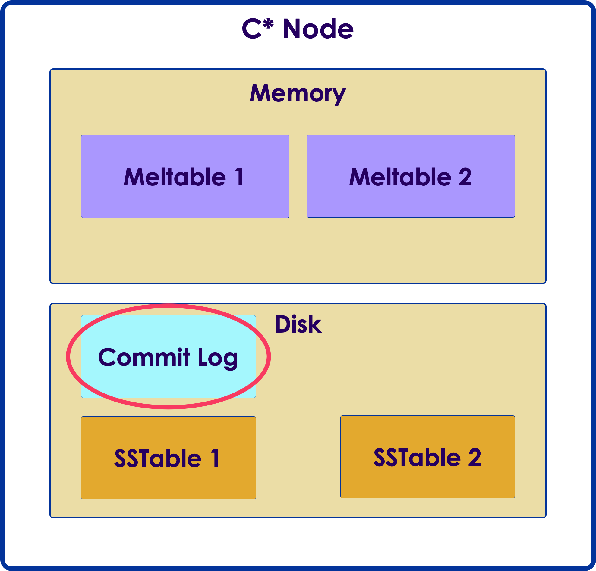
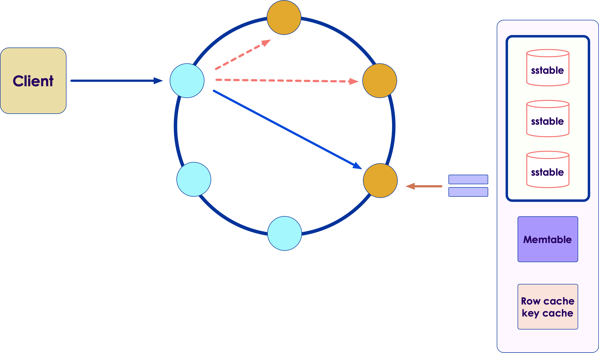
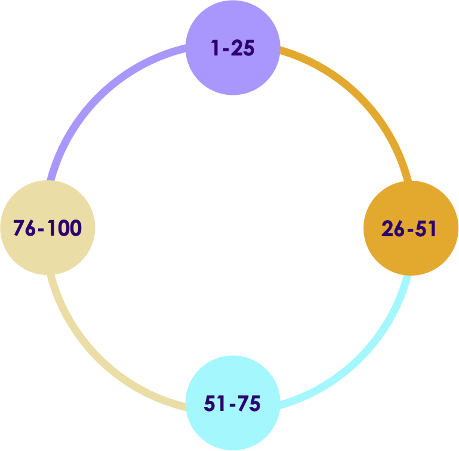
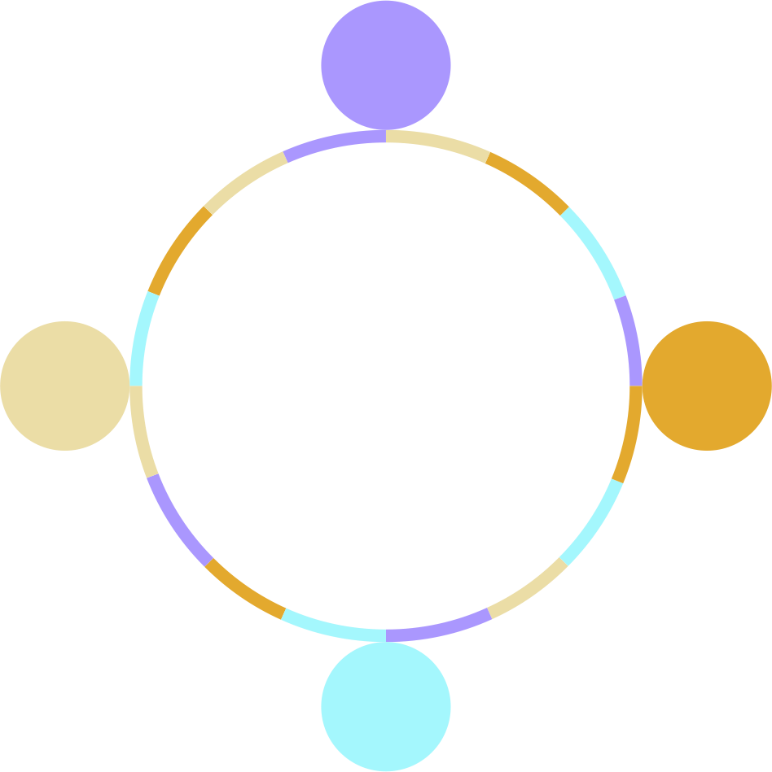

# Cassandra Internals


---


## Lesson Objectives


 * Gain an understanding of Cassandra architecture

 * Learn terminology and implementation details required for successful use of Cassandra

Notes: 


---

# Internal Architecture

---


## `C*` Data Stores



 * `C*` data store has 3 components

     - 1. Memtable

     - 2. SSTable

     - 3. Commitlog


Notes: 


---

## Memtable



 * In memory

 * One memtable per table

 * When a memtable exceeds size threshold,  it is flushed to disk (to SSTable)

 * `C*` can manage memtable size

     - Or can be set by user

 *  serves as a **cache** for queries


Notes: 

Increase memtable threshold when: The write load includes a high volume of updates on a smaller set of data.
A steady stream of continuous writes occurs. This action leads to more efficient compaction.


---

## SSTable



 * Persisted on disk  ('D' in ACID)

 * Memtables are backed by SSTables

 * Maintained per table

 * Immutable

 * SSTables have indexes

     - Primary Index

        * Primary keys and offset in the file

     - Partition Summary

        * subset of partition index (sampling)


Notes: 


---

## SSTable Structures


 * Each table is a directory

 * Key Structures

     - Data.db: Data file

     - Index.db: Partition Index with index of row keys in Data.db

     - Filter.db: Bloom filter (see next slide)

     - Statistics.db: Metadata stats about the table

     - Summary.db: Sample of partition index stored in memory

Notes: 


---

## Bloom Filters


 * Off-heap structure associated with each SSTable

 * When data is not cached, need to access SSTable on disk to fetch the data

 * Disk access is relatively costly, we want to avoid it if possible

 * Bloom Filters is a quick way to determine if a key is in SSTable

 * Bloom Filters will return

     - **DEFINITELY NO:** the key doesn't exist in SSTable

     - **MAY BE:** the key may exist

 * 'NO' avoids a costly disk access, just to find no data

Notes: 


---

## Commit log



 * Why do we need commit log in addition to SSTable?

 * To guarantee no data-loss, data needs to be persisted to disk

     - In addition to memtable

 * Commit log is written sequentially in the order processed

 * SSTables 

     - keep data in sorted order (takes time)

     - Are immutable, so can't write every update to SSTable  


Notes: 


---

## Commit Log


 * Value of X is being updated from 3 -> 5 -> 7

</br>


Notes: 


---

## Compaction


 * Merges SSTables

     - Combines columns

 * Removes Tombstones

 * Rebuilds primary / secondary indexes

 * IO intensive

 * Several parameters to configure/tune

     - In cassandra.yaml

     - Compaction strategy on a per-table basis

Notes: 


---

## Compaction


Notes: 

Row values are merged


---

# Read / Write Path

---


## `C*` Write Path


Notes: 

Recall, that when you write a row, the partition key is hashed to a token which determines which node the row goes to. 


---

## Write Path


 * Client can connect to **ANY** node

 * This node becomes **CO-ORDINATOR** node

 * Using **Partition Key** co-ordinator node picks replicas

 * Co-ordinator sends write data to all replicas (dictated by replication factor)

 * Waits for acknowledgement based on tuned consistency (ALL, QUORUM ..etc)

 * Ack sent back to client

Notes: 


---

## Write Path


 * When a node gets write request...

     - First writes to commit log

     - Then to memtable

 * Then acknowledges the write

 * Quiz: why write to commit log first?

        * When memtable is full, it is flushed to a new SSTable

Notes: 

Once memtable is flushed, that portion of the commit log is no longer required and will be erased


---

## Writes Are Slow?


 * Out of memory

 * Disk full

 * Replica node down

 * Consistency too high (e.g.  ALL or QUOROM across DCs)

 * MOST COMMON ISSUE – Wrong Data Model!

     - Large partition sizes

Notes: 


---

## Read Path



Notes: 


---

## Read Path


 * Client can connect to **ANY** node

 * This node becomes **CO-ORDINATOR** node

 * Using **Partition Key** co-ordinator node picks replicas

 * Co-ordinator sends read request to necessary replicas (based on consistency ALL, QUORUM ..etc)

 * (conflict resolution if needed)

Notes: 


---

## Read Path


 * On a single node… when a read request is received

     - Memtable is read to get latest data for this partition

     - All SSTables that hold data for this partition is read

     - Data is merged from Memtable and SSTables

 * Quiz: Why commit log is not consulted?

 * Answer: Commit log is append only – used in case of failure. The data is stored in memtable

Notes: 


---

# Caching / Bloom Filters

---


## Caching


 * `C*` uses extensive caching to provide fast query times

 * Row Cache 

 * Partition Summary

 * Partition Key Cache


Notes: 


---

## Caching: Row Cache


 * When a row is read, **entire row** is pulled into memory

 * It can be cached so future queries can be answered quickly

 * `C*` caches **all rows** when reading a partition

      - Only enable for **small** partitions  

      - Only when number of reads **is >>** number of writes  (95%)

      - Large partitions will exhaust JVM => Out of Memory error

 * Relying on OS Page Cache may be a better option

     - Uses Off-heap memory

 * Use either Row Cache OR Partition Key Cache

Notes: 


---

## Read Path Details


Notes: 


---

## Read Path using Caches


 * On a single node… when a read request is received

     -  **Key Cache** checked to see if row is already cached. If so, DONE.

     - Memtable is read to get latest data for this partition

     -  **Partition Summary** gives offset into partition index for this token

     -  **Partition Key Cache** gives SSTable offset (cache of Partition Index)

     - SSTable data is read from that offset until desired Row is reached

     - Data is merged from Memtable and SSTables

 * Bloom Filter helps determine if token is in this SSTable

 * Quiz: Why commit log is not consulted?

 * Answer: Commit log is append only – used in case of failure. The data is stored in memtable

Notes: 

Caches are enabled using: CREATE TABLE users ( userid text PRIMARY KEY, first_name text, last_name text, ) WITH caching = { 'keys' : 'NONE', 'rows_per_partition' : '120' };


---

## Monitoring and Tweaking Cache


 * Best way to optimize cache is to monitor it and make adjustments

```text
$  nodetool info

ID               : 387d15ba-7103-491b-9327-1a691dbb504a
Load             : 65.87 KB
Heap Memory (MB) : 392.82 / 1996.81
...
Key Cache        : entries 10, size 728 (bytes), capacity 103809024 (bytes), 93 hits, 102 requests, 0.912 recent hit rate, 14400 save period in seconds

Row Cache        : entries 0, size 0 (bytes), capacity 0 (bytes), 0 hits, 0 requests, NaN recent hit rate, 0 save period in seconds

Counter Cache    : entries 0, size 0 (bytes), capacity 51380224 (bytes), 0 hits, 0 requests, NaN recent hit rate, 7200 save period in seconds

```

Notes: 


---

## Reads Are Slow?


 * Compaction has not caught up

 * I/O saturation

     - Mostly with HDDs

 * Disk full

 * Lost replica set  (node down)

 * Consistency too high (e.g. ALL)

 * Out of memory

Notes: 


---

# Clustering

---


## Row Placement In a Cluster


 * Partition key determines which node owns the row

 * Partition Key ---  (hashing) => token 

 * Token value range is very large:  -2^63 to 2^64-1 

 * Each node in the cluster “owns” a set of tokens

 * Partition key's token maps to ONE node 

     - Row is placed here

 * Hashing algorithm

     - Murmur3Partitioner   (replaces MD5 hashing)

Notes: 


---

## Single Token Range per Node




Notes: 


---

## VNodes


 * Problems with single token range per NODE design

     - Need to manage token assignment (manually at setup time)

     - More manual work while expanding cluster

     - As hardware gets more powerful, one node can host more data which implies more tokens

 * Solution: Virtual node (abstraction)

     - Each (physical) server has many 'virtual nodes' 

     - Token range is split into as many as 256 partitions and distributed across nodes

     - Token assignment to node automatically handled by `C*`

Notes: 


---

## Token Ranges with VNodes




Notes: 


---

## Review Questions


 * What are the 3 main data stores?

 * How does Cassandra ensure writes are durable?

 * What are the various caches used to speed up queries?

 * What is compaction? 

Notes: 


---

## Lesson Summary


 * Learned about inner workings of `C*`

Notes: 


