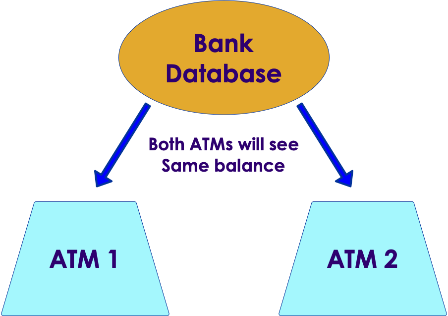
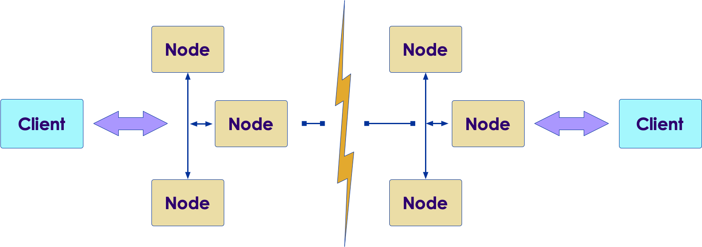
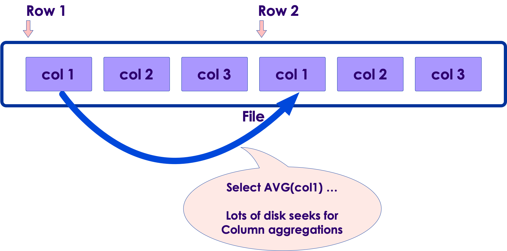
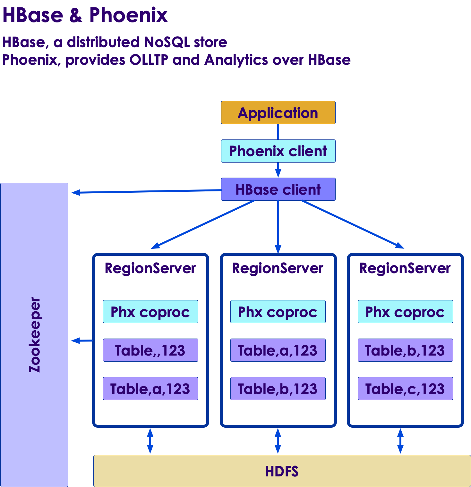
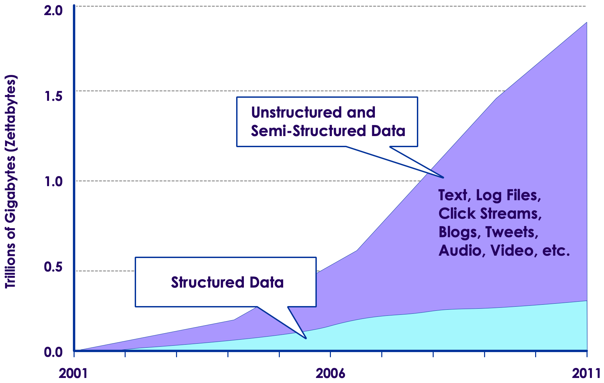

# NoSQL Intro

---

## Lesson Objectives

 * Learn about scaling limitations in traditional RDBMS

 * Learn NoSQL concepts 

 * Understand consistencies and CAP theorem

 * Gain an understanding of columnar storage

 * Learn how NoSQL can handle Big Data

Notes: 

---

# RDBMS and NoSQL

---

## Story of Scaling a Startup...

Notes: 

---

## Scaling Startup: 1 Month In

Notes: 

---

## Scaling a Startup: X Months In...

Notes: 

---

## Moral of the Story

 * Scaling traditional databases (RDBMS) 

    - is HARD!

    - and EXPENSIVE!!

Notes: 

---

## What’s Wrong with Relational Databases?

 * Nothing!

 * Very mature ecosystem, widely used

 * SQL is awesome! (We all know it)

 * Rich set of tools and libraries

 * Provides ACID transactions

 * Nice, relational schemas

 * ...BUT...

Notes: 

---

## What’s Wrong with Relational Databases?

 * Most RDBMS are written for “single machine architecture”

 * Most DBs only scale vertically

     - Buy more powerful machines

     - There is only so much money can buy :)

 * Scaling has to be done “outside the db”

     - Complicates application code!

 * Sharding & replication has to be managed by app developers

     - Not easy to do it at scale

     - Lots of “baby sitting”

     - (War stories!)

Notes: 

---

## New Breed of Applications...

 * Big Users

     - Having millions of users /=per day is not uncommon

     - Applications can go viral and get a huge amount of usage in a short time (literally days or hours!)

     - Peak usage of applications can be many times higher than normal usage (e.g., Twitter during a FIFA world cup game)

 * Big Data

     - Volume: Terabytes to petabytes

     - Velocity: Data is generated pretty fast

     - Variety: Unstructured data (Twitter streams, sensor data, etc.)

 * RDBMS is not good at handling the above

Notes: 

---

## Growth of Unstructured Data

Notes: 

---

## Example Application: Google Maps Navigation

 * Millions of users/day

 * Say each user generates about 1000 data points 

     - GPS location, speed, traffic reports

 * This results in 100s of millions (even billions) of record points every day!!

Notes: 

---

## The Perfect Data Store!

Notes: 

---

## Rise of NoSQL Data Stores

 * NoSQL data stores are primarily designed for Scalability, Scalability, Scalability

 * Designed to run on a cluster of machines

     - Commodity, not special, hardware -> cost effective

 * Horizontal Scalability from the get-go

     - Want more capacity? Add more nodes (with no downtime!)

 * Failure tolerant

     - Nodes may (and will) go down... but the DB stays up

 * Flexible Data Model/Schema

     - Relational model isn’t the best fit for all data models

     - Flexible schema (or no schema)

     - No need to define schema before capturing data

Notes: 

---

## Rise of NoSQL Stores...

 * Ability to handle Big Data

 * Fast writes & reads without locking

     - Ingest high-velocity data streams 

 * Dispense with some niceties

     - NO Secondary indexes!

     - NO JOINS!!

     - No (or very little) ACID!!! 

 * Some NoSQL DBs do provide transactions

Notes: 

---

## NoSQL vs. RDBMS

| Feature      | NoSQL                                  | RDBMS                                   |
|--------------|----------------------------------------|-----------------------------------------|
| For          | Unstructured/semi-   structured data      | Structured data                         |
| Schema       | Optional/flexible                      | Required/Enforced                       |
| Data models  | - Flat tables    - de-normalized   | Heavily normalized                      |
| Scale        | Scales horizontally (huge scalability) | Scales vertically (limited scalability) |
| Foreign Keys | No                                     | Supported                               |
| Joins        | No                                     | Yes                                     |

Notes: 

---

# ACID and NoSQL

---

## ACID

 * **A**tomicity

     - All or nothing

 * **C**onsistency

     - Transaction brings DB from one valid state to another

 * **I**solation

     - Multiple transactions can execute in parallel, but they won’t interfere with each other

 * **D**urability

     - Once a transaction is committed, data is persisted and available

 * ACID is great for mission-critical systems

Notes: 

---

## Transactions in Distributed Systems

 * Very hard scale

 * Involves

     - Blocking

     - Locking

     - -> increased latency 

     - -> reduced throughput

 * Network effect

     - What if nodes crash in the middle of a transaction?

     - Or network gets partitioned?

 * Most NoSQLs don’t offer transactions

Notes: 

---

## A**C**ID: Consistency

 * Replicas agree on latest value

     -  Readers get the latest value

 * Consistency Levels

     - Strong Consistency

     - Eventual Consistency

Notes: 

---

## Quiz

 * Imagine visiting a bank

 * Withdraw money using the lobby ATM

 * Go through the drive-thru to use the ATM

     - Bank balance will reflect the latest transaction

 * What consistency level is this?

Notes: 

---

## Quiz

 * You walk into a busy coffee shop.

 * One person takes the order, another fulfills it.

 * You get immediate acknowledgment of the order but it is fulfilled at a later time.

 *  **Eventually**, when you walk out of the coffee shop, your transaction is full-filled.

 * Who corrects mistakes?

 * What consistency level is this?

Notes: 

---

## Eventual Consistency Example

Notes: 

---

## Eventual Consistency

 * Writers get immediate acknowledgment

 * Readers may get older values

 * The system will eventually catch up

 * It also provides for remedial action(s)

 * Eventual Consistency is suitable for:

     - Non-critical writes

     - High write throughput

     - Asynchronous bulk writes

Notes: 

---

## Eventual Consistency   Example: Video + Comments

Notes: 

---

## When is ACID not needed?

 * Data that is not "critical" or "transactional"

 * Tweets, mobile phone geolocations, sensor data

 * Need very fast writes (without locking)

 * Need very fast reads (without blocking)

 * Give up (some) ACID

 * -> Gain massive scalability

Notes: 

---

## High Availability

 * Nodes may go down…but the system is available

 * Clients can read/write data

 * Achieved via replication

 * No single point of failure

 * ... but there is a catch

Notes: 

---

# CAP Theorem

---

## CAP Theorem (Eric Brewer)

 * **C**onsistency: All replicas agree on the same value

 * **A**vailability: Can always read and write to system

 * **P**artition Tolerance: System keeps working even if replicas can’t talk to each other **‘split brain**’ scenario

 * CAP Theorem says we can have **2 of 3**

Notes: 

---

## CAP Theorem

Notes: 

---

## CAP Classification

Notes: 

---

## CAP Theorem Implications

 * Choose a data store that fits the application

 * Gmail

     - Based on Google Big Table

     - High Availability of Gmail service is facilitated by replicating email across multiple data centers

     - If primary cluster is down, application automatically switches to backup cluster

 * Netflix

     - Uses Cassandra for its streaming service

     - High Availability is more important than highly consistent view

Notes: 

---

# NoSQL Stores

---

## NoSQL DB Types

| Key Value | Document  | Graph | Wide Column |
|-----------|-----------|-------|-------------|
| Memcache  | MongoDB   | Neo   | HBase       |
| Redis     | CouchDB   |       | Cassandra   |
|           | CouchBase |       | Accumulo    |

Notes: 

---

## Key Value Stores

 * Essentially a hash table, indexed by key

 * Either entirely in-memory

     - E.g., Memcache or Scalaris

 * Or Memory + Disk Persistence option

     - E.g., Redis

 * These systems do not offer secondary indices or keys

Notes: 

---

## Document Stores

 * Principal storage abstraction is a document

 * Arbitrary collection of key/value pairs

 * Usually JSON data

 * Internally stored as BLOBs or BSON

 * E.g., MongoDB or CouchDB

 * Provides secondary indices and map/reduce operations

 * Small to medium scalability

Notes: 

---

## Graph Databases

 * Equivalent of RDBMS-es for graphs

 * Used for storing connected data sets

 * Provide index free adjacency

 * Also, provide a graph query language

 * E.g., Neo4j

 * These are for online graph operations, not for batch analytics

Notes: 

---

## Wide Column Stores

 * Can support  **billions of rows and millions of columns**!

 * Data is sharded across nodes

 * Cassandra, HBase, Accumulo, SkyllaDB, etc.

 &nbsp; &nbsp; &nbsp; &nbsp; 

Notes: 

---

# Columnar Storage

---

## Columnar Store

 * Columnar format stores columns **physically together** (instead of rows)

 * Optimized for fast column based aggregations

 * select MAX(temp) from sensors;

 * Doesn’t work well for ‘select *’ queries

     - Row stores work best for that

Notes: 

---

## Row-Based Store

Notes: 

---

## Columnar Store

Notes: 

---

## NoSQL & CAP—Recap

Notes: 

---

## NoSQL and Big Data

 * Hadoop is the platform of choice for Big Data

 * Hadoop analytics is **batch** (MapReduce)

     - Queries take minutes, hours 

 * Hadoop is not suitable for low latency reads/writes

 * NoSQL data stores are suitable for low latency reads/writes but not for high volume batch analytics

Notes: 

---

## Data Spectrum

Notes: 

---

## Cassandra and Data Analytics

 * NoSQL is for point access

 * Analytics is better handled in Hadoop and Spark

 * But if all your data is in a HBase or Cassandra

Notes: 

---

## Numbers Every One Should Know by Jeff Dean, Fellow @ Google

Notes: 

---

## Review Questions

  * True or False? Most NoSQL data stores are designed to run on single node.

  * Which one of the features do most NoSQL data stores support?

     - Transactions
     - Durability
     - High speed read/writes
     - Sharding
     - Secondary indexes/joins

   * What are the implications of CAP Theorem?

   * What kind of NoSQL systems are HBase and Cassandra?
     - Document store
     - Key-value store
     - Graph store

Notes: 

---

# Backup Slides

---

## HBase and Phoenix for Data Analytics

Notes: 

---

## Growth of Unstructured Data

Notes: 

---

## CAP Theorem

Notes: 

