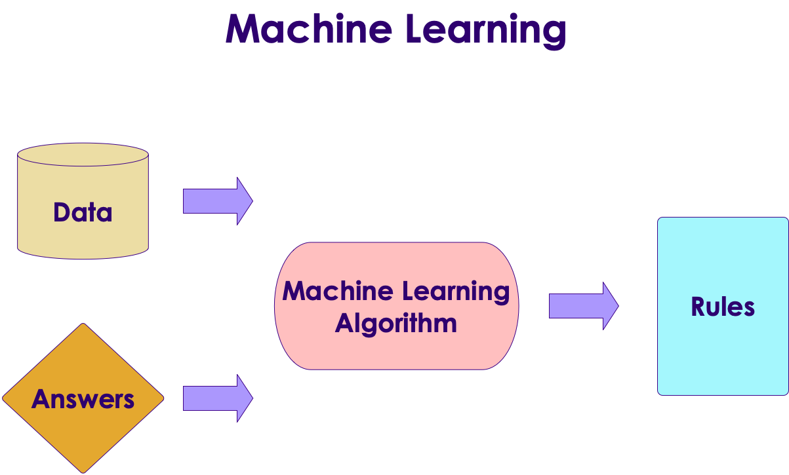
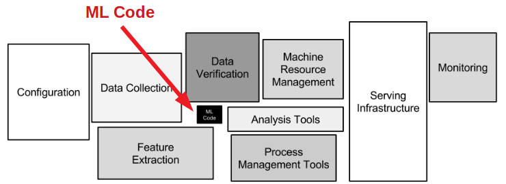
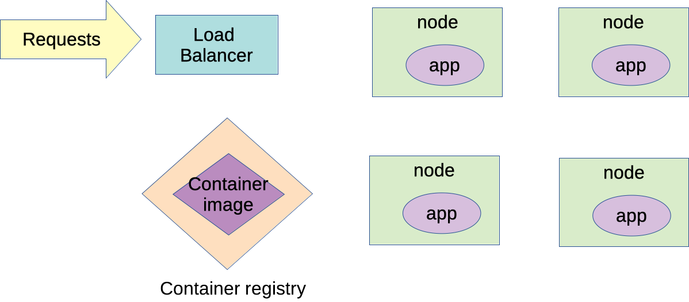

# Becoming a ML Engineer

Sujee Maniyam @ Elephant Scale


---

## Hi, I am Sujee Maniyam


* Founder / Principal @ [ElephantScale](http://elephantscale.com)

* Consult & teach **AI, Data Science, Big Data and Cloud** technologies

* Author
  - [__'Guided Machine Learning'__](https://elephantscale.github.io/guided-machine-learning/) - open source book for learning ML
  - [__'Hadoop illuminated'__](http://hadoopilluminated.com/):  open source book
  - [__'HBase Design Patterns'__](https://www.packtpub.com/big-data-and-business-intelligence/hbase-design-patterns): Packt Publishing, 2015
  - [__'Data Analytics With Spark And Hadoop'__](http://shop.oreilly.com/product/0636920052616.do):  O'Reilly video course

* Contact:
  - sujee@elephantscale.com
  - [ElephantScale.com](http://elephantscale.com)
  - [https://www.linkedin.com/in/sujeemaniyam](https://www.linkedin.com/in/sujeemaniyam)

Notes:

Hello, every one,   welcome to the conference and welcome to this talk

Just a quick intro about me.
My name is Sujee Maniyam - I am a founder at Elephant Scale.   
At Elephant Scale I do training and consulting in AI / Big Data and Cloud technologies.  
I have taught at companies like TMobile, Cisco, Walmart and Intuit.

I am also an author - I like to write open source books :-)   
My first one was called 'Hadoop Illuminated'.  
Right now I am working on a guide called 'Guided Machine Learning'

I live in San Jose, California and we have a cat!

And I am really glad to be speaking at this conference.

---

## About This Talk

### We will discuss:

* Understand what ML Engineering is
* How to become one

### More

* __`tinyurl.com/mleng`__

* Download slides and sign up for a FREE MLEng class!

Notes:

So I am going to about a new discipline called 'Machine Learning Engineering'

I have setup a google doc with some extra information about this talk.  And here is the URL.
It is cool that I was able to get tinyurl.com/mleng !

So what you will find here:

You can download the latest slides

And I am going to start a class on ML Eng soon.  The first batch will be free.  You can sign up if you are interested.  And I will notify you when the class is running.

---

# Machine Learning Engineering

Notes:

So let's start with some basic understanding of machine learning

---

## What is Machine Learning


* **"The field of study that gives computers the ability to learn without being explicitly programmed."**  
 -- Arthur Samuel

Notes:

So this is intersting.

Most of us are programmers.  When you write code in Java or Python or even SQL we are giving instructions to the computer.

So how can a computer learn to do things without being programmed?

Let me give you an example

---

## Traditional Programming vs. Machine Learning


* Here is an example of spam detection rule engine

* The rules are coded by developers

* There could be 100s of 1000s of rules!
  - And they become very hard to manage

<br />
<br />
<br />

```java

if (email.from_ip.one_of("ip1", "ip2", "ip3")) {
  result = "no-spam"
}
else if ( email.text.contains ("free loans", "cheap degrees"))
{
  result = "spam"
}
```

Notes:

So here we are writing rules to classify emails as spam or not.
---

## Traditional Programming vs. Machine Learning



* Here is how we detect spam using ML
* We don't explicitly write rules
* Instead, we show the algorithm with spam and non-spam emails
* Algorithm 'learns' which attributes are indicative of spam
* Then algorithm predicts spam/no-spam on new email


Notes:

So here I am showing an example of how to detect spam using ML.

I am showing the algorithm a bunch of spam emails and some good emails.

The algorithm learns patterns from the sample data on what makes a spam and what makes a good email.

This is called learning or training the algoithm.

And once it has learned enough it can make a decision on a new email.

---

## Machine Learning Process

* Machine learning is focused on building models
  - Build model
  - Test/evaluate the model
  - Rinse/repeat

* Data Scientists focus on this

* Lot of this is done on a laptop (small scale)


Notes:

So a typical machine learning workflow looks like this:

We build a model.  
We test it.  
and we repeat the proecss until we are happy with the model

And this is what data scientists do, they build and tune models.

And most of the machine learning classes teach this process.

Now let's what is involved in taking the model to production

---

## Productionizing Models


Notes:

And here is what it takes to producionize the model  :-)

You can see the green boxes (which indicates building the model) is just a small part of the overall process.

So let me talk about some of these processes.

For example, We see training the model at large scale

And once the model is ready it is  deployed, And we want to monitor the model for performance

And we want a smooth process to update the model to newer version

So as you can see taking the model to production involves lot more than building the model -- which is just the start

---

## Hidden Technical Debt in Machine Learning Systems

* This famous Google [paper](https://papers.nips.cc/paper/5656-hidden-technical-debt-in-machine-learning-systems.pdf) outlines what is involved in building a large ML system



Notes:

And this just not my opinon.  Here is a paper from Google that talks about the same thing.

The paper is called 'hidden technical debt in machine learning systems'

So here you see a large scale ML deployment.

Can you guys see the ML portion?

That's right, it is the smallest box in the middle :-) 

---

## What is Machine Learning Engineering

* __Machine Learning Engineering__ is the process of taking machine learning models to production


* Includes:
  - Good software engineering practices
  - data analytics
  - and devops

Notes:

So that brings us to the definition of 'machine learning engineering'

The simplest explation I can offer is , "It is the process of taking ML models into production"

And in addition to model building it involves lot of other discplines like  
software engineering and devops

---


## Demand for ML Engineer

 &nbsp;  &nbsp;
 &nbsp;  &nbsp;
 &nbsp;  &nbsp;

 &nbsp;  &nbsp;


Notes:

So who is hiring ML Engineers?

I searched for 'machine learning engineers' on couple of jobs sites : LinkedIN jobs and Ineed,

and I pulled these job descriptions

So you see, jobs from Apple, Nvidia, Adobe here.  And there are lot more companies advertising to hire ML Engineers.

I have seen large companies and startups

---

## Are You Excited About ML Eng? :-)


Notes:

So hopefully you guys are excited about Machine Learning Engineering :-)

Let's see what it takes to be a ML Engineer

---

## ML Engineer Skill Set


Notes:

Here is a venn diagram for skills a good ML Engineer should have.

As you can see, it is more than just knowing ML Algorithms.  It involves knowing other skills like Big Data, Cloud and DevOps

In the next few slides, we will dive into each of these in detail.

---

## ML Engineer Skill Set: ML


* Need solid understanding of machine learning algorithms
  - See next slide for explanation

* What if I don't know enough Math?
  - Even though ML and DL are built on advanced math, we don't need deep understanding of the mathematical theories to use the algorithms
  - Because the tools and algorithms have gotten so much better and easier to use

* Practical use of algorithms recommended

Notes:

So a good machine learning engineer needs a good grounding on ML algorithms.

Now lot of people ask me, I want to learn ML but I don't know advanced math.

Even though...

Because the tools...

What we are looking for is familiarity with algorithms

---

## AI vs. Machine Learning :-)


[Source](https://www.reddit.com/r/ProgrammerHumor/comments/a07d0u/ai_in_nutshell/)

Notes:

Now people ask me what is the difference between AI and Machine Learning.

I really liked this one, because it is so funny.

I thought I will share this with you guys :-) 

---

## AI / Machine Learning / Deep Learning


* **Artificial Intelligence (AI):** Broader concept of "making machines smart"

* **Machine Learning:** Current application of AI that machines learn from data using mathematical, statistical models

* **Deep Learning: (Hot!)** Using Neural Networks to solve some hard problems

Notes:

So here I am giving you a , sort of a , formal definition of these terms.

AI is an umbrella terms.. making machines smart

Machine Learning ...

Deep Learning is getting a lot of attention now.  Deep Learning uses a technique called neural networks.  

And Deep Learning algorithms are solving some really hard problems now.  

For example, self driving cars use neural nets to detect shapes

---

## ML Engineer Skill Set: Cloud


* Nowadays large scale training and deployment happens on the cloud

* Advantages of cloud:
  - Easy to get started
  - Flexible
  - Pay as you use pricing
  - Almost unlimited scale

Notes:

Cloud has really changed our computing landscape

It is pretty common to see companies, both small and large, choosing the cloud 

Because...

it is very easy to get started.  you don't need to buy machines and set them up.  
You can simply swipe a credit card to get started.

And you only pay for services you use

And in the cloud, we can pretty much have unlimited scale

---

## From Laptop to Cloud


* Data Scientists might develop their model on their laptop
  - Small scale data
  - Smaller model

* Training the model at large scale, typically is done on cloud environment
  - ML Engineer will handle this

Notes:

So when do we go to cloud?

So one example might be, a data scientist developing a model on their laptop.  
They are using small scale data, that their laptop can handle.  
And  only do small scale training of the model

Once they are reasonably happy with model, they would want to try the model at scale

And possibly in the cloud

And usually ML Engineers will get involved in this phase

---

## Which Cloud?

* Three major cloud vendors:
  - Google
  - Amazon
  - Microsoft

* All of them have pretty good ML capabilities

* Choose the one that best suit your needs
  - partnership
  - deals
  - team expertise

  &nbsp;
  &nbsp;
  &nbsp;

Notes:

So which cloud service you should learn?

Right now we have 3 major cloud vendors: Amazon, Google and Microsoft.

And they are all very capable

And all of them have pretty good ML capababilities

I'd recommend that you pick one and learn.  The knowledge is pretty transferable to other cloud environments.

For example Google Cloud gives you a $300 credit :-)  
That is a good amount of money you can use to learn GCP.

---

## ML Engineer Skill Set: Big Data & Distributed Computing


* Training large scale models may use large amount of data

* And training can be  computationally intensive

* For example, let's say working with 1GB data on a laptop takes 1 hr

* How about we have 1TB of data?
  - it will definitely not fit into laptop's memory

* We would need to do it distributed on a cluster of machines

Notes:

Read the points

---

## Distributed Computing


* In distributed computing, __data and computing are distributed across many nodes__

* Tools for distributed computing
  - Apache Spark (Open source, very popular, cloud neutral)
  - AWS Lambda (serverless compute)
  - Google BigQuery (SQL at scale)


Notes:

Here I am showing the migration from the laptop to a cluster.

In the laptop we have a small sample of the data.  
And we can only do limited training due to lack of capacity.

But in a clustered environment, data is distributed across many nodes.  
See the blue circles.

Not just data, but the computing is also distributed across many machines (see orange circles)

One popular tool for distributed computing is Apache Spark.  Spark can parallelize computing across many nodes.  
And Spark has pretty good ML algorithms implemented out of the box.  
So we can use them right away, we don't need to implement them from scratch

The latest Spark release - version 3 -  is targeted towards machine learning use.  
you can read about it on Spark release page.

Spark is supported pretty well across all clouds

Also the cloud vendors have their own version of distributed computing as well.  
For example Amazon has AWS lambda.  
And google has BigQuery

---

## Model Serving

* Here is an example of model serving at scale

* The system has to scale up and down based on load

* If some nodes or applications crash, they needed to restarted automatically

* The application is packaged as containers



Notes:

So let's assume we have a model trained.  
how do we put the model to use?

This part is called 'model serving'

Models are usually deployed as web services

Here I am showing a typical deployment blueprint.  

First of all, the model serving application is packaged as a container.  
And it registered with the container registry of a cloud provider

Then the system deploys this container on a few nodes.  
See the purple circles

And we have a load balancer to route requests for the service across many application instances

And if nodes crash we need to spin up new nodes to replace the crashed ones

And may be we want to spin up more nodes to handle increase loads

How do we do all this?

The answer is Kubernetes

---

## ML Engineer Skill Set: DevOps


* Deploying applications that are fault tolerant and work at scale requires modern DevOps

* Tools of trade:
  - Docker: Package applications as containers
  - Kubernetes: Deploy and manage containers, specially in the cloud
  - Kubeflow: Kubernetes for Machine Learning
  - Monitoring and Logging: Various tools

<br clear="all">

  
  


Notes:

And this brings me to the final skill set for ML Engineer... DevOps

DevOps will help us to deploy applications at scale and monitor them

So what are the tools for devops?

You have probablyu heard about Docker and Kubernetes

Docker is a very popular container format to package applications

Kubernetes handles every thing from deploying Docker containers across many machines  
It can also do load balancing  
And it can spin up new containers to handle the load

Kubeflow is basically Kubernetes, optimized for machine learning workflow

---

## ML Engineer Learning Path


Notes:

I talked about a lot of skillsets.

How do we go about learning them?

Here is a sample learning path I came up with.

First we are starting with some python progarmming.  
Python has become defacto language for machine learning.  
And also it is a great language for devops and scripting as well.

Then I recommend learning machine learning and deep learning.  
So we have some fundamental knowledge about algorithms  and how they work.

Then I would suggest learning DevOps and Cloud essentials.

you can pick and choose how you learn each module.  
For example if you know Cloud then focus on the rest  and so on

---

## Some Resources To Get You Started

* [Guided Machine Learning](https://elephantscale.github.io/guided-machine-learning/) - a self study guide for learning ML
  - Sign up, we meet every Saturday 11am PST

*  __`tinyurl.com/mleng`__

* Download slides and sign up for a FREE MLEng class!

Notes:

So guys, I hope I have given you an idea of machine learning engineering.

As you can see a good machine learning engineer knows a lot of great technologies.  
That is what makes them highly valuable  
And the salaries I see confirm this

And hopefully got some of you excited to learn this awesome discipline

Here are some pointers to get you started

You can go to this url to get the slides and sign up for a free class that I am planning to start

* Show the page

---

## Further Reading

* Books
  - [Data Science on AWS](https://learning.oreilly.com/library/view/data-science-on/9781492079385/) - by Chris Fregly, Antje Barth
  - [Practical Deep Learning for Cloud, Mobile, and Edge](https://learning.oreilly.com/library/view/practical-deep-learning/9781492034858/) - by Anirudh Koul, Siddha Ganju, Meher Kasam
  - [Kubeflow for Machine Learning](https://learning.oreilly.com/library/view/kubeflow-for-machine/9781492050117/) - by Trevor Grant, Holden Karau, Boris Lublinsky, Richard Liu, Ilan Filonenko

* Websites / Blogs
  - [www.datascienceonaws.com/](https://www.datascienceonaws.com/)

 &nbsp;  &nbsp;


Notes:

And here are some good books and websites I'd recommend

And I know Chris Fregly - author of 'data science on aws' is speaking at this conference.  
I will definitely check out his talk!

---

## Q&A & Thanks!

<!-- {"left" : 8.56, "top" : 1.21, "height" : 1.15, "width" : 1.55} -->
<!-- {"left" : 6.53, "top" : 2.66, "height" : 2.52, "width" : 3.79} -->

* Any questions?

*  __`tinyurl.com/mleng`__

* Sujee Maniyam - sujee@elephantscale.com 


Notes:

So let's open up for questions

And thank you so much for attending guys.  

Hope you found this a little useful.  

Contact me if you have any questions  

My email is on the link above
