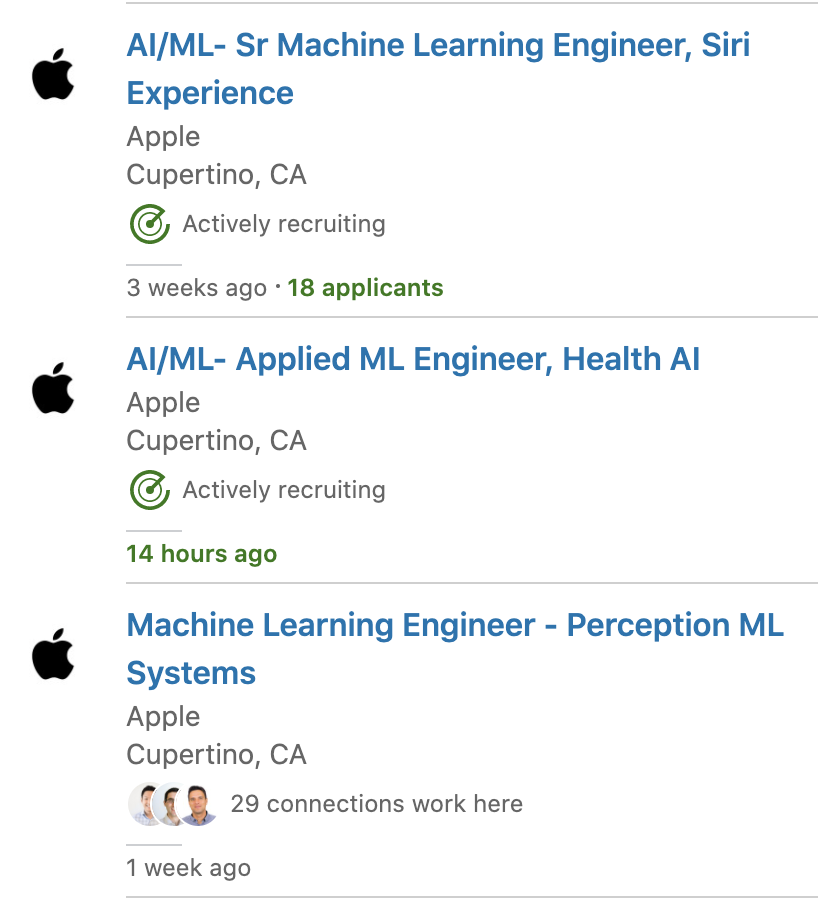
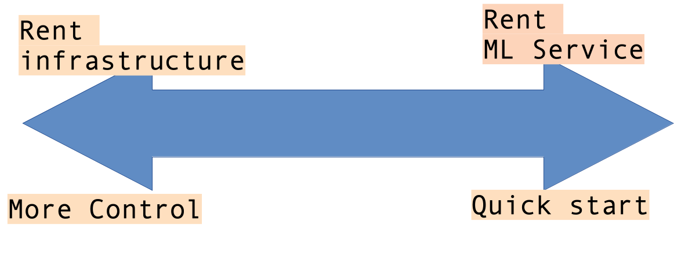

# Becoming a ML Engineer

---

## Hi, I am Sujee Maniyam


* Founder / Principal @ [ElephantScale](http://elephantscale.com)

* Consult & teach **AI, Data Science, Big Data and Cloud** technologies

* Author
  - [__'Guided Machine Learning'__](https://elephantscale.github.io/guided-machine-learning/) - open source book for learning ML
  - [__'Hadoop illuminated'__](http://hadoopilluminated.com/):  open source book
  - [__'HBase Design Patterns'__](https://www.packtpub.com/big-data-and-business-intelligence/hbase-design-patterns): Packt Publishing, 2015
  - [__'Data Analytics With Spark And Hadoop'__](http://shop.oreilly.com/product/0636920052616.do):  O'Reilly video course

* Contact:
  - sujee@elephantscale.com
  - [github.com/sujee](https://github.com/sujee)
  - [ElephantScale.com](http://elephantscale.com)
  - [https://www.linkedin.com/in/sujeemaniyam](https://www.linkedin.com/in/sujeemaniyam)

---

## About This Talk

### We will discuss:

* Understand what ML Engineering is
* How to become one

### More

* __`tinyurl.com/yydcn48b`__

* Download slides and sign up for a FREE MLEng class!

---

# Machine Learning Engineering

---

## What is Machine Learning


* **"The field of study that gives computers the ability to learn without being explicitly programmed."**  
 -- Arthur Samuel


---

## Traditional Programming vs. Machine Learning


* Here is an example of spam detection rule engine

* The rules are coded by developers

* There could be 100s of 1000s of rules!

<br />
<br />
<br />

```java

if (email.from_ip.one_of("ip1", "ip2", "ip3")) {
  result = "no-spam"
}
else if ( email.text.contains ("free loans", "cheap degrees"))
{
  result = "spam"
}
```

Notes:

---

## Traditional Programming vs. Machine Learning


* Here is how we detect spam using ML
* We don't explicitly write rules
* Instead, we show the algorithm with spam and non-spam emails
* Algorithm 'learns' which attributes are indicative of spam
* Then algorithm predicts spam/no-spam on new email


---

## Machine Learning Process

* Machine learning is focused on building models
  - Build model
  - Test/evaluate the model
  - Rinse/repeat

* Data Scientists focus on this

* Lot of this is done on a laptop (small scale)


---

## Productionizing Models


---

## What is Machine Learning Engineering

* __Machine Learning Engineering__ is the process of taking machine learning models to production

* Includes:
  - Good software engineering practices
  - data analytics
  - and devops

---

## Demand for ML Engineer

 &nbsp;  &nbsp;
 &nbsp;  &nbsp;
 &nbsp;  &nbsp;

 &nbsp;  &nbsp;


---

## ML Engineer Skill Set


---

## ML Engineer Skill Set: AI


* A good ML engineer needs good understanding of machine learning and deep learning algorithms
  - See next slide for explanation

* What if I don't know enough Math?
  - Even though ML and DL are built on advanced math, we don't need deep understanding of the mathematical theories to use the algorithms
  - Because the tools and algorithms have gotten so much better and easier to use

* Practical use of algorithms recommended

---

## AI vs. Machine Learning :-)


[Source](https://www.reddit.com/r/ProgrammerHumor/comments/a07d0u/ai_in_nutshell/)

---

## AI / Machine Learning / Deep Learning


* **Artificial Intelligence (AI):** Broader concept of "making machines smart"

* **Machine Learning:** Current application of AI that machines learn from data using mathematical, statistical models

* **Deep Learning: (Hot!)** Using Neural Networks to solve some hard problems

---

## From Laptop to Cloud


* Data Scientists might develop their model on their laptop
  - Small scale data
  - Smaller model

* Training the model at large scale, typically is done on cloud environment
  - ML Engineer will handle this

---

## ML Engineer Skill Set: Cloud


* Nowadays large scale training and deployment happens on the cloud

* Advantages of cloud:
  - Easy to get started
  - Flexible
  - Pay as you use pricing
  - Almost unlimited scale

---

## Which Cloud?

* Three major cloud vendors:
  - Google
  - Amazon
  - Microsoft

* All of them have pretty good ML capabilities

* Choose the one that best suit your needs
  - partnership
  - deals
  - team expertise

  &nbsp;
  &nbsp;
  &nbsp;

---

## Deciding ML Services



* Decide the spectrum of the service you'd like
  - Based on desired control, flexibility and agility

* Renting infrastructure:
  - Get a virtual machine with GPU and train our own model

* Renting a ML service:
  - Use a pre-built model
  - Say use a 'computer vision' model that is offered by cloud vendor
  - This is basically 'ML as Service'

---

## ML Engineer Skill Set: Big Data & Distributed Computing


* Training large scale models may use large amount of data

* And training can be  computationally intensive

* For example, let's say working with 1GB data on a laptop takes 1 hr

* How about we have 1TB of data?
  - it will definitely not fit into laptop's memory

* We would need to do it distributed on a cluster of machines


---

## Distributed Computing


* In distributed computing, __data and computing are distributed across many nodes__

* Tools for distributed computing
  - Apache Spark (Open source, very popular, cloud neutral)
  - AWS Lambda (serverless compute)
  - Google BigQuery (SQL at scale)


---

## Model Serving

* Here is an example of model serving at scale

* The system has to scale up and down based on load

* If some nodes or applications crash, they needed to restarted automatically

* The application is packaged as containers


---

## ML Engineer Skill Set: DevOps


* Deploying applications that are fault tolerant and work at scale requires modern DevOps

* Tools of trade:
  - Docker: Package applications as containers
  - Kubernetes: Deploy and manage containers, specially in the cloud
  - Kubeflow: Kubernetes for Machine Learning
  - Monitoring and Logging: Various tools

<br clear="all">

  
  


---

## ML Engineer Learning Path


---

## Some Resources To Get You Started

* [Guided Machine Learning](https://elephantscale.github.io/guided-machine-learning/) - a self study guide for learning ML
  - Sign up, we meet every Saturday 11am PST

*  __`tinyurl.com/yydcn48b`__

* Download slides and sign up for a FREE MLEng class!

---

## Further Reading

* Books
  - [Data Science on AWS](https://learning.oreilly.com/library/view/data-science-on/9781492079385/) - by Chris Fregly, Antje Barth
  - [Practical Deep Learning for Cloud, Mobile, and Edge](https://learning.oreilly.com/library/view/practical-deep-learning/9781492034858/) - by Anirudh Koul, Siddha Ganju, Meher Kasam
  - [Kubeflow for Machine Learning](https://learning.oreilly.com/library/view/kubeflow-for-machine/9781492050117/) - by Trevor Grant, Holden Karau, Boris Lublinsky, Richard Liu, Ilan Filonenko

* Websites / Blogs
  - [www.datascienceonaws.com/](https://www.datascienceonaws.com/)

 &nbsp;  &nbsp;


Notes:

---

## Q&A & Thanks!

<!-- {"left" : 8.56, "top" : 1.21, "height" : 1.15, "width" : 1.55} -->
<!-- {"left" : 6.53, "top" : 2.66, "height" : 2.52, "width" : 3.79} -->

* Any questions?

*  __`tinyurl.com/yydcn48b`__

