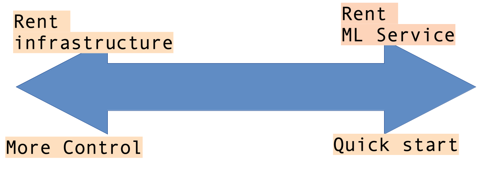

# Backup Slides

---

## Deciding ML Services

* Decide the spectrum of the service you'd like
  - Based on desired control, flexibility and agility

* Renting infrastructure:
  - Get a virtual machine with GPU and train our own model

* Renting a ML service:
  - Use a pre-built model
  - Say use a 'computer vision' model that is offered by cloud vendor
  - This is basically 'ML as Service'

---