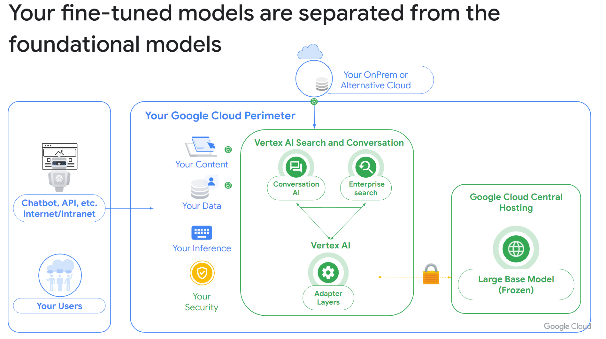

# Text Generation Gen AI with Vertex

(C) Copyright Elephant Scale
February 27, 2024

## Course Description

* Large Language Models (LLM) are taking the world by storm. It can be ChatGPT, Claude, or Bard, but AI is doubling productivity in many occupations.
* This course covers AI and Generative AI landscape, using Google Cloud's Vertex AI.

## Audience
* Developers, data scientists, team leads, project managers

## Skill Level

* Introductory for all

## Duration
* One of two days

## Prerequisites
* General familiarity with machine learning

## Format
* Lectures and hands on labs. (50% - 50%)

## Lab environment
* Zero Install: There is no need to install software on students' machines!
* A lab environment in the cloud will be provided for students.

### Students will need the following
* A reasonably modern laptop with unrestricted connection to the Internet. Laptops with overly restrictive VPNs or firewalls may not work properly.
    * A checklist to verify connectivity will be provided
* Chrome browser

### Generative AI on Vertex AI
* Vertex AI on Google Cloud
* Generative AI options on Google Cloud
* Introduction to the Course Use Case (Text Generation)

### Vertex AI Studio
* Introduction to Vertex AI Studio
* Available models and use cases
* Designing and testing prompts in the Google Cloud console
* Data governance in Vertex AI Studio
* Lab: Getting Started with Vertex AI Studio’s User Interface

### Prompt Design
* Why is prompt design so important?
* Zero-shot vs. few-shot prompting
* Providing additional context and instruction-tuning
* Best practices
* Lab: Question Answering with Generative Models on Vertex AI

### Implementing the PaLM API
* Lab: Getting Started with the Vertex AI PaLM API and Python SDK

### Introduction to the PaLM API
* Utilizing generative models using the Python SDK
* Understanding model parameters for text generation
* Lab: Use the PaLM API to Integrate GenAI into Applications

### Fine-Tuning Models
* Scenarios to use model tuning
* Workflow for model tuning
* Preparing your model tuning dataset
* Create a model tuning job
* Loading a tuned model
* Demo: Fine-Tuning Models for Your Specific Use Case

### References (_Remove before sending_)

https://www.roitraining.com/text-generation-for-applications-using-generative-ai-studio/

https://www.youtube.com/watch?v=4A4W03qUTsw&t=140s

https://cloud.google.com/vertex-ai/docs/generative-ai/models/tune-models#rlhf-tuning

https://cloud.google.com/vertex-ai/docs/generative-ai/models/tune-models

[LLM white pager](References/adaptation_of_foundation_models_whitepaper_google_cloud.pdf)