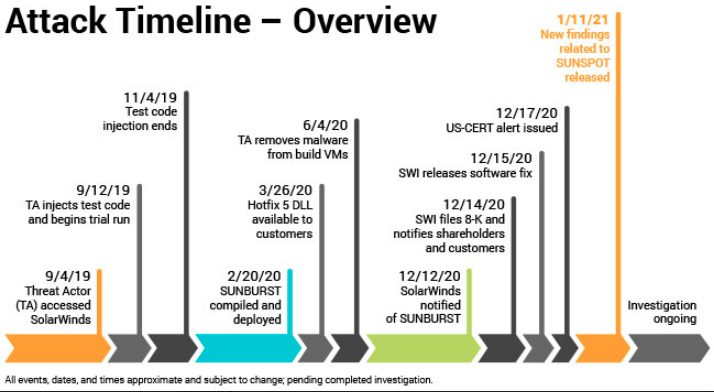
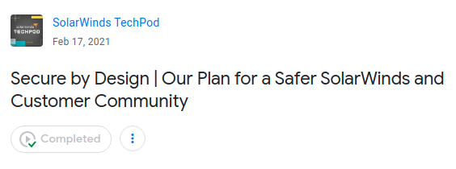

# Webinar - How not to be the next SolarWinds

---

## "Historic mess" - Wired

~

Notes:

https://www.wired.com/story/russia-solarwinds-hack-roundup/?redirectURL=https%3A%2F%2Fwww.wired.com%2Fstory%2Frussia-solarwinds-hack-roundup%2F

---

## Wired story

* How Russia pulled off the biggest espionage hack on record
* Russia's hack of IT management company SolarWinds began as far back as March 2020
* Came to light when the perpetrators used that access to break into the cybersecurity firm FireEye, which first disclosed a breach on December 9, 2020

---

## Victims

* A cascading number of victims have been identified
* Including 
    * the US Departments of State Homeland Security
    * Commerce
    * The US Treasury
    * The National Institutes of Health
    * 18,000 in total
    
    

---
    
## Attack timeline 

---

## How it was discovered

* **FireEye**
* An employee received an alert
    * someone had logged into the company's VPN using their credentials
    * from a new device
    * Over 100 FireEye employees engaged in the response
    * included combing through 50,000 lines of code to suss out any abnormalities.
    

---    

## SolarWinds' response

---
## SolarWinds' podcast

* Companies now are up against state actors
* Here is how we will protect against the same type of hack - hash signatures of build artifact    
* Learn to
    * Audit your cloud trust relationship
    * Document network
    * Enhance permission rules
    
* Intern did it!
    

---

## Let's go deeper into the hack

## Apple's approach

Notes:

https://www.technologyreview.com/2021/03/01/1020089/apple-walled-garden-hackers-protected/