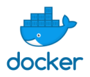

# Intermediate Containerization With Docker and Kubernetes

© Elephant Scale  
April 5, 2022

## Overview

Containerization has taken the IT world by storm, in the last few years. Large software houses, starting from Google and Amazon, are running significant portions of their production load in containers.

Kubernetes is an open-source system for automating deployment, scaling, and management of containerized applications. It groups containers that make up an application into logical units for easy management and discovery. Kubernetes builds upon 15 years of experience of running production workloads at Google, combined with best-of-breed ideas and practices from the community.

This course introduces the students to containers in general, then continues with Kubernetes, its architecture, its use in production, and its best practices.

## What you will learn

* Docker
    * Benefits of containerization
    * Docker concepts and architecture
    * Using docker commands
    * Dockerfiles and building dockers
    * Deploying docker containers
    * Working with container registries
* Kubernetes
    * Kubernetes concepts and architecture
    * Orchestrating Docker containers with Kubernetes
    * Labels and selectors
    * Deploying resilient, scalable services
    * Kubernetes volumes
    * Kubernetes networking

## Audience

Developers, Architects, DevOps

## Duration

5 half days

## Format

Lectures and hands-on labs. (50%, 50%)

## Prerequisites

* Must-have: comfortable with Linux environment.
* Previous development experience in popular languages (Java, Python, Javascript) is recommended.
* Some exposure to docker is assumed.

## Lab environment

A cloud based lab environment will be provided.

## Students will need the following

* A reasonably modern laptop with unrestricted connection to the Internet.  Laptops with overly restrictive VPNs or firewalls may not work properly
* Chrome browser
* SSH client for your platform

## Detailed Outline

## Part 1 - Docker

### Containerization Introduction

* Monolithic apps vs. microservices
* Deploy issues faced by developers
* Virtual machines vs containers
* Containerization technologies

### Docker Intro

* Docker architecture
* Docker internals
* Running docker
* Docker concepts: images, containers, registries
* Introduction to Dockerhub
* Labs

### Working with Docker Containers

* Downloading Docker images
* Running docker containers
* Managing container life cycle
* Labs

### Building Custom Docker Images

* Bundling our applications in a container
* Introducing the Dockerfile
* Building an image from a Dockerfile
* Understanding layers and commands
* Labs

### Working with the Registry

* Introduction to container registries
* Introduction to DockerHub
* Creating a repository on DockerHub,
* Publishing custom images to registry
* Dev setup with a private container registry
* Wrap-up
* Labs

### Networking

* Understanding Docker networking
* Various networking options for Docker
* Bridge vs Host networking
* Exposing ports

### Storage

* Persistent storage in Docker
* Using binds and volumes
* Defining and using storage volumes
* Storage backup and restore
* Labs

### Docker Compose

* Orchestrating containers
* Docker compose concepts
* First application with docker compose
* Developing complex applications using docker compose
* Labs

### Troubleshooting and Debugging

* Inspecting docker logs
* Docker daemon logging
* Container logging
* Troubleshooting and optimizing builds
* Cleanup and maintenance

## Part 2 - Kubernetes

### Kubernetes Intro

* Evolution of orchestration systems
* Kubernetes introduction and features
* Benefits
* Design principles
* Case studies

### Kubernetes Architecture

* Kubernetes architecture
* Controllers and workers
* Namespaces
* Controller, Scheduler, etcd, kubelet
* Managing state in etcd
* Pods and containers
* Replicasets
* Demonsets
* Labs

### Kubernetes Resources

* Labels and annotations
* Node selectors
* Pod assignments
* Resource requirements and limits
* Scheduling and resource allocations
* Labs

### Networking

* Docker networking
* Kubernetes networking
* Networking of pods and containers
* DNS service
* Exposing services
* Labs

### Storage

* Kubernetes volumes
* Provisioning and using persistent volumes
* Dynamic volume allocation
* Labs

### Deploying Scalable Services

* Deployments and Replica Sets
* Services
* Deployment strategies
* Rolling out deployments
* Blue/green deployments
* Deploying services
* Ingress
* Labs

### Kubernetes Ecosystem

* Developer tools
* Monitoring tools
* Testing tools
* Helm
* Labs
