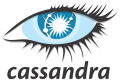

# Introduction to Apache Cassandra

© Elephant Scale

February 10, 2022

## Overview

Modern, large scale applications involve dealing with Big Data, that is often larger than what traditional databases (RDBMS) can handle.

The Cassandra (C\*) is a massively scalable NoSQL database that provides high availability and fault tolerance.

This hands-on course will introduce Cassandra, concepts, data modeling and CQL (Cassandra Query Language). The focus is practical aspects of working with C\* effectively. We will also cover "anti patterns" and best practices, that will lead to optimal C\* implementations in high performance production systems.

## What You Will Learn

* NoSQL concepts
* Cassandra's concepts and architecture
* Setting up and running C\*
* Setting up C\* and your IDE
* CQL (Cassandra Query Language)
* Data modeling in CQL
* Using APIs to interact with Cassandra
* Understand C\* internals (read / write path)
* Deletion and compaction
* C\* administration
* C\* case studies
* C\* data modeling
* C\* workshop (time permitting)

## Audience

Developers, Architects, Database admins

## Skill Level

Introductory - Intermediate

## Duration

5 half-days  (20 hrs)

## Prerequisites

* comfortable with Java programming language
* comfortable in Linux environment (navigating command line, running commands)

## Lab environment

A cloud based lab environment will be provided.

## Students will need the following

* A reasonably modern laptop with unrestricted connection to the Internet.  Laptops with overly restrictive VPNs or firewalls may not work properly
* Chrome browser
* SSH client for your platform

## Detailed Outline

## Session 1

### Introduction to Big Data / NoSQL

* Big Data challenges vs RDBMS
* NoSQL overview
* CAP theorem
* When is NoSQL appropriate
* Columnar storage
* NoSQL ecosystem

### Cassandra Essentials

* C\* architecture overview
* C\* clusters, rings, nodes
* Keyspaces, tables, rows and columns
* Partitioning, replication, tokens
* Quorum and consistency levels
* Labs: installing Cassandra, interacting with Cassandra using CQLSH

## Session 2

### Data Modeling – part 1

* introduction to CQL
* CQL Datatypes
* Creating keyspaces and tables
* Choosing columns and types
* Choosing primary keys
* Time to live (TTL)
* Querying with CQL
* CQL updates
* Collections (list, map, and set)
* Labs: various data modeling exercises using CQL; experimenting with queries and supported data types

## Session 3

### Data Modeling – part 2

* Creating and using secondary indexes
* Composite keys (partition keys and clustering keys)
* Understanding partition keys and data distribution
* Time series data
* Best practices for time series data
* Counters
* Lightweight transactions (LWT)
* Labs: creating and using indexes; modeling time series data

## C\* Java API
  
* Introduction to Java driver
* CRUD (Create / Read / Update, Delete) operations using Java client
* Asynchronous queries
* Labs: using Java API for Cassandra

## Session 4

### C\* Internals

* Understand Cassandra design under the hood
* Partitioners, gossip protocols, snitches
* sstables, memtables, commit log
* Read path, write path
* Deletions, compactions, tombstones
* Failure handling
* Caching

### C\* Admin

* Hardware selection
* Software dependencies
* Cassandra distributions
* Install checklist and process
* Benchmarking tools
* Lab: students install Cassandra, run benchmarks

### C\* Best Practices

* C\* best practices
* Performance tuning
* Troubleshooting tools and tips
* "Anti-patterns" - how NOT to use C\*

## Session 5

### C\* Case Studies

* We will look at some C\* use cases in the industry.  Study their system architecture, best practices and recommendations.  This gives attendees a good sense of how C\* is being used in real world use cases.

### C\* Data Modeling labs

* **Attendees will work as teams**
* Multiple use cases from various domains are presented
* Students work in groups to come up designs and models,  discuss various designs, analyze decisions

### C\* Workshop

* In this section, attendees will implement a real-world use case using C\*
* **Attendees will work as teams**
* Each team will come up with data models for C\* and implement them and test them
* Also teams are encouraged to present their solution to the class.  We will discuss, provide feedback and learn from each other
* Possible project ideas:  
    - Implement a Slack like messaging system.  Come up with data models for users, messages and group chats
    - Implement a music service like Spotify.  Come up with data models for songs, users, ratings
    - Implement a stock quotes tracking system.  Come up with models for stock tickets, prices (time series data)
