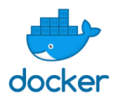

# Docker Introduction

© Elephant Scale  
2022 January

## Overview

Containerization is one of the most important developments in application deployment in many years, and paves the way for many other exciting possibilities in dev/ops.

Docker is the industry-standard container format and Docker tools are the cross-platform standard for creating containers.

This course introduces containerization, docker and docker ecosystem to participants

## What you will learn

* Containerization technologies
* Docker and its ecosystem
* Using Docker images
* Building custom docker images

## Audience

Managers, Developers, Architects, DevOps

## Duration

1 day

## Format

Lectures and hands-on labs. (50%, 50%)

## Prerequisites

* For hands-on labs, previous development experience in popular languages (Java, Python, Javascript) is recommended.
* Familiarity with Linux environment is essential

## Lab environment

A cloud based lab environment will be provided.

## Students will need the following

* A reasonably modern laptop with unrestricted connection to the Internet.  Laptops with overly restrictive VPNs or firewalls may not work properly
* Chrome browser
* SSH client for your platform

## Detailed Outline

### Containerization Introduction

* Monolithic apps vs. microservices
* Deploy issues faced by developers
* Virtual machines vs containers
* Containerization technologies

### Docker Intro

* Docker architecture
* Docker internals
* Running docker
* Docker concepts: images, containers, registries
* Introduction to Dockerhub
* Labs

### Working with Docker Containers

* Downloading Docker images
* Running docker containers
* Managing container life cycle
* Labs

### Building Custom Docker Images

* Bundling our applications in a container
* Introducing the Dockerfile
* Building an image from a Dockerfile
* Labs

### Docker Orchestration

* Docker swarm
* Docker compose
* Kubernetes

### Next Steps

* Discuss projects, use cases and next steps
