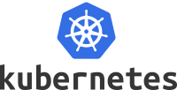

# Introduction to Kubernetes

© Elephant Scale  
February 12, 2025

## Overview

Containerization has taken the IT world by storm, in the last few years. Large software houses, starting from Google and Amazon, are running significant portions of their production load in containers.

Kubernetes is an open-source system for automating deployment, scaling, and management of containerized applications. It groups containers that make up an application into logical units for easy management and discovery. Kubernetes builds upon 15 years of experience of running production workloads at Google, combined with best-of-breed ideas and practices from the community.

This course introduces the students to Docker and then  Kubernetes, its architecture, its use in production, and its best practices.

## What You Will Learn

* Kubernetes concepts and architecture
* Orchestrating Docker containers with Kubernetes
* Labels and selectors
* Deploying resilient, scalable services
* Kubernetes volumes
* Kubernetes networking
* security

## Duration

3 days

## Audience

Developers, architects, admins

## Format

50% lectures, 50% hands-on labs.

## Prerequisites

* Must-have: comfortable with Linux environment.
* Familiar with software development

## Lab environment

A cloud based lab environment will be provided.

## Students will need the following

* A reasonably modern laptop with unrestricted connection to the Internet.  Laptops with overly restrictive VPNs or firewalls may not work properly
* Chrome browser
* SSH client for your platform

## Detailed Outline

### Containerization Introduction

* Monolithic apps vs. microservices
* Deploy issues faced by developers
* Virtual machines vs containers
* Containerization technologies

### Docker Intro

* Docker architecture
* Docker internals
* Running docker
* Docker concepts: images, containers, registries
* Introduction to Dockerhub
* Labs

### Working with Docker Containers

* Downloading Docker images
* Running docker containers
* Labs

### Kubernetes Intro

* Evolution of orchestration systems
* Kubernetes introduction and features
* Benefits
* Design principles
* Case studies

### Kubernetes Architecture

* Kubernetes architecture
* Controllers and workers
* Namespaces
* Controller, Scheduler, etcd, kubelet
* Managing state in etcd
* Pods and containers
* Replicasets
* Demonsets
* Labs

### Kubernetes Resources

* Labels and annotations
* Node selectors
* Pod assignments
* Resource requirements and limits
* Scheduling and resource allocations
* Labs

### Networking

* Docker networking
* Kubernetes networking
* Networking of pods and containers
* DNS service
* Exposing services
* Labs

### Storage

* Kubernetes volumes
* Provisioning and using persistent volumes
* Dynamic volume allocation
* Labs

### Deploying Scalable Services

* Deployments and Replica Sets
* Services
* Deployment strategies
* Rolling out deployments
* Blue/green deployments
* Deploying services
* Ingress
* Labs

### Kubernetes Ecosystem

* Developer tools
* Monitoring tools
* Testing tools
* Helm
* Labs

### Security

* Docker and Kubernetes security
* Role-based access control (RBAC)
* Enterprise-grade features
* Docker Trusted Registry

### Practical Kubernetes Examples

* A 3 tier web application: wordpress
* Container level monitoring
* Load balancing traffic
* Autoscaling
* A/B testing
* Kubernetes in the cloud
* Kubernetes as service

### Kubernetes Best Practices

* Configuration examples
* Writing better manifest files
* Optimizing kubernetes operations
* Monitoring resource usage
* Tracking changes
* Health checks
* Liveness probes

### Workshops (time permitting)

* Students will work on end to end scenarios using Docker and Kubernetes
