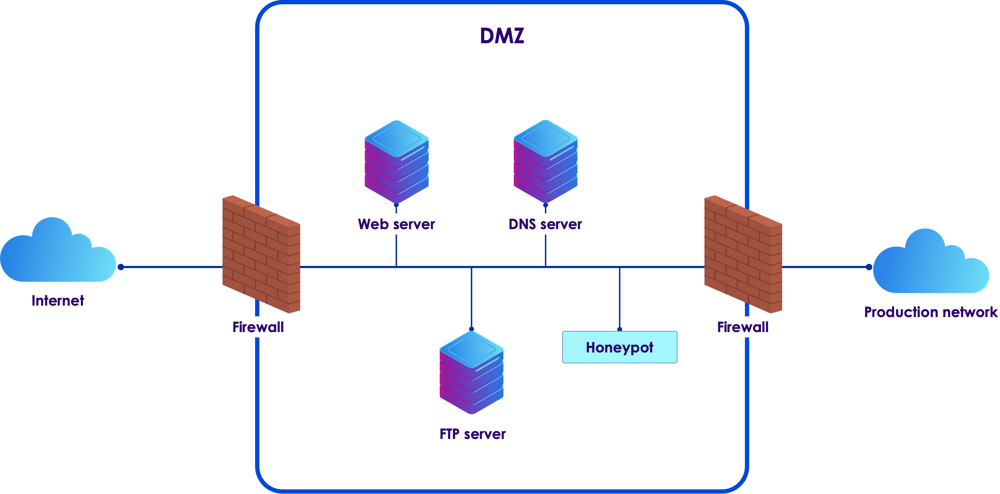
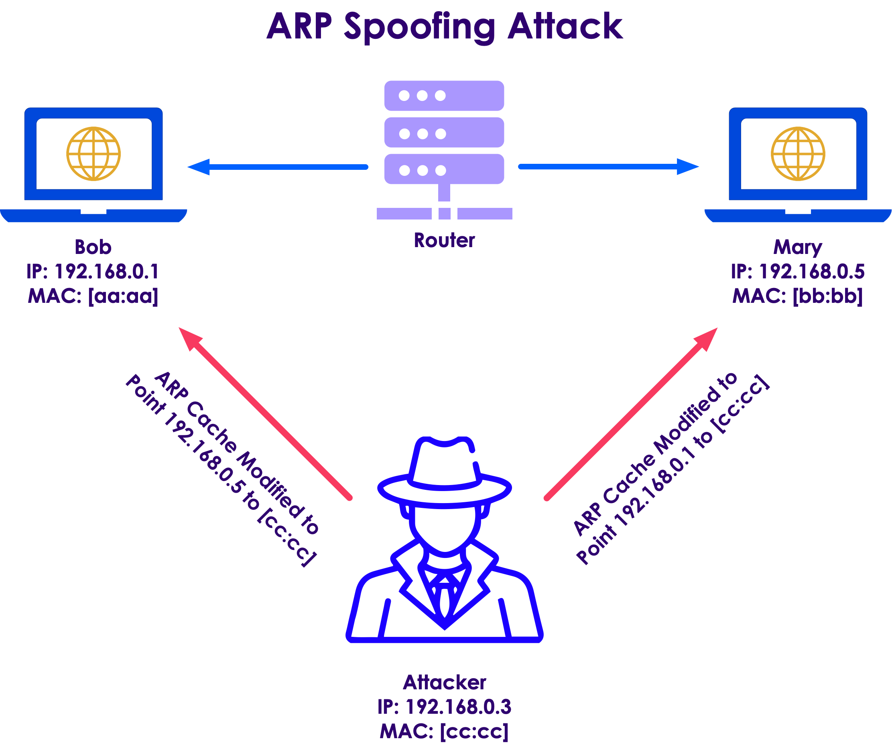
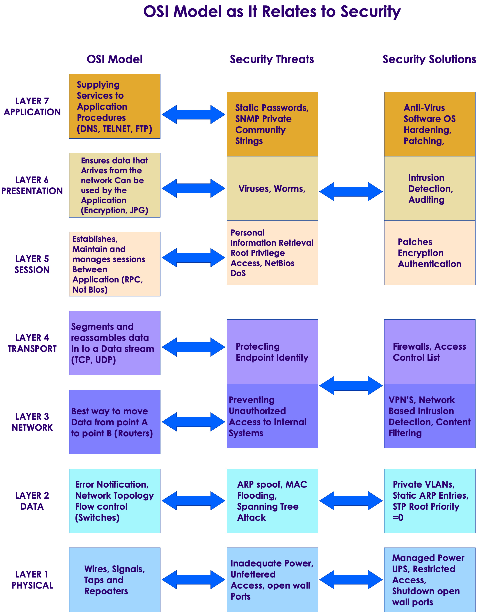

# OSI Security Model

---

# The OSI Layers

---

## The OSI Layers

 * Open System Interconnection or OSI layers

 * Reference model for how information from software in one device moves to an application on another computer

<!-- {"left" : 1.63, "top" : 2.94, "height" : 5.36, "width" : 6.99} -->

Notes: 

Image credit: https://superuser.com/questions/874393/what-protocol-is-used-to-transfer-a-message-in-a-http-application
Licensed for free use and sharing with attribution and without modification

---

## The OSI Layers

 * Maps to various implementations

 * TCP/IP architecture for example

 <!-- {"left" : 1.81, "top" : 2.67, "height" : 5.3, "width" : 6.64} -->

Notes: 

Image Credit: https://nicolaswindpassinger.com/osi-reference-model

---

## The OSI and IoT

 * OSI maps to different protocols and standards for web and IoT worlds

 <!-- {"left" : 0.93, "top" : 2.26, "height" : 5.21, "width" : 8.38} -->

Notes: 

Image Credit: https://nicolaswindpassinger.com/osi-reference-model

---

## Application Layer

 <!-- {"left" : 6.68, "top" : 1.35, "height" : 4.8, "width" : 3.22} -->

 * Represents processes on the level of applications and users, IoT and otherwise

 * Links the business application access to network services

 * Messaging protocols found at this layer CoAP, MQTT, XMPP, AMPQP and HTTP

Notes: 

Ref: 

---

## Presentation Layer

 <!-- {"left" : 6.68, "top" : 1.35, "height" : 4.8, "width" : 3.22} -->

 * Formats and encrypts data for communication.

 * Resolves compatibility issues in the communication between the application and the network. 

 * For example, TLS class of cryptographic protocols

Notes: 

Ref: 

---

## Session Layer

 <!-- {"left" : 6.68, "top" : 1.35, "height" : 4.8, "width" : 3.22} -->

 * Connections between local and remote applications are initiated, managed and terminated here

 * Manages sessions over multiple devices on the same network

Notes: 

Ref: 

---

## Transport Layer

 <!-- {"left" : 6.68, "top" : 1.35, "height" : 4.8, "width" : 3.22} -->

 * Manages the host-to-host data transmission

 * Ensures that data transfers between hosts are completed.

 * Manages error recovery and retransmission of lost data. 

 * TCP and UDP are two common protocols in this layer

Notes: 

Ref: 

---

## Network Layer

 <!-- {"left" : 6.68, "top" : 1.35, "height" : 4.8, "width" : 3.22} -->

 * Responsible for routing and transferring data packets between different nodes across various networks

 * Includes the IP the Internet Protocol part of TCP/IP

 * Of concern to IoT is that it also includes IPv4 and IPv6

Notes: 

Ref: 

---

## Data Link Layer

 <!-- {"left" : 6.68, "top" : 1.35, "height" : 4.8, "width" : 3.22} -->

 * Later where data transfer between two directly connected nodes in a network takes place

 * Divided into two sub layers: 

     - Medium access control layer (MAC layer)

     - Logical link control layer (LLC). 

 * Various IEEE 802 standards apply to this layer

     - IEEE 802.15.4 or low rate Wireless PAN for example

Notes: 

Ref: 

---

## Physical Layer

 <!-- {"left" : 6.68, "top" : 1.35, "height" : 4.8, "width" : 3.22} -->
 * Layer where networks are organized

 * Foundation of IoT and its connected 

 * Includes the essential physical structure needed to make the IoT possible

     - E.g., cables and radio frequency links

     - Essential transmission specifications, communication protocols and hardware on a device and data level.=

Notes: 

Ref: 

---

## OST Intuitive Model

 * Using OSI to figure out why an application isn't working

   - Layer 1: Physical
     - 	Is the network cable plugged in?
   - Layer 2: Data Link
     - 	Do you have a link light?
   - Layer 3: Network
     - 	Are you getting an IP?
   - Layer 4: Transport
     - 	Can you connect to your default gateway?
   - Layer 5: Session
     - 	Do you have DNS server information? 
     - 	Can you ping 4.2.2.2 but not google.com?
   - Layers 6&7: Presentation & Application
     - 	Can you browse to a site? 

Notes: 

---

# Common Attacks by Layer

---

## Examples of Attacks at Each Level

| Layer | Description  | Attack                                                                                                                               |
|-------|--------------|--------------------------------------------------------------------------------------------------------------------------------------|
| 7     | Application  | Social Engineering, UserID/Password sniffing. Lack of role-based security for admin and support. Spoofing authentication credentials |
| 6     | Presentation | Phishing, TLS/SSL sniffing Breaking weak or faulty encryption                                                                        |
| 5     | Session      | Hacking – Telnet and FTP hacking Access to unsecured applications                                                                    |
| 4     | Transport    | TCP Sessions sniffing Port sniffing                                                                                                  |
| 3     | Network      | Man in the Middle Attacks Port sniffing                                                                                              |
| 2     | Data Link    | Spoofing MAC/ARP sniffing                                                                                                            |
| 1     | Physical     | Sniffing, physical device compromise                                                                                                 |

Notes: 

---

## Application Level Security 

 * Refers to the applications that support the end user functions

     - Applications at this layer include FTP, SMTP and other services

     - Supports user applications with that authentication and authorization

 * Main security challenge for IIoT is unauthorized access to control systems

     - Entry point to introduce additional vectors – e.g, creating backdoors for future attacks

     - Common attack vector using social engineering, phishing and other deceptive exploits

 * First line of defense is strong organizational procedures and policies on issuing, revoking and changing authentication credentials

Notes: 

---

## Application Level Security 

 * UserID/Password is common authentication

     - Often implemented with weak account policy
     - Users suffer from password fatigue
        * Tend to use the same password across accounts
        * Tend to use short easy to guess passwords
        * Tend to not change their passwords

Notes: 

Several attacks have been documented where an individual used the same password for an administration account as they did for a social media account.  The credentials were hacked from the social media account and then used to access the corporate network.

---

## Application Level Security 

 * Mitigations

     - Password policy requiring strong passwords and regular rotations
     - Use generated tokens instead of passwords
        * These have higher entropy and are harder to crack
        * Eliminates the problem of password reuse

     - MFA – multi-factor authentication

        * Requires authentication from two of three possible sources
          * What the user knows – password or token
          * Where the user is – specific IP address
          * Something the user has – mobile phone for a confirmation code

Notes: 

Several attacks have been documented where an individual used the same password for an administration account as they did for a social media account.  The credentials were hacked from the social media account and then used to access the corporate network.

---

## Presentation Level Security 

 * Encryption is performed at this layer

 * Common attacks often involve weak or missing encryption

     - There must be both encryption for data in transit and encryption for data at rest

---

## Presentation Level Security 

 * Exploitable weaknesses can occur when:

     - An encryption standard is used that is too weak, one that has known weaknesses for example
     - Flawed implementation of the encryption such as:

        * Keys are too short
        * Salts are not used in digests allowing the use of rainbow tables to reverse engineer passwords

        * Using an encryption library that has not been fully vetted
        * Using a home-grown encryption library that is not full tested

     - Flawed application of an encryption application
        * Failure to encrypt data when it should be
        * Not encrypting some data that is accessible

Notes: 

---

## Presentation Level Security 

 * Presentation level security can be subverted at the application level

 * Called a Man in the Browser (MiTB) attack
     - Access is gained at the application level to steal or alter data before it become encrypted

 * Often the result of human engineering

     - Compromised user installs malware
     - Or malware is installed from a phishing or other attack

 * Can be mitigated to a degree by isolation

     - Applications used for systems control do not have access to other applications
     - No public access to the user control apps
     - Only the absolute minimum network access to private networks

 * Ideally, control systems only connect to the system they control

Notes: 

---

## Man in the Browser

 <!-- {"left" : 0.35, "top" : 2.1, "height" : 5.45, "width" : 9.56} -->

Notes: 

---

## Session Level Security 

 * The main attacks at this level deal with interfering with sessions or some sort of session hijack
 * Man in the Middle (MiTD) attacks occur when an adversary can intercept communications between two parties in a session
 * A main risk is that an adversary could take over an automated system by hijacking a session between the system and an operator
 * Some potential exploits
     - Failure to use regular confirmation of identity of participant
        * Ignoring warning about expired TSL certificate for example
     - Failure to rotate credentials during a session
        * The longer a set of credentials is used, the more likely they are to be hacked
     - Failure to securely transmit session information
        * Often makes the session tokens or ids guessable by an adversary

Notes: 

---

## Transport Level Security 

 * Internet based attacks probe for open ports
     - Can be used to inject malware
     - Malware often opens other ports as a backdoor

 * Mitigations involve
     - Regular port scans
     - Use of non-standard ports to confound probing for commonly used ports
     - Firewalls to block access to most ports except those explicitly allowed on a whitelist

 * Known or published IP addresses are potential targets

 * Mitigations involve
     - Use of an API gateway to map external IP addresses to internal addresses
     - Use of filtering and firewalling on the gateway
     - Establishment of a DNZ

Notes: 

---

## Demilitarized Zone and Honey Pots 

 * DMZs connect internal networks to the outside world

    * Internal networks cannot be accessed directly
    * Must go through the DMZ
    * Including standard application-level attacks

 * Honeypots are fake networks

    * Designed to distract attackers
    * They wind up attacking the honeypot instead of the industrial system

 <!-- {"left" : 1.62, "top" : 4.82, "height" : 3.54, "width" : 7.01} -->

Notes: 

---

## Network Layer Security

 * Level at which most network hardware operates

     - Switches, routers, firewalls, etc.

 * Attacker can reroute traffic via a compromised router

     - Many commercial routers have security flaws

 * Malware insertion into network devices is a common attack

     - Used by the NSA as part of their Tailored Access Operations (TAO)

     - Network devices are physically intercepted during shipment

     - Malware is installed to create backdoors

 * Security analyses often overlook off the shelf hardware

Notes: 

---

## ARP Spoofing Attack

<!-- {"left" : 0.4, "top" : 2.29, "height" : 5.16, "width" : 9.44} -->

Notes: 

---

## Network Layer Security

 * Mitigations involve

     - Using NAT and other address translation strategies

     - Physically secure network equipment

     - Breeches at this layer commonly occur inside the organization

     - The use of VPNs where possible

     - However, this does add a layer of latency and complexity

     - Full security audits of all network equipment

Notes: 

---

## Data Link Layer Security

 * This layer works on the MAC address and packet layer

 * Common attack is to force a Network Interface Controller (NIC) into promiscuous mode

     - This allows it to absorb traffic intended for other machines

 * This is also the layer where attackers may spoof a MAC address

 * Mitigation

     - A common mitigation is to create separate virtual LANS (VLANs) on a single physical LAN

     - Access control lists can then be applied to the different VLANs

     - Disabling unused ports also helps at this layer too

Notes: 

---

## Physical Layer Security

 * Most common attack is compromised physical devices

     - Access to the devices creates opportunities for insertion of malware or physical taps or attacks

 * First line of defense

     - Physically isolate and lock up all the equipment
     - Allow access only to vetted people who need access
     - Use the lowest level of access needed

 * Social engineering attacks try to convince staff to allow access to bad actors

     - Mitigation is to have strongly enforced security measures
     - "We will not open the server room for anyone who claims to have lost their keycard."

 * Physical interception is done by accessing cables and other devices – data taps for example
     - Also done by monitoring EM signals from monitors and other devices

Notes: 

---

## Physical Layer Security

 * Common vector to disable physical devices

     - Power overloads

     - EM pulses or physical damage

 * Mitigations

     - Any device, cable or other "thing" connected to the network is vulnerable

     - Use proper shielding and physical isolation when necessary

     - Have a good disaster recover plan for loss of physical assets

Notes: 

---

# Defense in Depth

---

## Defense in Depth

 * Any IoT security solution must include a security model and plan for each of the OSI levels or their equivalent

 * Any deployed system is as insecure as the security at its weakest level

 <!-- {"left" : 2.04, "top" : 3.28, "height" : 4.8, "width" : 6.17} -->

Notes: 

---

## OSI mitigations

 <!-- {"left" : 1.91, "top" : 1.75, "height" : 6.23, "width" : 6.43} -->

Notes: 

---

## Layer One Attacks

 * Traditional cybersecurity improvements push attackers toward alternative paths

     - The physical layer has become a fertile ground for attacks

     - Effectively, the soft underbelly of cybersecurity

 * Can take the form of a compromised employee planting a device on the network

 * Rogue and insecure hardware is often missed during security audits

     - Legitimate hardware can be altered to provide insecure access

 * Zero-trust network security causes attackers to look at physical access via hardware exploits

     - Even air-gapping is not an effective solution

     - For example, STUXNET

Notes: 

Taken from https://www.helpnetsecurity.com/2021/09/14/osi-layer-1/

---

## Hardware Security Challenges

 * Firmware can be updated with compromised versions

     - Often overlooked in security testing

 * Recommended mitigation

     - automated security validation tools that can scan for configuration anomalies within their platform and evaluate security-sensitive bits within their firmware

 * Hardware uses multiple components from different manufacturers, each using a different supply chain

     - Security has to be enforced across the supply chain

 * Problem made more urgent by the increased use of  systems on chips (SoCs)

     - SoCs consolidate multiple traditional components on a single chip

     - Bypasses the more traditional network security analysis

Notes: 

Taken from https://www.helpnetsecurity.com/2021/09/14/osi-layer-1/

