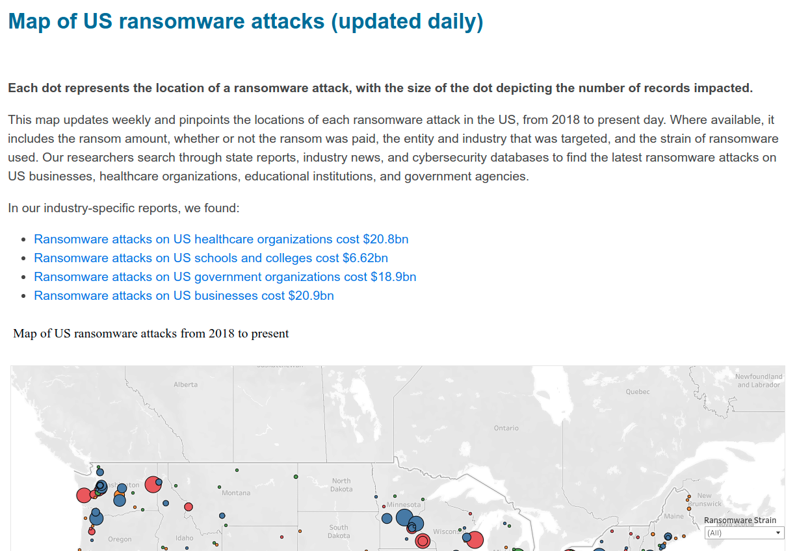

# Security Intro

## Bad joke
* Why was the sys admin not found?

---

## Bad joke - answer
* Because he ran somewhere!

---

## Ransomware attacks - map

---

## Ransomware attacks - live stats

[https://www.comparitech.com/ransomware-attack-map/?mod=djemCybersecruityPro&tpl=cy
](https://www.comparitech.com/ransomware-attack-map/?mod=djemCybersecruityPro&tpl=cy
)

---

## Personal Story
* Hacker comes to town!
* Jeremiah Grossman

---

## Grossman's Lessons

* Make life (work) harder for hackers
* And they will go elsewhere

---

## Hacking as a lifestyle

---

## Told by GrugQ

---

## Summary of hacker advice

---

## GrugQ Twitter

* Followed by 118K
* @thegrugq

---

## Practically

* You could do this:
* Validate all inputs
* Protect against all (?) attacks
* Encrypt your data, in motion and in rest
* And you will not be blamed
* But this is boring
  - and brings no new functionality

---

 
## Suggestion
* At times, let us play games
* Red Team attacks
* Blue Team defends
* Tell your boss, you are doing security :)

---

## Criminal Economy

* Criminal marketplaces
* Escrow services
* Bitcoin
* Malware as a service
  * Software provided
  * Negotiation services
  * Payment facilitation, etc.
  
---

## Insider job recruitment

* https://krebsonsecurity.com/page/3/

---

## Is FBI involved?

* Old answer
  * Yes
  * Working with other agencies
  * Across borders
  * But they can only do so much

* New answer
  * "Hounds" policy
  * Australia, GB, France plan to treat it as military threat
  * Dutch policy actively attacks

---

## Criminal Operations
* Highly specialized
* Productized
* How can we counteract it?
* One should do what he can do with his hands

---

## Pieces of advice

* For the manager, for the developer
1. Become a security champion
2. Threat modeling
3. Tabletop exercises
4. Contingency plans
5. Education

---

## Security champion

---

## Threat modeling

---

## Tabletop exercises

---

## Contingency plans

* Hacker advice to victims:
  * Don't hire help! Or else it will go even worse for you
  * __Do you believe it?__

1. Have a plan. (Such as off-line backup.)Test it!
2. Line-up your help (lawyers, negotiators, etc.)
3. Cyber-Insurance
4. Your addition?

---

## Atomic Red Team

[Atomic Red Team](https://atomicredteam.io/)

---

## Education

* Secure Coding
* OT (Operational Technology) Security
* Secure Coding Java
* Secure Coding C++
* Vault and Consul
* Ghidra
* Etc.

---

## Congrats on completion

--

