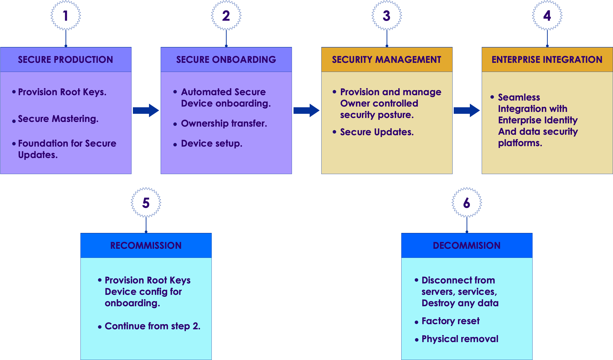

# Security Design

---

## Secure by Design

 * Securing the IIoT does not require radically new ideas, concepts or techniques
 * Instead, existing best practices in all areas of IT security need to be updated and integrated
 * Starting point is the concept of secure by design

     - Ensures that security is a primary objective at all stages of product creation and deployment
     - Avoids security being “added on” after development
     - Remedial security is historically the source of many breeches

---

## Secure by Design

 * The problem faced is:

     - IoT is still in its early stages
     - Need to extend and integrate cyber security and physical security for cyber-physical systems

 * Three main principles

     - Threat analysis: starts with a security threat analysis
     - Defense in depth: full stack security design
     - Security everywhere: no part of a system is ignored

Notes: 

---

## IoT Security Blueprint

<!-- {"left" : 0.73, "top" : 2.33, "height" : 4.98, "width" : 8.78} -->

Notes: 

---

## IoT Foundation Best Practices

 * Classification of Data
 * Physical Security
 * Device Secure Boot
 * Secure Operating System
 * Application Security
 * Credential Management
 * Encryption
 * Network Connections
 * Secure Software Updates
 * Logging
 * Software Update Policy
 * Assessing a Secure Boot Process
 * Software Image and Update
 * Side Channel Attacks

Notes: 

---

## Classification of Data

 * Define a data classification scheme and document it

     - Defines classes or levels of sensitivity for data
     - Ensures right level of security is implemented
     - Ensures compliance with legal regulations

 * Assess every item of data stored, processed, transmitted or received by a device

     - Apply a data classification rating to each item
     - Collections of data may be more sensitive than individual items and may be classified differently

 * Ensure the security design protects every data item and collections of items against unauthorized viewing, changing or deletion, to at least its classification rating or higher

 * When documenting the security design, also document the data items, their classification and the security design features that protect them

Notes: 

---

## Physical Security

 * IoT devices are often deployed in easily accessible locations

     - Increases risk of physical damage, tampering with switches and making connections to management, debugging and test ports

 * Secure devices by physically barring access and removing all means of unwanted connection

 * Any interface used for administration or test purposes during development should be removed from a production device, disabled or made physically inaccessible

 * All test access points on production units must be disabled or locked

 * Necessary administration ports must have effective access controls

     - Strong credential management, 
     - Restricted ports
     - Secure protocols etc.

Notes: 

---

## Physical Security

 * Device circuitry should physically inaccessible to tampering

     - e.g. epoxy chips to circuit  board, resin encapsulation, hiding data and address lines under these components etc.

 * Secure protective casing and mounting options for deployment of devices in exposed locations

 * To identify possible problems in the supply chain, make the device and packaging “tamper evident”

 * Shield against side-channel attacks

     - E.g. monitoring of power consumption or temperature

Notes: 

---

## Device Secure Boot

 * Uses a staged boot sequence to minimize risk

     - Every stage is checked for validity before initializing
     - Minimizes risk of rogue code being run at boot time

 * Ensure a ROM-based secure boot function is always used

 * Use a hardware-based tamper-resistant capability

     -  E.g. Secure Access Module (SAM) or Trusted Platform Module (TPM)
     - Stores crucial data items and runs the trusted authentication and cryptographic functions required for the boot process. 
     - Must hold the read-only first stage of the bootloader and all other data required to verify the authenticity of firmware

 * Check each stage of boot code is valid and trusted immediately before execution

     -  Reduces the risk of TOCTOU attacks (Time of Check to Time of Use)

Notes: 

---

## Device Secure Boot

 *  At each stage check that only the expected hardware is present and matches the stage's configuration parameters

 * Do not boot the next stage of device functionality until the previous stage has been successfully booted.

 * Ensure failures at any stage of the boot sequence fail gracefully into a secure state that prevents unauthorized access

 * This applies to the booting up a device, not software that runs of the device – that is covered later

Notes: 

---

## Secure Operating System

 * The OS should have only the components that support the functioning of the device – everything else is removed
 * Should use the latest stable OS components
 * OS should use the most secure settings available
 * Apply secure boot principles (last section) to the OS
 * Disable all unused ports, protocols and services
 * Apply tested updates
 * Disable write access to the root file system for users and applications
 * Do not use “root” – create an administrator account that has only the rights needed for administering the device
 * Use an encrypted file system
 * Document the OS security configuration
 * Apply minimum access rights to all files and directories

Notes: 

---

## Application Security

 * Document the security design of applications
 * Applications must have the lowest privilege level possible
 * Applications have access only to resources they need
 * Applications should be isolated from each other
 * Ensure applications were created with secure development principles – for example, secure code standards compliance
 * Ensure SDLC incorporate security into all phases of development, design and test
 * Use secure coding techniques as documented for that language
 * Ensure all errors and exceptions are handled securely
 * Ensure no hard coded credentials in the code
 * Ensure no secrets are recorded in errors or log files
 * Never deploy debug version of code
 * Plan for network connectivity loss to avoid insecure states

Notes: 

---

## Credential Management

 * Device should be uniquely identifiable by means of a factory-set tamper resistant hardware identifier or equivalent

 * Use good password management techniques

 * Password credentials must use an industry standard hash function, along with a unique non-guessable salt value

 * All credentials must be strongly encrypted

 * Use a secure storage for credentials, e.g. Hashicorp Vault

 * Use multi-factor authentication wherever possible

 * Ensure a trusted time source is used for signing

 * Manage digital certificates carefully, including replacing certificates

     - Certificates should be used to identify only one device

 * Factory resets should remove all data and stored credentials on a device

Notes: 

---

## Encryption

 * Apply the level of encryption appropriate for that data classification

 * Use industry standard tools and the strongest and most recent version of algorithms

 * When connections allow a selection of different protocols, remove the weaker ones from the list of options

 * Do not use insecure protocols like HTTP or FTP

 * Store keys securely with a secrets manager

 * Ensure keys can be updated remotely and securely

 * Avoid using global keys

     - Each device that uses encryption should have its own keys

Notes: 

---

## Network Connections

 * Network access points are high risk points of attack

 * Activate only the network interfaces that are required

 * Run only the services on the network that are required

 * Open only ports that are required

 * Always use a correctly configured firewall

 * Always use secure protocols like HTTPS, SFTP

 * Never send or store credentials in plain text

 * Authenticate every inbound connection to ensure it is from a legitimate source

 * Authenticate the destination of any sensitive data before it is sent

Notes: 

---

## Software Updates

 * Encrypt update packages to prevent tampering

 * Cryptographically validate the integrity and authenticity of a software update package before installation begins

 * Ensure that the package cannot be modified or replaced by an attacker between being validated and installed

     - TOCTOU (Time of Check to Time of Use) attack

 * The installation must resolve and validate all required dependencies for the update

     - If this fails, the system should be left in a secure and stable state

 * Unsure the system goes into a safe and secure state if the update fails

 * Institute anti-rollback to prevent attackers from reverting the software back to an earlier unsecure version

Notes: 

---

## Logging

 * All logged data  must comply with appropriate data protection regulations
 * Logging function runs in its own process
 * Log files are stored separate from operational and other files
 * Set maximum log file size and enable log file rotation
 * Minimum logging must include

     - Start up and shut down parameters
     - Access and login attempts
     - Unexpected events

 * Restrict access rights to log files to the minimum required to function
 * If logging to a central repository, send log data over a secure channel to avoid eavesdropping or tampering
 * Monitor and analyze logs regularly to extract valuable information and insight
 * Synchronize to an accurate time source for accurate timestamps

Notes: 

---

## Software Update Policy

 * Both system builders and users must have a policy about updating software on devices in the field including

     - Management of all connected devices over their complete device lifecycle

     - A clear, publicized, process for managing software errata

     - Clearly defined mechanisms within the software architecture for software updates

     - Conformance with standards for software patching

Notes: 

---

## Secure Boot Process

 * The secure boot cannot be bypassed

 * All code loaded as part of the boot process, unless it runs directly from ROM, is verified to ensure:

     - The code was created by the expected, authorized sources
     - The code has not been modified since it was created
     - The code is intended for the device type on which it is to be run

---

## Secure Boot Process

 * Verify code after it has been loaded into RAM as opposed to before when it is in persistent storage
 * The boot sequence starts running from ROM, using an immutable root key to verify the first code to be loaded
 * Modules of code are loaded progressively, but only after each previous stage has been successfully verified and booted
 * Any existing data currently installed on the device that will be used as part of the boot configuration is checked for length, type, range etc. prior to use within the boot process

Notes: 

---

## Secure Boot Process

 * At each stage of the boot process the boot software checks that the hardware configuration matches the expected configuration parameters for that stage

 * The boot process ensures that if an error occurs during any stage of the process, the device “fails gracefully” into a secure state in which RAM has been cleared of residual code

     - Failed boots do not leave the device open to unauthorized access

 * Bootloader code is updated to address vulnerabilities

Notes: 

---

## Software Image and Update

 * To establish the authenticity and integrity of a software update, a cryptographic signature is attached to the software package

     - Devices only install updates if they first verify the signature

 * The signature's cryptographic key size and hash algorithms have sufficient cryptographic strength for the intended service life of the product

 * The signature method chosen has a key provisioning method suitable for the intended manufacturing supply chain

 * The system makes use of any hardware cryptography support available on the device, such as hardware key store, accelerated hashing and decryption operations

 * The copies of the symmetric or asymmetric keys used to create the software component signatures are stored in sufficiently secure storage

Notes: 

---

## Side Channel Attacks

 * A Side Channel is an unintended/unanticipated capability to observe changes in the state of a component

     - Could be at the chip, board, application, device or network level
     - Deduce information based on these changes and then use that information to exploit the system
     - Especially when dealing with high-risk scenarios or those in harsh environments

 *  Fault Injections deliberately runs a system under conditions outside those for which it was designed	
     - Can be used to establish side channels

 * Side channel mitigations

     - Obfuscate signals by varying amplitude and/or time domain
     - Randomize jitter and delay
     - Obfuscate hardware and software-based functions with randomized performance regardless of the inputs

Notes: 

---

## Side Channel Attacks

 * Side channel mitigations

     - Insert dummy operations

     - Design circuitry to fail gracefully and reliably as power supply rails reach designed limits

     - Design circuitry to fail gracefully and reliably as temperature reaches designed limits

     - Include fault injection countermeasures in the design

     - Employ appropriate mitigating physical construction (mountings, housing, EMF shields etc.)

Notes: 

---

# Security Development

---

## Secure Development

 * In addition to secure design of the product

 * The development process must also be secure

 * Removes opportunities for bad actors to subvert the development process

 * Also deals with securing the management, administrative and support functions during development

     - We know that the test results have not been tampered with if we have a secure testing process.

 * Secure Ops also covers the operational processes to ensure they are defined with security in mind

     - Cuts across all organizational units

 * This is one of the goals of DevSecOps

     - Security doesn't apply to what we do but how we do it as well

Notes: 

---

## The Specification

 * A spec is a description of what is to be built, its capabilities and functionality

     - All engineering projects are built to a specification 

     - Provides a baseline for testing and quality analysis

     - Not a design - only describes what the deliverable should be

 * Designs describe how to build something from a spec with the resources and technology available to the development team

     - One spec may give rise to multiple designs

     - Designs are the phase where solutions to nonfunctional requirements are crafted

Notes: 

---

## Why a Specification?

 * Poorly designed software is inherently insecure

 * We can't have well-designed software unless we know:

     - Exactly what the software should do

     - What the software must not do

     - How the software should handle errors and exceptions

     - How the software should respond to attacks

 * Since the spec describes exactly how the software will perform

     - Testers start developing tests based on the specification

     - Security testers also start developing penetration and exploit tests based on the spec

Notes: 

---

## Securing the Development Process

 * Design process security prevents the insertion of malicious code during development

 * Three examples of malicious code insertion

     - Backdoors: Programmers insert code that allows unauthorized access to the system 

     - Logic Bombs: Code designed to compromise or damage the system when triggered by an attacker

     - Surprise Functionality: Functionality that is not in the spec that can be exploited by an attacker

 * Malicious code insertion is generally cannot be identified by standard testing

     - White box testing that exercises all the code must also be employed

     - Part of what testers do in exploratory testing is to look for surprise functionality

Notes: 

---

## Logic Bomb Examples

 * July 2019, contractor for Siemens set logic bombs to go off after a period of time to force the company to hire him to fix the resulting damage

 * June 2008, systems administrator at UBS used a logic bomb to try and drive down the price of the company's stock

 * February 2002, a logic bomb was planted by a programmer at Deutsche Morgan Grenfell

     - It was discovered before it went off but took months to remove

 * 2012, a contractor for the US Army placed a logic bomb into the payroll systems for the US Army Reserves

     - His employer had lost the contract to build the system which would affect his job

 * Logic bombs also can be programmed into cyber-physical systems

Notes: 

---

## Backdoor Examples

 * A systems administrator for the City of San Francisco created a hidden admin account and backdoor

     - When he was fired, he used the backdoor to lock everyone out of the system

     - Software and hardware manufactures often install backdoors for testing during development

     - These are undocumented, not secure and often not removed after development

     - Once these backdoors are known, they provide an easily breached attack surface

 * In 2014. SerComm, a company that assembled routers for LinkSys and Netgear was found to have installed backdoors in the routers

 * Borland's Interbase (versions 4 to 6) had a backdoor that allowed anyone to take full control of all the Interbase databases

Notes: 

---

## Surprise Functionality

 * Occurs when developers reuse source code or libraries from other projects or sources

     - The reused code is not vetted or inspected thoroughly

     - The resulting application now has undocumented and untested functionality

     - This unknown code now presents a potential exploit

     - This is not a deliberate attack, but rather just sloppy programming to produce an exploitable security flaw

Notes: 

---

## Securing the Codebase

 * Source code is an asset that needs to be secure

     - Both development code and operations infrastructure code

 * Best practice is to use a VCS like git with audit capabilities

     - Allows tracking of where all source code and subsequent changes originated

     - Once code has been finalized, it is "frozen" and cannot be changed

     - Only vetted code from the codebase is used in builds

 * Code management and access policies can be enforced to establish a chain of possession for all code

 * Projects should use a standard code style so that everyone can read and understand the code

 * Also applies to firmware and device level code and mircocode

Notes: 

---

## Securing Writing the Code

 * Pair programming is used to improve security and code quality

     - One person codes while the other reviews the code as it is written

     - In addition to catching bugs, it makes malicious code insertion very difficult

     - As an extra layer of security and quality, the code is reviewed by a third developer on a random basis

 * To prevent collusion

     - The programmers paired together every day are chosen randomly

     - The third programmer who acts as reviewer is chosen randomly

 * Exactly the same process can be done for testing, security analysis and hardware design

Notes: 

---

## Reviews 

 * All production code and other development should be subject to formal reviews (code reviews, design reviews, etc)

     - Participants should include people not involved in the project, ie. fresh eyes

     - Testers and security experts should be part of the review

 * No component is included in a product until it passes a full review

 * Reviews and walk-throughs find errors and possible exploits as well as potential malicious code and flaws

 * Reviews are done with reference to code standards, vulnerability lists and known potential problem areas

     - As well as providing a standard for best practices

Notes: 

---

## Development Standards

 * There exist best practice standards for most areas of engineering and software design

 * These are intended at starting points for organizations to develop their own development standards

 * There are secure coding standards

     - These focus on how to avoid code that introduced vulnerabilities

     - These are often the result of poor programming practices

     - Eg. A vulnerability is introduced in Java by failing to properly handle unchecked exceptions

 * Industry standards for IoT, hardware and software systems codify many of the established best practices

Notes: 

---

# Security Design

---

## Security Responsibility

 * Security is not the responsibility of a “security team”

 * Just like quality, security is everyone's responsibility

     - A security team, like a QA team, is a resource and coordinates security related concerns

 * At a minimum, every person in the organization should have a clear understanding of the security responsibilities of their role

     - Eg, help desk should know how to identify and respond social engineering attacks

     - Eg, HR should ensure every new team member has a full security orientation

 * The Security Team is responsible for defining a security management program and policy

     - Just like the Quality Team is responsible for defining the quality management program and policy

 * Also includes ensuring that everyone has:

     - Access to the appropriate tools for implementing security, testing and other security related tasks

Notes: 

---

## Security Responsibility

 * A full understanding of the organizational security policies

 * Training to ensure that all staff know how to execute their security responsibilities

---

## Security Responsibility

 * The security team is also responsible for:

     - Managing security testing activities both during development and during operations
     - Developing response and mitigation plans for potential security incidents
     - Monitoring all possible security related incidents

        * This may include ongoing data mining and analysis of event logs

     - Driving responses to security incidents

        * Including reporting to appropriate authorities
        * Informing management
        * Implementing a mitigation and response plan

     - Communicating newly discovered security issues to development and operations
     - Conducting security audits

Notes: 

---

## Security Testing

 * Done throughout the system lifecycle

     - DevSecOps assumes continuous testing

 * Tiger teams are testing teams designed to act like an attacker and defeat the organization's security measures

     - Also referred to as red teams

 * There are two types:

     - Internal: these are permanent teams that already know the security measures in place
     - External: these are teams that simulate attackers with no knowledge of the security except what a real attacker could figure out

 * External teams can often do social engineering exploits that internal teams cannot
 * External teams often find novel ways to exploit a system that internal teams overlook

Notes: 

