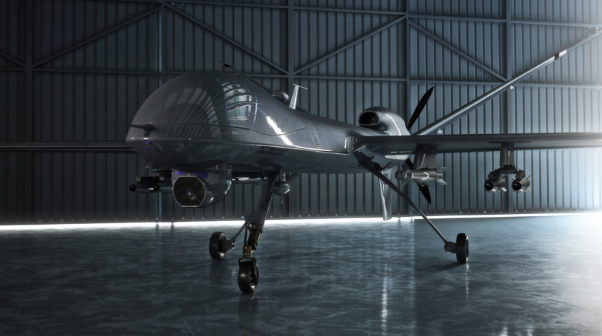
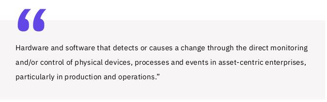

# OT Cybersecurity Overview

---

## Trends and directions

* Trends
  * As data collection and analysis become more important
  * IT and OT converge to enable “big data” initiatives
* Directions
  * it has become necessary to reassess cybersecurity best practices 
  * for protecting OT

Notes:

* The plan described in the following slides follows the direction suggested
in the "Comprehensive Guide to Operational Technology Cybersecurity" eBook
by MissionSecure company

---

## OT security

* What is Operational Technology (OT) Cybersecurity?
* Operational technology (OT) cybersecurity references 
  * software, hardware, practices, personnel, and services
  * deployed to protect operational technology infrastructure, people, and data.
* IT and OT converge to enable “big data”

Notes:

  * As data collection and analysis become
    more important, and as IT and OT converge to enable “big data” initiatives, it has become necessary to reassess
    cybersecurity best practices for protecting OT.

---

## OT History

* Third Industrial Revolution
  * We are in it, going to Fourth
* Programmable logic controller (PLC)
* Control Systems

Notes:

* The need for industrial controls arose with the first Industrial Revolution of the 1700s. Converting steam into usable
  energy was difficult and dangerous; it took decades to perfect a governor that could control the speed of steam engine
  output to truly tame this new power source. Each subsequent industrial revolution (we are currently into the fourth) has
  driven, or was driven by, further developments in controls on physical systems.
* The Last Modern Era: Third Industrial Revolution
* A major advance in industrial controls was the ability to automate multiple steps in a manufacturing process. To
  enable this type of operation, engineers developed electrically operated on/off switches, called relays, which could be
  combined to perform logical operations. This type of control logic appeared on manufacturing lines as early as 1900.
  Relays work great, but to modify the logic you had to rip out the hardware stack and re-wire it with a new relay
  configuration. Even if you only had to do this once a year, say when moving to a new product model on a production line,
  it was costly and time-consuming.
* Programmable Logic Controllers
  The programmable logic controller (PLC), first
  designed in 1971, was created as a replacement
  for traditional relay stacks. PLCs applied electronics
  to production automation for the first time, thereby
  launching the third Industrial Revolution. The
  invention of the PLC made creating and modifying
  control logic much easier, and it quickly became
  the foundation for simple but powerful control loop
  systems, which consist of a sensor, controller (e.g.,
  PLC), and actuator.
* Control Systems
  From these simple process loops, very complex
  behavior can be modeled and controlled with nested
  and/or cascading architectures. Logic can be built to
  control continuous manufacturing processes, such
  as those found in a refinery or chemical plant, and
  batch manufacturing processes, such as is found on
  an assembly line. Control systems also found their way
  into distributed applications such as electrical power
  grids, railways, and pipelines.
* 
---

## SCADA

* Supervisory Control and Data Acquisition (SCADA) Systems
* Human-Machine Interface (HMI)
* Distributed Control Systems (DCS)

Notes:

* Often in distribution system applications,
data acquisition is as important as control.
Historically, Supervisory Control and Data
Acquisition (SCADA) systems have been used
to integrate data acquisition systems (sensors)
with data transmission systems and data
presentation solutions that support Human-
Machine Interface (HMI) software, creating
centralized visibility into an entire system, such
as an electric grid.
* Distributed Control Systems (DCS)
  Distributed Control Systems (DCS) provide a
  similar set of functionalities as SCADA but on
  the scale of a factory, and typically with less
  complexity, or at least diversity, in networking
  and communications channels.

---

## ICS and OT

Notes:

* All of the technologies we have discussed have historically been rolled up under the heading of industrial control
systems (ICS). However, the use of the term operational technology (OT), in contradistinction to IT, has become
popular in recent years. The analyst firm Gartner defines OT as...
* This definition makes it clear that the distinction between OT and ICS is not so much in the core functionality of OT
  but more in the recognition of an evolving definition of “asset-centric” enterprises, with OT now finding application far
  beyond the traditional “industrial” industries where ICS has found a home for the last 50 years.

---

## IoT and IIoT

* Like OT, IoT utilizes devices such as actuators and sensors
* IoT architectures are fairly streamlined compared with OT
* When applied to industrial applications
  * __Industrial Internet of Things (IIoT)__
  

---

## Examples of IoT devices

* Electricity/Gas/Water Smart Meters
* Smart Home
* Building Automation
* Vehicle Head Unit
* Security & Fire Alarms
* Inventory Management
* CCTV
* Healthcare Monitoring
* Assisted Living Monitoring

Notes:

* IoT leverages several new technologies that have
significantly reduced the difficulty and cost of deploying
monitoring and control systems, particularly in highly
geographically distributed environments. These
technologies include real-time analytics, commodity
sensors, sophisticated embedded systems, cloud storage
and computing, and 5G networks. The sophistication of
analytics, the ubiquity of bandwidth—wired and wireless—
and the low price of data storage and compact multi-
purpose sensors have all converged to make it much
cheaper and easier to collect, analyze and act, on massive
amounts of data about the world around us.

---

