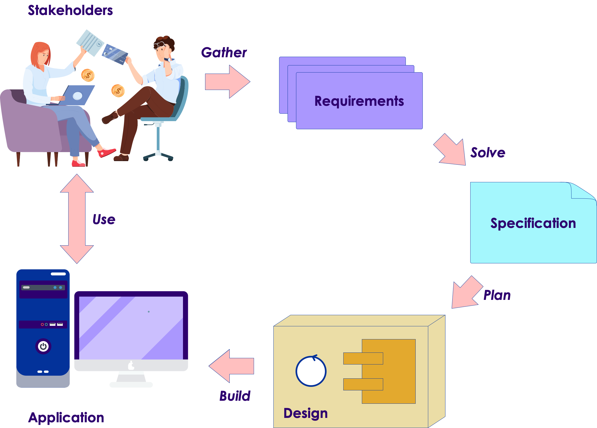
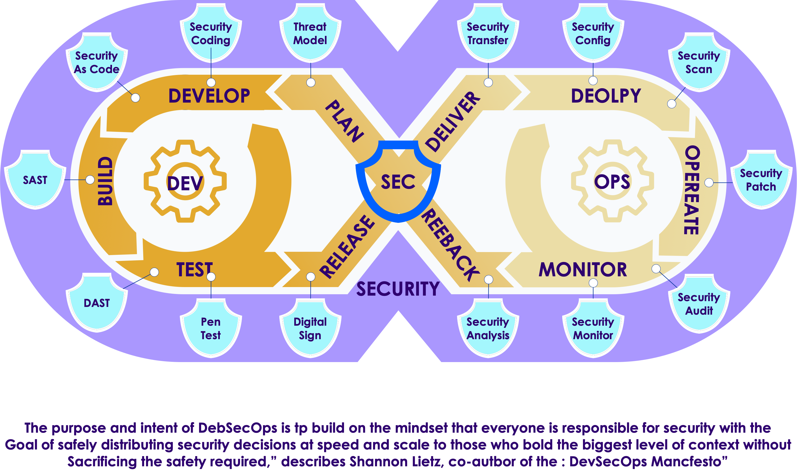

# System Lifecycles and SDLCs

---

## The Engineering Process

 <!-- {"left" : 5.68, "top" : 1.63, "height" : 4.81, "width" : 4.38} -->

 * Used whenever a product or service is engineered

     - This includes software and IoT

 * Supported by

     - Classic software SDLCs

        * Including Agile and waterfall methodologies

     - SLC: System Lifecycle management

     - DevOps and DevSecOps

Notes: 

Image credit: https://superuser.com/questions/874393/what-protocol-is-used-to-transfer-a-message-in-a-http-application
Licensed for free use and sharing with attribution and without modification

---

## Requirements

 <!-- {"left" : 5.78, "top" : 1.54, "height" : 4.54, "width" : 4.27} -->

 * Identify the problem to be solved

     - What is needed by stakeholders

     - What factors constrain solutions

 * Acceptance criteria

     - How will we know the problem is solved?

 * Requirements types

     - Functional, non-functional (performance) and business

     - Security requirements are now considered separate from general non-functional requirements

Notes: 

Image credit: https://superuser.com/questions/874393/what-protocol-is-used-to-transfer-a-message-in-a-http-application
Licensed for free use and sharing with attribution and without modification

---

## Analysis

 <!-- {"left" : 5.78, "top" : 1.54, "height" : 4.54, "width" : 4.27} -->

 * Evaluate possible solutions

     - What would a solution look like?

     - How would it perform?

     - How would it be organized?

     - How would it be tested?

 * Evaluate possible architectural choices

     - High level design

 * Initial threat analysis

     - What sort of security and operational threats does the solution raise?

Notes: 

Image credit: https://superuser.com/questions/874393/what-protocol-is-used-to-transfer-a-message-in-a-http-application
Licensed for free use and sharing with attribution and without modification

---

## Design

  <!-- {"left" : 5.78, "top" : 1.54, "height" : 4.54, "width" : 4.27} -->

 * Only one solution can be built

     - What is possible with the available resources?

 * Define the concrete architecture

     - Design the components

     - Design how they interact

     - Choose technologies for construction of the components

 * Define the plan for construction phase

 * Identify the security vulnerabilities introduced by the choice of components

Notes: 

Image credit: https://superuser.com/questions/874393/what-protocol-is-used-to-transfer-a-message-in-a-http-application
Licensed for free use and sharing with attribution and without modification

---

## Construction

  <!-- {"left" : 5.78, "top" : 1.54, "height" : 4.54, "width" : 4.27} -->
 * Apply a development process

     - Roles and responsibilities

     - Testing, coding, etc.

 * Define the methodology

     - Agile/Scrum, etc.

     - Code, build, test 

 * Identify new security issues as they arise during construction

Notes: 

Image credit: https://superuser.com/questions/874393/what-protocol-is-used-to-transfer-a-message-in-a-http-application
Licensed for free use and sharing with attribution and without modification

---

## Deployment

 <!-- {"left" : 5.78, "top" : 1.54, "height" : 4.54, "width" : 4.27} -->

 * Get the application into production

     - Roll out logistics

     - Continuous Deployment?

 * Beta test and acceptance test

 * Transition existing operations to the deployed app

 * Various deployment strategies can be used

     - Green/Blue

     - Canary, etc.

 * Goal is to ensure a successful transition to the application

Notes: 

Image credit: https://superuser.com/questions/874393/what-protocol-is-used-to-transfer-a-message-in-a-http-application
Licensed for free use and sharing with attribution and without modification

---

## Production

  <!-- {"left" : 5.78, "top" : 1.54, "height" : 4.54, "width" : 4.27} -->

 * Monitor performance

     - Manage changing requirements

     - Collect data for future development

     - Evaluate service level agreements

 * Look for “gotchas” in the real world

 * Identify new or emerging security threats

     - Exploits may be developed after deployment

     - Want to avoid 0-day exploits by getting patches and mitigations rolled out ASAP

Notes: 

Image credit: https://superuser.com/questions/874393/what-protocol-is-used-to-transfer-a-message-in-a-http-application
Licensed for free use and sharing with attribution and without modification

---

## Retirement

 <!-- {"left" : 5.78, "top" : 1.54, "height" : 4.54, "width" : 4.27} -->

 * How do we take the application out of production?

     - What are the implications for other systems that interact with our application?

 * How do we transition users to the application’s replacement?

 * Ensure that once the application is removed, there are no security holes left behind

Notes: 

Image credit: https://superuser.com/questions/874393/what-protocol-is-used-to-transfer-a-message-in-a-http-application
Licensed for free use and sharing with attribution and without modification

---

# System Lifecycles and SDLCs

---

## System Lifecycle Management

 * Also referred to as Application Lifecycle Management (ALM)

 * Most development processes only deal with activities up to the delivery of the finished product

 * SLC takes the larger view of treating any software-based product, or cyber-physical product, like any other product

     - The whole of the engineering process is managed

---

## System Lifecycle Management

 * Does not replace a software development lifecycle (SDLC)

     - The application lifecycle is defined to be:

        * “the entire time an organization spends money of the product from the initial idea to the end of the application’s life when it is no longer in use.” 

 * Also requires the evaluation of the product from three points of view:

     - The business perspective

     - The development perspective

     - The operations perspective	

Notes: 

---

## System Lifecycle Management

 <!-- {"left" : 1.84, "top" : 1.38, "height" : 2.62, "width" : 6.57} -->

 * Three main milestones

 * Idea or Inception:

     - Before the start of the development process 
     - Usually involves evaluating the business case, portfolio management issues and feasibility considerations
     - Provides a Go/NoGo decision before development starts

Notes: 

---

## System Lifecycle Management

 <!-- {"left" : 1.84, "top" : 1.38, "height" : 2.62, "width" : 6.57} -->

 * Deployment: 
     - Occurs when the finished product is moved into production and made available to users

 * Retirement: 
     - Ensures that at the end of life for the product, it can be taken out of production safely and without business or technical risk

Notes: 

---

## Governance

 <!-- {"left" : 1.63, "top" : 1.11, "height" : 3.08, "width" : 6.99} -->

 * Begins with business case and feasibility studies

 * Portfolio management
     - Ensuring no overlap with other applications or any gaps that could create risk
     - Evaluation of risk, legal, social and other concerns
     - Makes mangement related decisions (like when to deploy)

Notes: 

---

## Development

 <!-- {"left" : 1.63, "top" : 1.11, "height" : 3.08, "width" : 6.99} -->

 * Only concerned about the choice of methodology

 * Integration with:
     - Records management, PM policies, security, etc.
     - Ensures that the development process is executed correctly
     - Requirements, Development, Test (RDT) is executed

Notes: 

---

## Development - Waterfall

<!-- {"left" : 0.23, "top" : 2.77, "height" : 4.11, "width" : 9.78} -->

Notes: 

---

## Development - Agile

 <!-- {"left" : 0.33, "top" : 2.49, "height" : 4.08, "width" : 9.6} -->

Notes: 

---

## Development – Continuous Deliver

 <!-- {"left" : 0.48, "top" : 2.66, "height" : 3.75, "width" : 9.29} -->

Notes: 

---

## Operations

 <!-- {"left" : 1.1, "top" : 1.33, "height" : 3.22, "width" : 8.06} -->

 * During deployment, governance makes decisions and development makes changes

     - Ops provides context for making dev and govern work together

     - Ops monitors usage, performance, service level targets, change requests and bug reports

     - Also monitors changes in the application’s technical environment that could impact the application

Notes: 

---

# System Lifecycles and SDLCs

---

## SDLC

 * Software Development Lifecycle

     - Defines the organization of work during the construction phase
     - Follows the Engineering process from requirements to deployment

 <!-- {"left" : 1.91, "top" : 3.58, "height" : 4.59, "width" : 6.42} -->

Notes: 

---

## SDLC Types

 <!-- {"left" : 1.93, "top" : 1.29, "height" : 1.28, "width" : 6.39} -->

 * Depends on how many of the requirements are knows at the start of the project

 * Two basic endpoints on a continuum:
     - Predictive: We know all the requirements so we can predict exactly what the delivered product should be
     - Adaptive: We only have partial requirements, so we deploy prototypes iteratively in order to explore unknown requirements
     - Most projects will lie somewhere on the scale of adaptability

 * Predictive methods go through the engineering process once
 * Adaptive method go through the engineering process multiple times
     - Each iteration adds an increment of development

Notes: 

---

## Predictive Processes

 * All the requirements are known at the project start 	

     - Characteristic of projects that have high amounts of risk

     - Usually implemented as a waterfall SDLC

 * The final result or target can be accurately specified

     - Very important for mission critical systems like software that runs a nuclear reactor cooling system or a heart pacemaker

 * Often not suited for software that users interact with

 * Predictive SLDCs start to become very inefficient and ineffective when requirements change quickly or are not completely known

     - Especially true of new or innovative software	

Notes: 

---

## Adaptive Processes

 * Many of the requirements are not known at the project start

 * Very often we are focused on solving a problem but the nature of the solution is unknown

     - We must take a trial and error approach

 * We may be deploying new technology where requirements are not yet known

 * Stakeholders have no idea what their requirements would be and often need to have a prototype to play with to start to identify their requirements

 * Most commonly needed when requirements are fluid (like with user	interfaces or automating interactions

Notes: 

---

## Iterative Processes

 * Most of the requirements are known at the project start 

 * Some new or some changes to requirements are anticipated

 * Process works in iterations which are mini-projects

 * At the end of each iteration, there is a re-evaluation of the requirements, specification and design

 * Tends to be used a lot in developing cyber-physical systems

 * Often used instead of a predictive process when risk is important but not all the requirements are available

Notes: 

---

## Non-Agile Adaptive SDLCs

 <!-- {"left" : 0.8, "top" : 2.04, "height" : 5.57, "width" : 8.64} -->

Notes: 

---

## The Specification

 * The specification is produced during the analysis activities

 * The specification describes how what is being build 

     - Will function and perform
     - Will interact with users and other systems
     - Will interact with the organizational environment

 * The specification can take many forms

     - A common part of Agile specs is a complete set of acceptance tests

---

## The Specification

 * Role of the spec

     - Developers must define exactly how their code will work
     - Enables testers to develop the quality control criteria for testing

 * A critical part of the specification is how the system will meet the security and safety requirements

 *  *“If there is not enough information to write a test to a spec item, you don’t have enough information to write code to implement it.”* 

Notes: 

---

## Test, Test and Test Again

 <!-- {"left" : 7.54, "top" : 1.18, "height" : 3.13, "width" : 2.45} -->

 *  *Boris*  *Beizer* 

 *  **More than the act of testing, the act of designing tests is one of the best bug preventers known.The thinking that must be done to create a useful test can discover and eliminate bugs at every stage in the creation of software, from conception to specification, to design, coding and the rest.** 

 *  **If you can't test it, don't build it.** 

 *  **If you don't test it, rip it out.** 

Notes: 

---

## IEEE Best Practices for Specs

 <!-- {"left" : 1.22, "top" : 1.93, "height" : 5.79, "width" : 7.81} -->

Notes: 

Taken from the IEEE standard “Best Practices for Software Requirements Specifications”

---

# System Lifecycles and SDLCs

---

## The Rise of DevOps

 * DevOps is not a development methodology
 * It is a response to the virtualization like cloud providers
     - Infrastructure is now developed virtually
     - E.g., Terraform, Ansible, etc.

 * Infrastructure as code (IaC)
 * DevOps is the merging of the roles of Dev and Ops
     - Developers write code, Ops now write code
     - DevOps integrates the two roles through common tools
     - Enables *continuous integration* and  *continuous deployment* (CICD)

 <!-- {"left" : 3.28, "top" : 6.17, "height" : 2.1, "width" : 3.69} -->

Notes: 

---

## Why IaC?

 * Speed and simplicity

     - Entire deployments can be set up or torn down by running a script
     - Configuration consistency
     - Identical copies of configurations can be created for testing or development

 * Minimization of risk

     - Reduces human procedural errors
     - Allows for testing, reviews and other quality measures

 * Increased efficiency in development

     - Infrastructure code is not a bottleneck
     - Allows for more efficient development and operations management

 * Supported by main IoT development and operations platforms

     - Cloud IoT development environments
     - IioT development tools (e.g. IBM Engineering Lifecycle)

Notes: 

---

## Why IaC?

 * Self-service

     - Infrastructure deployment with scripts does not rely on an administrator
     - Speed and safety
     - Infrastructure is deployment and updated faster and with fewer errors

 * Documentation

     - The IaC source files  *are*  infrastructure documentation

---

## Why IaC?

 * Version control

     - Previous deployments can be maintained in source control for regression or audit need, or to satisfy regulatory requirements

 * Validation
     - For every single change, code reviews and dynamic testing can be performed

 * Reuse
     - New infrastructure deployments can be derived quickly from previous deployments

Notes: 

---

## DevSecOps

 * Automatically bakes in security at every phase of the software development lifecycle

 <!-- {"left" : 1.14, "top" : 2.49, "height" : 5.22, "width" : 7.98} -->

Notes: 

Image is from DoD Document – public domain

---

## DevSecOps Advantages

 * Rapid, cost-effective software delivery

     - Security problems can lead to huge time delays
     - Fixing security issues can be time-consuming and expensive The rapid
     - DevSecOps saves time and reduces costs by minimizing the need to repeat a process to address security issues after the fact
     - Integrated security cuts out duplicative reviews and unnecessary rebuilds, resulting in more secure code

---

## DevSecOps Advantages

 * Improved, proactive security

     - Throughout development, code is reviewed, audited, scanned, and tested for security issues
     - Security problems are fixed before additional dependencies are introduced

 * Compatible with modern development
     - Cybersecurity testing can be integrated into an automated test suite for operations teams

Notes: 

From the IBM website on devsecops

---

## DevSecOps Advantages

 * Repeatable and adaptive process

     - Ensures security is applied consistently across the operational and development environment

     - As the environment changes, security development adapts to new security requirements

Notes: 

---

## DevSecOps Best Practices

 * Shift left

     - Moves security from the end of a process left to the start of the development process

     - Security is an integral part of the development process from the start

 * Security education

     - Combination of engineering and compliance

     - Requires development engineers, operations teams, and compliance teams work together

     - Ensures everyone understands the required security posture and follows the same standards

---

## DevSecOps Best Practices

 * Traceability, auditability, and visibility

     -  *Traceability:* tracking configuration items across the development cycle from requirements to implemented code 

     -  *Auditability:* ensuring compliance with security protocols

     -  *Visibility:*  solid monitoring system in place during whole product lifecycle

Notes: 

