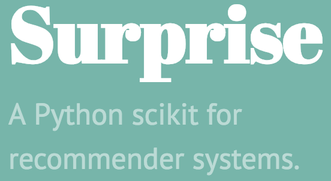

# Python Recommendations
---

## Lesson Objectives

  * Understand Recommendations in Python
  * Approaches
  * Scikit-Learn
  * Surprise

---

# Scikit-learn
---

## Scikit-Learn

 * Can we just use scikit-learn?
 * Of course we can!
 * Scikit-learn allows:
   - Matrix Factorization (SVD, ALS)
   - K-Nearest Neighbors

Notes:

---

## Creating User-Item Matrix

 * scipy.csr_matrix is sparse!
 * Perfect for these 99.9% sparse matrix

```python
import pandas as pd
from scipy.sparse import csr_matrix

mtx = csr_matrix(df.values.fillna(0.)
```
<!-- {"left" : 0, "top" : 2.02, "height" : 1.97, "width" : 10.25} -->


Notes:

---

## Nearest Neighbors in Scikit-Learn

 * use scikit-learn KNN class

```python
from sklearn.neighbors import
NearestNeighbors

knn = NearestNeighbors(metric="cosine",
algorithm="brute")
knn.fit(mtx)
```
<!-- {"left" : 0, "top" : 1.38, "height" : 2.69, "width" : 10.25} -->

Notes:

---

# Surprise
---

## What is Surprise?


<!-- {"left" : 0, "top" : 2.06, "height" : 3.38, "width" : 6.17} -->

Notes:

---

# Evaluating Recommendations
---

## How to Evaluate?
  * Recommendations can be a bit like Regression
    - Try to predict a rating (numeric)
    - How close can we get?
    - Metrics: MSE (Mean-Squared Error)
  * Recommendations can be like Classification
    - Does a user "like" the time? True/False
    - Can we correctly classify this?
    - Metrics: Cross-Entropy

Notes:

---

## Training and Test
  * Withhold some ratings for training/test


Notes:

---

## ROC Curve


<!-- {"left" : 0.09, "top" : 0.94, "height" : 6.37, "width" : 10.06} -->


Notes:
