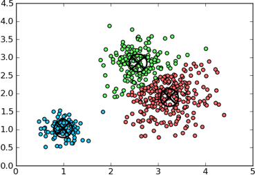
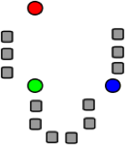
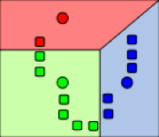
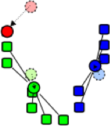
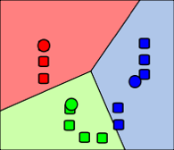

# PYTHON:Sklearn Clustering
---
## Clustering Vectors

* There are many different clustering algorithms for vectors.

* Simplest is k-means

* K-means requires a known value of k (number of clusters) to start with.


<!-- {"left" : 2.43, "top" : 3.02, "height" : 3.6, "width" : 5.4} -->

Notes:

---

## K-Means Clustering

  * K-Means: Simplest Clustering Algorithm.

  * Step 1: k numbers of points (centroids) are pre-seeded in the data.  Example: 3 centroids (red, green, blue)

<!-- {"left" : 7.39, "top" : 1.89, "height" : 2.16, "width" : 2.24} -->


  * Step 2: Each point in the dataset is associated with its nearest centroid, as determined by a distance measurement.


<!-- {"left" : 7.29, "top" : 5.14, "height" : 2.16, "width" : 2.5} -->


Notes:

---

## K-Means Clustering


  * Step 3: The centroid (geometric center) of the clustered points becomes the new centroid of that cluster. Each centroid is updated.


<!-- {"left" : 7.32, "top" : 1.89, "height" : 2, "width" : 2.32} -->

  * Step 4: Repeat steps 2 and 3 until convergence is reached (the points move less than the threshold amount).

<!-- {"left" : 7.67, "top" : 5.05, "height" : 1.89, "width" : 2.19} -->


Notes:

  * Ways to Determine Distance between points
    - Euclidian distance – (most obvious) Euclidian, which takes the distance in Euclidian space
    - Cosine Distance – cosine of angle between vectors – ignores magnitude
    - Manhattan distance: Effectively counts the number of square blocks one would “walk” to get there without cutting corners.
    - Tanimoto distance  Take both angle and magnitude into account.

  * Most algorithms attempt to balance the
    - Magnitude
    - Angle


---

## K-Means Clustering Summary

  * K-Means is simple

    - Well-understood.
    - Easy to parallelize

  * Disadvantages:

    - Value of k must be known in advance, which may mean running the exercise many times to get optimum results.
    - Initial centroid positions are important; may cause long convergence.
    - Dense groupings of points are not especially considered
      - Outliers may bias results.
    - Clusters not broadly (hyper)spherical don’t work well for k-means.
      - Use hierarchical clustering for these situations.


Notes:

---

## K-Means in Scikit-learn

  * Scikit-learn has good support for k-means
  * How to perform k-means clustering in Scikit-learn

    - Put data in ndarray
    - Perform clustering with a specified number of iterations
    - Evaluate the “fit” of the cluster. Is it a good run?
    - If not, change the number of clusters (value of k)
    - Once we have a good clustering run:
       - Map each vector to its nearest cluster
       - Group original data by its corresponding cluster
       - Assign (predict) new vectors to their nearest cluster

Notes:

---

## K-Means in Scikit-learn


  * k-means clustering

```python
from sklearn.cluster import kmeans
```
<!-- {"left" : 0, "top" : 1.48, "height" : 0.68, "width" : 8.12} -->

  * Default values: just provide KMeans(df, value-of-k)

```python
kmeans = KMeans(n_clusters=2, random_state=0).fit(X)
```
<!-- {"left" : 0, "top" : 2.89, "height" : 0.59, "width" : 10.25} -->

  * How many iterations should you have?

    - “It depends”… too low and you might get bad results
    - Too many and you waste time
    - Try 10-20

Notes:

---

## Evaluating Cluster Performance

  * WSSSE: Within Set Sum of Squared Errors

  * WSSSSE = `kmeans._inertia`

    - COST = sum of squared distances of points to cluster center.

  * What does this mean?

    - WSSSE will decrease with increasing values of k.
    - “Law of Diminishing Returns”
      - High values of k give marginal gain.

  * We can iterate across k until we get good results.

Notes:

---

## The Elbow Method

* Identify the “elbow” on the curve

* Example: What value of K to select in this case?

<!-- {"left" : 1.01, "top" : 2.26, "height" : 4.69, "width" : 8.03} -->


Notes:

Elbow method is basically plotting “variance” % of a data against number of clusters and find the point after which  adding more clusters will not make a huge difference. That is called Elbow method.

---
## Using KMeans Model

  * How to apply the model to data?

  * Use predict:

    - kmeans.predict(Vector)

```python
int clusterId = model.predict(vector)
```

  * Predict returns an integer

    - Cluster number, i.e., `0, 1, 2, 3… (k-1)`.


Notes:

  * KMeansModel is a clustering model for K-means. Each point belongs to the cluster with the closest center.
    - Method Predict maps given points to their cluster indices. Returns the cluster index that a given point belongs to.

---
## Handling New Data

* New Data be assigned on the existing model:

- Make a Vector out of the new Data
- Call `KMeansModel.predict(vector)`, to get cluster membership as a number (integer)

* The new data will not affect the existing cluster locations.


Notes:

---

## Lab : KMeans Clustering on Flights

  * Overview:
    - Try clustering flights dataset
    - Use NYCFlights

  * Builds on previous labs:
    - None

  * Approximate time:
    - 20-30 min.

  * Follow:
    - **sklearn/kmeans/README.md**

Notes:
