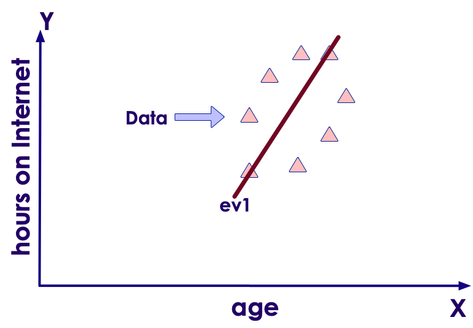
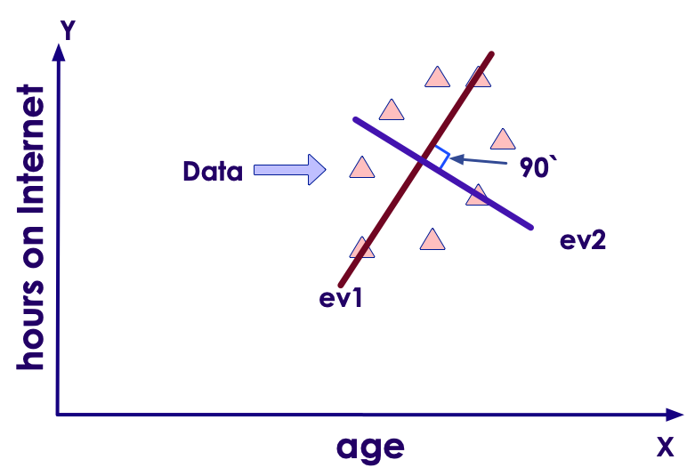
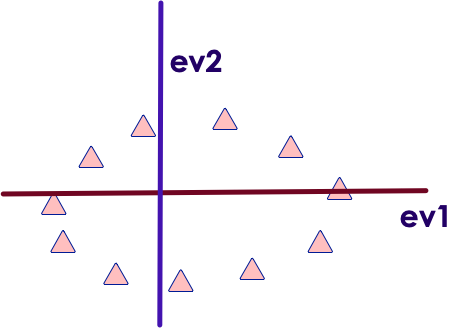
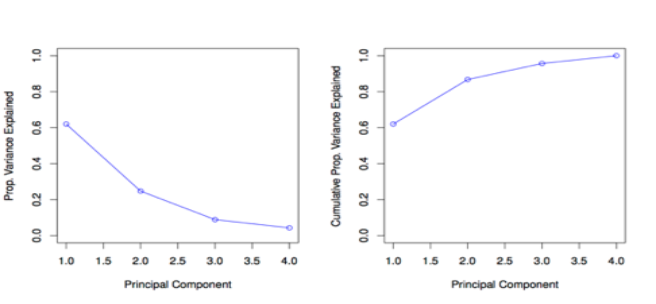

# Python: PYTHON-Sklearn-PCA
---

# Data Whitening (PCA)

---

## Data Whitening

  * Data that is heavily correlated may need to be whitened.

  * This means de-correlated.

  * One way to do this is with PCA: Principal Component Analysis.

  * PCA can also be used to reduce dimensionality

Notes:

---

## Principal Component Analysis (PCA)

* Not all dimensions are equally interesting.
Can we reduce the **'dimensionality'** of data, **without loosing** **too much information**?

* PCA does just that.

* It finds low-dimensional representation of data that contains as much as possible of **variation**.

* PCA seeks a small number of dimensions that are as **interesting** as possible.

* **Interesting** is measured by the amount that the observations vary along each dimension.

Notes:

---

## Using PCA for Visualization

  * If we reduce dimensions to 2 or 3, we can visualize highly dimensional data

  * Great alternative to Scatter Plot Matrices

Notes:

---

## PCA Theory: Eigen Vectors / Values

  * Say we are measuring the following responses

    - Age, hours on the internet

    - 2 variables --> 2 dimensional dataset --> 2 Eigen Vectors

  * If we measure

    - Age, hours on the internet, hours on the mobile phone
    - 3 variables, 3 dimensional dataset --> 3 Eigen vectors

  * So number of Eigen vectors = number of dimensions

  * EigenVector is a direction – vertical, horizontal, 45' degrees ..etc

---

## PCA Theory: Eigen Vectors / Values

 * EigenValue is a number – denoting how much 'variance' in the data in that vector's direction.

  * Eigen Vector and Eigen Value go together
(E Vector, E Value)

  * EigenVector with highest EigenValue (meaning lot of variance in that direction)  becomes a Principal Component

Notes:

---

## PCA Math: Eigen Vectors

  * In the plot below, EigenVector (ev1) is shown that crosses the data with 'highest variance'

<!-- {"left" : 1.63, "top" : 2.5, "height" : 4.02, "width" : 6.59} -->

Notes:

Image adopted with thanks to: https://georgemdallas.wordpress.com/2013/10/30/principal-component-analysis-4-dummies-eigenvectors-eigenvalues-and-dimension-reduction/

---

## PCA Math: Eigen Vectors

  * But we have a 2-dimensional data
--> 2 eigen vectors

  * To maximize coverage the second EigenVector will be orthogonal (90 degrees) to the first one (ev1)

<!-- {"left" : 2.04, "top" : 3.14, "height" : 3.76, "width" : 6.17} -->

Notes:

Image adopted with thanks to: https://georgemdallas.wordpress.com/2013/10/30/principal-component-analysis-4-dummies-eigenvectors-eigenvalues-and-dimension-reduction/

---

## PCA Math: Eigen Vectors

  * The EigenVectors have given us more useful axis to frame data

  * Remember, the data hasn't changed at all, we are just looking at it from a different perspective

<!-- {"left" : 2.63, "top" : 2.83, "height" : 4.08, "width" : 5.27} -->

Notes:

Image adopted with thanks to: https://georgemdallas.wordpress.com/2013/10/30/principal-component-analysis-4-dummies-eigenvectors-eigenvalues-and-dimension-reduction/

---

## PCA on Oxford Internet Study

  * Say there were
    - 2500 people interviewed == 2500 observations
    - 15 questions = 15 dimensions = 15 EigenVectors & Values

  * Say our 15 Eigen Values are (in descending order)
[ **25, 22, 20, 17**, 10, 7, 6, 5, 4, 3, 1, 0.5, 0.4,  0.3, 0.1 ]

  * We see the first 4 have the biggest values
    - Indicating 4 directions with lots of information

  * We have identified our 4 Principal Components (PC)

  * We have gone from 15 attributes to 4  (call them PC1, PC2, PC3, PC4)

Notes:

---

## Principal Components

  * First Principal Component (PC1)  has the largest variance (EigenValue)

  * Second Principal Component has second largest variance that is uncorrelated to PC1

    - Orthogonal vector to PC1

Notes:

---

## Evaluating PCA – Scree Plot

  * We use a scree plot to understand PCA

  * Left chart plots Variance for each PC component.

    - First component (PC1) has the most (62%)
    - Second one PC2 around 25%
    - PC4 hast the least

  * Right graph shows 'accumulated' variance when combining PCs.  We are moving towards ONE

<!-- {"left" : 2.59, "top" : 4.28, "height" : 2.77, "width" : 5.07} -->

Notes:
