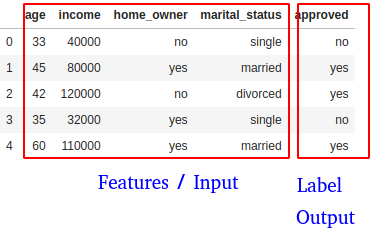
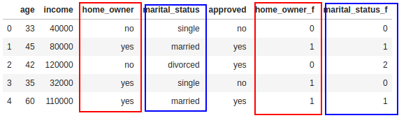
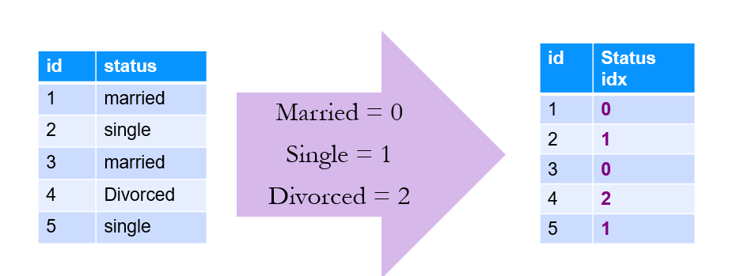
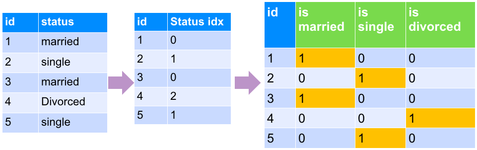
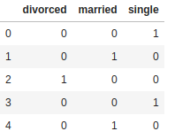
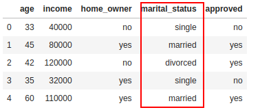
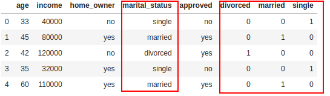

# Python Sklearn: Preprocessing

---

## Lesson Objectives

 * Understand the need for preprocessing
 * Know what is a transformer


Notes:

---

# Feature Engineering

---

## What is Feature Engineering?
 * Columns are not Features!
 * Features are the input to your model.
 * Columns are the source of your features.
 * Feature engineering is transforming raw data into features.


Notes:

---

## Categorical Variables
 * Algorithms run on ndarrays and matrices of type **float64**
   - Bool, int64 will be upcasted to float64
 * Your data may have string or categorical variables
   - Here we have : _home_owner_  and _marital status_
   - usually pandas type 'object'
 * Label (_approved_): Usually doesn't matter
   - can use LabelEncoder class
 * We have to convert the input columns (features)  into numbers

| age | income  | home_owner | marital status | approved |
|-----|---------|------------|----------------|----------|
| 33  | 40,000  | no         | single         | no       |
| 45  | 80,000  | yes        | married        | yes      |
| 42  | 120,000 | no         | divorced       | yes      |
| 35  | 32,000  | yes        | single         | no       |
| 60  | 110,000 | yes        | married        | yes      |

Notes:

---

## Strategy 1: Factorization
 * Factorization
   - Call `pd.factorize()` on the dimension
   - Will assign an integer to each unique value
   - E.g. (red = 1, green = 2… etc)
 * See next slide for details

---
## Factorization

```python
import pandas as pd

data = pd.DataFrame ( { 'age' : [33,45,42,35,60],
                        'income' : [40000,80000,120000,32000,110000],
                        'home_owner' : ['no', 'yes', 'no', 'yes', 'yes' ],
                        'marital_status' : ['single', 'married', 'divorced', 'single', 'married'],
                        'approved' : ['no', 'yes', 'yes', 'no', 'yes']
                    })
data
## do factorization
data ['home_owner_f'] = pd.factorize(data['home_owner'])[0]
data ['marital_status_f'] = pd.factorize(data['marital_status'])[0]
data
```
<!-- {"left" : 0, "top" : 1.35, "height" : 2.44, "width" : 10.25} -->

<!-- {"left" : 0.39, "top" : 5.05, "height" : 2.09, "width" : 3.33} -->
<!-- {"left" : 3.93, "top" : 5.33, "height" : 1.11, "width" : 1.11} -->
<!-- {"left" : 5.19, "top" : 5.2, "height" : 1.36, "width" : 4.67} -->


---
## Problems with Factorization
- Number may not be meaningful in any way (arbitrary)
- Model may try to infer something about ordering.
- Model may not understand that these are discrete values
- Model may infer some correlation between values.
- For example here our model can infer  
  `Married(0)  < Single (1) < Divorced (2)`
- "Finding signal in the noise" - can lead to bad results

<!-- {"left" : 1.02, "top" : 4.98, "height" : 3.11, "width" : 8.21} -->


Notes:

---

## Strategy 2: One Hot Encoding
* Dummy variables can help us treat the different values separately
    - Without trying to infer some relationship between values.
 * 'dummy variables' assigns  true / false to each.
    - Note, only one bit is on
    - This is called **ONE-HOT-Encoding**

<!-- {"left" : 0.52, "top" : 5.02, "height" : 2.9, "width" : 9.21} -->

Notes:

---
## Dummy Variables

* We can use `pandas.get_dummies()`

```python
import pandas as pd

data = pd.DataFrame ( { 'age' : [33,45,42,35,60],
                        'income' : [40000,80000,120000,32000,110000],
                        'home_owner' : ['no', 'yes', 'no', 'yes', 'yes' ],
                        'marital_status' : ['single', 'married', 'divorced', 'single', 'married'],
                        'approved' : ['no', 'yes', 'yes', 'no', 'yes']
                    })

marital_dummies = pd.get_dummies(data['marital_status'])
marital_dummies
```
<!-- {"left" : 0, "top" : 2.07, "height" : 2.11, "width" : 10.25} -->

<!-- {"left" : 3.04, "top" : 4.85, "height" : 3.3, "width" : 4.16} -->


---

## Dummy Variables

```python
import pandas as pd

data = pd.DataFrame ( { 'age' : [33,45,42,35,60],
                        'income' : [40000,80000,120000,32000,110000],
                        'home_owner' : ['no', 'yes', 'no', 'yes', 'yes' ],
                        'marital_status' : ['single', 'married', 'divorced', 'single', 'married'],
                        'approved' : ['no', 'yes', 'yes', 'no', 'yes']
                    })

marital_dummies = pd.get_dummies(data['marital_status'])

data2 = pd.concat([data,marital_dummies],axis=1)
data2
```
<!-- {"left" : 0, "top" : 1.38, "height" : 2.29, "width" : 10.25} -->


<!-- {"left" : 0.43, "top" : 4.58, "height" : 1.43, "width" : 3.35} --> 
 <!-- {"left" : 3.87, "top" : 4.79, "height" : 1, "width" : 1} -->
 <!-- {"left" : 5.15, "top" : 4.58, "height" : 1.43, "width" : 4.66} -->

Notes:

---

## One-Hot Encoder in SKLearn

<!-- TODO TIm -->

```python
from sklearn.preprocessing import OneHotEncoder

fact = pd.factorize(dimensions)
OneHotEncoder().fit(fact).transform(fact)
```
<!-- {"left" : 0.0, "top" : 1.52, "height" : 1.62, "width" : 10.25} -->

Notes:

---

## Quantization
   * Turn the category into a real-world number
   * Example colors:
     - Blue: 668 THz
     - Green: 526 THz
     - Red: 400 THz
   * Usually join (pd.merge) to a ”lookup table”


Notes:

---

# Scaling and Normalization
---

## Scaling
 * Usually data needs to be cleaned up and transformed before creating features
 * In the data below, we see **age** and **income** are in two different scales
    - age : ranges from 33 - 60
    - income ranges from 32,000  to 120,000
 * Some algorithms will yield better results if these different ranges can be scaled to a uniform range

<!-- {"left" : 1.85, "top" : 5.13, "height" : 2.6, "width" : 6.11} -->


---
## Scaling

 * StandardScaler class will scale data down
 * Remove high magnitude data
 * Z-Scoring:
   - Subtract mean and divide standard deviation

<!-- {"left" : 3.13, "top" : 3.91, "height" : 2.48, "width" : 3.32} -->


Notes:

```math
$z = {\frac{x - \mu}{\sigma}}$
```
---
## Pandas Z-Scoring
 * Z-scoring can be done in vanilla Pandas, but can't use as part of sklearn pipeline

```python
import pandas as pd

data = pd.DataFrame ( { 'age' : [33,45,42,35,60],
                        'income' : [40000,80000,120000,32000,110000],
                        'home_owner' : ['no', 'yes', 'no', 'yes', 'yes' ],
                        'marital_status' : ['single', 'married', 'divorced', 'single', 'married'],
                        'approved' : ['no', 'yes', 'yes', 'no', 'yes']
                    })
data

data['age_z'] = (data['age'] - data['age'].mean()) / data['age'].std()
data['income_z'] = (data['income'] - data['income'].mean()) / data['income'].std()
data
```
<!-- {"left" : 0, "top" : 2.35, "height" : 2.44, "width" : 10.25} -->


<!-- {"left" : 0.21, "top" : 5.97, "height" : 1.68, "width" : 3.94} -->
<!-- {"left" : 4.74, "top" : 5.97, "height" : 2.1, "width" : 5.3} -->


Notes:

---

## StandardScaler class

 * StandardScaler class used for Z-scoring

```python
from sklearn.preprocessing import StandardScaler
scaler = StandardScaler()
scaled_data = scaler.fit_transform(data)
```
<!-- {"left" : 0.0, "top" : 1.83, "height" : 1.32, "width" : 10.25} -->

Notes:

---

## Normalization
 * Scale to Unit Norm

```python
from sklearn.preprocessing import Normalizer
normalizer = Normalizer()
norm_data = normalizer.fit_transform(data)
```
<!-- {"left" : 0.0, "top" : 1.78, "height" : 1.35, "width" : 10.25} -->


Notes:

---

# Decorrelation
---


## Variable Correlation
 * Data can be heavily Correlated
 * Pearson Correlation Coefficient
   - unit-norm covariance
   - -1.0 to +1.0


Notes:

---

## Is Correlation a Problem?
 * Maybe!
 * Imagine if you measure stats of basketball player:
   - Points Scored In Season
   - Points Per Game
   - Shots on Goal
   - Field Goals Scored
   - Minutes Played
 * Are any of these variables correlated?


Notes:

---

## The Problem
  * Bias!
  * Correlated Variables could be heavily weighed.


Notes:

---

## Whitening Data
  * Whitening is:
    - Decorrelating
    - Normalizing to Unit Norm
  * Data Whitening can lead to better results.


Notes:

---

## The Solution: PCA
  * Use PCA
  * More about Dimensionality Reduction Later


Notes:
