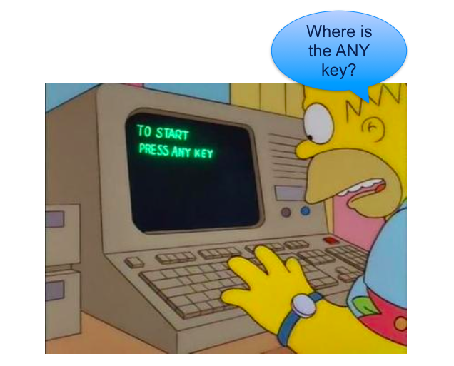

# Data Science on Google Cloud

<!-- TODO shiva -->

  

---

## About This Class

* Introduces tools and services available in Google Cloud Platform (GCP)

* Demonstrates how to perform data science tasks on Google Cloud Platform

Notes:

---
## Pre-requisites and Expectations

<!-- {"left" : 6.19, "top" : 1.61, "height" : 0.91, "width" : 3.79} -->

 * Interest in Data Science

 * Basic Python knowledge is assumed
    - if you are new to Python, we will provide some resources

 * Curiosity! Ask a lot of questions

 * This is a **Intro** class
    - No previous knowledge is assumed
    - Class will be based on the pace of majority of the students

Notes:

---

## Agenda - 4 Days

*  **Day 1**
    - Google Cloud Intro
    - Data storage in Google Cloud
    - Data analyis in Google Cloud
    - Visualizations

*  **Day 2**
     - Big Query
     - Cloud SQL
     - App Engine

---

## Agenda - 4 Days

*  **Day 3**
     - Hadoop and Spark
     - DataProc
     - Machine Learning in Spark
     - Tensorflow

* **Day 4**
     - Streaming with Beam
     - Bigtable
     - Deploying ML models

Notes:

---

## Our Teaching Philosophy

<!-- TODO shiva  -->
 <!-- {"left" : 2.05, "top" : 3.28, "height" : 4.97, "width" : 6.16} -->

 * Emphasis on concepts & fundamentals

 * Highly interactive (questions and discussions are welcome)

 * Hands-on (learn by doing)

---

## Introductions

 * About Instructor
 * About you
     - Your Name
     - Your background (developer, admin, manager, ...)
     - Technologies you are familiar with
     - Familiarity with Python (scale of 1 - 4 ;  1 - new,   4 - expert)
     - Familiarity with Google Cloud (scale of 1 - 4 ;  1 - new,   4 - expert)
     - Something non-technical about you!(favorite ice cream flavor / hobby...)

 &nbsp; <!-- {"left" : 1.55, "top" : 6.43, "height" : 1.76, "width" : 1.99} --> &nbsp; <!-- {"left" : 3.56, "top" : 6.45, "height" : 1.7, "width" : 3.13} --> &nbsp; <!-- {"left" : 6.71, "top" : 6.43, "height" : 1.76, "width" : 1.99} -->

Notes:

---

## Class Logistics

* Instructor's contact

* Slides
    - For each session, slides will be emailed out or delivered via virtual classroom

* Labs
    - Lab files will be distributed

* Lab environment
    - Provided in the cloud

---

## Let's Get Started!
