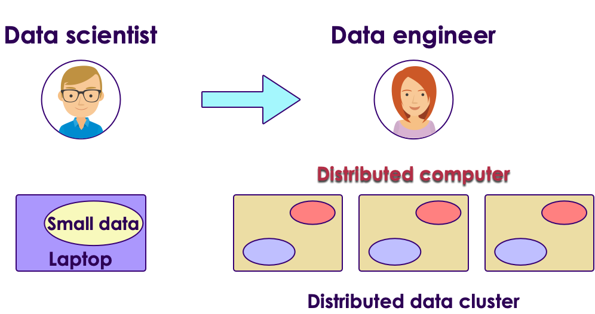
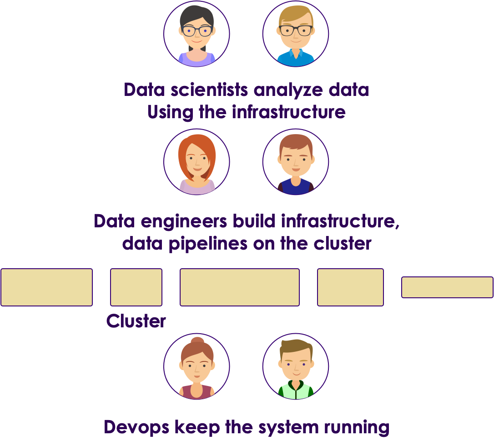

# Advantages of Cloud

 <!-- {"left" : 2.92, "top" : 7.35, "height" : 1.44, "width" : 2.19} -->

---

## Data Science Evolution

- When data is/was small, Data Science can be done on a laptop

<!-- {"left" : 0.39, "top" : 2.6, "height" : 3.08, "width" : 4.61} -->
 &nbsp;  &nbsp;
<!-- {"left" : 5.23, "top" : 2.6, "height" : 3.08, "width" : 4.62} -->

---

## As Data Sizes Grew...

- Laptops and workstations could not handle large data sizes

- We need clusters

- Cluster provide 2 things
    - Distributed data (can store huge amount of data; 100s TB or PB)
    - Distributed computing - Running processing on many machines in parallel

<!-- {"left" : 1.28, "top" : 4.2, "height" : 4.36, "width" : 7.69} -->

---
## Data Science on Large Scale

- Data Scientists develop models on their laptops using small sample data
    - Usually using R or Python language

- Then they would hand over the models to Data Engineers to re-implement the model for cluster
    - Could be using a different language like Java

 <!-- {"left" : 1.02, "top" : 4.08, "height" : 4.65, "width" : 8.21} -->

---

## Laptop --> Cluster is not trivial

- The above approach is not very agile

- It can take days / weeks to deploy models from laptop to cluster

- Error prone, when data engineers reimplement the model in a different language bugs can be introduced

- This is known as __deployment gap__

---

##  Multiple Teams are Involved --> Operational Complexity

 <!-- {"left" : 2.37, "top" : 1.46, "height" : 6.72, "width" : 5.52} -->

---

## Modern Data Science Wish List

- We want to do Data Science; not build infrastructure

- Experiment on small data; then scale seamlessly to large data

- Use large data to train more accurate and complex models

- Infrastructure like __hot water__
    - On demand
    - Pay for use

---

## Modern Data Science

<!-- {"left" : 6.12, "top" : 1.08, "height" : 2.62, "width" : 3.93} -->

- Luckily with modern cloud technology we can achieve all the above goals

- All cloud vendors are offering __AI as service__

- We focus on data and algorithms

- They will take care of infrastructure (like hot water)

 

 <!-- {"left" : 0.37, "top" : 6.62, "height" : 0.91, "width" : 2.43} --> &nbsp; &nbsp; <!-- {"left" : 3.53, "top" : 6.62, "height" : 0.91, "width" : 2.8} -->  &nbsp; &nbsp;
  <!-- {"left" : 7.07, "top" : 6.62, "height" : 0.91, "width" : 2.81} --> 
Notes:
