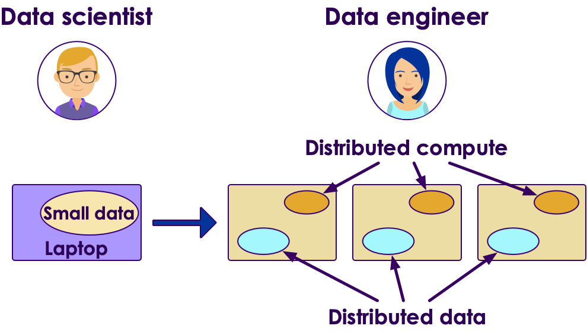
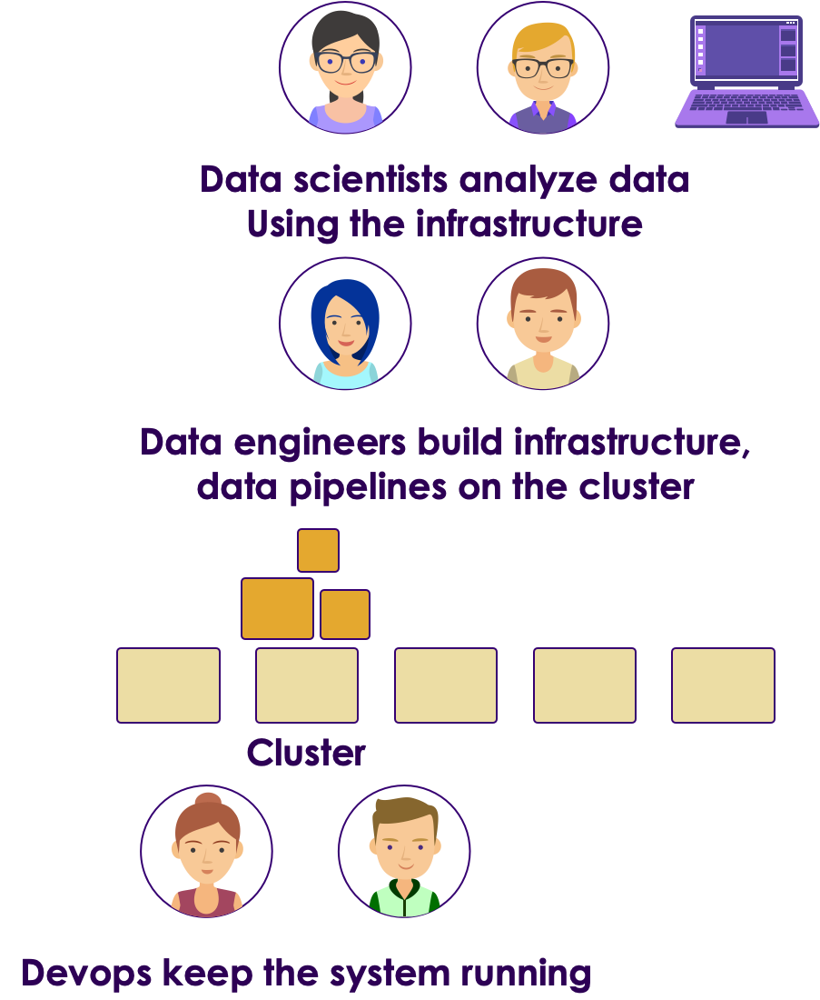

# Advantages of Cloud

<!-- TODO shiva -->
 &nbsp; &nbsp;

---

## Data Science Evolution

- When data is/was small, Data Science can be done on a laptop

<!-- TODO shiva -->
 &nbsp;  &nbsp;
 &nbsp;  &nbsp;

---

## As Data Sizes Grew...

- Laptops and workstations could not handle large data sizes

- We need clusters

- Cluster provide 2 things
    - Distributed data (can store huge amount of data; 100s TB or PB)
    - Distributed computing - Running processing on many machines in parallel

<!-- TODO shiva -->
 &nbsp;  &nbsp;

---
## Data Science on Large Scale

- Data Scientists develop models on their laptops using small sample data
    - Usually using R or Python language

- Then they would hand over the models to Data Engineers to re-implement the model for cluster
    - Could be using a different language like Java

<!-- TODO shiva -->
 

---

## Laptop --> Cluster is not trivial

- The above approach is not very agile

- It can take days / weeks to deploy models from laptop to cluster

- Error prone, when data engineers reimplement the model in a different language bugs can be introduced

- This is known as __deployment gap__

---

##  Multiple Teams are Involved --> Operational Complexity

<!-- TODO shiva -->
 

---

## Modern Data Science Wish List

- We want to do Data Science ; not build infrastructure

- Experiment on small data; then scale seamlessly to large data

- Use large data to train more accurate and complex models

- Infrastructure like __hot water__
    - On demand
    - Pay for use

---

## Modern Data Science

<!-- TODO shiva -->

- Luckily with modern cloud technology we can achieve all the above goals

- All cloud vendors are offering __AI as service__

- We focus on data and algorithms

- They will take care of infrastructure (like hot water)

 

<!-- TODO shiva -->
  &nbsp; &nbsp;
  &nbsp; &nbsp;
  &nbsp; &nbsp;

Notes:
