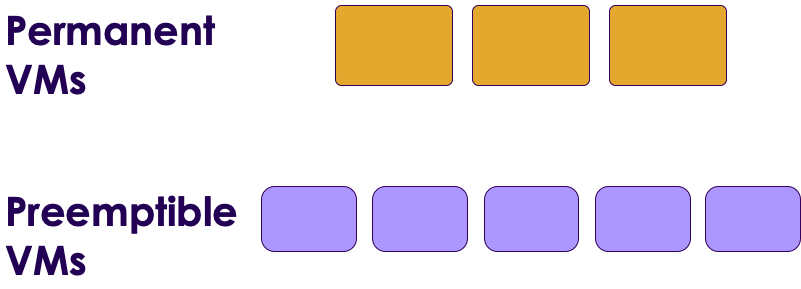
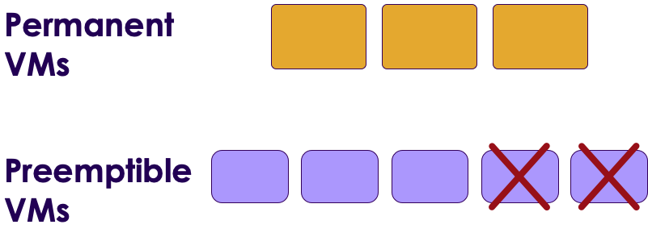

# Google Compute Engine

<!-- {"left" : 5.12, "top" : 6.4, "height" : 2.14, "width" : 2.14} -->

---

## Objectives
- Learn about Google Compute Engine

---

## Google Compute Engine

* On demand virtual machines

* Wide variety of machine types for various work loads

* Preemptible VMs : Low-cost, short-term instances for fault tolerant workloads

* GPU: For computationally intensive workloads like machine learning

* OS of choice : Linux, Windows

* Billing per second usage

* Fully supports containers using Docker and Kubenetes

Notes:

---
## Google Compute Engine 

<!-- TODO shiva -->


* Can rent virtual machines and manage them ourselves

* Or use serverless services, infrastructure is managed by Google

---

## Machine Types

|                   | E2 (beta) General purpose                                                                                                                         | N1, N2 General purpose                                                         | M1, M2 Memory-Optimized                                               | C2 Compute-Optimized                                            |
|-------------------|---------------------------------------------------------------------------------------------------------------------------------------------------|--------------------------------------------------------------------------------|-----------------------------------------------------------------------|-----------------------------------------------------------------|
| Description       | Day-to-day computing at a lower cost                                                                                                              | Balanced price/performance across a wide range of VM shapes                    | Ultra high-memory workloads                                           | Ultra high performance for compute-intensive workloads          |
| Example workloads | - Web serving <br/> - App serving <br/> - Small-medium databases <br/> - Microservices <br/> - Virtual desktops <br/> - Development environments | - Web serving <br/> - App serving <br/> - Medium-Large databases <br/> - Cache | - Large in-memory databases like SAP HANA <br/> - In-memory analytics | - HPC <br/> - Electronic Design Automation (EDA) <br/> - Gaming |

<!-- {"left" : 0.25, "top" : 1.26, "height" : 5.3, "width" : 9.75} -->

<br />
<br />

[https://cloud.google.com/compute/docs/machine-types](https://cloud.google.com/compute/docs/machine-types)
---

## Sample Machine Configurations

| Machine Type           | vCPUs    | memory / vCPUs |
|------------------------|----------|----------------|
| N1 - General Purpose   | 1 - 96   | 0.95 - 6.5 GB    |
| C2 - Compute-optimized | 4 - 60   | 4 GB           |
| Memory Optimized       | 40 - 416 | 24 GB          |

<!-- {"left" : 0.25, "top" : 1.26, "height" : 2, "width" : 9.75} -->


<br />

[https://cloud.google.com/compute/docs/machine-types](https://cloud.google.com/compute/docs/machine-types)

---
## Disks

* There are 2 kinds of disks offered:
    - Persistent disk
    - local disk

*  __Persistent disks__ are great when we have to persist data beyond the life-cycle of VM
    - Databases
    - Backups

* Persistent disks supports multiple readers; they can all read the data without too much performance loss

* When a VM terminates, the persistent disk can be attached to another VM

* Persistent disks can be __snapshotted__ for backup and reuse

---
## Disks

* __Local drives__ are attached to the actual physical server

* They offer very high input/output operations

* Data is not persisted when VM terminates

* Use cases
    - Local caching ..etc
    - Temporary files

---

## Preemptible VMs

* Typically VM instances run until shutdown

* Their cost is fixed per hr
  - You can get discount if you commit to longer period

* Preemptible VMs can be 'taken away from you' with a 30 second notice!

* You get a huge discount on pricing (upto 80% off)

* This will work if our work load
    - runs as a cluster
    - can tolerate failures

* https://cloud.google.com/preemptible-vms/

---
## Design Lab: A Preemptible VM  Use Case

<!-- {"left" : 6.43, "top" : 1.15, "height" : 2.71, "width" : 3.74} -->

* __Use case: Video processing__
    - Say we have a video hosting service
    - Users upload lot of videos
    - We need to process the videos
    - And stream them for the right device type (Desktop, Phone, Tablet)
    - We need a lot of compute, and we want them cheap

* __Question for class__
    - Can you design a solution?

---

## Solution with Preemptible VMs

* Our processing pool consists of
    - a few VMs that are permanent (these run 24x7)
    - and few preemptible VMs

* This helps us expand our compute cluster
    - when cloud capacity is available
    - and pricing is cheap enough

* And when demand for compute instances goes up, Google may 'take away' our preemptible instances from us with some notice

* This way we can dynamically scale our compute pool based on demand and pricing

---

## Solution with Preemptible VMs


- With larger pool

<!-- {"left" : 1.88, "top" : 1.95, "height" : 2.34, "width" : 6.49} -->

<br clear="all" />

- VMS are taken away --> smaller compute pool

<!-- {"left" : 1.88, "top" : 6.07, "height" : 2.34, "width" : 6.49} -->

---

## Spining up a Linux Instance

<!-- {"left" : 6.75, "top" : 1.13, "height" : 5.75, "width" : 3.28} -->

* Goto [VM Instances page](https://console.cloud.google.com/compute/instances)
* Create a new instance with the following properties
    - Instance type: N1
    - Boot image: Ubuntu 18.04
    - Disk size: 10 GB


---

## Accessing the Instance

<!-- {"left" : 5.59, "top" : 1.26, "height" : 3.55, "width" : 4.25} -->

* We will use SSH to login to our instance

* Use the web based SSH console (easy, no keys ..etc)

---

## Lab: Estimate Compute Pricing

<!-- {"left" : 6.43, "top" : 1.15, "height" : 2.71, "width" : 3.74} -->


* **Overview:**
    - Estimate cost of compute instance

* **Approximate time:**
    - 5 minutes

* **Instructions:**
    - Go to : https://cloud.google.com/compute/all-pricing
    - Calculate cost per day / month for the following
    - A db instance with 8 CPU core and 32 G memory


Notes:

---

## Cloud Compute Command Reference 

- Reference : https://cloud.google.com/sdk/gcloud/reference/compute/

```bash 

# List images 
$   gcloud compute images list

# List Instances 
$   gcloud compute list

# To create VM
$  gcloud compute instances create instance_name
    --image ubuntu-1804 \
    --zone=us-west1-b 
    
# Spin up latest tensorflow
$  gcloud compute instances create my_instance_name
  --zone=us-west1-b \
  --image-family=tf-latest-cpu \
  --image-project=deeplearning-platform-release

```

---

## Lab: Spin up an Instance

<!-- {"left" : 6.76, "top" : 0.88, "height" : 4.37, "width" : 3.28} -->


* **Overview:**
    - Spin up your own cloud VM instance

* **Approximate time:**
    - 20-30 mins

* **Instructions:**
    - Please follow lab instances


Notes:

---

## Review and Q&A

<!-- {"left" : 8.24, "top" : 1.21, "height" : 1.28, "width" : 1.73} -->


- Let's go over what we have covered so far

- Any questions?

<!-- {"left" : 2.69, "top" : 4.43, "height" : 3.24, "width" : 4.86} -->
