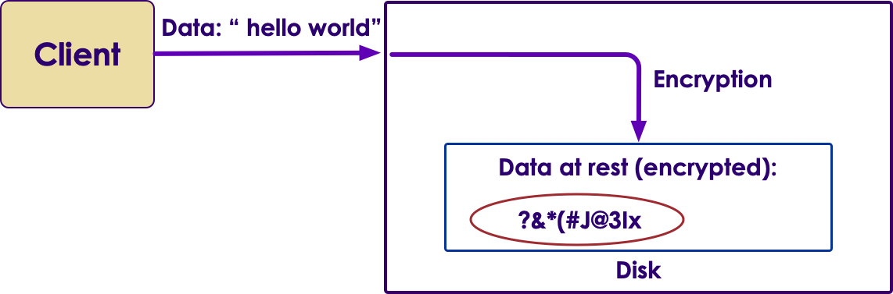
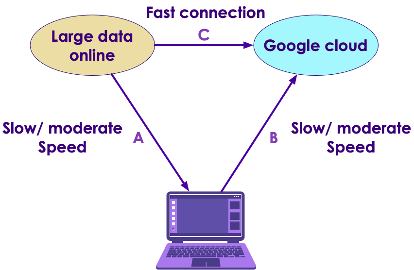

# Google Cloud Storage

  

---

## Objectives

- Data storage options in Cloud
- Ingesting Data

---

## Google Cloud Storage

* Pretty much 'unlimited' storage (kilobytes to exabytes)

* Built it data protection (backups, data guarantee ..etc)

* Pay as you use

* Multiple storage classes for any workload


---

## Cloud Storage and Scale Out Processing

* Google storage enables 'scale-out' data processing and computing on Google cloud

* The data can be transferred from 'storage' to 'compute' nodes very fast; over high speed network


  

---
## Storage Classes

  

- Source : https://cloud.google.com/storage/

---

## Storage Classes

* __Standard Storage__ :
    - Frequently accessed data (hot data)
    - 99.99%  availability
* __Nearline Storage__ :
    - Infrequently accessed data ( )
    - Suited for archival, backup, long tail media storage
* __Coldline Storage__ :
    - Suited for archival
    - Very low cost storage
* __Archival Storage__ :
    - Cheapest storage
    - Data stored for legal / regulatory reasons, but not accessed frequently
* Reference : https://cloud.google.com/storage/

---

## Pricing

* Prices vary according amount of data / discounts ..etc.  The following will give you some idea

* Storage fees

|          | Standard Storage | Nearline | Coldline | Archival |
|----------|------------------|----------|----------|----------|
| TB/Month | $26              | $10      | $7       | $4       |

<br />

* Egress / Ingress fees
    - Within same region : FREE
    - Across region : ~ 1c / GB

---

## Encryption

* Data is __always encrypted on server side__ before written to disk

* This is known as __encrypt data at rest__

* Uses AES-256 bit encryption

* Google manages encryption keys (proven and hardened)

  

---

## Client Side Encryption

* A client can encrypt data before sending to Google Cloud Storage

* When Cloud receives the data, it encrypts it the second time  (server side encryption)

* Clients must manage its own encryption keys

  

---

## Storage Buckets

* The main storage container on Cloud Storage is called a bucket

* Stores Binary Large Objects (blobs) on the cloud

* Bucket naming conventions
    - Every bucket name must be unique globally
    - Bucket names are publicly visible.  So don't use sensitive names like 'acme-company-deal-with-company-X'
    - 3-63 characters, DNS friendly
    - Reference : https://cloud.google.com/storage/docs/naming#requirements


Notes:


---


## Ingesting Data into the Cloud


* There are multiple ways to upload data into Cloud storage (depending on the use case)

* Direct upload using the GCP console
    - Works well for small / medium data

* Using the Cloud Shell to upload data into the bucket using the command outline
    - To ingest large datasets

* Transfer data from another cloud storage
    - Bulk transfer

Notes:

---

## Ingesting Large Amount of Data

  

* For large data ingests we recommend a 'direct transfer  ( C )'
* Because you will have much greater bandwidth point-to-point
* Downloading large amount of data to laptop and uploading back to Google Storage might be very slow

---

## Cloud Storage Utility Reference

* The Cloud Storage utility is : __`gsutil`__

* Reference : https://cloud.google.com/storage/docs/gsutil

* The following commands can work on Cloud Shell (recommended) or your laptop (if setup correctly)

```bash

# To get help
$   gsutil

# To see buckets
$   gsutil ls
$   gsutil ls  gs://bucket_name/dir_name

# To create a bucket
$   gsutil  mb  gs://bucket_name

# To copy files into a bucket
$   gsutil  cp  <files to copy>  gs://bucket_name/dir_name  
$   gsutil  cp  flights-*.csv  gs://bucket_name/flights/

# To download files from bucket
$   gsutil  cp  'gs://bucket_name/flights/*' .


```


---

## Lab : Ingesting Data into Google Cloud

<!-- {"left" : 6.76, "top" : 0.88, "height" : 4.37, "width" : 3.28} -->

* **Overview:**
    - Upload data into Google Cloud Storage


* **Approximate time:**
    - 30 mins

* **Instructions:**
    - Please follow instructions for
    - **Storage-1: Uploading data using Console**
    - **Storage-2: Uploading data using Cloud Shell**


Notes:

---
## Lab : Scheduling Data Ingest

<!-- {"left" : 6.76, "top" : 0.88, "height" : 4.37, "width" : 3.28} -->

* **Overview:**
    - Schedule data ingest into Google Cloud Storage


* **Approximate time:**
    - 20 mins

* **Instructions:**
    - Please follow instructions for
    - **Storage-3: Schedule Ingest**


Notes:

---

## Review and Q&A

<!-- {"left" : 8.24, "top" : 1.21, "height" : 1.28, "width" : 1.73} -->


- Let's go over what we have covered so far

- Any questions?


<!-- {"left" : 2.69, "top" : 4.43, "height" : 3.24, "width" : 4.86} -->
