# Google Data Studio

<!-- TODO shiva -->
  

---

## Objectives
- Learn about Data Studio
- Create visualizations 

---

# Data is Beautiful

---

## Data is Beautiful

* Good visualizations help audience understand data
    - Not just looking at numbers

* A good data scientist must learn good visualization techniques.

* Good resources:
  - [Data is Beautiful @ Reddit](https://www.reddit.com/r/dataisbeautiful/)
  - [Five Thirty Eight](https://fivethirtyeight.com/) - Interesting charts mostly about US politics and government
  - [datausa.io/](https://datausa.io/) - US government data visualization

Notes:

---

## Viz: US Population

<!-- TODO shiva -->
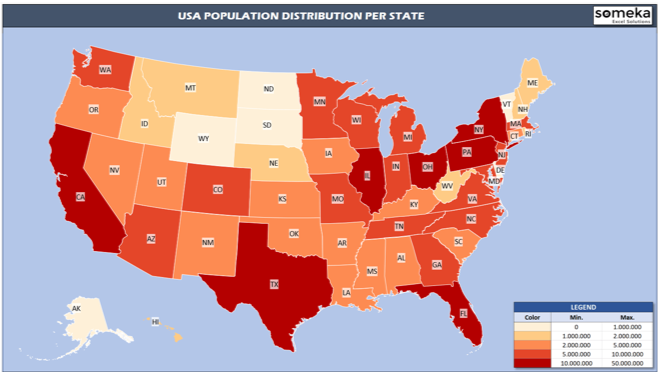  

* [Source](https://www.someka.net/excel-template/usa-heat-map-generator/)

---

## Viz: US Debt

<!-- TODO shiva -->
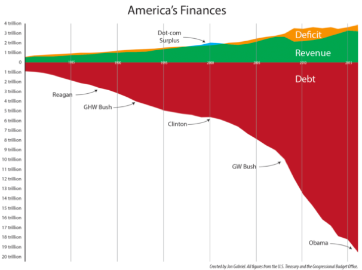  

* [Source](https://ricochet.com/archives/problem-no-one-dc-wants-talk/)

Notes:

---
## Viz: Australian Bush Fires of 2019

<!-- TODO shiva -->
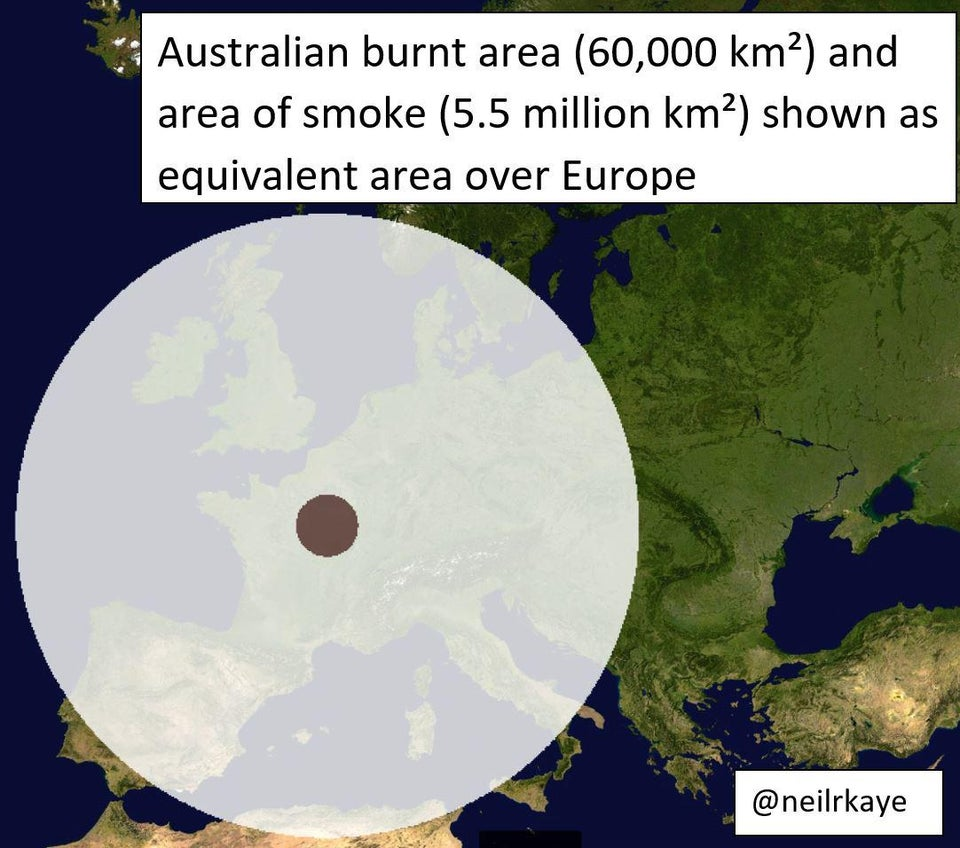  

- [Source](https://www.reddit.com/r/dataisbeautiful/comments/ejhw7w/area_of_land_burnt_in_australia_and_area_of_smoke/)

---
## Viz: Camera vs. Smartphone Sales

<!-- TODO shiva -->
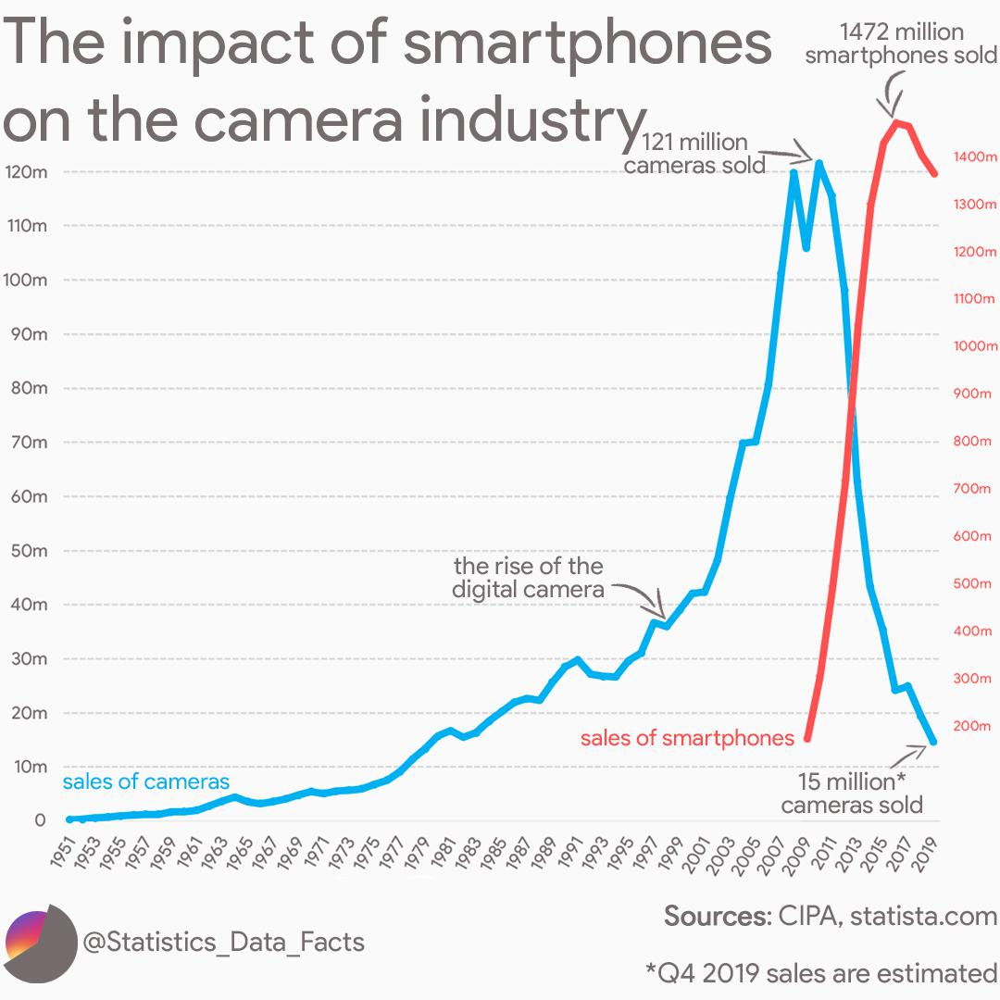  

- __"Correlation vs Causation"__
- [Source](https://www.reddit.com/r/dataisbeautiful/comments/d4mh5k/the_impact_of_smartphones_on_the_camera_industry/)

---
## Viz: Cardiac Deaths vs. Waffle House

<!-- TODO shiva -->
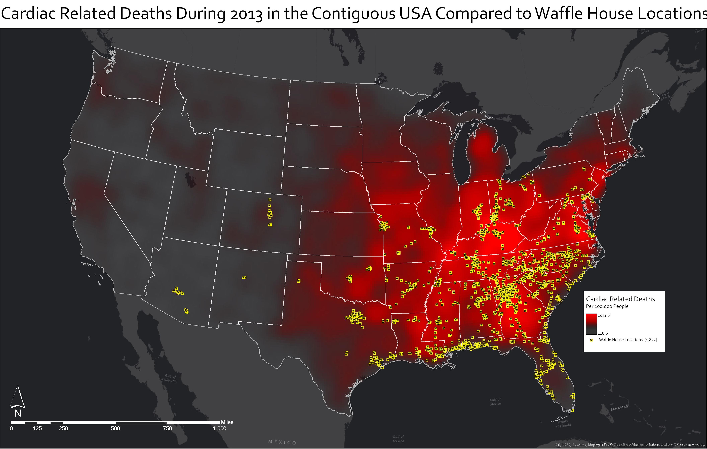  

- __"Correlation vs Causation"__
* [Source](https://www.reddit.com/r/dataisbeautiful/comments/7dnnng/cardiac_related_deaths_during_2013_in_the/)

---

# Google Data Studio

---

## Google Data Studio 

<!-- TODO shiva -->
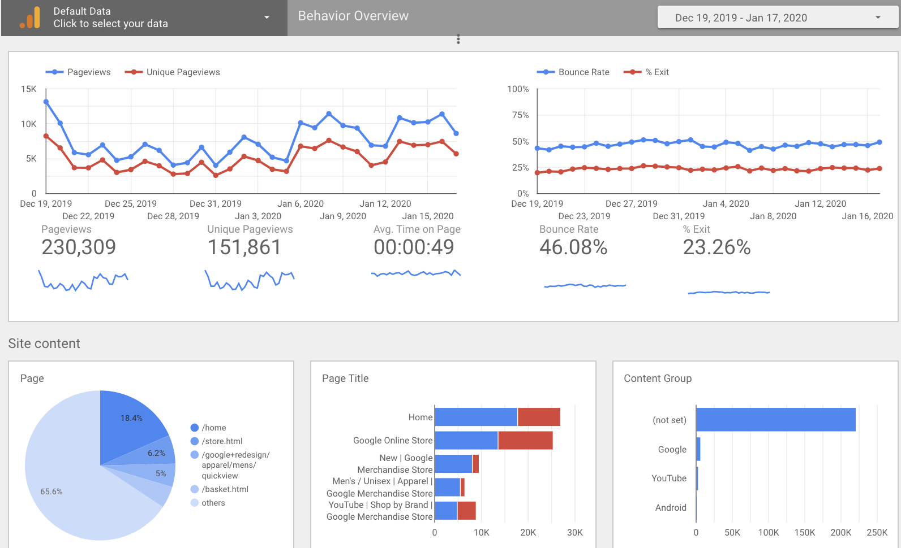  

* An online tool to visualize data 
    - Think Tablaue, but  online
    
* Beautiful templates out of the box 

* Very little coding - drag and drop 

* Create interactive graphs
    - e.g. change date range ..etc

* Share results with anyone

---

## Basic Workflow in Studio

* Data Source --> Report --> Chart

* Data Sources provide data 
    - Cloud storage, Google Drive, database ..etc

* Reporting shapes data
    - We can add filters (e.g.   zip_code !- NULL)
    
* Charts help us visualize data
    - Usual charts : Bar, Pie, Time series, Stacked ...

---

## Data Sources

* Several built in Google connectors for Google eco system 
  - Google drive, Cloud Storage, Cloud SQL, Big Query 
* Reference : https://datastudio.google.com/data

<!-- TODO shiva -->
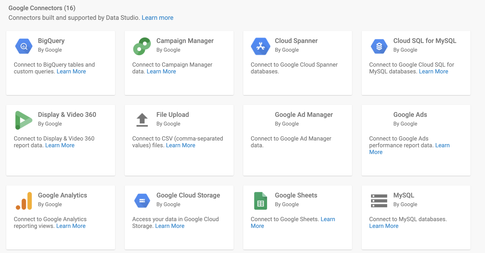  
---
## Data Sources

* Several 3rd party connectors available too
  - Adroll, Facebook Ads, Quickbooks
* Reference : https://datastudio.google.com/data

<!-- TODO shiva -->
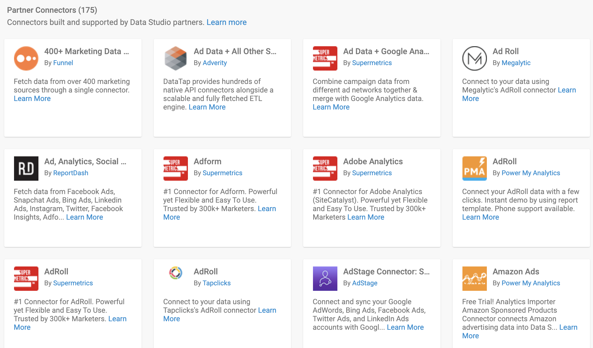  

---

## Data Studio Show Case: "What Happened to M Night Shyamalan?"

<!-- TODO shiva -->

- Please analyze the [visualization](https://datastudio.google.com/reporting/0B6vuEpR8jgX2R29GVzJxWDlOak0/page/vbQ) and discuss your thoughts

<!-- TODO shiva -->
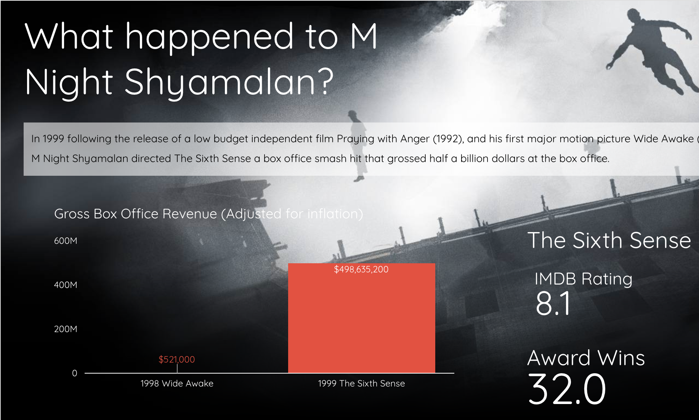  

---
## Data Studio Show Case: "Are We Alone?"

<!-- TODO shiva -->

- Please analyze the [visualization](https://datastudio.google.com/reporting/1HWH0xFoTRvMi8JonyeeqnOct9wua26j-/page/YwMf) and discuss your thoughts

<!-- TODO shiva -->
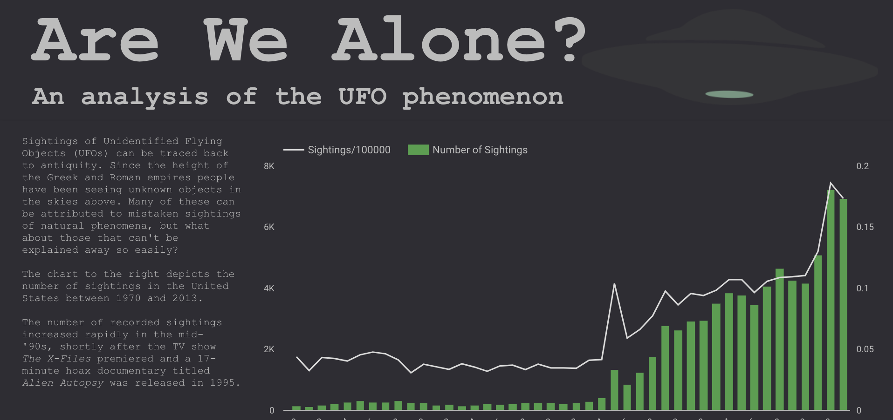  
---

## Mini Lab: Customize an Existing Report

<!-- {"left" : 6.76, "top" : 0.88, "height" : 4.37, "width" : 3.28} -->

* Start with the report [Web traffic report](https://datastudio.google.com/reporting/0B_U5RNpwhcE6dDFzTHNtMC1UZnc/page/ly5G)
* Select a graph and choose __'Explore'__.  This will open that particular graph on your own workspace.  
  - Change the graph type (e.g. from line --> bar)
  - Try other customizations 

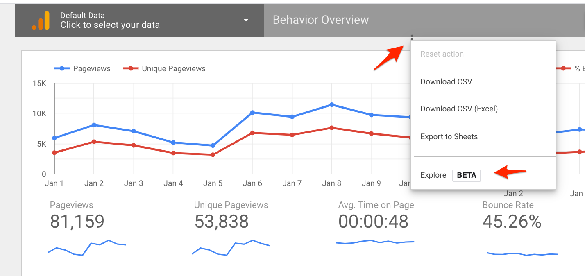  

Notes:

---

## Lab: Intro to Data Studio

<!-- {"left" : 6.76, "top" : 0.88, "height" : 4.37, "width" : 3.28} -->

* **Overview:**
    - Get started with data studio

* **Approximate time:**
    - 20 mins

* **Instructions:**
    - Please follow lab instances for 
    - **STUDIO-1** lab

Notes:

---
## Lab: Data Studio Lab 2

<!-- {"left" : 6.76, "top" : 0.88, "height" : 4.37, "width" : 3.28} -->

* **Overview:**
    - Analyze raw flights data

* **Approximate time:**
    - 20 mins

* **Instructions:**
    - Please follow lab instances for 
    - **STUDIO-2** lab

Notes:

---

## Lab: Data Studio Lab Using BigQuery

<!-- {"left" : 6.76, "top" : 0.88, "height" : 4.37, "width" : 3.28} -->

* **Overview:**
    - Analyze public dataset (IRS filings) using BigQuery

* **Approximate time:**
    - 20 mins

* **Instructions:**
    - Please follow lab instances for 
    - **STUDIO-3** lab

Notes:

---

## Review and Q&A

<!-- {"left" : 8.24, "top" : 1.21, "height" : 1.28, "width" : 1.73} -->

- Let's go over what we have covered so far

- Any questions?

<!-- {"left" : 2.69, "top" : 4.43, "height" : 3.24, "width" : 4.86} -->
