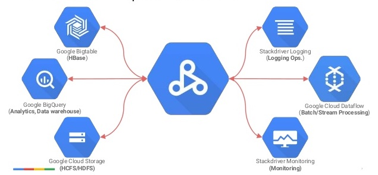
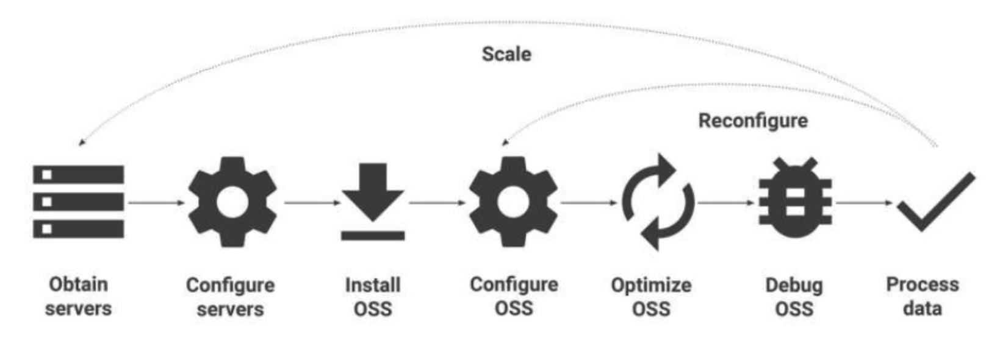
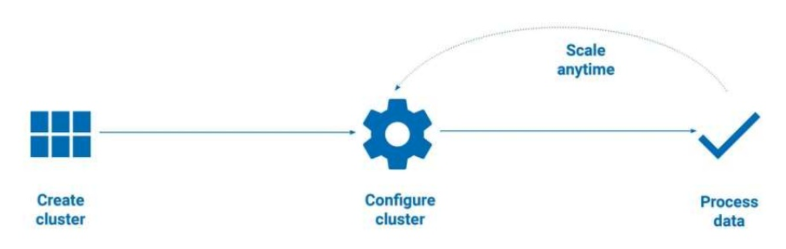

# Dataproc on Google Cloud

<!-- {"left" : 4.37, "top" : 7, "height" : 1.19, "width" : 3.65} -->

---

## Objectives
- What is Dataproc?
- Features
- Dataproc in action

---

## Dataproc

* Google Cloud Dataproc is a easy to use, fast, low cost, and fully managed service that lets you run Spark and Hadoop on the Google Cloud Platform.  

Notes:

---

## Easy to Use

- Easily create and scale clusters to run native:
  - Spark
  - PySpark
  - Spark SQL
  - MapReduce
  - Hive
  - Pig
   <!-- {"left" : 5.84, "top" : 1.16, "height" : 3.49, "width" : 4.33} -->

---
## Fast and Scalable Data Processing

 - Cloud Dataproc clusters can be created quickly, resized at any time, and can integrate between three and hundreds of nodes and many machine types to alleviate any concerns with data pipelines outgrowing clusters.
 - Users will have more time to focus on the insights and less on the infrastructure with each cluster action taking less than 90 seconds.

 <!-- {"left" : 5.84, "top" : 1.16, "height" : 3.49, "width" : 4.33} -->

---

## Low cost

- Low-cost data processing with:
  - Low and fixed price
  - Minute-by-minute billing
  - Fast cluster provisioning, execution, and removal.
  - Ability to manually scale clusters based on needs
  - Preemptible instances

 <!-- {"left" : 5.84, "top" : 1.16, "height" : 3.49, "width" : 4.33} -->

---
## Integrated
- Integration with Cloud Platform provides immense scalability, ease-of use, and multiple channels for cluster interaction and management.  

 <!-- {"left" : 5.84, "top" : 1.16, "height" : 3.49, "width" : 4.33} -->

---
# Dataproc Features

---
- Automated Cluster Management
  - Managed deployment, logging, and monitoring let you focus on your data, not on your cluster.
  - Dataproc clusters are stable, scalable, and speedy

- Resizable Clusters
  - Create and scale clusters quickly with various virtual machine types, disk sizes, number of nodes, and networking options.

- Autoscaling Clusters
   - Dataproc Autoscaling provides a mechanism for automating cluster resource management, and enables automatic addition and subtraction of cluster workers (nodes).

---
- Cloud Integrated
  - Built-in integration with Cloud Storage, BigQuery, Bigtable, Stackdriver Logging, Stackdriver Monitoring, and AI Hub, giving you a complete and robust data platform.

 - Versioning
   - Image versioning allows you to switch between different versions of Apache Spark, Apache Hadoop, and other tools.

- Highly available
   - Run clusters in high availability mode with multiple master nodes, and set jobs to restart on failure to ensure your clusters and jobs are highly available.

---
 - Enterprise Security
   - When you create a Dataproc cluster, you can enable Hadoop Secure Mode via Kerberos by adding a Security Configuration.
   - Also,GCP and Dataproc offer additional security features that help protect your data.

- Cluster Scheduled Deletion
  - To help avoid incurring charges for an inactive cluster, you can use Cloud Dataproc's scheduled deletion
   - Provides options to delete a cluster after a specified cluster idle period, at a specified future time, or after a specfied time period.

 ----
 - Automatic or Manual Configuration
    - Dataproc automatically configures hardware and software, but also gives you manual control.

 - Developer Tools
    - Multiple ways to manage a cluster, including an easy-to-use web UI, the Cloud SDK, RESTful APIs, and SSH access.

 - Initialization Actions
   - Run initialization actions to install or customize the settings and libraries you need when your cluster is created.

---
- Optional Components
   - Use optional components to install and configure additional components on the cluster.
   - Optional components are integrated with Dataproc components, and offer fully configured environments for Zeppelin, Druid, Presto, and other open source software components related to the Apache Hadoop and Apache Spark ecosystem.

- Custom Images
  - Dataproc clusters can be provisioned with a custom image that includes your pre-installed Linux operating system packages.

- Flexible Virtual Machines
   - Clusters can use custom machine types and preemptible virtual machines to make them the perfect size for your needs.

- Component Gateway and Notebook Access
   - Dataproc Component Gateway enables secure, one-click access to Dataproc default and optional component web interfaces running on the cluster.

- Workflow Templates
   -  Dataproc workflow templates provide a flexible and easy-to-use mechanism for managing and executing workflows.
   - A Workflow Template is a reusable workflow configuration that defines a graph of jobs with information on where to run those jobs.

## Traditional Spark and Hadoop Clusters

---
## Google Cloud Dataproc

---
## Dataproc Cluster

- Spark and Hadoop Operation Support Systems
   - Spark, Hadoop, Hive, Pig, and other OSS execute on the cluster.
- Cloud Datproc Agent
   - Cloud Dataproc clusters have an agent to manage the Cloud Datproc cluster.  
- Dataproc uses Compute Engine, Cloud Storage, and Cloud Ops tools.  

---
## Dataproc jobs

-  PySpark
- PySpark
- Spark SQL
- MapReduce
- Pig  
- Hive

---
## Dataproc Outputs

- Application on the cluster
- Dataproc jobs
- GCP Products

---
## Cloud Dataproc Workload

|                                          Copy Data to GCS                                         |                                          Update file prefix                                         |                                              Use Cloud Dataproc                                             |
|:-------------------------------------------------------------------------------------------------:|:---------------------------------------------------------------------------------------------------:|:-----------------------------------------------------------------------------------------------------------:|
| Copy your data to Google Cloud Storage(GCS) by installing the connector or by copying manually.   | Update the file location prefix in your scripts from  hdfs:// to gcs:// to access your data in GCS. | Create a Cloud Dataproc cluster and run your job on the cluster against the data you copied to GCS.  Done. |

---

## Lab 1

<!-- {"left" : 6.76, "top" : 0.88, "height" : 4.37, "width" : 3.28} -->

* **Overview:**
    - Setup Dataproc

* **Approximate time:**
    - 15-30 mins

* **Instructions:**
    - Please follow lab.  

Notes:

---
## Lab 2

<!-- {"left" : 6.76, "top" : 0.88, "height" : 4.37, "width" : 3.28} -->

* **Overview:**
    - Opening a jupyter notebook on dataproc cluster

* **Approximate time:**
    - 15-30 mins

* **Instructions:**
    - Please follow lab.  

---

## Review and Q&A

<!-- {"left" : 8.24, "top" : 1.21, "height" : 1.28, "width" : 1.73} -->

- Let's go over what we have covered so far

- Any questions?

<!-- {"left" : 2.69, "top" : 4.43, "height" : 3.24, "width" : 4.86} -->
