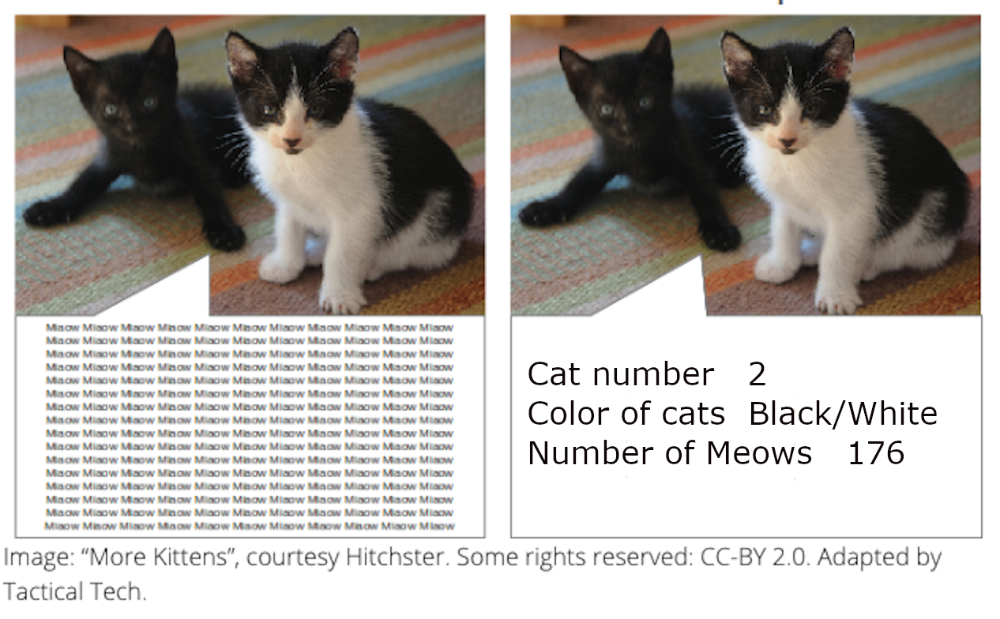
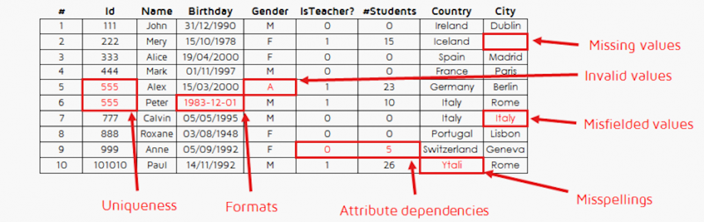
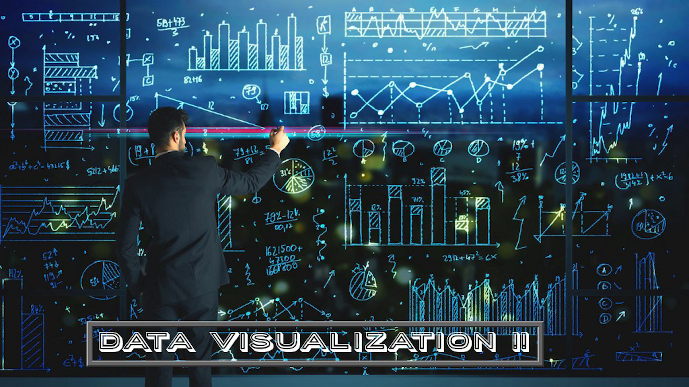
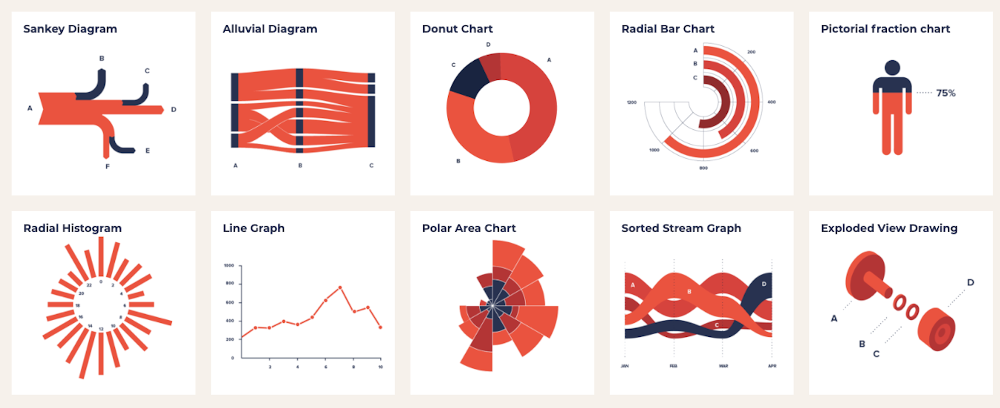
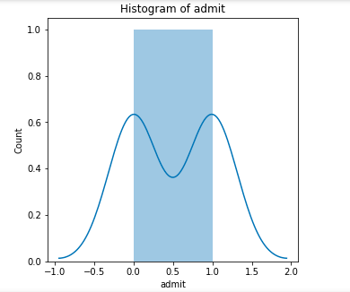

#  Data Analysis under Google Cloud


---
## Overview
* What is Data Analysis?
* Exploring and understanding datasets
* Cleaning data
* Feature selection
* Visualizing data
* Labs  

---
## What is Data Analysis?
   * Data analysis is the process of inspecting, cleansing, transforming and modeling data, discovering useful information, and supporting the decision making process.  
   * In today's business world, data analysis plays a role in making decisions more scientific and helping businesses operate more effectively.  
   * To put it simply data analysis helps you make better decisions.
---
## Real world example of data analysis

 <!-- {"left" : 1.02, "top" : 1.9, "height" : 5.26, "width" : 8.21} -->  


---

## Data analysis helps you make better decisions
* The data you find about the car go into your decision of purchasing a used car.  
* For example some of the relevant data you would want to know is how many miles does it have, the age, the wear, type of interior, etc..   
* All this data about the car go into your final decision if you purchase the car or not.  

---
## Exploratory and understanding datasets
* Before anything can be done with any dataset it is import to first be familiar with your dataset.  
*  Data scientists spend much of their time on data preparation before they ever jump into modeling.   

---
## Understanding Data

* Basic questions
  - Is there a pattern?
  - Are there lot of outliers?  (May skew analysis. Should we keep these or throw them away?)
---
## Exploratory Data analysis
* EDA is a term data scientists use known as Exploratory Data Analysis.  
* Some of these EDA steps include summarizing main data set characteristics, finding representative or critical points, and discovering relevant features.
---
## Data and Data after EDA

<!-- {"left" : 1.76, "top" : 1.28, "height" : 4.16, "width" : 6.72} -->  


* After EDA there are only 3 important features.   
* The number of cats, cat colors, and how many Miaows

---
## Data Cleaning
* Quality of the output depends on quality of the input.   
* Often you will be given data and you could simply apply that to any model but the result will often not be satisfactory unless you clean it first.   
* Data cleaning is the process of preparing data for data analysis by removing or modifying data that is incorrect, incomplete, irrelevant, duplicated, or improperly formatted.
---
## Data Cleaning
* Problems with raw data sets
  - Non-usable format (say in Excel spreadsheet format)
  - Contains errors & wrong values
  - Missing values
  - Data is spread across multiple silos

* Data scientists spend a lot of time cleaning and massaging raw data, to get them ready for analysis.

* Crucial part of data science

* Can consume a lot of time (50% - 80%  of the project!!!)

* Least sexy
---
## Example of Data that needs to be cleaned

<!-- {"left" : 0.83, "top" : 3.18, "height" : 2.72, "width" : 8.6} -->  


---

## Feature Selection
*  Selection of features in your data that are most relevant to the predictive modeling problem you are working on.
*  Not necessarily every feature(column) is going to have an impact on the output variable.   
* By taking out irrelevant features and including the relevant features it will make a better model.

---
## Less is More

 * More Features is not necessarily better
 * The **Curse of Dimensionality** says that more *features* requires more *observations* (rows)
   - And this relationship is **not** linear:
   - More features --> **Many** more rows.
 * So, what we want is the *right* set of features.
 * But how do we know how to select the right number of features?

---
## Correlation

 * One way is to look at the correlation of features to target/label
 * If the feature is correlated, it might be important
 * Highly Correlated with outcome is generally a good thing.
---
## How to find correlation in python

 * Pandas makes finding the correlation easy
 * This is the Pearson Correlation Coefficient

```python

import pandas as pd

df.corr()[['label']]

          label
0      0.981981
1      0.866025
2     -1.000000
label  1.000000

```
<!-- {"left" : 0, "top" : 2.40, "height" : 2.9, "width" : 4.11} -->

<br/>
<br/>

* Here, we see that all 3 features 0,1,2 are very highly correlated with the output label

---

## Correlation Can Lie!

 * Highly correlated with outcome is generally a good thing.

 * But, correlation can lie to you!
   - High correlation isn't necessarily signifiant
   - Need to look at p-value and f-value

 * Low correlation features can still be *empirically* predictive
  - It means that including the feature gives you better results than not including it.


---

## Random Forest

 * Random Forests can be powerful feature selection tool
 * Random Forests run many times with different feature combinations
 * Can estimate which are the most important features.

```python
from sklearn.ensemble import RandomForestClassifier
clf = RandomForestClassifier(
  n_estimators=400, n_jobs=-1)
clf.fit(X, y)
top_features = utils.feature_importances(
  clf, top_features, n=20)

```
<!-- {"left" : 0, "top" : 3.16, "height" : 2.03, "width" : 9.28} -->


---

## Forward and Reverse Selection

 * We can try running the model with different combinations of features
   - Choose the best combination of features
   - Forward Selection: Start with no features and add
   - Reverse Selection: Start with all features and subtract
 * However, all other things being equal, we should *not* just choose the combination with the highest accuracy
 * We need to apply a penalty for having too many features.
 * Some useful metrics:
   - AIC: Aikake Information Criterion:  Useful for feature selection
   - BIC: Bayes Information Criterion

---

## Data Visualizations

<!-- {"left" : 1.02, "top" : 2.23, "height" : 4.62, "width" : 8.21} -->  

---

## Visualizations

  * How you tell the results

  * Very very important part!!

  * Good visualizations convey the point to the audience.

  * A good data scientist must learn good visualization techniques.

  * Standard graphs: line, bar, pie, ...

  * Modern visualizations

     - Heat maps
     - Animations (D3JS etc.)

---
## Examples of Data visualizations
<!-- {"left" : 1.02, "top" : 2.86, "height" : 3.35, "width" : 8.21} -->  


---
## Great python libraries to deal with visualizations

* matplotlib
* Seaborn
* datasist
* autoviz

---
## Example using datasist

```python
import datasist as ds
ds.visualizations.histogram(df)

```
<!-- {"left" : 0, "top" : 1.62, "height" : 0.86, "width" : 5.94} -->  

<br/>

<!-- {"left" : 2.42, "top" : 3.33, "height" : 4.53, "width" : 5.42} -->  

---
## Quiz

[Quiz](https://docs.google.com/forms/d/18HMIqa_Nq3cpSJlcC78VVahg6l9g9NHxyJF0wDi9xfc/edit)
