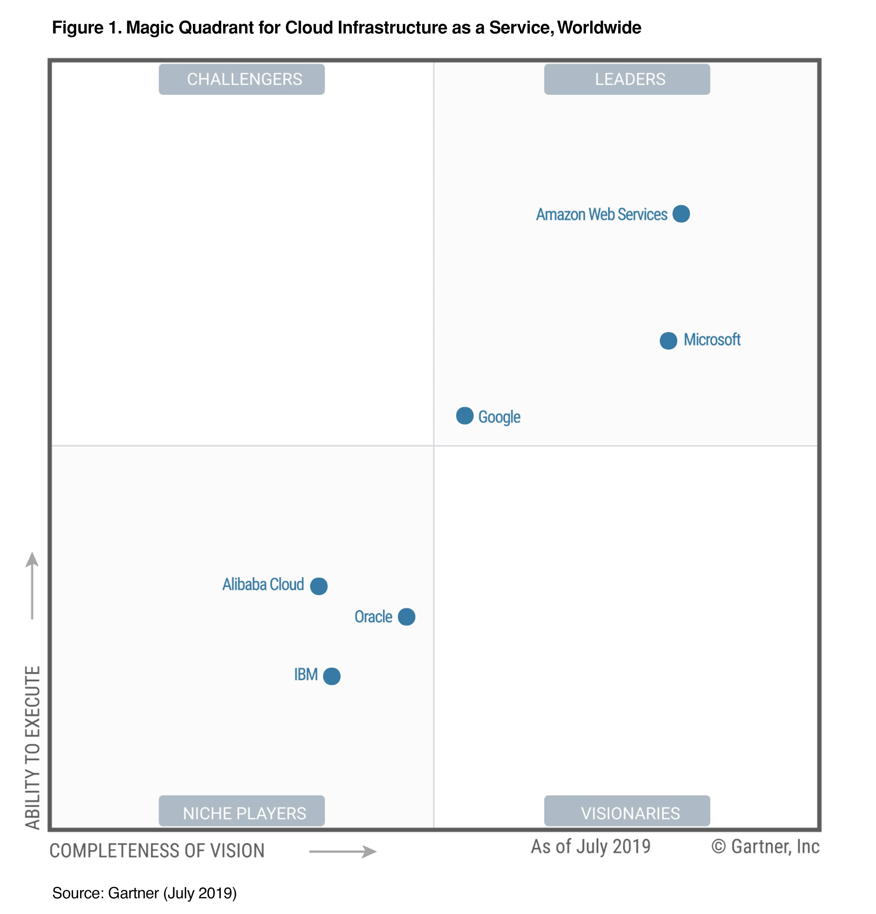
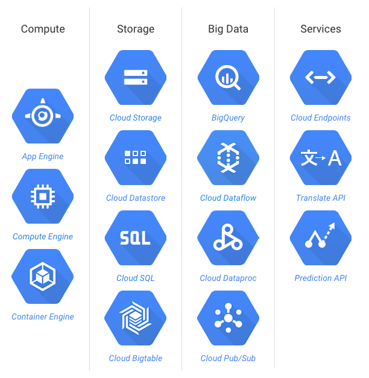

# Google Cloud Intro

---

## Objectives

---

## Cloud Advantages

[Cloud-Advantages.md](Cloud-Advantages.md)

---

# Google Cloud Features

---

## Google Cloud Features
- No infrastructure management

- Automatic scale

- Pay only for use

- Integrated logging and monitoring

- Ease of use (development, debugging, deploying)

- Basically **Platform as Service**

---

## Google Cloud vs. Others

<!-- TODO shiva -->

- Source: [Gartner Magic Quadrant for Cloud Infrastructure as a Service 2019](https://cloud.google.com/gartner-cloud-infrastructure-as-a-service/)

---

## Google Cloud Services Overview

<!-- TODO shiva -->

---

## Google Cloud Services Overview 

* __Compute__ : Scalable VMs

* __Storage__ : Scalable, 'unlimited' storage 

* __Databases__ : Relational databases

* __Networking__ : Build your own networking

* __Big Data__ : Analyze huge amount of data 

* __Machine Learning__ : Scalable ML platform

---

## Google Compute Engine 

<!-- TODO shiva -->

* Can rent virtual machines and manage them ourselves 

* Or use serverless services, infrastructure is managed by Google

---

# Google Cloud Use Cases 

---

## Google Cloud Customers and Use Cases

* https://cloud.google.com/customers/  
* [Target use case video](https://www.youtube.com/watch?v=djQIFqY5cJ4&feature=youtu.be)
- [HSBC use case](https://www.youtube.com/watch?v=W8oTEyogAwo&feature=youtu.be)

 

<!-- TODO shiva -->
  &nbsp;  &nbsp;
  &nbsp;  &nbsp;
  &nbsp;  &nbsp;

