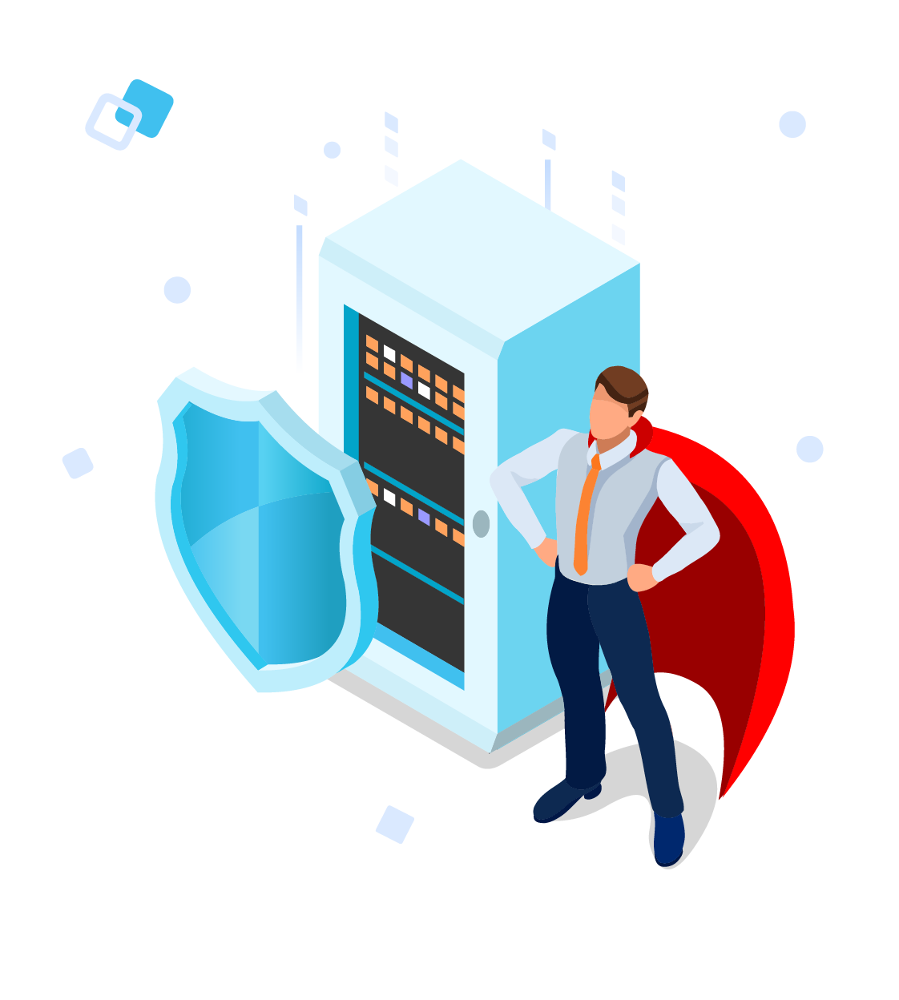
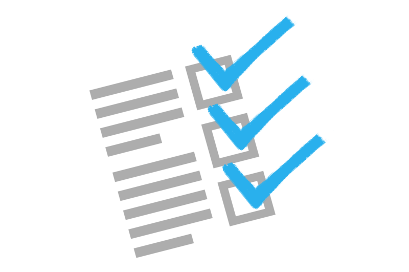

# Google Cloud SQL

<!-- {"left" : 4.37, "top" : 7, "height" : 1.19, "width" : 3.65} -->

---

## About This Class

* Introduction to Cloud SQL

* What is SQL

* Cloud SQL Launch Checklist

Notes:

---
## What is Cloud SQL

<!-- {"left" : 6.31, "top" : 1.38, "height" : 0.91, "width" : 3.79} -->

 * Cloud SQL is a full managed MySQL database instance.
 * Fully mananged database service that makes it easy to set up, maintain, manage, and administer your relational database on Google Cloud Platform.  
 * You can use Cloud SQL with MySQL, PostgreSQL, or SQL Server.  
 * Can connect with nearly any application in the world.  

Notes:

---

## What is Cloud SQL

<!-- {"left" : 6.31, "top" : 1.38, "height" : 0.91, "width" : 3.79} -->

 * Easy-to-manage compatible relational database in the cloud.    
 * Automates database provisioning, storage capacity management, and other time-consuming tasks.   
 * Ensures reliability and security with built-in automation for high availability, backups, and security updates, plus a 24/7 Site Reliability Engineering team.
 * Easy integration with your workstation, as well as App Engine, Compute Engine, Kubernetes, and BigQuery

---

## Secure and Compliant

 <!-- {"left" : 5.84, "top" : 1.16, "height" : 3.49, "width" : 4.33} -->
* Automatic data encryption at rest and in transit.
* Private connectivity with Virtual Private Cloud and user controlled network access, includes firewall protection.
* Compliant with SSAE 16, ISO 27001, PCI DSS v3.0, and HIPPA.

Notes:

---

## Scale as you go

 <!-- {"left" : 5.84, "top" : 1.16, "height" : 3.49, "width" : 4.33} -->

 * Emphasis on concepts & fundamentals

 * Highly interactive (questions and discussions are welcome)

 * Hands-on (learn by doing)

---

## Setup in minutes

 * Standard connection drivers
 * Built in migrational tools allow you to create and connect to your first database in just a few minutes.

Notes:

---

_"Using Google App Engine and Google Cloud SQL make our applications go live in half the time and have provided us with hassle-free control over all processes.  The shift to Google Cloud SQL has allowed us to focus on making our applications even better. "_

-Yogesh Agarwal, CEO, Daffodil

---

## What is SQL

* SQL stands for Structured Query Language

* It is a database language used to query and manipulate the data in the database.  

* Domain-specific language used designed for managing data held in a regional database management system(RDBMS) or for stream processing in a relational data stream management system(RDSMS)

* Specifically useful in handling structured data.

 <!-- {"left" : 5.84, "top" : 1.16, "height" : 3.49, "width" : 4.33} -->

---

## Cloud SQL Launch Checklist

* Launch checklist for Cloud SQL gives recommended activites that you should complete for launching a commercial application that uses Cloud SQL.
* The checklist is broken down into three sections.
    - Architecture Design and Development
    - Alpha Testing
    - Final launching

 <!-- {"left" : 5.84, "top" : 1.16, "height" : 3.49, "width" : 4.33} -->

---
## Architecture Design and Development

* Recommended use this checklist in the early stage of development.
*  This part of checklist requires most time to complete.

---
## Architecture Design and Development checklist

*  Assess the performance characteristics of Cloud SQL and the service's limitations and restrictions.
*  Ensure your DevOps team is familiar with the Cloud Console and Cloud SDK.
*  Consult Cloud SQL community support for information and practical advice on Cloud SQL.
*  Subscribe to the Cloud SQL announce group.  Posts are made to this group for service updates, issues, and incident reports.  

---

## Alpha Testing

*  Use when you are close to code complete.
*  Want to get initial metrics about application.  

----

## Alpha Testing Checklist

* Remain current on the drivers that provide data access for your development platform.
* Load test, early, and realistically.   
* If you are connecting from Compute Engine, make sure the firewall behavior related to idle connections does not harm the application.
*  Observe the connection limits for the App engine apps.
*  Make sure there is a strategy in place for doing schema changes and the impact of doing them is well understood.  

---
## Final Launch

*  Use before and shortly before and during your launch.

 <!-- {"left" : 5.84, "top" : 1.16, "height" : 3.49, "width" : 4.33} -->

---

## Final Launch Checklist

* There are no Cloud SQL specific activities for launch.
* If you have followed the checklist to this point you are ready for the applications launch.
